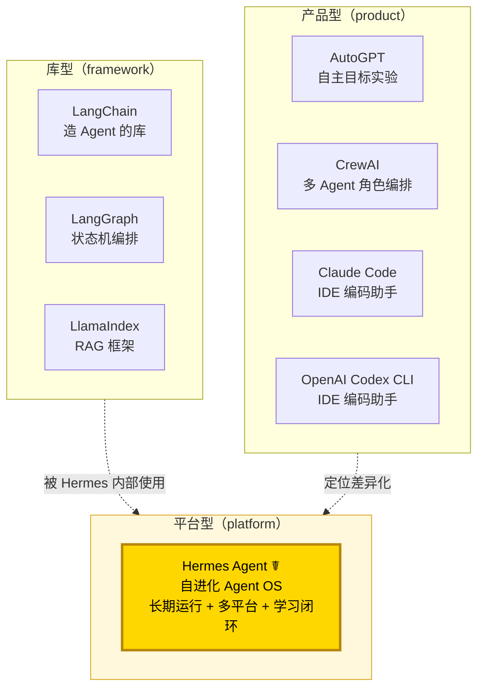
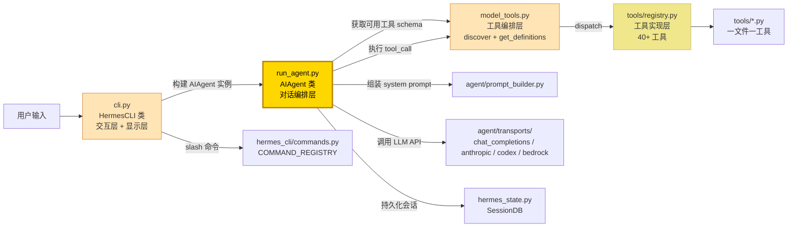
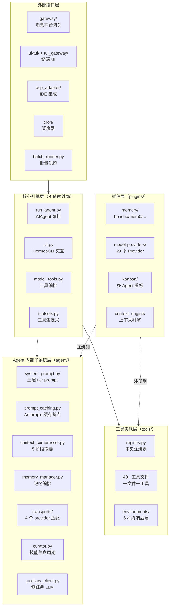
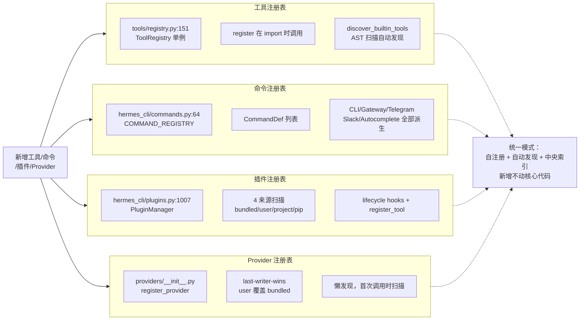
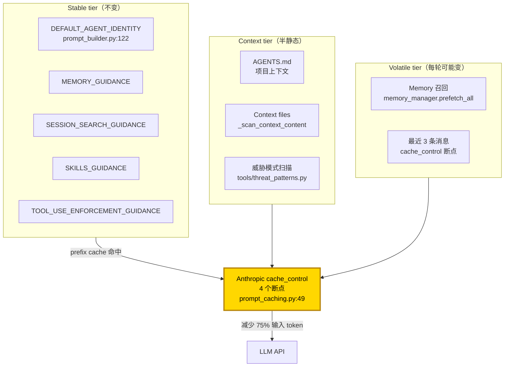
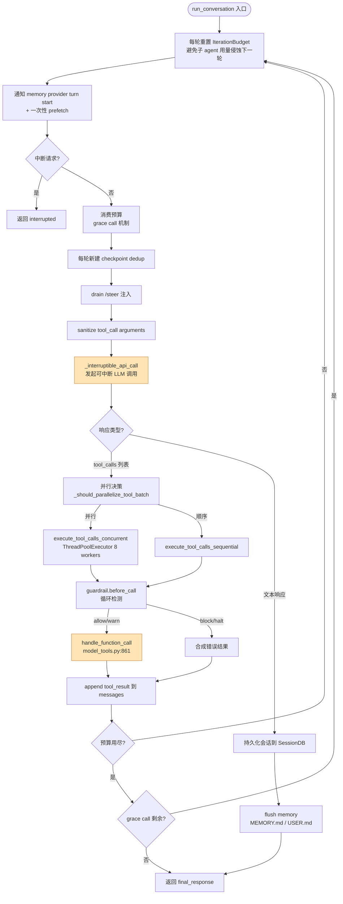
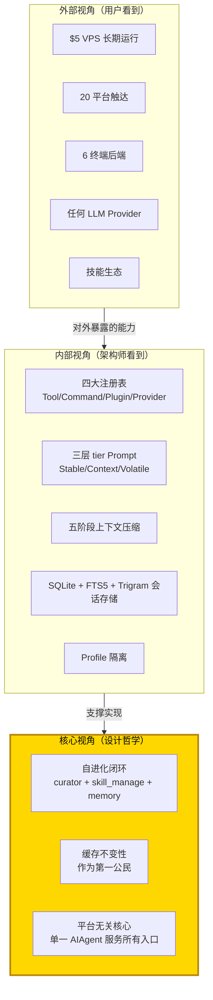

# 整体观：Hermes Agent 项目全貌解读

> 三观递进法 · 第一观 · 看见
> 本文是 Hermes Agent 代码库深度阅读 trilogy 的第一篇。三篇文档构成「看见 → 看懂 → 看透」的认知升级路径：第一篇建立整体认知地图，第二篇深入算法细节，第三篇升华设计哲学。本文负责第一观——给你一张鸟瞰全貌。

---

## 总：一句话看见 Hermes

**Hermes Agent（☤）是由 Nous Research 构建的"自进化（self-improving）AI Agent 操作系统"**——它把"自进化闭环"作为第一性原理，在"长期运行 + 多平台触达 + 工具生态 + 缓存经济性"四个维度上同时发力，使得一个 LLM Agent 既能像 IDE 编码助手那样即时响应，又能像 Linux 守护进程那样在 $5 VPS 上 7×24 小时伴随用户运行。

打开 `/workspace/README.md:15`，第一句话就把这个定位写得明明白白：

> "The self-improving AI agent built by Nous Research. It's the only agent with a built-in learning loop — it creates skills from experience, improves them during use, nudges itself to persist knowledge, searches its own past conversations, and builds a deepening model of who you are across sessions."

它的"独特之处"被压缩成五个动词：**creates skills**（创建技能）、**improves them during use**（在使用中改进）、**nudges itself to persist knowledge**（主动持久化知识）、**searches its own past conversations**（搜索过往对话）、**builds a deepening model of who you are**（构建越来越深的用户画像）。这五个动词构成了 Hermes 区别于"通用 Agent 框架"的全部灵魂。

Hermes 不是 LangChain（"造 Agent 的库"），不是 AutoGPT（"自主目标循环实验"），不是 CrewAI（"多 Agent 角色编排"），也不是 Claude Code（"IDE 编码助手"）。它是**一个可以长期运行、跨平台触达、自我进化的成品 Agent 平台**——介于"库"与"产品"之间的"Agent 操作系统"。

本文将沿着「定位 → 结构 → 理念 → 原理 → 流程」的层层递进路径，把这张地图绘制出来。

---

## 分之一：项目定位与生态定位

### 1.1 它是什么——三句话定位

1. **形态定位**：一个用 Python 写的"长期运行 AI Agent 平台"，单进程可同时服务 CLI、终端 TUI、20 个消息平台网关、IDE 集成、cron 调度、批量轨迹生成 6 类入口。
2. **能力定位**：内置 40+ 工具、20+ 平台适配器、6 种终端后端、可插拔记忆/Provider/MCP/技能生态；支持任何 LLM（Nous Portal、OpenRouter、Anthropic、Bedrock、本地 Ollama 等）。
3. **价值定位**：把"自进化闭环"做成第一公民——技能创建→使用→改进→归档、会话搜索→跨会话召回→用户画像深化，是它区别于所有同类项目的"独特卖点"。

### 1.2 它解决什么问题

LLM Agent 当下面临"五座大山"：

| 痛点 | Hermes 的回答 |
|---|---|
| **长期运行成本** | Prompt caching（4 断点 + 三层 tier）+ serverless 终端后端（Modal/Daytona 休眠唤醒），$5 VPS 可 7×24 运行 |
| **跨平台触达** | 单一 gateway 进程同时跑 Telegram、Discord、Slack、WhatsApp、Signal、Email 等 20 个平台 |
| **跨会话记忆** | SQLite + FTS5 + Trigram 全文索引会话历史 + 可插拔 memory provider（honcho 辩证式、mem0、supermemory 等）|
| **能力扩展** | 注册表 + 自动发现 + 插件机制，新增工具/命令/Provider 不动核心代码 |
| **自我进化** | Curator 后台技能生命周期管理 + skill_manage 让 Agent 自主创建/编辑技能 |

### 1.3 在生态中的位置



> **图 1.1｜生态定位图**：Hermes 处于一个相对独特的生态位——它既不是库（不让你"组装 Agent"），也不是单一 IDE 工具（不限于编码），而是介于两者之间的"Agent 操作系统"。库型项目是它的"建材"，产品型项目是它的"邻居"，而它本身提供"运行时 + 持久化 + 调度 + 网关 + 插件 + 技能生态"的完整基础设施。

### 1.4 差异化核心四点

`/workspace/README.md:19-27` 用一张表把差异化卖点亮出来：

1. **真正的终端界面（TUI）**——非简单 CLI，而是 Ink/React + JSON-RPC 后端的完整终端 UI
2. **随你所在（lives where you do）**——20 个消息平台从单一 gateway 进程运行
3. **闭环学习（closed learning loop）**——技能创建/改进 + FTS5 会话搜索 + Honcho 辩证式用户建模
4. **随处运行（runs anywhere）**——6 种终端后端（local、Docker、SSH、Modal、Daytona、Singularity），支持 serverless 休眠唤醒

这四点既是产品卖点，也是架构选型的指南针——后面的每一处设计选择都能追溯到这里。

---

## 分之二：整体代码结构与模块职责

### 2.1 顶层目录鸟瞰

打开 `/workspace`，会看到一个"扁平但分层清晰"的结构。下表把所有顶层目录/文件按职责归类：

| 类别 | 路径 | 职责一句话 |
|---|---|---|
| **核心引擎** | [run_agent.py](file:///workspace/run_agent.py) | `AIAgent` 类——核心对话循环（约 5000+ 行） |
| **核心引擎** | [cli.py](file:///workspace/cli.py) | `HermesCLI` 类——交互式终端 UI（约 15000+ 行）|
| **核心引擎** | [model_tools.py](file:///workspace/model_tools.py) | 工具编排、schema 收集、dispatch |
| **核心引擎** | [toolsets.py](file:///workspace/toolsets.py) | 工具集定义与平台预设 |
| **状态层** | [hermes_state.py](file:///workspace/hermes_state.py) | `SessionDB`——SQLite + FTS5 会话存储 |
| **状态层** | [hermes_constants.py](file:///workspace/hermes_constants.py) | `get_hermes_home()`——profile 感知路径 |
| **状态层** | [hermes_logging.py](file:///workspace/hermes_logging.py) | profile 感知日志 |
| **Agent 内部** | [agent/](file:///workspace/agent/) | prompt 构建、上下文压缩、provider 适配、记忆、技能、轨迹等子系统 |
| **CLI 基础** | [hermes_cli/](file:///workspace/hermes_cli/) | CLI 子命令、setup 向导、插件加载、皮肤引擎 |
| **工具实现** | [tools/](file:///workspace/tools/) | 一文件一工具，通过 `registry.py` 自注册 |
| **网关** | [gateway/](file:///workspace/gateway/) | `run.py` + `session.py` + 20 个平台适配器 |
| **插件** | [plugins/](file:///workspace/plugins/) | memory、context_engine、model-providers、kanban 等可插拔子系统 |
| **TUI 前端** | [ui-tui/](file:///workspace/ui-tui/) | Ink (React) 终端 UI——`hermes --tui` |
| **TUI 后端** | [tui_gateway/](file:///workspace/tui_gateway/) | TUI 的 Python JSON-RPC 后端 |
| **IDE 集成** | [acp_adapter/](file:///workspace/acp_adapter/) | ACP 服务器（VS Code/Zed/JetBrains） |
| **调度器** | [cron/](file:///workspace/cron/) | `jobs.py` + `scheduler.py` |
| **技能** | [skills/](file:///workspace/skills/) | 内置技能（默认可用） |
| **技能** | [optional-skills/](file:///workspace/optional-skills/) | 可选技能（需显式安装） |
| **文档** | [website/](file:///workspace/website/) | Docusaurus 文档站 |
| **测试** | [tests/](file:///workspace/tests/) | Pytest 套件（~25,000 测试 / ~1,250 文件） |

### 2.2 四个核心文件的职责切分

`run_agent.py` / `cli.py` / `model_tools.py` / `toolsets.py` 构成了 Hermes 的"四大金刚"。它们的职责切分体现了一个重要的设计原则：**"业务编排"与"业务实现"分离**。



> **图 2.1｜四大核心文件协作图**：`cli.py` 负责交互与显示（用户输入、Rich 渲染、prompt_toolkit 输入、皮肤主题），把"对话编排"职责完全委托给 `run_agent.py` 的 `AIAgent` 类。`AIAgent` 通过 `model_tools.py` 获取工具 schema 并 dispatch 工具调用，最终落到 `tools/registry.py` 调用具体工具。`toolsets.py` 则定义"工具集"——按平台预设的"工具包"，决定哪些工具对哪个平台可见。

#### `run_agent.py`（AIAgent 类）

定义于 `/workspace/run_agent.py:319`，是整个项目的"心脏"。它有 ~60 个 `__init__` 参数（credentials、routing、callbacks、session context、budget、credential pool 等）。关键方法：

- `__init__` 是转发器——实际逻辑在 `/workspace/agent/agent_init.py:136` `init_agent()`（约 1400 行属性初始化被抽出）
- `run_conversation()` 第 4859 行——也是转发器，实际逻辑在 `/workspace/agent/conversation_loop.py:351`
- `chat()` 第 4872 行——`run_conversation` 的薄封装

> **关注点分离的设计动机**：`/workspace/agent/agent_init.py:1-18` 的 docstring 写道："Keeping it in run_agent.py bloats that file with code that's mostly 'setup state, then forget'."（让它留在 run_agent.py 会让那个文件充斥"初始化状态后就不再碰"的代码）。这是经典的"上帝类瘦身"——把 `__init__`、`run_conversation` 抽到独立文件，主类只剩接口契约。

#### `cli.py`（HermesCLI 类）

定义于 `/workspace/cli.py:3071`，是交互式 REPL 终端 UI。使用 **Rich** 渲染 banner/panels、**prompt_toolkit** 处理输入（含自动补全）、**KawaiiSpinner** 动画（agent/display.py）、**Skin Engine** 主题化。

关键方法：
- `process_command()` 第 8719 行——slash 命令分发
- `run()` 第 13057 行——主 REPL 循环
- 第 5162 行——`self.agent = AIAgent(...)` 构建实例
- 第 12372、15527 行——调用 `self.agent.run_conversation()`

#### `model_tools.py`（工具编排层）

负责三件事：

1. **触发工具发现**：第 180 行 `discover_builtin_tools()` 在模块加载时执行
2. **提供 schema**：第 264 行 `get_tool_definitions()`——主 schema 提供者，带 memo 缓存
3. **dispatch 工具调用**：第 861 行 `handle_function_call()`——主分发器，路由到 `tools/registry.py`
4. **async↔sync 桥接**：第 84 行 `_run_async()`——注释明确 "This is the single source of truth for sync->async bridging"

#### `toolsets.py`（工具集定义）

定义 `TOOLSETS` 字典（第 88 行）。每个工具集是一个工具列表 + 可引用其他工具集的复合体。`resolve_toolset()`（第 606 行）递归解析含循环/菱形依赖检测。

- `_HERMES_CORE_TOOLS` 第 31 行——所有平台共享的核心工具清单（不是死代码，是默认 bundle）
- `TOOLSETS` 字典第 88 行——所有工具集定义
- `resolve_toolset()` 第 606 行——递归解析含循环检测

### 2.3 关键目录的职责边界

下表把"职责容易混淆"的目录明确切分：



> **图 2.2｜五层架构分层图**：Hermes 的代码可以清晰地分为五层——核心引擎层（业务编排）、Agent 内部子系统层（prompt、cache、compress、memory、transport）、工具实现层（registry + 40+ 工具）、外部接口层（CLI/Gateway/TUI/ACP/Cron/Batch）、插件层（memory/model-providers/kanban/context_engine）。注意箭头方向：插件层是"注册到"核心层而非"被核心层调用"——这是注册表模式的关键体现。

### 2.4 三类入口与启动流程

Hermes 有 6 类入口，每个入口都通过 `platform=` 参数区分：

| 入口 | 主文件 | 启动逻辑 |
|---|---|---|
| **CLI** | `hermes_cli/main.py:12717` `main()` | `_apply_profile_override()` 在 import 前执行 → 构建 argparse → dispatch 到子命令 |
| **Gateway** | `gateway/run.py:19821` `main()` → `start_gateway()` 第 19399 行 | PID 文件锁防重复实例 → 加载 adapters → 启动平台 → 等待 shutdown 信号 |
| **TUI 前端** | `ui-tui/src/entry.tsx` | Node + Ink 渲染层 |
| **TUI 后端** | `tui_gateway/entry.py:213` `main()` | 写 `gateway.ready` 事件 → stdin 循环 JSON-RPC 派发 |
| **ACP（IDE 集成）** | `acp_adapter/entry.py:212` `main()` | MCP 工具发现 → 构建 `HermesACPAgent()` → `asyncio.run(acp.run_agent(agent))` |
| **批量轨迹** | `batch_runner.py` | 并行处理任务集 |

**关键设计点：Profile override 在所有 import 之前执行**。`/workspace/hermes_cli/main.py:310` 的 `_apply_profile_override()` 不是在 `main()` 内调用，而是**模块加载时直接调用**——这样确保所有后续 hermes 模块 import 时 `HERMES_HOME` 环境变量已正确设置。这是 Profile 隔离能成立的基石。

---

## 分之三：设计理念与架构模式

### 3.1 七大核心设计原则

`/workspace/website/docs/developer-guide/architecture.md:254-263` 明确列出了 Hermes 的设计原则。下表配上代码证据：

| 原则 | 含义 | 代码证据 |
|---|---|---|
| **Prompt 稳定性** | 系统提示不在对话中途变更；除显式用户操作外不破坏缓存 | `/workspace/agent/system_prompt.py:1-22` 三层 tier（stable/context/volatile）；`/workspace/agent/prompt_caching.py:1-9` "build once per session, reuse across all turns — only context compression triggers a rebuild" |
| **可观察执行** | 每次工具调用通过 callback 可见 | `/workspace/run_agent.py:371-381` 8 个 callback 参数（tool_progress、thinking、reasoning、clarify、step、stream_delta、tool_gen、status）|
| **可中断** | API 调用与工具执行可中途取消 | `/workspace/run_agent.py:3755` `_interruptible_api_call`；`/workspace/agent/conversation_loop.py:806` 每轮检查 `_interrupt_requested` |
| **平台无关核心** | 一个 AIAgent 类服务所有入口 | `AIAgent` 通过 `platform="cli"\|"telegram"\|...` 参数区分，**无平台子类**——平台差异通过参数和 callback 注入 |
| **松耦合** | 可选子系统（MCP、插件、记忆 provider、RL）使用注册表 + check_fn gating | `/workspace/tools/registry.py:151` `ToolRegistry` + `_check_fn_cached` 第 126 行（30s TTL 缓存）|
| **Profile 隔离** | 每个 profile 独立 HERMES_HOME、config、memory、sessions、gateway PID | `/workspace/hermes_cli/main.py:310` `_apply_profile_override()` 在任何 import 前设置 HERMES_HOME；`/workspace/hermes_constants.py:53` `get_hermes_home()` 单一真理源 |
| **缓存不变性** | 不破坏上游 prefix cache——这是经济性约束 | `AGENTS.md` 明确"Cache-breaking forces dramatically higher costs"；slash 命令默认延迟失效，`--now` 显式 opt-in |

### 3.2 注册表模式（Registry Pattern）——可扩展性的基石

Hermes 有 **4 个中央注册表**，覆盖几乎所有"插件式扩展点"：



> **图 3.1｜四大注册表统一模式**：工具、命令、插件、Provider 全部采用"自注册 + 自动发现 + 中央索引"的统一模式。新增工具/命令/插件无需修改核心文件——这是 Hermes 能在生态中快速吸收社区贡献（skills hub、agentskills.io 开放标准）的架构基础。

#### 工具自动发现的 AST 扫描

`/workspace/tools/registry.py:29-74` 的 `discover_builtin_tools()` 用 AST（不是正则）识别含顶层 `registry.register()` 调用的模块：

```python
# /workspace/tools/registry.py#L29-L74（简化展示）
def _is_registry_register_call(node: ast.AST) -> bool:
    """Return True when *node* is a ``registry.register(...)`` call expression."""
    # 用 AST 检测，只看模块顶层语句

def _module_registers_tools(module_path: Path) -> bool:
    """Return True when the module contains a top-level registry.register() call."""
    # 只检查模块体语句，不检查函数内调用

def discover_builtin_tools(tools_dir=None) -> List[str]:
    """Import built-in self-registering tool modules and return their module names."""
    module_names = [
        f"tools.{path.stem}"
        for path in sorted(tools_path.glob("*.py"))
        if path.name not in {"__init__.py", "registry.py", "mcp_tool.py"}
        and _module_registers_tools(path)
    ]
```

> **设计要点**：自动发现只是导入和注册 schema，**必须显式加入 toolset 才会暴露给 agent**。`AGENTS.md` 强调："`_HERMES_CORE_TOOLS` is not dead code — it's the default bundle every platform's base toolset inherits from."

### 3.3 三层 tier Prompt 系统

`/workspace/agent/system_prompt.py:1-22` 注释明确：

> "The agent's system prompt is built once per session and reused across all turns — only context compression triggers a rebuild. This keeps the upstream prefix cache warm."

system prompt 被分为三层：



> **图 3.2｜三层 tier Prompt 系统与缓存策略**：Stable tier（系统身份、指导原则）+ Context tier（项目 AGENTS.md、context files）构成 prefix cache 的"前缀"——会话内不重建。Volatile tier（Memory 召回、最近消息）通过 Anthropic 的 4 个 `cache_control` 断点（system + 最近 3 条非系统消息）获得 ~75% 输入 token 缓存命中。slash 命令变更系统提示状态时默认延迟失效（下次会话生效），`--now` 显式立即失效。

### 3.4 配置驱动的三层配置分层

| 层 | 内容 | 加载器 | 路径 |
|---|---|---|---|
| **config.yaml** | 用户设置（model/agent/terminal/compression/display/memory/security/...） | `load_config()` 第 5021 行（`(mtime_ns, size)` 缓存） | `~/.hermes/config.yaml` |
| **.env** | **仅密钥**（API keys、tokens、passwords） | `OPTIONAL_ENV_VARS` 第 2410 行（含元数据）| `~/.hermes/.env` |
| **profile** | 隔离实例（独立 HERMES_HOME、独立 config/memory/sessions/gateway PID） | `_apply_profile_override()` 第 310 行（在所有 import 前） | `~/.hermes/profiles/<name>/` |

`DEFAULT_CONFIG` 在 `/workspace/hermes_cli/config.py:802`——所有默认值的单一真理源。新增 key 通过深度合并自动生效，**仅在需要主动迁移/重命名时**才 bump `_config_version`。

> **三层配置陷阱**：`AGENTS.md` 警告三个加载器（`load_cli_config()`、`load_config()`、Gateway 直接 YAML load）覆盖范围不同。若新增 key 在 CLI 可见但 Gateway 不可见，说明用错了加载器——检查 `DEFAULT_CONFIG` 覆盖。

### 3.5 Profile 隔离机制

`/workspace/hermes_constants.py:53-108` 的 `get_hermes_home()` 是 Profile 隔离的单一真理源。所有需要 HERMES_HOME 路径的代码都通过它，**绝不**硬编码 `~/.hermes`。

```python
# 正确写法（profile 感知）
from hermes_constants import get_hermes_home
config_path = get_hermes_home() / "config.yaml"

# 错误写法（破坏 profiles）
config_path = Path.home() / ".hermes" / "config.yaml"  # ❌ 5 个 bug 的源头（PR #3575）
```

`hermes_constants.py` 还内置"防护告警"——当 `HERMES_HOME` 未设但 `active_profile` 指向非默认 profile 时，写入 `errors.log` 一次性警告，防止跨 profile 数据静默污染。

---

## 分之四：实现原理概述

### 4.1 AIAgent 主循环骨架

实际实现在 `/workspace/agent/conversation_loop.py:351` `run_conversation()`。核心循环结构：



> **图 4.1｜AIAgent.run_conversation() 主循环图**：核心循环遵循 ReAct 范式（Thought→Action→Observation），但增加了 Hermes 特有的 5 个机制——预算跟踪（避免 runaway loop）、grace call（预算耗尽后再给一次机会）、guardrail 循环检测（防止幂等工具重复返回相同结果）、并行决策（只读工具自动并行）、untrusted_tool_result 包裹（架构性提示注入防御）。

### 4.2 端到端数据流——CLI 路径

从用户输入到最终回复，端到端经过 11 个步骤：

```
1. 用户输入 → cli.py:13057 HermesCLI.run() 主 REPL 循环
2. cli.py:8719 process_command() 分发 slash 命令
3. (非命令) cli.py:5162 构建 AIAgent 实例
4. cli.py:12372 / 15527 调用 agent.run_conversation()
5. run_agent.py:4859 AIAgent.run_conversation() 转发器
6. agent/conversation_loop.py:351 实际 run_conversation()
7. agent/system_prompt.py:61 build_system_prompt_parts() 组装三层 prompt
8. agent/prompt_caching.py:49 apply_anthropic_cache_control() 注入缓存断点
9. run_agent.py:3755 _interruptible_api_call() 可中断 API 调用
10. (若有 tool_calls) model_tools.py:861 handle_function_call() 分发
    → tools/registry.py ToolRegistry.dispatch 调用具体工具
    → 工具执行（顺序或 ThreadPoolExecutor 并发）
    → append tool result → 回到主循环
11. (最终文本响应) hermes_state.py:376 SessionDB 持久化
    → agent/memory_manager.py flush memory（MEMORY.md / USER.md）
    → 返回 final_response
```

### 4.3 端到端数据流——Gateway 路径

Gateway 路径与 CLI 路径在 `agent.run_conversation()` 这一点汇聚，但前后的处理完全不同：

```
平台事件（Telegram/Discord/...）
  ↓ gateway/platforms/<platform>.py  Adapter.on_message() → MessageEvent
  ↓ gateway/run.py:7375  GatewayRunner._handle_message()
  ↓ 第 7401-7433 行：pre_gateway_dispatch 插件钩子（可 skip/rewrite/allow）
  ↓ 第 7447 行：_is_user_authorized() 用户授权检查
  ↓ 解析 session key → 获取或创建会话
  ↓ gateway/run.py:16908  _run_agent()  构建 AIAgent + 调用 run_conversation
  ↓ (同 CLI 路径的 conversation_loop)
  ↓ gateway/delivery.py  DeliveryRouter 投递响应回平台
```

`/workspace/gateway/run.py:7375-7387` 的 `_handle_message()` docstring 明确"核心消息处理管道"7 步：授权 → 命令检查 → 运行中 agent 中断 → 会话获取/创建 → 上下文构建 → 运行 agent → 返回响应。

### 4.4 Gateway 的两个消息守卫

`AGENTS.md` 明确警告：**gateway 有两个消息守卫，都必须让 approval/control 命令绕过**：

1. **base adapter**（`gateway/platforms/base.py`）：当 `session_key in self._active_sessions` 时把消息排入 `_pending_messages`
2. **gateway runner**（`gateway/run.py`）：拦截 `/stop`、`/new`、`/queue`、`/status`、`/approve`、`/deny` 在到达 `running_agent.interrupt()` 之前

任何新命令若要在 agent 阻塞时到达 runner（如 approval prompts），必须**同时**绕过两个守卫，并 inline dispatch 而非通过 `_process_message_background()`（这会与会话生命周期竞争）。

---

## 分之五：整体流程——端到端时序

### 5.1 端到端时序图

下图画出了一次完整的"用户消息 → Agent 工具调用 → 最终回复"端到端时序：

```mermaid
sequenceDiagram
    participant U as 用户
    participant CLI as cli.py<br/>HermesCLI
    participant Agent as run_agent.py<br/>AIAgent
    participant Loop as conversation_loop.py
    participant PB as prompt_builder.py
    participant Cache as prompt_caching.py
    participant API as LLM API<br/>(Anthropic/OpenAI/...)
    participant MT as model_tools.py
    participant Reg as tools/registry.py
    participant Tool as 具体工具
    participant DB as hermes_state.py<br/>SessionDB
    participant Mem as memory_manager.py

    U->>CLI: 输入消息
    CLI->>Agent: run_conversation(user_msg)
    Agent->>Loop: 实际执行

    loop 主循环（最多 max_iterations 轮）
        Loop->>PB: build_system_prompt_parts() 三层 tier
        PB-->>Loop: system prompt
        Loop->>Cache: apply_anthropic_cache_control()
        Cache-->>Loop: 4 断点 cache_control
        Loop->>Mem: prefetch_all(query) 召回相关记忆
        Mem-->>Loop: 召回上下文
        Loop->>API: _interruptible_api_call(messages, tools)
        API-->>Loop: 响应（含 tool_calls 或 text）

        alt 含 tool_calls
            Loop->>MT: handle_function_call(name, args)
            MT->>MT: 检查 pre_tool_call plugin hook
            MT->>MT: 检查 ACP 编辑审批
            MT->>Reg: dispatch(name, args, task_id)
            Reg->>Tool: handler(args)
            Tool-->>Reg: JSON 结果
            Reg-->>MT: 结果
            MT->>MT: _sanitize_tool_error<br/>+ untrusted_tool_result 包裹
            MT-->>Loop: tool_result
            Loop->>Loop: append tool_result 到 messages
        else 文本响应
            Loop->>DB: 持久化会话消息
            Loop->>Mem: sync_turn(user_content, assistant_content)
            Mem-->>Loop: 完成
        end
    end

    Loop-->>Agent: final_response
    Agent-->>CLI: final_response
    CLI-->>U: 显示回复
```

> **图 5.1｜端到端时序图**：用户消息从 CLI 进入，被 `AIAgent.run_conversation()` 接管，进入主循环。每轮组装 system prompt、应用缓存断点、召回记忆、发起可中断 API 调用。若响应含 tool_calls，则经 `model_tools.handle_function_call` → `registry.dispatch` → 具体工具 handler 执行，结果经净化和包裹后 append 到 messages 回到循环；若是文本响应则持久化会话、同步记忆、返回。这套流程在 CLI、Gateway、TUI、ACP、Cron 各入口下完全一致——这是"平台无关核心"的体现。

### 5.2 关键设计点解读

- **每轮重置 IterationBudget**（第 485 行）：避免子 agent 用量侵蚀下一轮——子 agent 调用 `delegate_task` 时会消耗自己的预算，不影响父 agent
- **memory turn start + 一次性 prefetch**（第 767-785 行）：缓存复用，避免 10 次工具调用 = 10 倍 memory 延迟
- **codex_app_server 模式有独立路径**（第 792-799 行）：`agent._run_codex_app_server_turn()` 走 Codex 特有的协议
- **`_budget_grace_call` 机制**（第 801 行）：预算耗尽后再给一次机会，避免硬截断导致半截响应
- **每轮检查中断**（第 806-811 行）：用户发新消息、`/stop`、信号都会触发中断

---

## 总：Hermes 的整体画像

回到最开始的问题——Hermes 是什么？经过五段分述，我们可以把它的整体画像凝练为三层：



> **图 5.2｜Hermes 整体画像三层视图**：从外部看，Hermes 是"长期运行 + 多平台 + 多 Provider + 技能生态"的成品 Agent 平台；从内部看，它是"四大注册表 + 三层 tier + 五阶段压缩 + FTS5 会话存储 + Profile 隔离"的工程实现；从核心哲学看，它把"自进化闭环 + 缓存不变性 + 平台无关核心"作为第一性原理——这三层叠加，构成了 Hermes 在生态中的独特生态位。

**一句话概括 Hermes 的整体画像**：

> **Hermes Agent 是一个把"自进化循环"作为第一性原理的、平台无关的、注册表驱动的、可长期伴随用户运行的 Agent 操作系统，其架构在"缓存不变性"与"扩展性"之间通过三层 tier + 单一真理源 + 自动发现达成了精妙平衡。**

---

## 使用指南：如何高效阅读 Hermes 代码

### 案例一：理解一次"用户问 Hermes 帮我写代码"的端到端流程

1. **从入口开始**：打开 `/workspace/hermes_cli/main.py:12717` `main()`，理解 argparse 路由
2. **追踪 CLI 循环**：跳到 `/workspace/cli.py:13057` `HermesCLI.run()` 看 REPL 循环
3. **找到 AIAgent 构建**：跳到 `/workspace/cli.py:5162` 看 `self.agent = AIAgent(...)` 参数
4. **进入对话循环**：跳到 `/workspace/agent/conversation_loop.py:351` `run_conversation()` 看主循环
5. **看 prompt 组装**：跳到 `/workspace/agent/system_prompt.py:61` `build_system_prompt_parts()`
6. **看工具调用**：跳到 `/workspace/model_tools.py:861` `handle_function_call()` → `/workspace/tools/registry.py:390` `dispatch()`
7. **看持久化**：跳到 `/workspace/hermes_state.py:376` `SessionDB` 看 SQLite schema

### 案例二：新增一个工具

按 `AGENTS.md` 的 "Adding New Tools" 章节，分两种路径：

#### Plugin 路径（推荐——不动核心）

创建 `~/.hermes/plugins/<name>/plugin.yaml` + `~/.hermes/plugins/<name>/__init__.py`，在 `register(ctx)` 里调 `ctx.register_tool(...)`。Plugin toolset 自动发现，可在 `hermes tools` 启用/禁用而不动 `tools/` 或 `toolsets.py`。

#### Core 路径（仅用于贡献内置工具）

**两步**：

1. 创建 `tools/your_tool.py`，含顶层 `registry.register()` 调用
2. 在 `toolsets.py` 加入 `_HERMES_CORE_TOOLS` 或新 toolset（**必须**——自动发现只导入注册 schema，但只有 toolset 中的工具才会暴露给 agent）

### 案例三：理解 Profile 隔离

1. 跑 `hermes -p coder` 启动一个名为 `coder` 的 profile
2. `_apply_profile_override()` 在所有 import 前设置 `HERMES_HOME=~/.hermes/profiles/coder`
3. 之后所有 `get_hermes_home()` 都返回 `~/.hermes/profiles/coder`——config、memory、sessions、skills、gateway PID 全部隔离
4. 可以同时跑 `hermes -p personal` 与 `hermes -p coder` 两个独立实例

### 阅读建议路线图

| 读者类型 | 推荐路径 |
|---|---|
| **想用 Hermes 的用户** | README.md → website/docs/getting-started/quickstart → website/docs/user-guide/cli |
| **想扩展 Hermes 的开发者** | AGENTS.md → website/docs/developer-guide/architecture → 本文 → 第二篇（具体观）|
| **想研究 Hermes 设计的研究者** | 本文 → 第二篇（具体观）→ 第三篇（深刻观）|
| **想贡献核心代码的贡献者** | AGENTS.md → website/docs/developer-guide/contributing → scripts/run_tests.sh 测试运行 |

---

## 结语：从整体观到具体观

到这里，我们已经把 Hermes 的整体画像绘制完毕：它是一个"自进化 Agent 操作系统"，由四大注册表驱动、用三层 tier 保护缓存不变性、通过五阶段压缩应对长上下文、依靠 FTS5 会话存储实现跨会话召回、用 Profile 隔离支撑多实例。

但**整体观只是看见，还未看懂**。本文没有展开的，是这些设计背后的算法原理：

- 五阶段上下文压缩为什么是这五个阶段？它对应哪篇论文？
- Mixture of Agents（MoA）在 Hermes 中如何实现？
- Anthropic 4 断点缓存为什么是 4 个，不是 3 个或 5 个？
- FTS5 + Trigram 双索引是怎么解决 CJK 检索问题的？
- Guardrail 的"幂等无进展检测"算法是什么？

这些问题，将在**第二篇·具体观**中逐一展开。我们将潜入水下，搜索每一处设计背后的学术论文，用具体代码例子逐一说明。

> **下一篇**：[02-具体观-算法与实现剖析.md](./02-具体观-算法与实现剖析.md) —— 潜入水下，看懂每一处算法背后的论文与代码。
