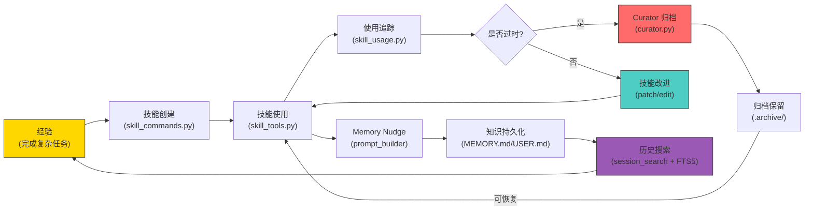
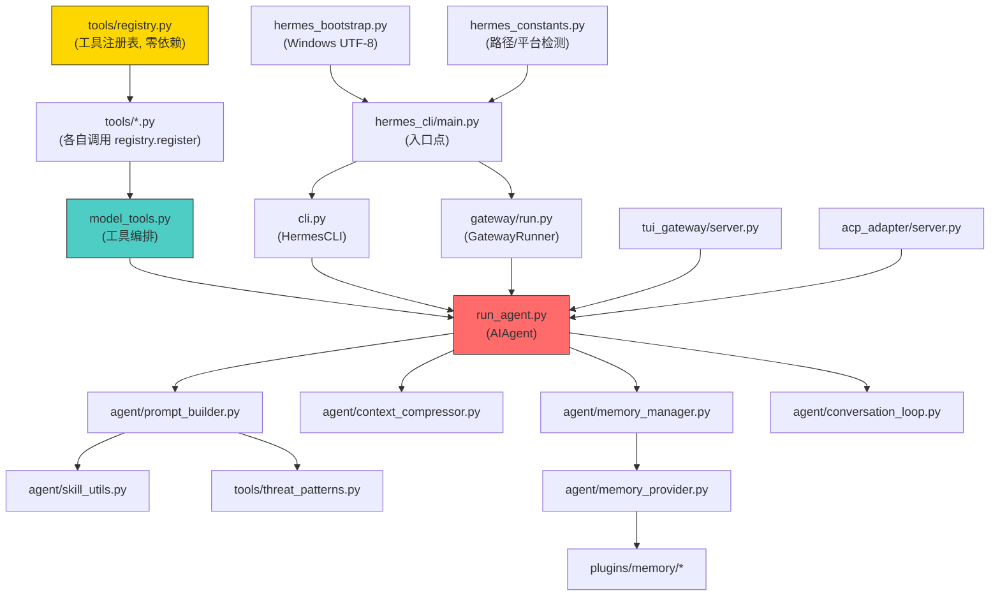
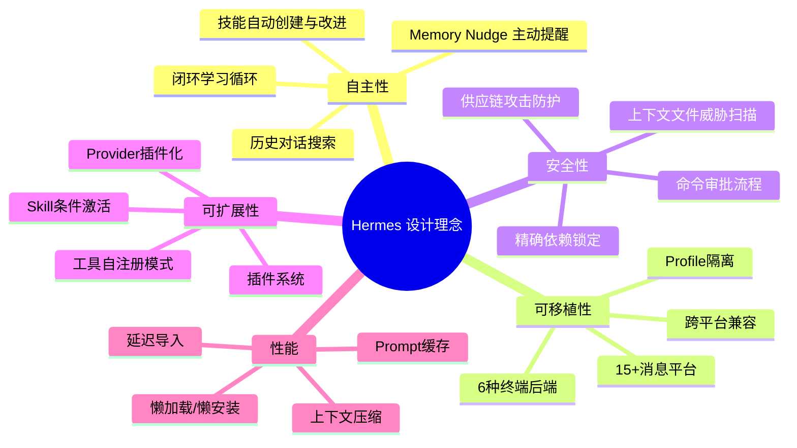
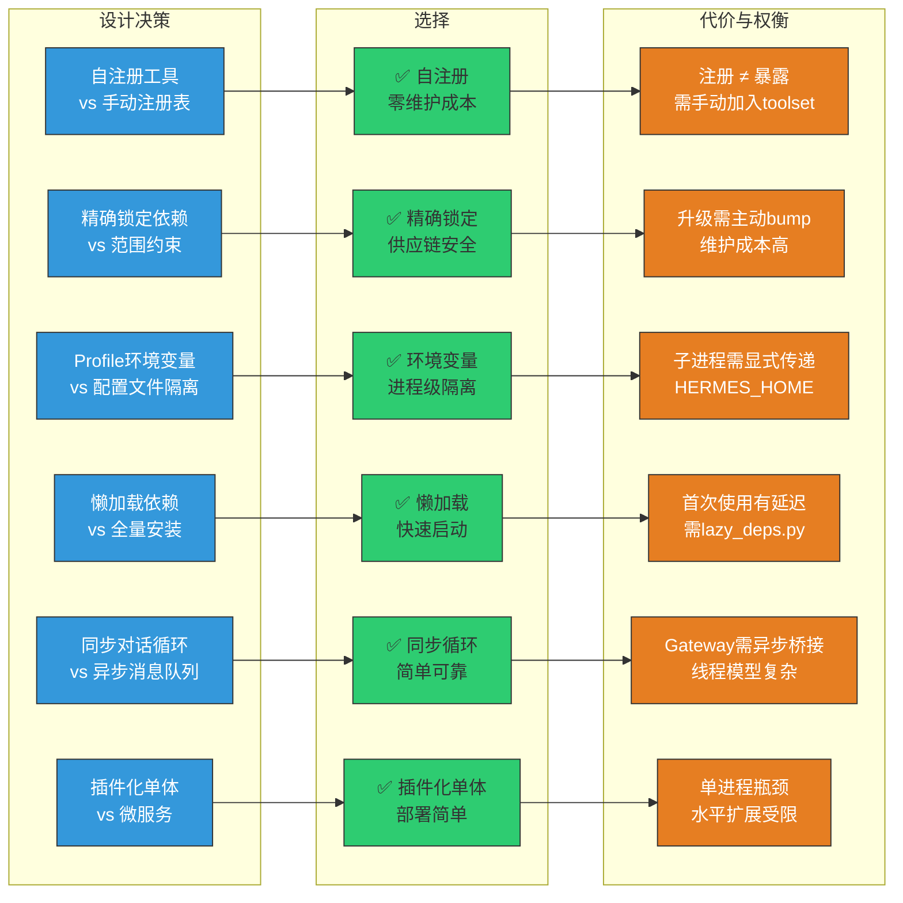

# Hermes Agent — 项目概览与架构总览

> **版本**：v0.15.1 | **许可**：MIT | **维护方**：[Nous Research](https://nousresearch.com)

---

## 一、开篇概览

Hermes Agent 是由 Nous Research 构建的**自改进 AI 代理**——它是目前唯一内置闭环学习循环的 AI Agent：从经验中自动创建技能（Skill），在使用过程中持续改进技能，主动提醒自己持久化知识，搜索自己的历史对话，并在跨会话中逐步构建对用户的深层认知模型。它可以在 $5 的 VPS 上运行，也可以在 GPU 集群或几乎零成本的 Serverless 基础设施上运行——不绑定你的笔记本电脑，你可以从 Telegram 与它对话，而它在云端 VM 上工作。

**核心创新点**：

1. **闭环学习循环**：Agent 自动创建技能 → 技能在使用中自我改进 → Curator 自动归档过时技能 → 历史对话可搜索 → 用户画像跨会话深化——形成完整的"经验→知识→优化"闭环。
2. **运行在任何地方**：6 种终端后端（local / Docker / SSH / Singularity / Modal / Daytona），Serverless 模式下空闲时几乎零成本，支持 $5 VPS 到 GPU 集群的全谱部署。
3. **多平台统一网关**：单一 Gateway 进程同时服务 Telegram / Discord / Slack / WhatsApp / Signal / Email / 飞书 / 钉钉 / 企业微信等 15+ 消息平台，语音备忘录转录、跨平台对话连续性。
4. **精确依赖锁定**：所有核心依赖精确到 `==X.Y.Z`，可选依赖通过 `tools/lazy_deps.py` 懒加载安装——这是对 2026 年 5 月 Mini Shai-Hulud 供应链攻击的直接回应。

---

## 二、全景架构图

```mermaid
graph TB
    subgraph 用户入口["用户入口层"]
        CLI["CLI (prompt_toolkit)"]
        TUI["TUI (Ink/React)"]
        Desktop["Desktop (Electron)"]
        Dashboard["Dashboard (Web)"]
        ACP["ACP Server (VS Code/Zed)"]
    end

    subgraph 消息网关["消息网关层"]
        GW["GatewayRunner"]
        TG["Telegram"]
        DC["Discord"]
        SL["Slack"]
        WA["WhatsApp"]
        FEISHU["飞书"]
        DING["钉钉"]
        WECOM["企业微信"]
        OTHER["Signal/Email/SMS/Matrix/..."]
    end

    subgraph 核心引擎["核心代理引擎"]
        Agent["AIAgent (run_agent.py)"]
        Loop["对话循环 (conversation_loop)"]
        PB["PromptBuilder (prompt_builder)"]
        CC["ContextCompressor"]
        TM["ToolManager (model_tools)"]
        REG["ToolRegistry (tools/registry)"]
    end

    subgraph 工具系统["工具系统"]
        TERM["terminal"]
        FILE["file_operations"]
        WEB["web_tools"]
        VISION["vision_tools"]
        DELEGATE["delegate_task"]
        CODE["execute_code"]
        CRON["cronjob_tools"]
        SKILL["skill_tools"]
        BROWSER["browser_tool"]
        MORE["40+ tools..."]
    end

    subgraph 记忆与学习["记忆与学习层"]
        MEM["MemoryManager"]
        MP["MemoryProvider (honcho/mem0/...)"]
        CUR["Curator (技能生命周期)"]
        SS["SessionSearch (FTS5)"]
        SKILLS["Skills System"]
    end

    subgraph 插件生态["插件生态"]
        PLUGINS["PluginManager"]
        MPP["Model Providers (30+)"]
        BRP["Browser Providers"]
        WSP["Web Search Providers"]
        IGP["Image Gen Providers"]
        MEMP["Memory Providers"]
    end

    subgraph 基础设施["基础设施层"]
        STATE["SessionDB (SQLite/FTS5)"]
        CONFIG["Config (config.yaml + .env)"]
        PROFILE["Profile Isolation"]
        BOOT["hermes_bootstrap / hermes_constants"]
        CRON_SCH["Cron Scheduler"]
        KANBAN["Kanban Board"]
    end

    CLI --> Agent
    TUI --> Agent
    Desktop --> Agent
    Dashboard --> Agent
    ACP --> Agent

    GW --> Agent
    TG --> GW
    DC --> GW
    SL --> GW
    WA --> GW
    FEISHU --> GW
    DING --> GW
    WECOM --> GW
    OTHER --> GW

    Agent --> Loop
    Loop --> PB
    Loop --> TM
    Loop --> CC
    TM --> REG
    REG --> TERM & FILE & WEB & VISION & DELEGATE & CODE & CRON & SKILL & BROWSER & MORE

    Loop --> MEM
    MEM --> MP
    Loop --> CUR
    CUR --> SKILLS
    Loop --> SS

    PLUGINS --> MPP & BRP & WSP & IGP & MEMP
    MPP --> Agent
    BRP --> BROWSER
    WSP --> WEB
    IGP --> VISION

    Agent --> STATE
    Agent --> CONFIG
    Agent --> PROFILE
    Agent --> BOOT
    GW --> CRON_SCH
    GW --> KANBAN
```



---

## 三、项目定位与核心价值

### 3.1 自改进 AI 代理的独特定位

Hermes Agent 不是一个简单的 ChatGPT 包装器，而是一个**具备自我进化能力的自主代理系统**。它的"自改进"不是营销口号，而是通过四个机制形成的工程闭环：

| 机制 | 实现模块 | 效果 |
|------|----------|------|
| **技能自动创建** | `agent/skill_commands.py` + `tools/skill_tools.py` | 复杂任务完成后，Agent 自动将解决方案固化为可复用的 Skill |
| **技能使用中改进** | `agent/curator.py` + `tools/skill_usage.py` | 追踪技能使用频次，Agent 可 patch/edit 已有技能 |
| **知识持久化提醒** | `agent/prompt_builder.py` 中的 memory nudge | Agent 主动提醒自己将重要信息写入 memory |
| **历史对话搜索** | `tools/session_search_tool.py` + FTS5 | Agent 可搜索自己的过去对话，实现跨会话知识复用 |

**为什么这样设计？** 传统的 AI Agent 每次对话都从零开始，无法积累经验。Hermes 的闭环设计让 Agent 在使用中变得越来越擅长特定任务——这更接近人类"从做中学"的认知模式，而非简单的 RAG 检索增强。

### 3.2 闭环学习循环的设计哲学



这个闭环的精妙之处在于**Agent 自身就是循环的驱动力**——不需要外部编排器或人工触发。Agent 在对话中自然地创建技能、使用技能、搜索历史、写入记忆，形成自驱动的飞轮效应。

### 3.3 "运行在任何地方"的设计目标

Hermes 的部署哲学是**不绑定任何特定运行环境**：

- **6 种终端后端**：`tools/environments/` 下的 `local.py`、`docker.py`、`ssh.py`、`singularity.py`、`modal.py`、`daytona.py`，通过 `BaseEnvironment` ABC 统一接口
- **Serverless 持久化**：Modal 和 Daytona 后端支持空闲休眠、按需唤醒，空闲时成本接近零
- **Profile 隔离**：`hermes_constants.py` 的 `get_hermes_home()` 实现多实例完全隔离，每个 Profile 有独立的 config、memory、skills、sessions
- **跨平台兼容**：Windows 原生支持（`hermes_bootstrap.py` 解决 UTF-8 编码问题）、macOS、Linux、Android/Termux

**为什么这样设计？** AI Agent 的价值在于"随时可用"——如果它只能在你打开笔记本电脑时工作，就失去了作为自主代理的意义。Hermes 让 Agent 可以在云端 7×24 运行，用户通过任何消息平台与之交互。

---

## 四、技术栈全景

### 4.1 技术栈分层图

```mermaid
graph TB
    subgraph 前端层["前端展示层"]
        TUI_TS["TypeScript / React (Ink)<br/>ui-tui/"]
        DESKTOP["Electron + React<br/>apps/desktop/"]
        WEB_DASH["React + Vite<br/>web/"]
        WEBSITE["Docusaurus<br/>website/"]
    end

    subgraph 通信层["通信与协议层"]
        PT["prompt_toolkit<br/>CLI 交互"]
        JSONRPC["JSON-RPC over stdio<br/>TUI ↔ Python"]
        FASTAPI["FastAPI + Uvicorn<br/>Dashboard API"]
        WS["WebSocket<br/>PTY Bridge"]
        ACP_PROTO["ACP Protocol<br/>编辑器集成"]
    end

    subgraph 核心层["核心代理层"]
        OPENAI["OpenAI SDK 2.24.0<br/>LLM 调用"]
        PYDANTIC["Pydantic 2.13.4<br/>数据校验"]
        RICH["Rich 14.3.3<br/>终端渲染"]
        CRONITER["croniter 6.0.0<br/>定时调度"]
        TENACITY["tenacity 9.1.4<br/>重试策略"]
    end

    subgraph 存储层["持久化层"]
        SQLITE["SQLite + FTS5<br/>会话存储"]
        YAML["YAML (PyYAML + ruamel.yaml)<br/>配置管理"]
        DOTENV["python-dotenv<br/>密钥管理"]
        FILESYS["文件系统<br/>Skills / Memory / Logs"]
    end

    subgraph 基础设施层["基础设施层"]
        DOCKER_ENV["Docker / Singularity<br/>容器隔离"]
        NIX["Nix Flakes<br/>可复现构建"]
        UV["uv<br/>包管理"]
        PSUTIL["psutil 7.2.2<br/>跨平台进程管理"]
    end

    前端层 --> 通信层
    通信层 --> 核心层
    核心层 --> 存储层
    存储层 --> 基础设施层
```



### 4.2 技术选型分析

| 技术 | 选型理由 | 关键文件 |
|------|----------|----------|
| **Python 3.11+** | Agent 生态的核心语言，OpenAI SDK 原生支持 | `pyproject.toml` → `requires-python = ">=3.11,<3.14"` |
| **OpenAI SDK** | 统一的 LLM 调用接口，支持所有兼容 API | `run_agent.py` → 延迟导入以优化启动速度 |
| **SQLite + FTS5** | 零依赖的嵌入式数据库，全文搜索支持历史对话检索 | `hermes_state.py` → `SessionDB` |
| **prompt_toolkit** | 成熟的终端交互库，支持自动补全、多行编辑 | `cli.py` → `HermesCLI` |
| **FastAPI** | 高性能异步 API 框架，Dashboard 和 ACP 共用 | `hermes_cli/web_server.py` |
| **Pydantic** | 数据校验与序列化，OpenAI SDK 的传递依赖 | `pyproject.toml` → 精确锁定 2.13.4 |
| **Rich** | 终端富文本渲染，Banner/Panel/Spinner | `agent/display.py` → `KawaiiSpinner` |
| **croniter** | Cron 表达式解析，定时任务调度 | `cron/scheduler.py` |

**为什么精确锁定依赖版本？** `pyproject.toml` 中的注释给出了明确答案：

> Rationale: ranges allow PyPI to ship a fresh version of a transitive at any time without a code review on our side. Exact pins mean the only way a new package version reaches a user is via an intentional update on our end.

这是对 2026 年 5 月 Mini Shai-Hulud 蠕虫攻击（通过 `mistralai` 2.4.6 恶意发布投毒）的直接工程回应——精确锁定意味着供应链攻击面最小化。

---

## 五、目录结构与模块划分

### 5.1 目录结构树形图

```
hermes-agent/
├── 📄 run_agent.py              # AIAgent 核心类 — 对话循环 (~12k LOC)
├── 📄 model_tools.py            # 工具编排层 — discover_builtin_tools() + handle_function_call()
├── 📄 toolsets.py               # 工具集定义 — _HERMES_CORE_TOOLS + 平台预设
├── 📄 cli.py                    # HermesCLI — 交互式 CLI (~11k LOC)
├── 📄 hermes_state.py           # SessionDB — SQLite 会话存储 (FTS5)
├── 📄 hermes_constants.py       # get_hermes_home() — Profile 感知路径
├── 📄 hermes_bootstrap.py       # Windows UTF-8 引导
├── 📄 hermes_logging.py         # 日志系统 (profile-aware)
├── 📄 batch_runner.py           # 并行批处理
├── 📄 trajectory_compressor.py  # 轨迹压缩
│
├── 📁 agent/                    # 代理内部模块
│   ├── prompt_builder.py        # 系统提示词组装
│   ├── context_compressor.py    # 上下文自动压缩
│   ├── conversation_loop.py     # 对话循环核心
│   ├── memory_manager.py        # 记忆管理器
│   ├── memory_provider.py       # MemoryProvider ABC
│   ├── curator.py               # 技能生命周期管理
│   ├── display.py               # KawaiiSpinner + 工具进度
│   ├── auxiliary_client.py      # 辅助 LLM 客户端
│   ├── transports/              # 多传输层适配 (chat_completions/codex/anthropic/bedrock)
│   ├── lsp/                     # LSP 集成
│   └── secret_sources/          # 密钥源 (Bitwarden)
│
├── 📁 tools/                    # 工具实现 (自注册)
│   ├── registry.py              # 🔑 中央工具注册表
│   ├── terminal_tool.py         # 终端编排
│   ├── file_operations.py       # 文件操作
│   ├── web_tools.py             # Web 搜索/提取
│   ├── vision_tools.py          # 图像分析
│   ├── delegate_tool.py         # 子代理委派
│   ├── code_execution_tool.py   # 沙箱代码执行
│   ├── session_search_tool.py   # 历史对话搜索
│   ├── cronjob_tools.py         # 定时任务
│   ├── skill_tools.py           # 技能管理
│   ├── environments/            # 终端后端 (local/docker/ssh/modal/daytona/singularity)
│   └── ...                      # 40+ 工具文件
│
├── 📁 gateway/                  # 消息网关
│   ├── run.py                   # GatewayRunner — 平台生命周期
│   ├── session.py               # 会话存储
│   ├── config.py                # 平台配置
│   ├── platforms/               # 平台适配器
│   │   ├── telegram.py          # Telegram
│   │   ├── discord_adapter.py   # Discord (via plugin)
│   │   ├── slack.py             # Slack
│   │   ├── whatsapp.py          # WhatsApp
│   │   ├── feishu.py            # 飞书
│   │   ├── dingtalk.py          # 钉钉
│   │   ├── wecom.py             # 企业微信
│   │   └── ...                  # 15+ 平台
│   └── builtin_hooks/           # 网关钩子扩展点
│
├── 📁 hermes_cli/               # CLI 子命令
│   ├── main.py                  # 入口点 + 参数解析
│   ├── config.py                # 配置管理 + 迁移
│   ├── setup.py                 # 交互式设置向导
│   ├── commands.py              # 🔑 斜杠命令注册表 (CommandDef)
│   ├── skin_engine.py           # 皮肤/主题引擎
│   ├── plugins.py               # 插件管理器
│   ├── profiles.py              # Profile 管理
│   ├── web_server.py            # Dashboard API 服务器
│   ├── dashboard_auth/          # Dashboard 认证
│   └── ...                      # 80+ CLI 模块
│
├── 📁 plugins/                  # 插件系统
│   ├── memory/                  # 记忆提供者 (honcho/mem0/supermemory/...)
│   ├── model-providers/         # 模型提供者 (30+ providers)
│   ├── browser/                 # 浏览器提供者 (browserbase/firecrawl/browser_use)
│   ├── web/                     # 搜索提供者 (exa/firecrawl/parallel/ddgs/...)
│   ├── image_gen/               # 图像生成 (fal/openai/xai/...)
│   ├── platforms/               # 额外平台 (discord/irc/line/mattermost/...)
│   ├── kanban/                  # 看板系统
│   └── ...                      # 更多插件
│
├── 📁 skills/                   # 内置技能 (按类别组织)
│   ├── research/                # arxiv/blogwatcher/polymarket/...
│   ├── creative/                # manim/p5js/comfyui/excalidraw/...
│   ├── github/                  # code-review/issues/pr-workflow/...
│   ├── productivity/            # google-workspace/notion/airtable/...
│   ├── mlops/                   # vllm/llama-cpp/wandb/...
│   └── ...                      # 15+ 类别
│
├── 📁 optional-skills/          # 可选技能 (默认不激活)
├── 📁 cron/                     # 定时调度器
│   ├── jobs.py                  # 作业存储
│   └── scheduler.py             # 调度循环
├── 📁 acp_adapter/              # ACP 服务器 (编辑器集成)
├── 📁 tui_gateway/              # TUI JSON-RPC 后端
├── 📁 ui-tui/                   # Ink (React) 终端 UI
├── 📁 apps/desktop/             # Electron 桌面应用
├── 📁 web/                      # Dashboard 前端
├── 📁 website/                  # Docusaurus 文档站
├── 📁 nix/                      # Nix 构建定义
├── 📁 providers/                # 模型提供者 (旧路径, 兼容)
├── 📁 tests/                    # 测试套件 (~17k 测试)
└── 📁 scripts/                  # 安装/发布脚本
```

### 5.2 模块依赖关系图



**依赖链的关键设计**：

1. `tools/registry.py` 是**零依赖**模块——它不导入任何其他 Hermes 模块，确保循环导入安全
2. 工具文件（`tools/*.py`）在模块级别调用 `registry.register()`，形成自注册模式
3. `model_tools.py` 触发工具发现（通过 `discover_builtin_tools()` 导入所有工具模块）
4. `run_agent.py`、`cli.py`、`batch_runner.py` 位于依赖链顶端

---

## 六、核心设计理念

### 6.1 单一入口点设计

Hermes 的所有入口点都遵循一个严格的初始化顺序：

```python
# hermes_cli/main.py — 入口点的第一行
try:
    import hermes_bootstrap  # ① Windows UTF-8 引导（POSIX 无操作）
except ModuleNotFoundError:
    pass

# ② Profile 覆盖 — 在任何模块导入之前设置 HERMES_HOME
_apply_profile_override()

# ③ 然后才能导入其他模块
from hermes_constants import get_hermes_home
```

**为什么这样设计？** `hermes_constants.py` 中的 `get_hermes_home()` 被 30+ 模块在导入时调用。如果 Profile 覆盖发生在模块导入之后，所有已缓存的路径都会指向错误的 Profile。因此 `_apply_profile_override()` 必须在任何 `import hermes_constants` 之前执行。

`hermes_bootstrap.py` 同理——它必须在任何 `print()` 或文件 I/O 之前修复 Windows 的 UTF-8 编码问题。这两个模块构成了 Hermes 的**初始化双守卫**。

### 6.2 模块自注册模式

Hermes 最优雅的设计模式之一是**工具自注册**：

```python
# tools/registry.py — 零依赖，可被任何模块安全导入
class ToolRegistry:
    def register(self, name, toolset, schema, handler, check_fn=None, ...):
        """注册一个工具到中央注册表"""
        ...

registry = ToolRegistry()  # 模块级单例
```

```python
# tools/web_tools.py — 每个工具文件在导入时自注册
from tools.registry import registry

registry.register(
    name="web_search",
    toolset="search",
    schema=WEB_SEARCH_SCHEMA,
    handler=lambda args, **kw: web_search(**args, **kw),
    check_fn=lambda: bool(os.getenv("FIRECRAWL_API_KEY")),
)
```

```python
# model_tools.py — 触发发现，无需维护导入列表
from tools.registry import discover_builtin_tools, registry
discover_builtin_tools()  # 自动扫描 tools/*.py 中含 registry.register() 的文件
```

**为什么这样设计？** 传统方式需要在某处维护一个工具导入列表——每次新增工具都要修改两处（工具文件 + 导入列表）。自注册模式让工具文件成为**唯一的修改点**：创建 `tools/my_tool.py`，调用 `registry.register()`，它就被自动发现和注册。`discover_builtin_tools()` 甚至使用 AST 分析来检测哪些文件包含 `registry.register()` 调用，避免盲目导入。

但**注册 ≠ 暴露**——工具必须被加入 `toolsets.py` 中的某个工具集才会暴露给 Agent。这是有意为之的两步设计：发现是自动的，但暴露是显式的。

### 6.3 Profile 隔离

```python
# hermes_constants.py — Profile 感知路径的核心实现
def get_hermes_home() -> Path:
    """单一真相源 — 所有 HERMES_HOME 路径都应通过此函数获取"""
    override = get_hermes_home_override()  # ContextVar 优先
    if override:
        return Path(override)
    val = os.environ.get("HERMES_HOME", "").strip()
    if val:
        return Path(val)
    return _get_platform_default_hermes_home()  # ~/.hermes 或 %LOCALAPPDATA%\hermes
```

Profile 隔离的规则极其严格（来自 `AGENTS.md`）：

1. **代码路径**：必须使用 `get_hermes_home()`，绝不硬编码 `~/.hermes`
2. **用户消息**：必须使用 `display_hermes_home()`，显示 `~/.hermes/profiles/<name>`
3. **模块级常量**：可以在导入时缓存 `get_hermes_home()`，因为此时 `_apply_profile_override()` 已执行
4. **网关平台适配器**：使用 `acquire_scoped_lock()` 防止两个 Profile 使用同一凭证
5. **Profile 操作**：锚定 `Path.home() / ".hermes"` 而非 `get_hermes_home()`

**为什么这样设计？** 多实例场景下（比如一个 Profile 做开发、一个做运维），如果路径不隔离，两个实例会互相覆盖配置、记忆和技能。`get_hermes_home()` 通过环境变量 + ContextVar 双重机制确保每个进程/线程看到正确的 Profile 路径。

### 6.4 精确依赖锁定

`pyproject.toml` 中的依赖策略是 Hermes 对供应链安全的工程回应：

```toml
# 核心依赖 — 全部精确锁定到 ==X.Y.Z
dependencies = [
    "openai==2.24.0",
    "pydantic==2.13.4",
    "prompt_toolkit==3.0.52",
    # ...
]

# 可选依赖 — 通过 lazy_deps.py 在首次使用时安装
[project.optional-dependencies]
anthropic = ["anthropic==0.86.0"]
firecrawl = ["firecrawl-py==4.17.0"]
fal = ["fal-client==0.13.1"]
```

**核心依赖 vs 可选依赖的策略差异**：

- **核心依赖**：精确锁定 `==X.Y.Z`，因为它们在每个 Hermes 会话中都会被使用
- **可选依赖**：也精确锁定，但通过 `tools/lazy_deps.py` 在首次使用时才安装，减小初始安装体积和攻击面
- **`[all]` 策略**（2026-05-12 更新）：只包含**无法懒加载**的额外依赖——任何可选后端（provider、搜索、TTS、消息平台）必须通过 `LAZY_DEPS` 路径解析

**为什么这样设计？** Mini Shai-Hulud 蠕虫通过 `mistralai` 2.4.6 恶意版本攻击了 PyPI——如果依赖使用范围约束（如 `mistralai>=2.3.0,<3`），所有安装都会在隔离前拉取恶意版本。精确锁定意味着新版本到达用户的唯一途径是我们主动更新 pin 值。

### 6.5 懒加载策略

Hermes 的懒加载体现在多个层面：

| 层面 | 实现 | 效果 |
|------|------|------|
| **依赖懒安装** | `tools/lazy_deps.py` | 首次使用 `anthropic`/`firecrawl`/`fal` 等时才 `pip install` |
| **工具懒发现** | `tools/registry.py` → `discover_builtin_tools()` | 仅在 `model_tools` 导入时扫描工具文件 |
| **Provider 懒扫描** | `providers/__init__.py` → `_discover_providers()` | 首次 `get_provider_profile()` 时才扫描 |
| **OpenAI SDK 延迟导入** | `run_agent.py` 中的代理对象 | SDK 导入耗时 ~240ms，延迟到首次 LLM 调用 |
| **插件懒加载** | `hermes_cli/plugins.py` → `discover_plugins()` | 作为 `model_tools` 导入的副作用触发 |

**为什么这样设计？** Hermes 的启动速度直接影响用户体验——用户输入 `hermes` 后应立即进入对话。通过将重量级导入推迟到实际需要时，CLI 的启动时间从秒级降到毫秒级。

### 6.6 设计理念思维导图



---

## 七、收束总结

### 7.1 架构风格总结

Hermes Agent 的架构风格可以概括为**"插件化单体 + 事件驱动网关"**：

1. **插件化单体**：核心代理引擎（`run_agent.py` + `model_tools.py`）是一个功能完整的单体，但通过自注册模式（`tools/registry.py`）、插件系统（`plugins/`）、Provider 插件化（`plugins/model-providers/`）实现了高度的可扩展性。新增工具只需创建一个文件并调用 `registry.register()`；新增模型提供者只需在 `plugins/model-providers/` 下创建一个目录。

2. **事件驱动网关**：`gateway/run.py` 的 `GatewayRunner` 是一个异步事件循环，管理多个平台适配器的生命周期，处理消息路由、Cron 调度、Kanban 调度。它与核心代理引擎通过同步调用（`AIAgent.run_conversation()`）交互，而非异步消息队列——这是有意为之的简化设计，因为 Agent 的对话循环本身就是同步的。

3. **分层隔离**：前端（CLI/TUI/Desktop/Dashboard）→ 通信层（prompt_toolkit/JSON-RPC/FastAPI/WebSocket）→ 核心引擎 → 工具系统 → 持久化层，各层之间通过明确的接口交互，而非直接耦合。

4. **防御性工程**：从 `hermes_bootstrap.py` 的 Windows UTF-8 守卫，到 `hermes_constants.py` 的 Profile 路径守卫，到 `pyproject.toml` 的精确依赖锁定，到 `tools/threat_patterns.py` 的上下文文件威胁扫描——Hermes 在每个可能出错的层面都设置了防御机制。

### 7.2 设计决策总结图



每一个设计决策都是**权衡**的结果——Hermes 选择了对它的核心场景（个人/小团队 AI Agent，7×24 运行，多平台接入，自改进闭环）最优的方案，而非追求架构上的"纯粹"。这种务实的工程哲学，正是 Hermes 能在复杂度可控的前提下实现如此丰富功能的关键。

---

> **文档版本**：基于 Hermes Agent v0.15.1 (2026-06) 代码库分析
> **关键参考文件**：`README.md`、`pyproject.toml`、`AGENTS.md`、`CONTRIBUTING.md`、`hermes_constants.py`、`hermes_bootstrap.py`、`tools/registry.py`、`model_tools.py`、`run_agent.py`、`gateway/run.py`、`agent/prompt_builder.py`、`toolsets.py`
