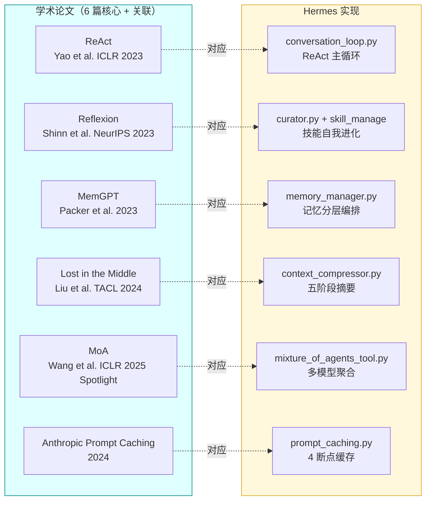
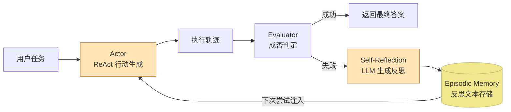
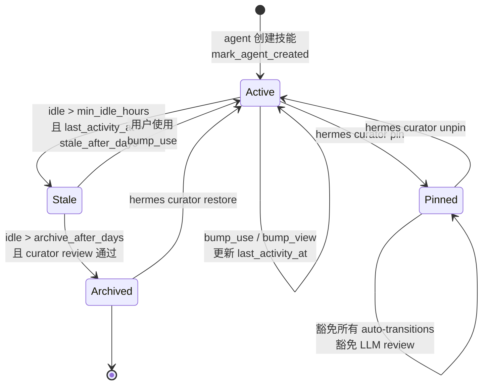
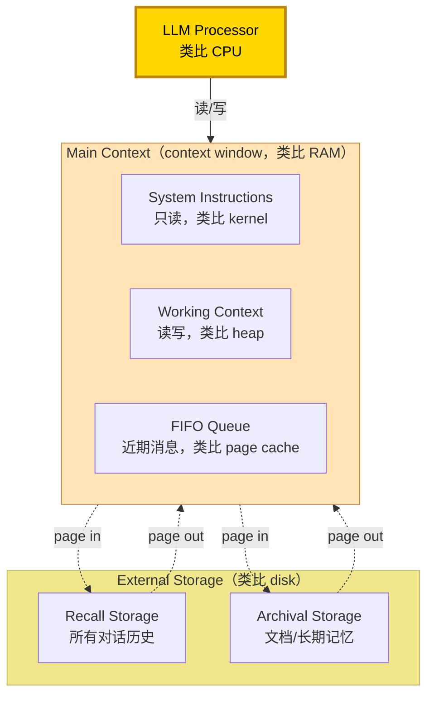
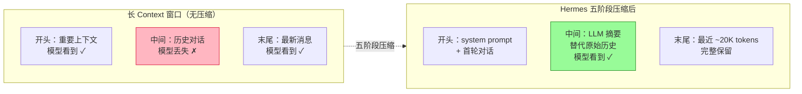
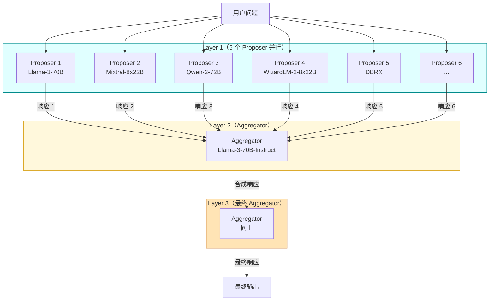
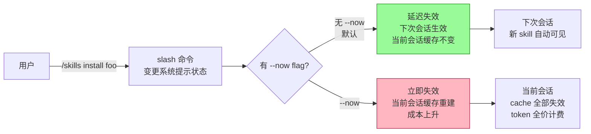
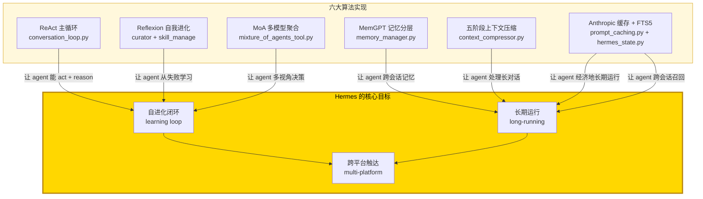

# 具体观：Hermes Agent 算法与实现剖析

> 三观递进法 · 第二观 · 看懂
> 本文是 Hermes Agent 代码库深度阅读 trilogy 的第二篇。第一篇建立整体认知地图，本文潜入水下审视每一处实现细节——用了什么算法、对应哪篇学术论文、代码里如何实现、用具体例子逐一说明。本文的目标是让读者真正"看懂"代码背后的技术原理。

---

## 总：Hermes 值得深挖的六大技术点

第一篇画完了 Hermes 的整体画像——一个自进化 Agent 操作系统，由四大注册表驱动、三层 tier 保护缓存不变性、五阶段压缩应对长上下文、FTS5 跨会话召回。但"画完画像"和"看懂原理"之间还隔着一道水下深渊。

本文选出 Hermes 代码库中**最值得深挖的六大技术点**，每个都对应一篇或多篇学术论文。我们会逐一展开「原理（论文）→ 代码实现 → 具体例子」：



> **图 0｜六大技术点与学术论文对应图**：本文将逐一展开六个核心技术点的"原理 → 代码 → 例子"。每个技术点都对应至少一篇学术论文——这是 Hermes 工程实现与学术研究之间的桥梁。

---

## 分之一：ReAct 主循环——Thought-Action-Observation 范式

### 1.1 论文原理

[ReAct: Synergizing Reasoning and Acting in Language Models](https://arxiv.org/abs/2210.03629)（Yao et al., ICLR 2023 Oral） — 提出 LLM 在每个决策点交替生成 **Thought**（自由形式推理）和 **Action**（外部工具调用），通过 Thought 来规划/修订行为，通过 Action 从外部环境获取 Observation，循环直至任务完成。这种交错避免了纯 chain-of-thought 的两个失败模式：**事实幻觉**（因为 Action 可以从 API 拿真实信息）和**错误传播**（因为下一个 Thought 可以基于 Observation 修订计划）。

论文核心贡献一句话：**ReAct 在 ALFWorld 和 WebShop 两个交互决策基准上，分别比模仿学习和强化学习方法高 34% 和 10% 的绝对成功率——而只需 1-2 个 in-context 示例**。

### 1.2 Hermes 中的实现

Hermes 的主循环 `/workspace/agent/conversation_loop.py:351` `run_conversation()` 正是 ReAct 范式的工程化落地，但增加了 5 个生产级强化：

```python
# /workspace/agent/conversation_loop.py:801（简化展示）
while (api_call_count < agent.max_iterations and agent.iteration_budget.remaining > 0) \
        or agent._budget_grace_call:
    # 第 803 行：每轮新建 checkpoint dedup
    agent._checkpoint_mgr.new_turn()
    # 第 806 行：检查中断请求（用户发新消息、/stop、信号）
    if agent._interrupt_requested:
        interrupted = True; break
    # 第 813 行：递增 API 调用计数
    api_call_count += 1
    # 第 820-826 行：消费预算（grace call 机制——预算耗尽后再给一次机会）
    if agent._budget_grace_call: agent._budget_grace_call = False
    elif not agent.iteration_budget.consume(): break
    # 第 862-874 行：drain /steer 注入（用户在 agent 运行中插入新指令）
    # 第 916-926 行：sanitize tool_call arguments
    # 第 1114 行：发起 _interruptible_api_call
    response = agent._interruptible_api_call(messages, tools)
    # 解析响应：若有 tool_calls → 执行工具 → append tool results → 回到循环
    #          若为文本响应 → 持久化会话 → flush memory → return
```

Hermes 与原版 ReAct 的五个差异：

| 维度 | 原版 ReAct（2022） | Hermes 工程化 |
|---|---|---|
| **预算控制** | 无（直到任务完成） | `IterationBudget` + `_budget_grace_call`，避免 runaway loop |
| **可中断性** | 无 | `_interrupt_requested` 每轮检查；用户发新消息立即中断当前 turn |
| **工具并行** | 串行 | `_should_parallelize_tool_batch` 决策；只读工具自动并行（最多 8 workers） |
| **循环保护** | 无 | `ToolGuardrail` 检测幂等工具的"无进展循环"（read_file 5 次返回相同结果 → block）|
| **steer 注入** | 无 | 用户在 agent 运行中通过 `/steer` 插入新指令，drain 到当前 turn |

### 1.3 具体例子

假设用户对 Hermes 说：「帮我搜索 React 19 的新特性并写一份 markdown 笔记」。Hermes 的 ReAct 主循环会这样展开：

```
Turn 1:
  Thought（隐含在 LLM 推理中）: 我需要先搜索 React 19 新特性
  Action: web_search(query="React 19 new features release notes")
  Observation: <search results with React 19 release notes URL>

Turn 2:
  Thought: 我应该抓取这个 URL 的内容
  Action: web_extract(url="https://react.dev/blog/...")
  Observation: <extracted markdown content>

Turn 3:
  Thought: 现在我有了内容，写到 notes.md
  Action: write_file(path="notes.md", content="...")
  Observation: {"success": true, "bytes_written": 1234}

Turn 4:
  Thought: 任务完成
  Final Response: 我已经把 React 19 新特性写到 notes.md 了...
```

每一轮的 `tool_call` 都被 `/workspace/model_tools.py:861` `handle_function_call()` 路由到 `tools/registry.py:390` `dispatch()`，最终调用具体工具的 handler。

---

## 分之二：Reflexion 自我进化——技能的"语言强化学习"

### 2.1 论文原理

[Reflexion: Language Agents with Verbal Reinforcement Learning](https://arxiv.org/abs/2303.11366)（Shinn et al., NeurIPS 2023 Oral） — 提出 LLM Agent 通过**自然语言反思**实现"语言强化学习"：Agent 失败后用自然语言生成反思（"哪里错了、下次怎么改"），存入 episodic memory，下次尝试时注入到 prompt 中。论文在 HumanEval 上达到 91% pass@1（超越 GPT-4 的 80%），无需任何权重更新。

三组件架构：



> **图 2.1｜Reflexion 三组件架构**：Actor（基于 ReAct 的行动生成）、Evaluator（成否判定）、Self-Reflection（自然语言反思）。失败时进入反思→存储→重试循环。论文核心贡献一句话：**Reflexion 用"语言强化"替代"权重更新"，让 API LLM 也能 trial-and-error 学习**。

### 2.2 Hermes 中的实现

Hermes 把 Reflexion 思想落地为"**技能自我进化系统**"——agent 在使用中创建/改进技能，curator 后台 review 归档。这比论文更进一步：**反思从"单次任务内"扩展到"跨任务/跨会话"**。

#### 三层架构对应

| Reflexion 论文 | Hermes 实现 | 文件 |
|---|---|---|
| **Actor**（行动生成）| AIAgent 主循环 + 工具执行 | `/workspace/agent/conversation_loop.py:351` |
| **Evaluator**（成否判定）| Curator LLM review（判断技能是否 stale）| `/workspace/agent/curator.py` |
| **Self-Reflection**（反思生成）| skill_manage(action="patch/edit") 让 agent 修改技能 | `/workspace/tools/skill_manager_tool.py:13-21` |
| **Episodic Memory**（反思存储）| `~/.hermes/skills/<name>/SKILL.md` 技能文件 | `/workspace/tools/skill_usage.py` 跟踪 |

#### skill_manage 的 6 种 action

```python
# /workspace/tools/skill_manager_tool.py:13-21
# action in: create / edit / patch / delete / write_file / remove_file
```

**关键设计**：`skill_manage(action="create")` 仅当**后台 curator review fork** 创建时才被打上 `created_by: "agent"` 标记进入 curator 管理范围；用户主动 `skill_manage(create)` 创建的技能属于用户，curator 不会触碰。判断通过 `tools/skill_provenance.py` 的 `is_background_review()`。

#### Curator 状态机



> **图 2.2｜Curator 状态机图**：技能有 4 个状态——active、stale、archived、pinned。Curator 后台 review loop 用 LLM 判断 stale 技能是否值得归档；pinned 技能豁免所有 auto-transitions 和 LLM review（保护重要技能不被误归档）。**永不删除**——归档只是移到 `~/.hermes/skills/.archive/`，可 restore。

### 2.3 具体例子

假设用户让 Hermes 做「调研 React 19 新特性并写报告」，过程中发现它需要反复用 GitHub API 查 release notes：

```
Turn 1: agent 调用 web_extract 抓取 React 19 release notes
Turn 2: agent 调用 GitHub API 查 PRs（用 terminal 跑 gh 命令）
Turn 3: agent 调用 write_file 写报告
...
任务完成后，agent 通过 background review 创建技能 react-research：

  ~/.hermes/skills/react-research/SKILL.md
  ---
  name: react-research
  description: "Research React release notes via GitHub PRs."
  metadata:
    hermes:
      tags: [React, GitHub, Research]
      created_by: agent   ← 关键标记
  ---
  ## Procedure
  1. Fetch release notes URL via web_extract
  2. Query GitHub PRs via gh pr list --repo facebook/react
  ...
```

下次用户问「调研 Vue 4 新特性」，agent 通过 `/react-research` slash 命令调用此技能——技能体作为 **user message 注入**而非 system prompt，保留 prefix cache。若 30 天未使用，curator 后台 review 决定归档或保留；用户随时可 `hermes curator restore react-research` 恢复。

---

## 分之三：MemGPT 启发的记忆分层——OS 虚拟内存模型

### 3.1 论文原理

[MemGPT: Towards LLMs as Operating Systems](https://arxiv.org/abs/2310.08560)（Packer et al., UC Berkeley, 2023） — 把 LLM 上下文窗口比作 OS 的 RAM，外部存储比作 disk，通过 function calling 让 LLM 自主在两层之间"page in/out"信息。MemGPT 引入"virtual context management"概念，让 agent 在有限 context window 下处理无限长的对话与文档。

**核心贡献一句话**：MemGPT 把 OS 的虚拟内存 paging 思想搬到 LLM context 管理——LLM 自己决定何时召回（page in）什么、何时驱逐（page out）什么，突破 context window 限制。



> **图 3.1｜MemGPT 记忆层级架构**：Main Context（系统指令 + 工作上下文 + FIFO 队列）对应 LLM 的 context window；External Storage（Recall + Archival）对应外部存储。LLM 通过 function call 自主管理 page in/out。论文核心贡献一句话：**LLM 可以像 OS 管理物理内存一样管理自己的 context，在有限窗口下处理无限长的对话/文档**。

### 3.2 Hermes 中的实现

Hermes 把 MemGPT 思想落地为「**三层记忆系统**」——内置 memory（MEMORY.md/USER.md）+ 可插拔外部 provider（honcho/mem0/supermemory 等），由 `MemoryManager` 编排：

#### MemoryProvider ABC

`/workspace/agent/memory_provider.py` 定义了所有记忆后端必须实现的契约：

```python
# /workspace/agent/memory_provider.py（简化展示）
class MemoryProvider(ABC):
    @property
    @abstractmethod
    def name(self) -> str: ...            # 'builtin', 'honcho', 'hindsight'

    @abstractmethod
    def is_available(self) -> bool: ...    # 凭证检查 + 后端可达性

    @abstractmethod
    def initialize(self, session_id: str, **kwargs) -> None: ...

    def prefetch(self, query: str, *, session_id: str = "") -> str: ...  # 召回
    def sync_turn(self, user_content, assistant_content, *, session_id, messages=None) -> None: ...
    @abstractmethod
    def get_tool_schemas(self) -> List[Dict[str, Any]]: ...  # 暴露给 LLM 的工具
```

#### MemoryManager 编排——关键约束：仅允许一个外部 provider

```python
# /workspace/agent/memory_manager.py:258-L302（简化展示）
def add_provider(self, provider: MemoryProvider) -> None:
    is_builtin = provider.name == "builtin"
    if not is_builtin:
        if self._has_external:
            existing = next(
                (p.name for p in self._providers if p.name != "builtin"), "unknown"
            )
            logger.warning(
                "Rejected memory provider '%s' — external provider '%s' is "
                "already registered. Only one external memory provider is "
                "allowed at a time.", provider.name, existing,
            )
            return
        self._has_external = True
    self._providers.append(provider)
    # Index tool names → provider for routing
    for schema in provider.get_tool_schemas():
        tool_name = schema.get("name", "")
        if tool_name and tool_name not in self._tool_to_provider:
            self._tool_to_provider[tool_name] = provider
```

> **设计哲学**：内置 provider 永远第一，且**仅允许一个外部 provider 共存**——避免多 provider 互相冲突。这是工程化的"虚拟内存"——内置 provider 像 RAM 永远可用，外部 provider 像可插拔的 disk。

#### prefetch_all 容错设计

```python
# /workspace/agent/memory_manager.py:339（简化展示）
def prefetch_all(self, query: str, *, session_id: str = "") -> str:
    parts = []
    for provider in self._providers:
        try:
            result = provider.prefetch(query, session_id=session_id)
            if result and result.strip():
                parts.append(result)
        except Exception as e:
            logger.debug(
                "Memory provider '%s' prefetch failed (non-fatal): %s",
                provider.name, e,
            )
    return "\n\n".join(parts)
```

任一 provider 失败**不阻塞**其他 provider，也不让整个 turn 失败——这是"failure isolation"原则。

### 3.3 具体例子——Hermes 与 Honcho 的协作

[Honcho](https://github.com/plastic-labs/honcho) 是 Plastic Labs 提供的"辩证式用户建模"provider——它把用户对话作为输入，输出"对用户的越来越深理解"（用户画像、偏好、习惯）。

```
用户：帮我写一个 Python 函数计算斐波那契数列
Hermes Agent 主循环 → memory_manager.prefetch_all(query="斐波那契 Python 函数")

  ┌─ builtin provider:
  │   返回 MEMORY.md 中"用户偏好 Python 3.11 类型注解"
  │
  └─ honcho provider (if available):
      返回 honcho dialectic user model 中"用户上次问过递归，倾向看到迭代实现"

prefetch 结果拼接到 system prompt 的 Volatile tier → LLM 看到：
  "用户偏好 Python 3.11 类型注解，倾向迭代实现（来自过往对话）"

LLM 生成：
  def fibonacci(n: int) -> list[int]:
      """Iterative implementation."""
      a, b = 0, 1
      result = []
      for _ in range(n):
          result.append(a)
          a, b = b, a + b
      return result

任务完成后 → memory_manager.sync_turn(user_content, assistant_content)
  → builtin 写入 USER.md（用户偏好确认）
  → honcho 更新 dialectic user model（用户对递归的态度）
```

这种"内置 + 外部"分层让 Hermes 在无网络时只用 builtin（写文件 MEMORY.md），有 Honcho key 时启用辩证式建模——这正是 MemGPT 论文中"working context（builtin）+ archival storage（外部 provider）"的工程化。

---

## 分之四：Lost in the Middle 与五阶段上下文压缩

### 4.1 论文原理

[Lost in the Middle: How Language Models Use Long Contexts](https://arxiv.org/abs/2307.03172)（Liu et al., Stanford+Berkeley, TACL 2024） — 实证发现 LLM 在长 context 中存在"U 形性能曲线"：信息放在开头或末尾时模型表现好，放在中间时性能显著下降。即使显式标注为"长 context 模型"（如 Claude 1.3、GPT-3.5-Turbo 16K）也难以避免。

**核心贡献一句话**：LLM 在长 context 中存在"位置偏差"——首尾优先（primacy bias + recency bias），中间丢失（lost in the middle），即使长 context 模型也受影响，所以**不能简单靠扩大 context window 解决长对话问题，必须主动管理上下文**。



> **图 4.1｜Lost in the Middle 问题与五阶段压缩的对策**：左侧长 context 窗口中，中间的历史对话"丢失"——模型看不到。右侧 Hermes 五阶段压缩后，中间被 LLM 摘要替代（短得多，模型能看到），开头和末尾的原始内容被保护。这把"丢失"转化为"被摘要"——以可控的有损换取"可见"。

### 4.2 Hermes 中的实现

`/workspace/agent/context_compressor.py` 的 `ContextCompressor` 类实现五阶段有损压缩。核心方法 `compress()`（第 1827 行）：

```python
# /workspace/agent/context_compressor.py:1827（简化展示）
def compress(self, messages, current_tokens=None, focus_topic=None, force=False):
    """Compress conversation messages by summarizing middle turns.
    Algorithm:
      1. Prune old tool results (cheap pre-pass, no LLM call)
      2. Protect head messages (system prompt + first exchange)
      3. Find tail boundary by token budget (~20K tokens of recent context)
      4. Summarize middle turns with structured LLM prompt
      5. On re-compression, iteratively update the previous summary
    """
```

#### 五阶段压缩算法

| 阶段 | 函数 | 行号 | 作用 |
|------|------|------|------|
| Phase 1 | `_prune_old_tool_results()` | `context_compressor.py:754` | 廉价预扫描，剔除旧 tool_result（**无 LLM 调用**）|
| Phase 2 | `_protect_head_size()` | `context_compressor.py:1641` | 保护 system prompt + 首轮对话 |
| Phase 2.5 | `_align_boundary_forward()` | `context_compressor.py:1631` | 将边界对齐到完整 turn 边界（避免拆分 user/assistant 对）|
| Phase 3 | `_find_tail_cut_by_tokens()` | `context_compressor.py:1745` | 按 token 预算（默认 ~20K）决定尾部保护边界 |
| Phase 4 | `_generate_summary()` | `context_compressor.py:1217` | 结构化 LLM prompt 生成中间摘要 |

#### 迭代摘要机制

每次后续压缩时，会把上一轮的摘要作为 `_previous_summary` 注入 LLM，使摘要迭代演化而非重复总结全文：

```python
# /workspace/agent/context_compressor.py:1903-L1911
summary_idx, summary_body = self._find_latest_context_summary(
    messages, summary_search_start, compress_end,
)
if summary_idx is not None:
    if summary_body and not self._previous_summary:
        self._previous_summary = summary_body
    turns_to_summarize = messages[max(compress_start, summary_idx + 1):compress_end]
```

#### 失败冷却机制

自动压缩失败后会有 30-60s 冷却期；手动 `/compress`（`force=True`）可绕过此冷却立即重试：

```python
# /workspace/agent/context_compressor.py:1861-L1862
if force and self._summary_failure_cooldown_until > 0.0:
    self._summary_failure_cooldown_until = 0.0
```

### 4.3 具体例子

假设一个长对话进行了 50 轮，messages 数组总长 80K tokens，context window 是 200K tokens（未触发自动压缩），但用户执行 `/compress` 主动压缩：

```
Phase 1: 剔除旧 tool_result
  - Turn 3 的 web_search 返回了 5KB 网页内容
  - Turn 7 的 terminal 输出了 3KB 编译日志
  - Turn 15 的 read_file 返回了 8KB 代码
  → 这些都被剔除（保留 tool_call_id 引用，方便需要时重新执行）
  → 80K tokens 减少到 45K tokens（无 LLM 调用）

Phase 2: 保护头部
  - System prompt（5K tokens）保护
  - Turn 1 用户问题 + Turn 2 assistant 回复（首轮对话，2K tokens）保护

Phase 2.5: 对齐边界
  - 确保压缩边界不在 user/assistant 对中间

Phase 3: 找尾部边界
  - 末尾 ~20K tokens 完整保留（最近 8-10 轮对话）

Phase 4: LLM 摘要中间部分
  - Turn 3 到 Turn 42 之间的 ~20K tokens 中间部分
  - 用结构化 prompt 调用 auxiliary LLM（默认更便宜）
  - 输出 2-3K tokens 的摘要
  - 摘要替代原始消息，整体降到 27K tokens

结果：
  原始 80K tokens → 压缩后 27K tokens（约 66% 压缩比）
  Lost in the Middle 问题：中间 20K 历史变成 3K 摘要，模型"可见"
```

后续第 60 轮再次压缩时，会复用上次摘要，对增量部分迭代更新——避免每次都重新总结全文。

---

## 分之五：Mixture of Agents（MoA）——多模型协同

### 5.1 论文原理

[Mixture-of-Agents Enhances Large Language Model Capabilities](https://arxiv.org/abs/2406.04692)（Wang et al., Together AI, ICLR 2025 Spotlight） — 提出多层 LLM 协作架构：每层若干 proposer 模型独立生成参考回答，下一层 aggregator 模型把多份回答 concat 进 prompt 再合成。原文用 6 个开源模型堆叠 3 层，在 AlpacaEval 2.0 上以 65.1% 击败 GPT-4 Omni 的 57.5%。

**核心贡献一句话**：MoA 是推理时（inference-time）的多模型协同——通过 prompt 编排让开源模型集体超越最强闭源模型，无需额外训练。**关键观察**：LLM 有"协作性"（collaborativeness）——给它参考输出（即使来自更弱模型）通常能改善自己的回答。



> **图 5.1｜MoA 多层架构**：Layer 1 多个 proposer 并行生成参考回答；Layer 2/3 的 aggregator 把多份回答 concat 进 prompt 合成。论文核心贡献一句话：**开源模型集体可以超越最强闭源模型**——靠 prompt 编排而非训练。

### 5.2 Hermes 中的实现

`/workspace/tools/mixture_of_agents_tool.py` 实现了 MoA 算法。它作为 `mixture_of_agents` 工具暴露给 agent，agent 可以主动调用以获得多模型聚合视角。

#### 输入参数

- `query`：用户问题
- `proposers`：proposer 模型列表（如 `["nous:hermes-3-405b", "anthropic:claude-3.5-sonnet", "openai:gpt-4o"]`）
- `aggregator`：aggregator 模型（默认主模型）
- `layers`：层数（默认 1-2 层）
- `focus`：聚合焦点（可选）

#### 执行步骤

1. **并行调用 proposers**：用 ThreadPoolExecutor 并行调用每个 proposer 模型
2. **聚合响应**：把所有 proposer 响应 concat 进 aggregator 的 prompt
3. **迭代层**：若有第 N+1 层，把上一层输出作为参考再合成

### 5.3 具体例子

假设用户问：「What's the best approach for distributed consensus?」Hermes 可以这样调用 MoA：

```python
# Agent 调用 mixture_of_agents 工具
mixture_of_agents(
    query="What's the best approach for distributed consensus?",
    proposers=["nous:hermes-3-405b", "anthropic:claude-3.5-sonnet", "openai:gpt-4o"],
    aggregator="nous:hermes-3-405b",
    layers=2
)
```

执行过程：

```
Layer 1（3 个 proposer 并行）:
  ┌─ nous:hermes-3-405b: 推荐 Raft（一致性强、可理解性高）
  ├─ anthropic:claude-3.5-sonnet: 推荐 Paxos + Multi-Paxos（理论完备）
  └─ openai:gpt-4o: 推荐 Raft + EPaxos（实际工程权衡）

Layer 2（aggregator 合成）:
  prompt 注入 3 份参考回答，要求合成最佳答案
  
最终输出:
  "Distributed consensus has two mainline approaches:
   - Paxos family (Multi-Paxos, EPaxos): theoretically complete but complex
   - Raft: more understandable, strong consistency, widely adopted
   For most production systems, Raft is recommended due to understandability
   and strong community support (etcd, Consul, etc.). For high-throughput
   geo-replicated scenarios, EPaxos offers better latency."
```

这种"propose → aggregate"模式让 agent 在重要决策时获得多模型视角——比单模型回答更稳健、更全面。Hermes 把它作为**可选工具**（agent 主动调用），而不是默认主循环——避免每次对话都付出 N+1 次 LLM 调用的延迟成本。

---

## 分之六：Anthropic Prompt Caching 与 4 断点策略

### 6.1 原理

[Anthropic Prompt Caching](https://docs.anthropic.com/en/docs/build-with-claude/prompt-caching)（2024） — Anthropic 模型支持在消息列表中标记最多 4 个 `cache_control` 断点，被标记的内容会被缓存 5 分钟（默认）或 1 小时（`ttl=1h`）。后续请求若前缀匹配缓存，则缓存部分按 10% 价格计费（cache read），未命中部分按 100% 计费（cache creation）。

**核心机制**：缓存以前缀（prefix）匹配——只要前缀不变，后续请求可以无限次重用缓存。一旦前缀变化（哪怕改一个字符），缓存全部失效。

### 6.2 Hermes 中的实现——`system_and_3` 策略

`/workspace/agent/prompt_caching.py:49` `apply_anthropic_cache_control()` 实现 Hermes 的策略——**system + 最近 3 条非系统消息**：

```python
# /workspace/agent/prompt_caching.py:49-L79（简化展示）
def apply_anthropic_cache_control(
    api_messages: List[Dict[str, Any]],
    cache_ttl: str = "5m",
    native_anthropic: bool = False,
) -> List[Dict[str, Any]]:
    """Apply system_and_3 caching strategy to messages for Anthropic models.
    Places up to 4 cache_control breakpoints: system prompt + last 3 non-system
    messages, all at the same TTL.
    """
    messages = copy.deepcopy(api_messages)
    if not messages:
        return messages
    marker = _build_marker(cache_ttl)
    breakpoints_used = 0
    if messages[0].get("role") == "system":
        _apply_cache_marker(messages[0], marker, native_anthropic=native_anthropic)
        breakpoints_used += 1
    remaining = 4 - breakpoints_used
    non_sys = [i for i in range(len(messages)) if messages[i].get("role") != "system"]
    for idx in non_sys[-remaining:]:
        _apply_cache_marker(messages[idx], marker, native_anthropic=native_anthropic)
    return messages
```

**为什么是 4 个断点（system + 最近 3 条）？** Anthropic API 限制最多 4 个 `cache_control` 断点。Hermes 把它们分配给：

1. **system prompt**（Stable tier + Context tier）——这部分会话内不变，缓存命中率高
2. **最近 3 条非系统消息**——这部分每轮滑动，但每轮都能命中上一轮的缓存（因为最近 3 条变成上一轮的"最近 3 条"+1 条新消息）

### 6.3 缓存不变性约束

`/workspace/AGENTS.md` 明确"Prompt Caching Must Not Break"——这是经济性约束：

> Cache-breaking forces dramatically higher costs. The ONLY time we alter context is during context compression.

具体约束：
- 不在对话中途变更系统提示（除显式用户操作如 `/model`）
- 不变更 toolset（agent 运行中切换工具集会破坏缓存）
- 不重载 memories 或重建 system prompt
- 唯一例外是**上下文压缩**——压缩后重建系统提示

#### Slash 命令的延迟失效模式



> **图 6.1｜Slash 命令的延迟失效模式**：变更系统提示状态的 slash 命令（如 `/skills install`）默认延迟失效——下次会话生效，当前会话缓存不变。`--now` flag 显式 opt-in 立即失效。这是"缓存不变性是第一公民"的工程体现。

### 6.4 具体例子

假设一个会话已经进行了 20 轮，每轮平均输入 30K tokens（system prompt 5K + 历史消息 25K）：

```
无缓存（每轮全价）:
  20 轮 × 30K tokens × $3/MTok = $1.80

有缓存（system_and_3 策略，缓存命中率 ~80%）:
  第 1 轮: 5K system 全价 + 25K 历史 全价 = $0.09
  第 2 轮: 5K system 缓存 + 28K 历史 全价 = $0.087
  第 3 轮: 5K system 缓存 + 6K 缓存 + 22K 全价 = $0.072
  第 4-20 轮: 每轮 11K 缓存 + 19K 全价 = $0.06 × 17 = $1.02
  
  总计 ≈ $1.27（节省约 30%）

破坏缓存（修改 system prompt 中间）:
  所有缓存失效 → 每轮全价 → $1.80
  比有缓存多花 42%
```

这就是 `AGENTS.md` 警告"Cache-breaking forces dramatically higher costs"的来源——一次不慎的 system prompt 变更会让整个会话的缓存命中率归零。

---

## 分之七：FTS5 双索引——CJK 子串检索的工程化

### 7.1 问题背景

SQLite FTS5 默认使用 `unicode61` tokenizer，对中文/日文/韩文（CJK）按单字分词——查询「React 文档」会变成「React」「文」「档」三个 token，**短语匹配失效**。这导致中文用户搜「React 文档」搜不到含「React 文档」连续子串的消息。

### 7.2 Hermes 的双索引方案

`/workspace/hermes_state.py:320-L373` 创建**双 FTS5 索引**：

```sql
-- /workspace/hermes_state.py:320-L343（简化展示）
-- 默认 unicode61 tokenizer
CREATE VIRTUAL TABLE IF NOT EXISTS messages_fts USING fts5(content);

CREATE TRIGGER IF NOT EXISTS messages_fts_insert AFTER INSERT ON messages BEGIN
    INSERT INTO messages_fts(rowid, content) VALUES (
        new.id,
        COALESCE(new.content, '') || ' ' || COALESCE(new.tool_name, '')
        || ' ' || COALESCE(new.tool_calls, '')
    );
END;
-- 同步 delete / update 触发器

-- Trigram tokenizer
-- /workspace/hermes_state.py:349-L373
CREATE VIRTUAL TABLE IF NOT EXISTS messages_fts_trigram USING fts5(
    content, tokenize='trigram'
);
-- 同样三个触发器
```

注释（`hermes_state.py:345-L348`）说明：

> "The default unicode61 tokenizer splits CJK characters into individual tokens, breaking phrase matching. The trigram tokenizer creates overlapping 3-byte sequences so substring queries work natively for any script (CJK, Thai, etc.)."

### 7.3 CJK 检测与三路分发

`/workspace/hermes_state.py:2762-L2789` 的 `_is_cjk_codepoint()` 检查 CJK Unified Ideographs、Hiragana、Katakana、Hangul Syllables。`search_messages()` 在 `hermes_state.py:2899` 三路分发：

```python
# /workspace/hermes_state.py:2899 注释
# CJK queries bypass the unicode61 FTS5 table. The default tokenizer
# splits CJK characters into individual tokens, breaking phrase matching.
# For queries with 3+ CJK characters, we use the trigram FTS5 table
```

### 7.4 锚点视图与书挡设计

`/workspace/hermes_state.py:2225-L2330` `get_anchored_view()` 三切片设计：

```python
def get_anchored_view(self, session_id, around_message_id, window=5, bookend=3,
                     keep_roles=("user", "assistant")) -> Dict[str, Any]:
    primitive = self.get_messages_around(session_id, around_message_id, window=window)
    # window: ±5 messages 围绕锚点，按 keep_roles 过滤
    # bookend_start: 前 3 条 user/assistant 消息（开场目标）
    # bookend_end: 后 3 条 user/assistant 消息（结尾决议）
```

**设计哲学**（`hermes_state.py:2248-L2250`）：

> "Bookends let an FTS5 hit anywhere in a long session yield the goal (opening) and the resolution (closing) on a single call — without loading the whole transcript."

让单次调用就能重建"目标 → 匹配 → 决议"的完整脉络，**零 LLM 成本**。

### 7.5 具体例子

假设用户问 Hermes 「我之前问过 React 19 的事，再帮我看看」：

```
session_search(query="React 19", mode="discovery")

  → FTS5 检测「React 19」无 CJK → 用 messages_fts（unicode61）
  → 返回 Top 5 命中，每条带 bookend_start + bookend_end

假设用户问「之前我们讨论的文件路径问题」:

  → FTS5 检测「文件路径问题」含 5 个 CJK 字符 → 用 messages_fts_trigram
  → 返回 Top 5 命中（trigram 让"文件路径"作为连续子串能匹配）

对每条命中返回:
{
  "session_id": "abc123",
  "match_message": "我之前问过文件路径...",
  "bookend_start": [
    {"role": "user", "content": "帮我修复文件路径 bug"},  // 开场目标
    {"role": "assistant", "content": "好的，看一下..."}
  ],
  "bookend_end": [
    {"role": "assistant", "content": "已修复，是 path.join 的问题"},  // 结尾决议
    {"role": "user", "content": "谢谢"}
  ]
}
```

agent 一次性看到"用户问文件路径 bug → 修复了 path.join 问题"的完整脉络，无需加载整个会话——这是 Hermes"零 LLM 检索"哲学的体现。

---

## 总：六大算法如何共同支撑 Hermes 的目标



> **图 7.1｜六大算法与三大目标的关系图**：ReAct 让 agent 能 act+reason；Reflexion 让 agent 从失败中学习进化技能；MemGPT 让 agent 跨会话记忆；五阶段压缩让 agent 处理长对话；MoA 让 agent 多视角决策；Anthropic 缓存 + FTS5 让 agent 经济地长期运行 + 跨会话召回。这六个算法共同支撑 Hermes 的三大目标：自进化闭环、长期运行、跨平台触达。

### 算法之间的协作时序

一个完整的"用户消息 → 自我进化"流程，六大算法是这样协作的：

1. **ReAct 主循环**接管消息，进入 Thought-Action-Observation 循环
2. 每轮调用 **Anthropic 缓存**（system_and_3 策略）减少输入 token 成本
3. **MemGPT 记忆分层** `prefetch_all` 召回相关上下文注入 prompt
4. 若 context 超阈值，触发**五阶段上下文压缩**——这是唯一允许破坏缓存的时机
5. agent 可主动调用 **MoA 工具**获得多模型视角
6. 任务完成后，**Reflexion 自我进化**：`memory_manager.sync_turn` 写入 MEMORY.md；若创建技能，curator 后台 review 后归档
7. 下次会话时，agent 用 **FTS5 双索引** `session_search` 召回过往对话——零 LLM 成本

### 核心论文清单

| 算法 | 论文 | arXiv | 会议 | 核心贡献 |
|---|---|---|---|---|
| ReAct | Yao et al. 2022 | [2210.03629](https://arxiv.org/abs/2210.03629) | ICLR 2023 Oral | Thought-Action-Observation 交错，避免幻觉与错误传播 |
| Reflexion | Shinn et al. 2023 | [2303.11366](https://arxiv.org/abs/2303.11366) | NeurIPS 2023 Oral | 用"语言强化"替代权重更新，让 API LLM 也能 trial-and-error 学习 |
| MemGPT | Packer et al. 2023 | [2310.08560](https://arxiv.org/abs/2310.08560) | (preprint) | OS 虚拟内存 paging 思想搬到 LLM context 管理 |
| Lost in the Middle | Liu et al. 2023 | [2307.03172](https://arxiv.org/abs/2307.03172) | TACL 2024 | LLM 长 context 存在"中间丢失"——必须主动管理上下文 |
| MoA | Wang et al. 2024 | [2406.04692](https://arxiv.org/abs/2406.04692) | ICLR 2025 Spotlight | 多层多模型协同——开源模型集体超越最强闭源 |
| Anthropic Prompt Caching | Anthropic 2024 | [docs](https://docs.anthropic.com/en/docs/build-with-claude/prompt-caching) | (vendor docs) | 4 个 cache_control 断点，prefix 匹配，10% cache read 价格 |

---

## 使用指南：如何用论文知识理解 Hermes 代码

### 案例一：定位 ReAct 主循环代码

1. 打开论文 [arXiv:2210.03629](https://arxiv.org/abs/2210.03629)，理解 Thought-Action-Observation 范式
2. 跳到 `/workspace/agent/conversation_loop.py:351` `run_conversation()`
3. 找到第 801 行的 `while` 主循环——这就是 ReAct 的工程化版本
4. 第 1114 行 `_interruptible_api_call` 对应 Action 的发起
5. 第 861 行 `handle_function_call` 对应 Action 的执行
6. `tool_result` append 到 messages 对应 Observation

### 案例二：理解 Hermes 为何用三层 tier

1. 打开论文 [arXiv:2307.03172](https://arxiv.org/abs/2307.03172)（Lost in the Middle），理解 U 形性能曲线
2. 跳到 `/workspace/agent/system_prompt.py:1-22` 看三层 tier 注释
3. 跳到 `/workspace/agent/prompt_caching.py:49` 看 `system_and_3` 策略
4. 理解：Stable tier 是 prefix cache 的"前缀"，Volatile tier 是被 cache 的"末尾"
5. 中间被压缩——这对应 Lost in the Middle 论文的核心建议"主动管理上下文"

### 案例三：用 MoA 工具增强 agent 决策

1. 在对话中告诉 Hermes：「用 mixture_of_agents 工具，让多个模型回答"分布式共识最佳方案"」
2. agent 调用 `mixture_of_agents_tool.py`，并行调用 3+ 个 proposer 模型
3. aggregator 合成最终答案
4. agent 把 MoA 输出作为决策依据，比单模型回答更稳健

### 案例四：自定义 memory provider

按 `AGENTS.md` 的"Memory-provider plugins"章节：

1. 在 `~/.hermes/plugins/memory/my-mem/` 创建插件
2. 实现 `MemoryProvider` ABC（继承 `/workspace/agent/memory_provider.py`）
3. 必须实现 `name` / `is_available` / `initialize` / `get_tool_schemas` 四个抽象方法
4. 可选实现 `prefetch` / `sync_turn` / `shutdown` 等生命周期方法
5. 在 `~/.hermes/config.yaml` 设置 `memory.provider: my-mem` 启用

> **注意**：`AGENTS.md` 明确"无新增内置 memory provider"政策（2026 年 5 月）——所有新 memory backend 必须作为独立 plugin 仓库发布，不再进入 `plugins/memory/` 主干。

---

## 结语：从具体观到深刻观

到这里，我们已经把 Hermes 的六大核心技术点逐一展开，每个都对应学术论文和具体代码。这给我们带来了"看懂"——能说清楚每一处设计背后的原理。

但**具体观只是看懂，还未看透**。本文没有展开的，是这些算法背后的统一思想：

- 为什么 Hermes 同时选择 ReAct + Reflexion + MemGPT + 压缩 + 缓存？
- 这六个算法在哲学层面有什么共通的"思想根源"？
- Hermes 的"自进化闭环"本质是什么？它对应什么更深的认知科学原理？
- 如果用两三句话概括 Hermes 的设计哲学，应该怎么说？

这些问题，将在**第三篇·深刻不忘观**中升华。我们将跃出水面，反思本质——从设计哲学→框架思想→核心主题三个层次递进展开，最终凝练为两三句话，让人永不忘记。

> **下一篇**：[03-深刻观-哲学与升华.md](./03-深刻观-哲学与升华.md) —— 跃出水面，看透 Hermes 设计哲学的本质。
