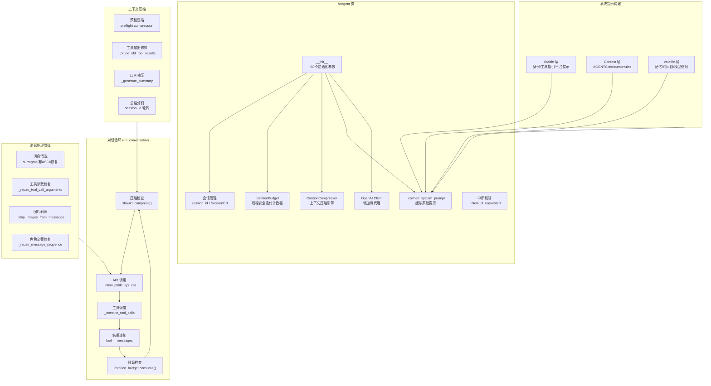
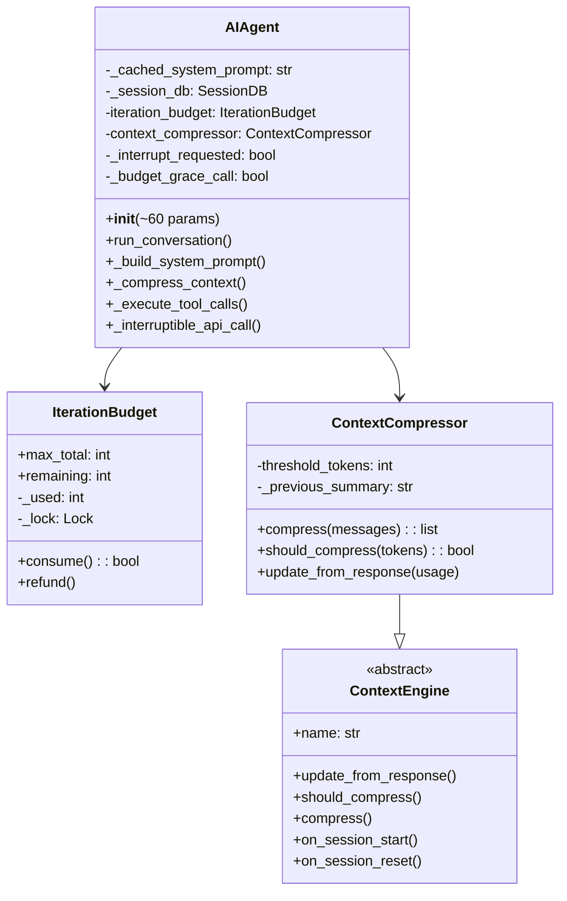
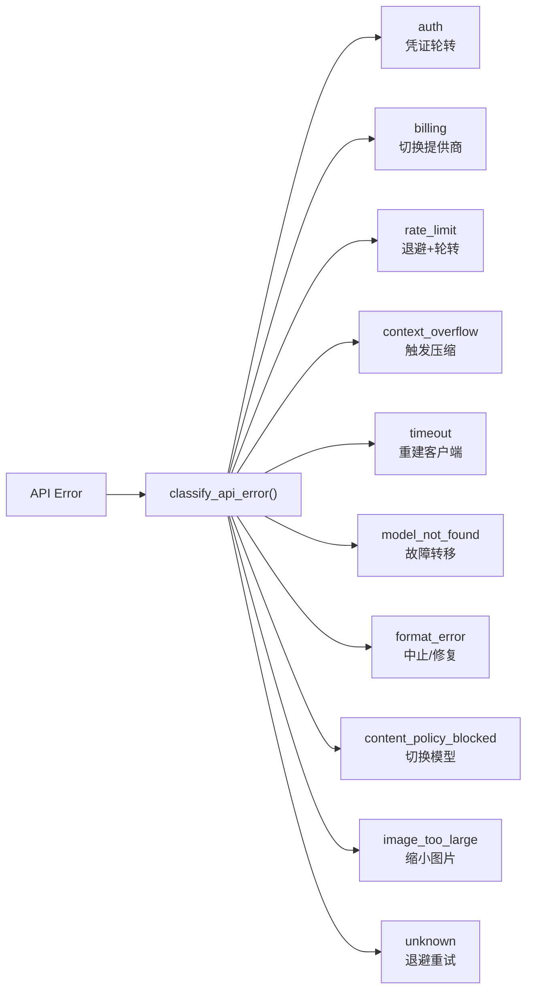
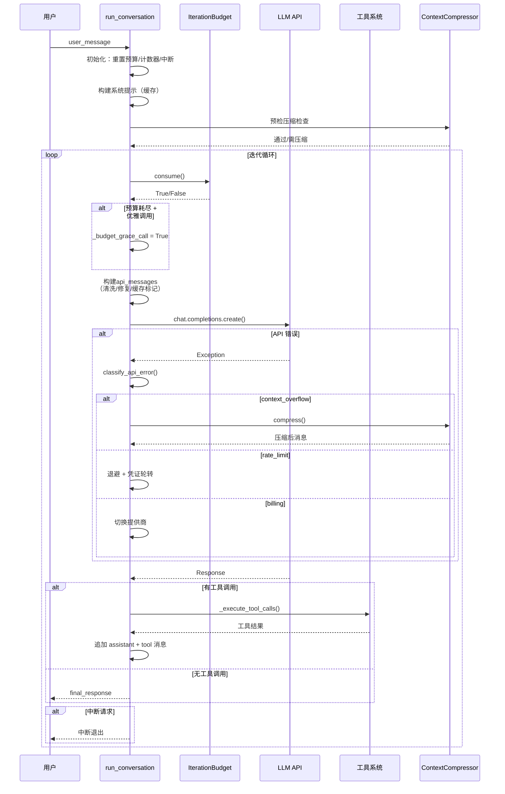
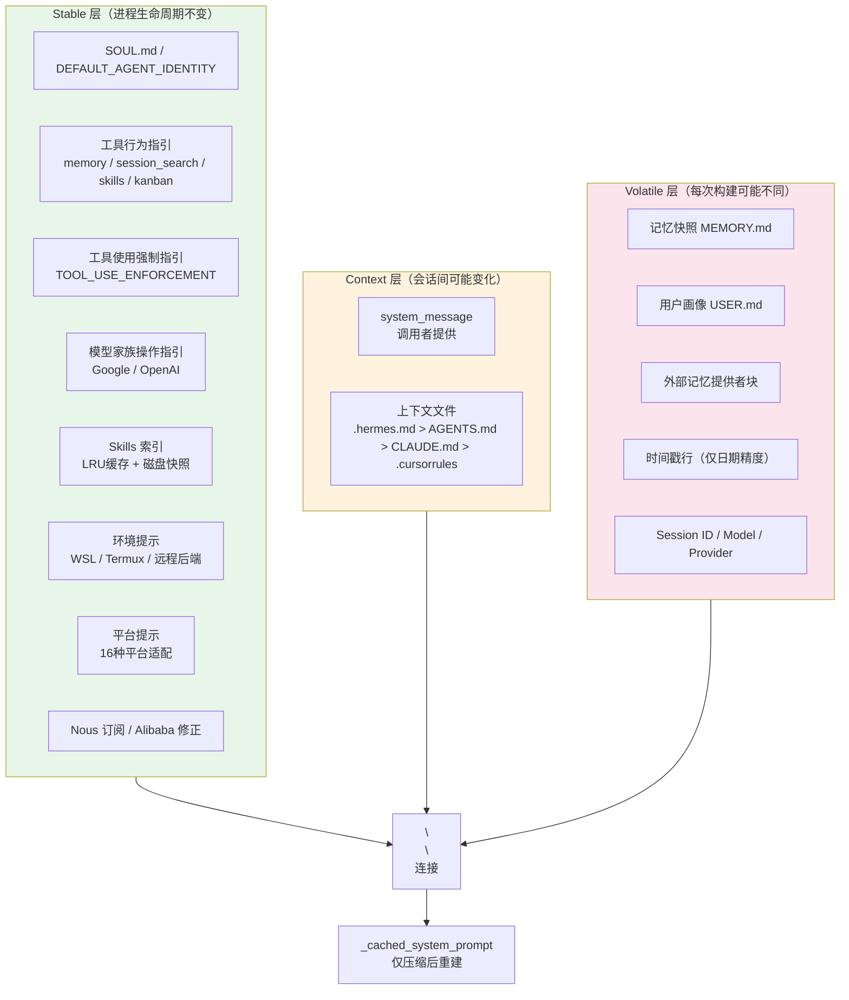
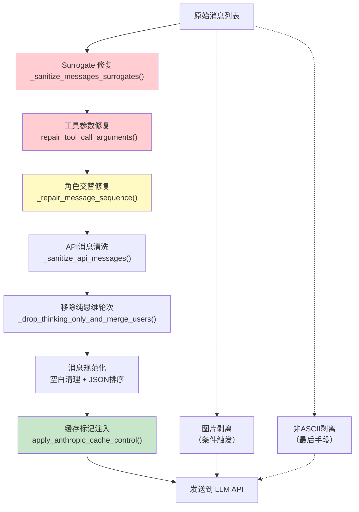
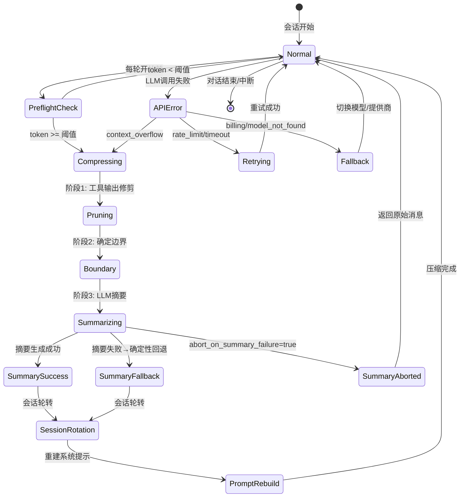
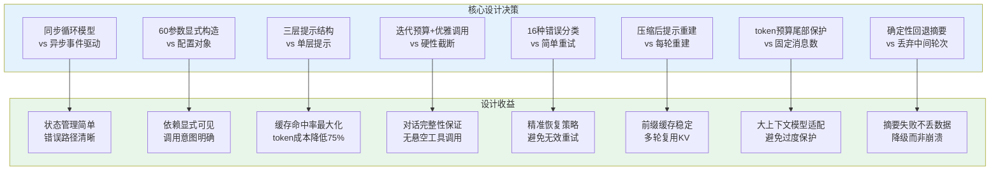

# 核心代理循环：Hermes Agent 的心脏与脉搏

> AIAgent 是 Hermes 的心脏，对话循环是其核心脉搏。每一次用户输入触发一次 `run_conversation` 调用，进入一个精密编排的循环：API 调用 → 工具调度 → 结果追加 → 继续循环，直到任务完成或预算耗尽。这个循环承载了模型交互、错误恢复、上下文压缩、中断处理等全部核心逻辑，是整个系统最复杂也最关键的代码路径。

## 全景架构图



---

## 一、AIAgent 类架构

### 1.1 初始化参数的设计考量

AIAgent 的 `__init__` 接受约 60 个参数，这个看似庞大的参数列表并非设计缺陷，而是 Hermes 多场景适配的必然结果：

| 参数类别 | 典型参数 | 设计意图 |
|---------|---------|---------|
| **模型连接** | `base_url`, `api_key`, `provider`, `api_mode`, `model` | 支持多提供商、多协议（OpenAI/Anthropic/Codex） |
| **工具控制** | `enabled_toolsets`, `disabled_toolsets`, `max_iterations` | 精细控制工具集与迭代预算 |
| **回调体系** | `tool_progress_callback`, `thinking_callback`, `stream_delta_callback` 等 8 个 | 适配 CLI/Gateway/平台等多前端 |
| **会话管理** | `session_id`, `session_db`, `parent_session_id`, `pass_session_id` | 支持会话持久化、子代理继承、压缩后轮转 |
| **平台适配** | `platform`, `user_id`, `chat_id`, `thread_id` | WhatsApp/Telegram/Discord/CLI 等多平台 |
| **记忆系统** | `skip_memory`, `skip_context_files`, `load_soul_identity` | 灵活控制记忆和上下文加载 |
| **安全与降级** | `credential_pool`, `fallback_model`, `checkpoints_enabled` | 凭证轮转、模型故障转移、检查点恢复 |

**为什么用 60 个参数而非配置对象？** 因为 AIAgent 的构造发生在多个入口点（CLI、Gateway、子代理 fork、后台审查），每个入口点需要精确控制不同的参数子集。配置对象会隐藏实际依赖，增加间接层；显式参数让每个调用点的意图一目了然。

实际初始化逻辑被委托给 `agent/agent_init.py` 的 `init_agent()` 函数，`AIAgent.__init__` 只是一个转发器：

```python
# run_agent.py:342-479
class AIAgent:
    def __init__(self, base_url=None, api_key=None, provider=None, ...):
        """Forwarder — see agent.agent_init.init_agent."""
        from agent.agent_init import init_agent
        init_agent(self, base_url=base_url, api_key=api_key, ...)
```

### 1.2 客户端创建与懒加载

OpenAI SDK 的导入耗时约 240ms，Hermes 通过**懒加载代理**避免在模块导入时付出这个代价：

```python
# run_agent.py:49-51
# NOTE: `from openai import OpenAI` is deliberately NOT at module top — the
# SDK pulls ~240 ms of imports. We expose `OpenAI` as a thin proxy object
# that imports the SDK on first call/isinstance check.
```

代理对象在 `agent/process_bootstrap.py` 中实现，首次实际调用时才触发 SDK 导入。这保证了 `import run_agent` 本身是轻量的，而 240ms 的开销只在第一次 API 调用时才付出。

### 1.3 会话管理

AIAgent 的会话管理围绕 `session_id` 和 `SessionDB` 展开：

- **延迟创建**：`_ensure_db_session()` 在首次 `run_conversation` 调用时才创建 SQLite 行，避免空会话浪费
- **压缩后轮转**：上下文压缩触发 `session_id` 轮转（旧会话标记为 `compression` 结束，新会话以旧 ID 为 `parent_session_id`）
- **子代理继承**：后台审查 fork 继承父代理的 `session_id`，通过压缩锁避免并发压缩导致会话分叉

### 1.4 中断机制

中断机制允许用户在工具执行过程中打断代理：

```python
# conversation_loop.py:806-811
if agent._interrupt_requested:
    interrupted = True
    _turn_exit_reason = "interrupted_by_user"
    break
```

中断信号通过 `_set_interrupt()` 绑定到执行线程，确保多代理并发时中断只影响目标代理。

### AIAgent 类结构图



---

## 二、对话循环 run_conversation

### 2.1 核心循环结构

`run_conversation` 是 Hermes 最核心的函数，约 3900 行，承载了完整的对话循环逻辑。其核心结构可概括为：

```python
# conversation_loop.py:801 (简化)
while (api_call_count < max_iterations and iteration_budget.remaining > 0) or _budget_grace_call:
    # 1. 检查中断
    if _interrupt_requested: break
    
    # 2. 消耗迭代预算
    if not iteration_budget.consume(): break
    
    # 3. 构建API消息（系统提示 + 对话历史 + 临时注入）
    api_messages = build_api_messages(messages, system_prompt)
    
    # 4. 调用LLM API（支持流式/非流式）
    response = _interruptible_api_call(api_messages)
    
    # 5. 错误分类与故障转移
    if error: handle_error(classify_api_error(error))
    
    # 6. 工具调度
    if response.has_tool_calls:
        results = _execute_tool_calls(response.tool_calls)
        messages.append(assistant_msg)
        messages.extend(tool_results)
        continue  # 继续循环
    
    # 7. 无工具调用 → 最终响应
    final_response = response.content
    break
```

### 2.2 迭代预算控制 IterationBudget

`IterationBudget` 是线程安全的迭代计数器，防止代理陷入无限工具调用循环：

```python
# agent/iteration_budget.py
class IterationBudget:
    def __init__(self, max_total: int):  # 默认 90
        self.max_total = max_total
        self._used = 0
        self._lock = threading.Lock()
    
    def consume(self) -> bool:
        """尝试消耗一次迭代，返回是否允许"""
        with self._lock:
            if self._used >= self.max_total:
                return False
            self._used += 1
            return True
    
    def refund(self) -> None:
        """退还一次迭代（用于 execute_code 等程序化调用）"""
        with self._lock:
            if self._used > 0:
                self._used -= 1
```

**设计要点**：
- 父代理预算默认 90 次，子代理独立预算默认 50 次
- `execute_code` 的迭代通过 `refund()` 退还，不占用预算
- 每轮 `run_conversation` 重置预算，避免跨轮累积

### 2.3 优雅调用机制 _budget_grace_call

当迭代预算耗尽时，Hermes 并非立即终止，而是给予一次"优雅调用"机会：

```python
# conversation_loop.py:801
while (api_call_count < max_iterations and iteration_budget.remaining > 0) or agent._budget_grace_call:
    if agent._budget_grace_call:
        agent._budget_grace_call = False  # 只给一次机会
    elif not agent.iteration_budget.consume():
        break  # 预算真正耗尽
```

**为什么需要优雅调用？** 当代理在第 N 次迭代执行了工具调用后预算耗尽，如果没有优雅调用，模型将无法看到工具结果并生成最终回复——对话会在一个悬空的工具调用后戛然而止。优雅调用确保模型至少有一次机会基于工具结果生成有意义的回复。

### 2.4 流式响应处理

Hermes 支持流式和非流式两种 API 调用模式：

- **非流式**：标准 `client.chat.completions.create()` 调用
- **流式**：通过 `stream_callback` 逐 delta 回调，用于 TTS 管线提前启动音频生成
- **流式上下文清洗**：`_stream_context_scrubber` 和 `_stream_think_scrubber` 在每轮开始时重置，防止中断的流式响应污染当前输出

### 2.5 错误分类与故障转移

`agent/error_classifier.py` 实现了结构化的错误分类管线，将 API 错误映射到 16 种 `FailoverReason`，每种对应不同的恢复策略：



**分类管线优先级**（从高到低）：
1. 提供商特定模式（Anthropic thinking sig、长上下文层级门控）
2. HTTP 状态码 + 消息感知细化
3. 错误码分类（从响应体提取）
4. 消息模式匹配（billing vs rate_limit vs context）
5. SSL/TLS 瞬态错误 → 作为超时重试
6. 服务器断连 + 大会话 → 上下文溢出
7. 传输错误启发式
8. 兜底：unknown（可重试）

**关键设计决策**：402 状态码需要特别区分——"Usage limit, try again in 5 minutes" 是周期性配额重置（应作为 rate_limit），而非真正的账单耗尽（billing）。这个区分避免了将临时限流误判为永久性账单问题。

### 2.6 上下文压缩触发条件

压缩在两个时机触发：

1. **预检压缩**（Preflight）：在进入主循环前检查，处理用户切换到小上下文模型但会话已很大的场景
2. **循环中压缩**：API 返回上下文溢出错误后触发

预检压缩支持最多 3 轮迭代，每轮压缩后重新估算 token 数，直到低于阈值：

```python
# conversation_loop.py:657-688
for _pass in range(3):
    messages, active_system_prompt = agent._compress_context(...)
    if len(messages) >= _orig_len:
        break  # 无法进一步压缩
    _preflight_tokens = estimate_request_tokens_rough(messages, ...)
    if not _compressor.should_compress(_preflight_tokens):
        break  # 已低于阈值
```

### 对话循环时序图



---

## 三、系统提示构建 agent/system_prompt.py

### 3.1 三层提示结构

Hermes 的系统提示采用三层架构，每层有不同的缓存稳定性：

```python
# agent/system_prompt.py:61-343
def build_system_prompt_parts(agent, system_message=None) -> Dict[str, str]:
    return {
        "stable":   "...",  # 进程生命周期内不变
        "context":  "...",  # 会话间可能变化
        "volatile": "...",  # 每次构建可能不同
    }
```

**Stable 层**（进程生命周期内不变）：
- SOUL.md 个性文件或 DEFAULT_AGENT_IDENTITY
- 工具行为指引（memory/session_search/skills/kanban/computer_use）
- 工具使用强制指引（TOOL_USE_ENFORCEMENT_GUIDANCE）
- 模型家族操作指引（Google/OpenAI 特定指引）
- Skills 索引（两层缓存：进程内 LRU + 磁盘快照）
- 环境提示（WSL/Termux/远程后端探测）
- 平台提示（WhatsApp/Telegram/Discord/CLI 等 16 种平台）

**Context 层**（会话间可能变化）：
- 调用者提供的 `system_message`
- 上下文文件发现（优先级：`.hermes.md` > `AGENTS.md` > `CLAUDE.md` > `.cursorrules`）

**Volatile 层**（每次构建可能不同）：
- 记忆快照（MEMORY.md）
- 用户画像（USER.md）
- 外部记忆提供者块
- 时间戳行（仅日期精度，非分钟精度）

### 3.2 提示缓存优化

系统提示的缓存策略是 Hermes 性能优化的核心：

```python
# agent/system_prompt.py:347-363
def build_system_prompt(agent, system_message=None) -> str:
    """Called once per session (cached on agent._cached_system_prompt) and
    only rebuilt after context compression events."""
    parts = build_system_prompt_parts(agent, system_message=system_message)
    return "\n\n".join(p for p in (parts["stable"], parts["context"], parts["volatile"]) if p)
```

**关键设计决策**：

1. **时间戳仅日期精度**：`"Conversation started: Thursday, June 05, 2026"` 而非分钟精度。分钟精度的时间戳会在每次重建路径（压缩边界、新代理 Gateway 轮转、无存储提示的会话恢复）上使前缀缓存 KV 失效。模型需要精确时间时可通过工具查询。

2. **系统提示仅在压缩后重建**：`invalidate_system_prompt()` 只在上下文压缩事件后调用，确保系统提示在会话的所有轮次中保持稳定，最大化前缀缓存命中。

3. **临时提示不进入系统提示**：`ephemeral_system_prompt` 在 API 调用时注入，不存入 `_cached_system_prompt`，避免破坏缓存前缀。

4. **插件上下文注入用户消息**：`pre_llm_call` 钩子的输出注入到用户消息中，而非系统提示，保护系统提示的缓存稳定性。

### 3.3 SOUL.md 个性文件加载

SOUL.md 是用户自定义的代理身份文件，位于 `~/.hermes/SOUL.md`：

```python
# agent/prompt_builder.py:1369-1394
def load_soul_md() -> Optional[str]:
    soul_path = get_hermes_home() / "SOUL.md"
    if not soul_path.exists():
        return None
    content = soul_path.read_text(encoding="utf-8").strip()
    content = _scan_context_content(content, "SOUL.md")  # 安全扫描
    content = _truncate_content(content, "SOUL.md")       # 截断至 20K 字符
    return content
```

加载流程包含安全扫描（`_scan_for_threats`），检测提示注入/恶意软件模式，匹配到的内容会被替换为 `[BLOCKED: ...]` 占位符。

### 3.4 上下文文件发现

上下文文件按优先级发现，**只加载第一个匹配**：

```python
# agent/prompt_builder.py:1504-1509
project_context = (
    _load_hermes_md(cwd_path)      # .hermes.md / HERMES.md（遍历至 git root）
    or _load_agents_md(cwd_path)   # AGENTS.md（仅 cwd）
    or _load_claude_md(cwd_path)   # CLAUDE.md（仅 cwd）
    or _load_cursorrules(cwd_path) # .cursorrules + .cursor/rules/*.mdc
)
```

每个文件上限 20,000 字符，采用头尾截断策略（70% 头部 + 20% 尾部）。

### 系统提示三层结构图



---

## 四、消息处理管线

### 4.1 消息清洗 message_sanitization.py

消息清洗管线在 API 调用前对消息列表进行多遍修复，确保发送到提供商的内容是合法的：

**Surrogate 字符修复**：
```python
# agent/message_sanitization.py:31-39
def _sanitize_surrogates(text: str) -> str:
    """替换孤立的代理代码点为 U+FFFD"""
    if _SURROGATE_RE.search(text):
        return _SURROGATE_RE.sub('\ufffd', text)
    return text
```

孤立代理字符（U+D800-U+DFFF）在 UTF-8 中非法，会导致 OpenAI SDK 内部的 `json.dumps()` 崩溃。来源包括：从 Google Docs/Word 粘贴的剪贴板内容、Ollama 提供的模型（Kimi K2.5、GLM-5、Qwen）的推理输出。

**非 ASCII 字符剥离**：作为最后手段，在 ASCII-only 系统（LANG=C、Chromebook）上剥离非 ASCII 字符。

### 4.2 工具调用参数修复

模型（特别是 GLM-5.1 via Ollama）可能生成格式错误的工具调用参数 JSON：

```python
# agent/message_sanitization.py:185-279
def _repair_tool_call_arguments(raw_args: str, tool_name: str = "?") -> str:
    """修复格式错误的 tool_call 参数 JSON"""
    # 修复步骤：
    # 0. json.loads(strict=False) — 处理未转义的控制字符
    # 1. 去除尾随逗号
    # 2. 关闭未闭合的结构
    # 3. 移除多余的闭合括号
    # 4. 转义 JSON 字符串中的控制字符
    # 最后手段：返回 "{}" 保证请求不崩溃
```

**关键设计**：修复后的 JSON 必须是合法的，因为下游提供商会严格验证 `function.arguments` 字段，返回 400 错误会导致会话卡在重复发送损坏历史的循环中。

### 4.3 非ASCII字符处理

消息清洗覆盖所有字符串字段，不仅是 `content`：

```python
# agent/message_sanitization.py:75-140
def _sanitize_messages_surrogates(messages: list) -> bool:
    """清洗消息列表中的所有字符串内容"""
    # 覆盖：content, name, tool_calls[].id/name/arguments
    # 以及额外字段：reasoning, reasoning_content, reasoning_details
```

字节级推理模型（xiaomi/mimo, kimi, glm）可能在 `reasoning_content` 字段中输出孤立代理字符，这些字段不在常规的 per-field 检查范围内，需要遍历所有额外字段。

### 4.4 图片剥离策略

图片剥离在三个层级发生：

1. **提供商不支持图片**：`_strip_images_from_messages()` 移除所有 `image_url` 内容部分，tool 角色消息保留占位符以维护 `tool_call_id` 关联
2. **历史图片清理**：`_strip_historical_media()` 在压缩后替换最后一个图片用户消息之前的所有图片部分为文本占位符，避免每轮重新传输多 MB 的 base64 图片
3. **图片过大恢复**：`try_shrink_image_parts_in_messages()` 在 Anthropic 5MB 限制拒绝后，将图片重新编码为更小尺寸

### 消息处理管线流程图



---

## 五、上下文压缩

### 5.1 压缩触发条件

上下文压缩在以下条件满足时触发：

```python
# agent/context_compressor.py:728-748
def should_compress(self, prompt_tokens=None) -> bool:
    tokens = prompt_tokens if prompt_tokens is not None else self.last_prompt_tokens
    if tokens < self.threshold_tokens:  # 默认 50% 上下文长度
        return False
    # 反抖动保护：最近两次压缩各节省 <10% 则跳过
    if self._ineffective_compression_count >= 2:
        return False
    return True
```

**阈值计算**：
- `threshold_tokens = max(context_length × threshold_percent, MINIMUM_CONTEXT_LENGTH)`
- `threshold_percent` 默认 0.50（50%），`MINIMUM_CONTEXT_LENGTH` 为 64K
- 辅助压缩模型的上下文窗口如果小于主模型的阈值，会自动降低阈值

**反抖动保护**：如果连续两次压缩各节省不到 10%，停止压缩，避免无限循环（每次只移除 1-2 条消息）。

### 5.2 对话摘要策略 conversation_compression.py

压缩算法分为四个阶段：

**阶段 1：工具输出修剪**（廉价，无 LLM 调用）
- 替换旧工具结果为信息性一行摘要（如 `[terminal] ran npm test -> exit 0, 47 lines output`）
- 去重相同工具结果（同一文件读取 5 次只保留最新完整副本）
- 截断大型工具调用参数（保持 JSON 有效性）
- 剥离旧 computer_use 截图

**阶段 2：确定边界**
- 保护头部：系统提示 + 前 N 条非系统消息
- 保护尾部：按 token 预算（~20K tokens）而非固定消息数
- 确保最后一条用户消息始终在尾部（防止活动任务丢失）

**阶段 3：LLM 摘要生成**
- 结构化模板：Active Task / Goal / Completed Actions / Blocked / Relevant Files / Remaining Work
- 迭代更新：后续压缩基于前次摘要增量更新，而非从零开始
- 焦点压缩：`/compress <topic>` 支持聚焦主题，60-70% 预算分配给焦点内容
- 故障转移：摘要模型失败时回退到主模型；全部失败时生成确定性回退摘要

**阶段 4：组装压缩后消息**
- 选择摘要角色避免连续相同角色（user/assistant 交替）
- 修复孤立 tool_call/tool_result 对
- 剥离历史图片部分
- 会话 ID 轮转 + SQLite 分割

### 5.3 上下文引擎 context_engine.py

`ContextEngine` 是可插拔的上下文引擎抽象基类：

```python
# agent/context_engine.py:32-99
class ContextEngine(ABC):
    @property
    @abstractmethod
    def name(self) -> str: ...
    
    @abstractmethod
    def update_from_response(self, usage): ...
    
    @abstractmethod
    def should_compress(self, prompt_tokens=None) -> bool: ...
    
    @abstractmethod
    def compress(self, messages, current_tokens=None, focus_topic=None): ...
```

内置的 `ContextCompressor` 是默认实现。第三方引擎（如 LCM）可通过插件系统替换，配置项为 `context.engine`。

### 5.4 压缩对提示缓存的影响

压缩是系统提示缓存的**唯一破坏者**：

```python
# agent/system_prompt.py:366-374
def invalidate_system_prompt(agent) -> None:
    """Invalidate the cached system prompt, forcing a rebuild on the next turn.
    Called after context compression events."""
    agent._cached_system_prompt = None
    if agent._memory_store:
        agent._memory_store.load_from_disk()  # 重新加载记忆
```

压缩后：
1. 系统提示被标记为无效，下一轮重建
2. 记忆从磁盘重新加载（压缩期间可能写入了新记忆）
3. `session_id` 轮转，旧会话标记为 `compression` 结束
4. 文件读取去重缓存被清除（压缩后原始内容已被摘要替代）

**Anthropic 提示缓存策略**（`agent/prompt_caching.py`）：
- `system_and_3` 布局：4 个 `cache_control` 断点（系统提示 + 最后 3 条非系统消息）
- 所有断点使用相同 TTL（5 分钟或 1 小时）
- 多轮对话中输入 token 成本降低约 75%

### 上下文压缩状态转换图



---

## 六、收束总结

### 设计精髓

Hermes 的对话循环体现了三个核心设计哲学：

**1. 同步模型**：整个对话循环是同步的 `while` 循环，而非异步事件驱动。这个选择牺牲了并发性，但换来了：
- 状态管理简单直观（无需 async/await 传染）
- 中断处理可靠（线程级信号而非协程取消）
- 错误恢复路径清晰（同步 try/catch 覆盖全部路径）

**2. 预算控制**：多层预算机制确保代理不会失控：
- `IterationBudget`：硬性迭代上限（90次），线程安全
- `_budget_grace_call`：软性优雅退出，保证对话完整性
- `refund()`：程序化工具调用不消耗预算
- 反抖动保护：连续无效压缩自动停止

**3. 缓存友好**：系统提示的缓存策略贯穿整个设计：
- 三层提示结构按稳定性排序（stable → context → volatile）
- 系统提示仅压缩后重建，其他时候字节级稳定
- 时间戳仅日期精度，避免每分钟缓存失效
- 插件/临时上下文注入用户消息，保护系统提示前缀
- Anthropic `system_and_3` 缓存策略，75% 输入 token 节省

### 设计决策总结图



---

> **关键文件索引**：
> - `run_agent.py` — AIAgent 类定义与入口
> - `agent/conversation_loop.py` — 对话循环核心逻辑（~3900行）
> - `agent/system_prompt.py` — 系统提示三层构建
> - `agent/prompt_builder.py` — 提示常量、上下文文件发现、Skills 索引
> - `agent/context_compressor.py` — 上下文压缩引擎（ContextCompressor）
> - `agent/conversation_compression.py` — 压缩入口、会话分割、图片缩小
> - `agent/context_engine.py` — 上下文引擎抽象基类
> - `agent/message_sanitization.py` — 消息清洗与工具参数修复
> - `agent/error_classifier.py` — API 错误分类管线
> - `agent/iteration_budget.py` — 线程安全迭代预算
> - `agent/prompt_caching.py` — Anthropic 提示缓存策略
> - `agent/display.py` — CLI 展示（Spinner/工具预览/Diff）
