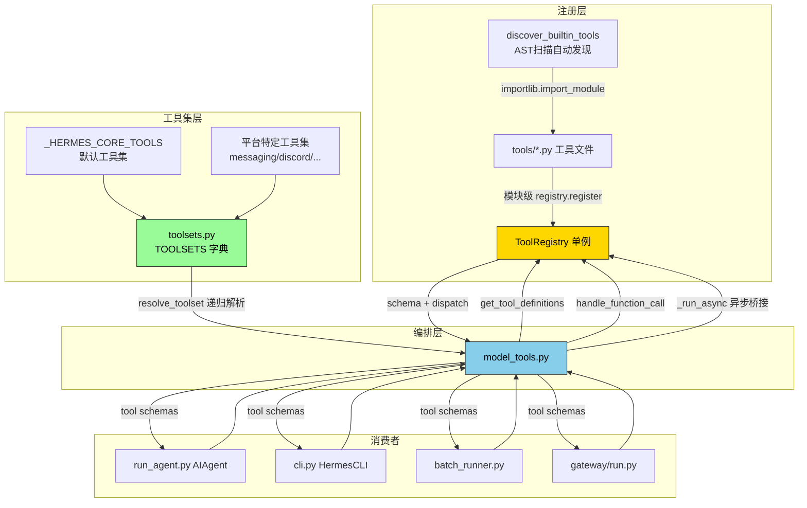
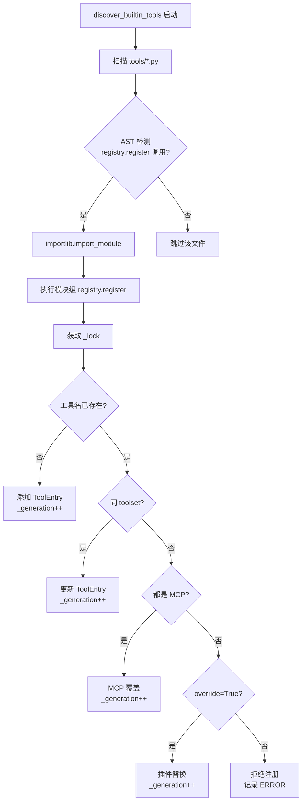
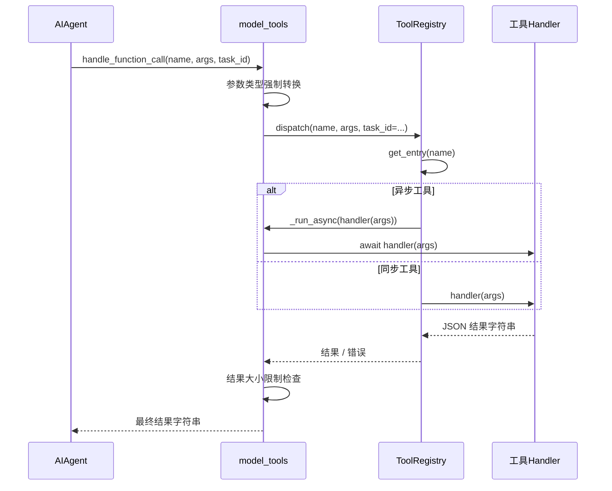
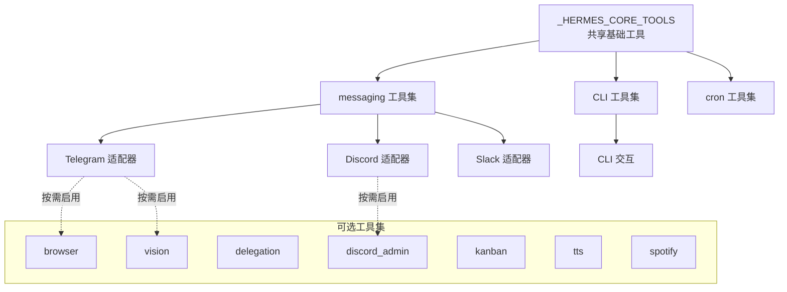
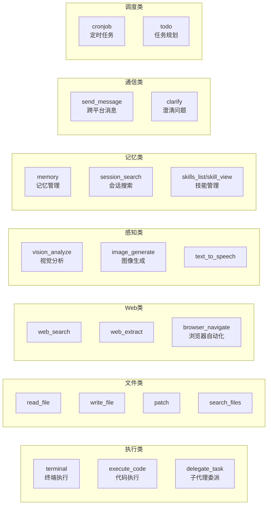
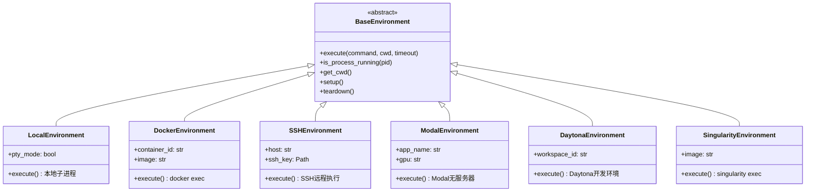
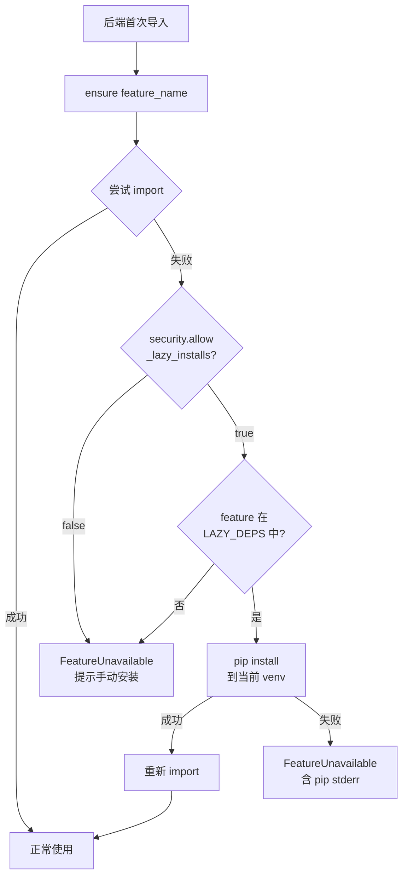
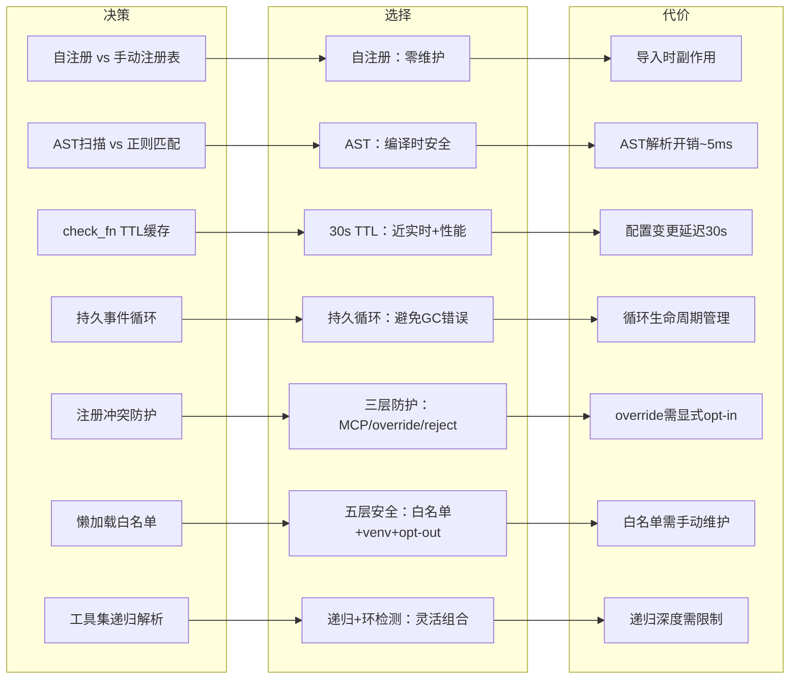

# 03 - 工具系统

## 一、开篇概览

工具系统是 Hermes Agent 的"双手"——它让代理能够与外部世界交互：执行终端命令、搜索网页、读写文件、委派子任务、管理记忆等。Hermes 工具系统的核心创新在于**自注册 + AST 自动发现**模式：每个工具文件在导入时自动调用 `registry.register()` 声明自己的 schema、handler 和可用性检查，而 `discover_builtin_tools()` 通过 AST 扫描识别哪些文件包含注册调用，无需维护任何手动注册表。这种设计让添加新工具只需创建一个文件，零配置即可被系统发现。



---

## 二、工具注册中心（`tools/registry.py`）

### 2.1 核心设计

注册中心是工具系统的基石，采用**单例模式**（`registry = ToolRegistry()`），所有工具文件在模块导入时调用 `registry.register()` 完成自注册。

```python
# tools/registry.py — ToolEntry 数据结构
class ToolEntry:
    __slots__ = (
        "name", "toolset", "schema", "handler", "check_fn",
        "requires_env", "is_async", "description", "emoji",
        "max_result_size_chars", "dynamic_schema_overrides",
    )
```

**为什么用 `__slots__`？** 工具条目是高频创建的对象（40+ 个内置工具 + 动态 MCP 工具），`__slots__` 消除了 `__dict__` 开销，减少内存占用约 40%，并防止意外属性赋值。

### 2.2 AST 扫描自动发现

```python
# tools/registry.py — AST 扫描识别注册调用
def _is_registry_register_call(node: ast.AST) -> bool:
    if not isinstance(node, ast.Expr) or not isinstance(node.value, ast.Call):
        return False
    func = node.value.func
    return (
        isinstance(func, ast.Attribute)
        and func.attr == "register"
        and isinstance(func.value, ast.Name)
        and func.value.id == "registry"
    )

def discover_builtin_tools(tools_dir=None) -> List[str]:
    tools_path = Path(tools_dir) if tools_dir else Path(__file__).resolve().parent
    module_names = [
        f"tools.{path.stem}"
        for path in sorted(tools_path.glob("*.py"))
        if path.name not in {"__init__.py", "registry.py", "mcp_tool.py"}
        and _module_registers_tools(path)  # AST 扫描过滤
    ]
    for mod_name in module_names:
        importlib.import_module(mod_name)  # 触发模块级 register()
```

**为什么用 AST 扫描而非手动注册表？**

1. **零维护成本**：添加新工具只需创建文件并调用 `registry.register()`，无需修改任何发现逻辑
2. **编译时安全**：AST 解析比正则匹配更可靠，不会误判注释或字符串中的 `registry.register`
3. **仅扫描顶层**：`_module_registers_tools` 只检查 `tree.body`（模块顶层语句），避免误导入辅助模块

### 2.3 check_fn TTL 缓存

```python
_CHECK_FN_TTL_SECONDS = 30.0
_check_fn_cache: Dict[Callable, tuple[float, bool]] = {}

def _check_fn_cached(fn: Callable) -> bool:
    now = time.monotonic()
    with _check_fn_cache_lock:
        cached = _check_fn_cache.get(fn)
        if cached and now - cached[0] < _CHECK_FN_TTL_SECONDS:
            return cached[1]
    try:
        value = bool(fn())
    except Exception:
        value = False
    with _check_fn_cache_lock:
        _check_fn_cache[fn] = (now, value)
    return value
```

**为什么需要 TTL 缓存？** `check_fn` 探测外部状态（Docker 守护进程、Modal SDK、playwright 二进制等），在长生命周期进程（CLI/Gateway）中每次调用 `get_tool_definitions()` 都重新探测是纯浪费。30 秒 TTL 让 `hermes tools enable` 等配置变更在 1-2 轮对话内生效，无需显式缓存刷新。

### 2.4 注册冲突防护

```python
def register(self, name, toolset, schema, handler, ..., override=False):
    with self._lock:
        existing = self._tools.get(name)
        if existing and existing.toolset != toolset:
            both_mcp = existing.toolset.startswith("mcp-") and toolset.startswith("mcp-")
            if both_mcp:
                pass  # MCP 工具允许覆盖
            elif override:
                pass  # 插件显式 opt-in 覆盖
            else:
                logger.error("Tool registration REJECTED: '%s' ...", name)
                return  # 拒绝意外覆盖
```

**三层防护**：MCP 内部允许覆盖（服务器刷新场景）、`override=True` 显式 opt-in（插件替换内置工具）、其他一律拒绝（防止意外覆盖）。



---

## 三、工具编排层（`model_tools.py`）

### 3.1 核心职责

`model_tools.py` 是工具系统的"编排者"——它连接注册中心与消费者（AIAgent、CLI、Gateway），提供两个核心 API：

- `get_tool_definitions()` — 根据启用的工具集生成 OpenAI 格式的 tool schema
- `handle_function_call()` — 工具调用分发与执行

### 3.2 异步桥接

```python
_tool_loop = None          # 主线程持久事件循环
_tool_loop_lock = threading.Lock()
_worker_thread_local = threading.local()  # 工作线程本地持久循环

def _run_async(coro):
    """从同步上下文运行异步协程。
    - CLI 路径：使用主线程持久循环（避免 asyncio.run 的 create-and-destroy）
    - Gateway 路径：已有运行循环，启动一次性线程
    - 工作线程路径：使用线程本地持久循环
    """
```

**为什么需要持久事件循环？** `asyncio.run()` 创建循环、运行协程、然后**关闭循环**。但缓存的 httpx/AsyncOpenAI 客户端绑定在循环上，循环关闭后 GC 时触发 "Event loop is closed" 错误。持久循环让缓存客户端始终有效。

### 3.3 工具调用时序



### 3.4 动态 Schema 覆盖

某些工具的 schema 需要反映运行时配置。例如 `delegate_task` 的 description 必须包含当前的 `delegation.max_concurrent_children` 和 `max_spawn_depth`，否则模型会被告知错误的限制。

```python
# ToolEntry.dynamic_schema_overrides — 零参数可调用对象
# 在每次 get_definitions() 调用时执行，结果浅合并到基础 schema 上
if entry.dynamic_schema_overrides is not None:
    overrides = entry.dynamic_schema_overrides()
    schema_with_name.update(overrides)
```

---

## 四、工具集系统（`toolsets.py`）

### 4.1 核心工具集

`_HERMES_CORE_TOOLS` 是所有平台共享的基础工具列表，涵盖 Web 搜索、终端执行、文件操作、视觉分析、浏览器自动化、TTS、记忆管理等核心能力。

```python
_HERMES_CORE_TOOLS = [
    "web_search", "web_extract",           # Web
    "terminal", "process",                  # 终端
    "read_file", "write_file", "patch", "search_files",  # 文件
    "vision_analyze", "image_generate",     # 视觉+图像
    "browser_navigate", "browser_snapshot", # 浏览器
    "todo", "memory",                       # 规划+记忆
    "execute_code", "delegate_task",        # 代码+委派
    "cronjob", "send_message",             # 定时+消息
    ...
]
```

### 4.2 工具集定义与组合

```python
TOOLSETS = {
    "web": {
        "description": "Web research and content extraction tools",
        "tools": ["web_search", "web_extract"],
        "includes": []  # 不包含其他工具集
    },
    "messaging": {
        "description": "Full messaging platform toolset",
        "tools": [...],
        "includes": ["web", "terminal", ...]  # 组合其他工具集
    },
    ...
}
```

`resolve_toolset()` 递归解析 `includes`，将工具集展开为工具名列表，并检测循环引用。

### 4.3 平台特定工具集选择

每个平台适配器选择一个基础工具集（如 Telegram 使用 `"messaging"`），再根据用户配置启用/禁用特定工具集。



---

## 五、核心工具实现分析

### 5.1 终端执行工具（`terminal_tool.py`）

终端工具是 Hermes 最核心的工具之一，支持 6 种后端：

| 后端 | 场景 | 隔离级别 |
|------|------|---------|
| local | 本地开发 | 无隔离 |
| docker | 容器化执行 | 进程+文件系统隔离 |
| ssh | 远程服务器 | 网络隔离 |
| modal | 无服务器GPU | 完全隔离 |
| daytona | 开发环境 | 沙箱隔离 |
| singularity | HPC集群 | 文件系统隔离 |

支持后台执行（`background=True`）、超时控制、审批机制。

### 5.2 子代理委派工具（`delegate_tool.py`）

```python
# 子代理永远不能访问的工具
DELEGATE_BLOCKED_TOOLS = frozenset([
    "delegate_task",   # 禁止递归委派
    "clarify",         # 禁止用户交互
    "memory",          # 禁止写入共享记忆
    "send_message",    # 禁止跨平台副作用
    "execute_code",    # 子代理应逐步推理
])
```

**两种形态**：
- **单任务**：`goal` + 可选 `context`/`toolsets`
- **批量并行**：`tasks: [...]`，每个任务独立子代理，并发上限由 `delegation.max_concurrent_children` 控制

**两种角色**：
- `leaf`（默认）：专注工作者，不能委派/澄清/记忆
- `orchestrator`：保留 `delegate_task`，可再派生工人，受 `delegation.max_spawn_depth` 限制

### 5.3 核心工具分类



---

## 六、终端后端系统（`tools/environments/`）

### 6.1 架构设计

所有终端后端继承自 `BaseEnvironment` ABC，统一接口包括 `execute()`、`is_process_running()`、`get_cwd()` 等。



### 6.2 后端选择逻辑

后端由 `terminal.env` 配置决定，默认为 `local`。Gateway 场景通常使用 Docker 或 SSH，确保代理操作在隔离环境中执行。

---

## 七、懒加载依赖（`tools/lazy_deps.py`）

### 7.1 设计动机

历史做法是将所有可选依赖放在 `pyproject.toml` 的 `[all]` extra 中，但存在两个问题：

1. **脆弱性**：一个 extra 的传递依赖在 PyPI 不可用时，整个 `[all]` 解析失败
2. **膨胀**：只用一个 provider 的用户拉取数百个永远不用的包

### 7.2 安全模型

```python
LAZY_DEPS: dict[str, tuple[str, ...]] = {
    "stt.mistral": ("mistralai==2.4.8",),
    "tts.elevenlabs": ("elevenlabs==1.59.0",),
    "provider.anthropic": ("anthropic==0.86.0",),
    "search.exa": ("exa-py==2.10.2",),
    ...
}
```

**五层安全防护**：

| 层 | 机制 | 目的 |
|----|------|------|
| 1 | Venv 限定 | 仅安装到当前 venv，不碰系统 Python |
| 2 | PyPI 包名限定 | 不支持 `git+https://`、`--index-url`、文件路径 |
| 3 | 白名单 | 只有 `LAZY_DEPS` 中的规格可安装 |
| 4 | 配置 opt-out | `security.allow_lazy_installs: false` 禁用 |
| 5 | 离线检测 | 安装失败时抛出 `FeatureUnavailable`，不静默重试 |

### 7.3 懒加载决策流程



---

## 八、收束总结

### 设计精髓

Hermes 工具系统的三大设计精髓：

1. **自注册模式**：工具文件通过模块级 `registry.register()` 自注册，AST 扫描自动发现，零配置添加新工具
2. **AST 发现**：编译时安全的自动发现机制，比正则匹配更可靠，比手动注册表更省维护
3. **懒加载安全**：白名单 + venv 限定 + 配置 opt-out 的多层防护，让可选依赖按需安装而不牺牲安全性

### 设计决策总结


