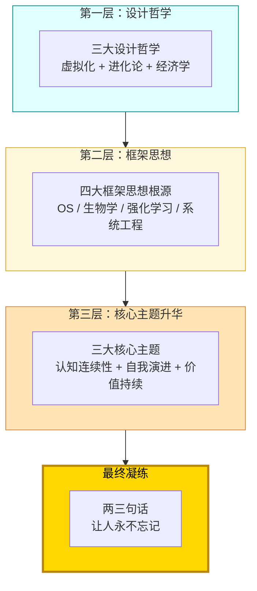
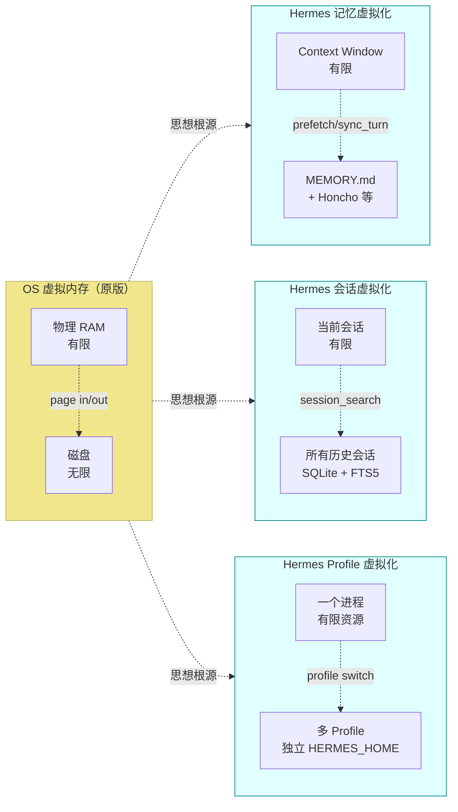
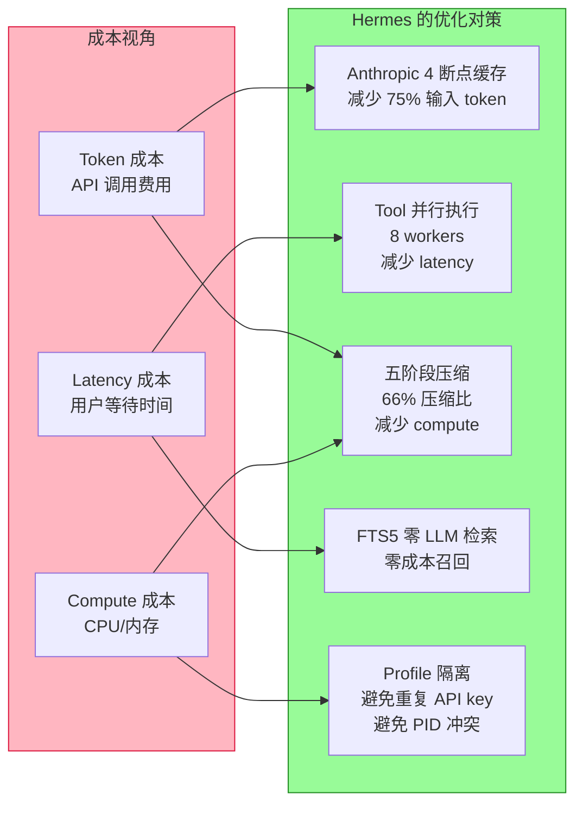
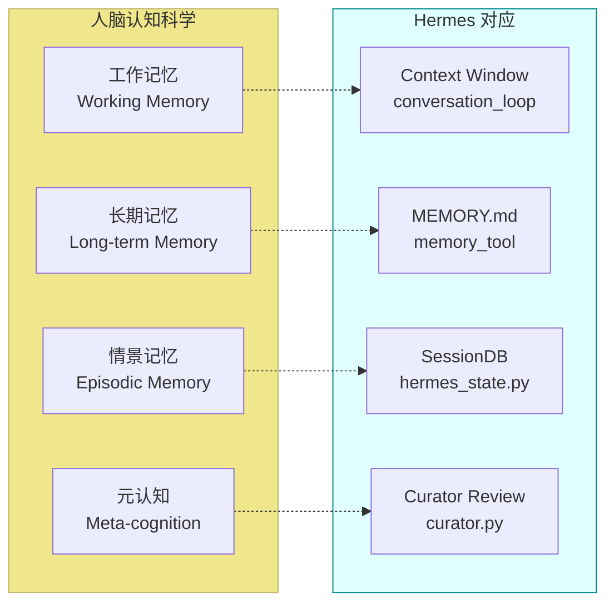
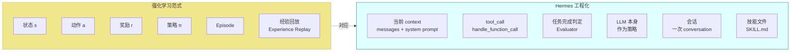
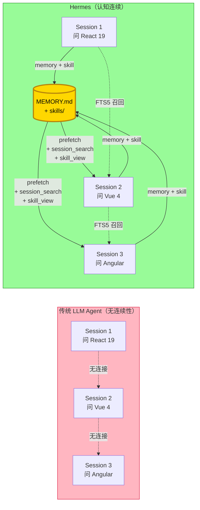
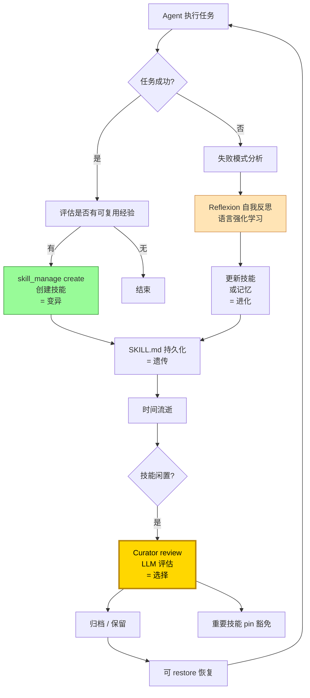
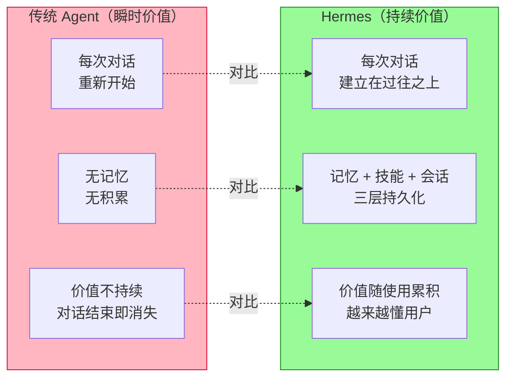
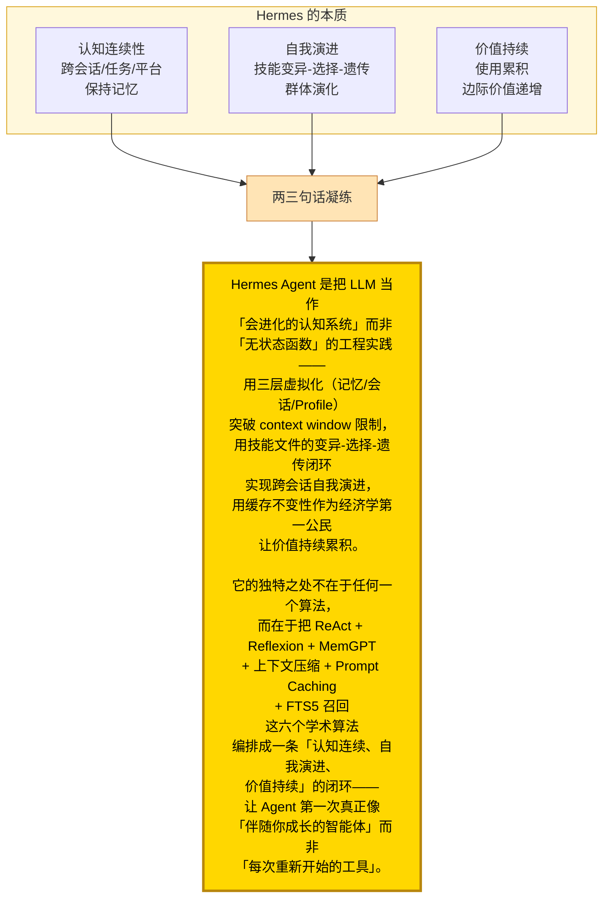

# 深刻不忘观：Hermes Agent 的哲学与升华

> 三观递进法 · 第三观 · 看透
> 本文是 Hermes Agent 代码库深度阅读 trilogy 的终章。第一篇建立整体认知地图，第二篇深入算法细节，本文跃出水面反思本质——更深层的框架设计哲学是什么、算法框架背后有怎样的思想根源、核心主题如何升华。最终凝练为**两三句话**，让人永不忘记。

---

## 总：回望前两观的发现

让我们先回望前两观所揭示的 Hermes：

**整体观（看见）**：Hermes 是一个"自进化 Agent 操作系统"——四大注册表（Tool/Command/Plugin/Provider）驱动可扩展性、三层 tier Prompt 保护缓存不变性、五阶段压缩应对长上下文、FTS5 跨会话召回、Profile 隔离支撑多实例。它既不是库（如 LangChain），也不是单一 IDE 工具（如 Claude Code），而是介于两者之间的"Agent 操作系统"。

**具体观（看懂）**：六大算法共同支撑 Hermes——ReAct 主循环让 agent 能 act+reason；Reflexion 让 agent 从失败中学习进化技能；MemGPT 让 agent 跨会话记忆；五阶段压缩应对 Lost in the Middle；MoA 让 agent 多视角决策；Anthropic 缓存 + FTS5 让 agent 经济地长期运行 + 跨会话召回。

但这两观都停留在"看见"和"看懂"的层面，没有回答更深的问题：

- 为什么 Hermes **同时**选择这六个算法？它们在哲学层面有什么共通的思想根源？
- "自进化闭环"本质是什么？它对应什么更深的认知科学原理？
- 如果把 Hermes 的所有设计选择抽象到最高层，**一句话**能不能概括它的设计哲学？
- 这个项目对"AI Agent 应该是什么"这一根本问题给出了什么回答？

本文将从「**设计哲学 → 框架思想 → 核心主题**」三个层次递进展开，最终凝练为**两三句话**作为整个 trilogy 的认知结晶。



> **图 0｜第三观的三层递进结构**：从设计哲学（最具体可见的工程原则）→ 框架思想（抽象到思想根源）→ 核心主题（升华到本质）→ 最终凝练为两三句话。每一层都是上一层的"为什么"，最终回答"Hermes 究竟是什么"。

---

## 分之一：三大设计哲学

### 1.1 设计哲学一：虚拟化（Virtualization）

打开 Hermes 代码，"虚拟化"思想无处不在。它把"虚拟内存 paging"作为隐喻贯穿三个子系统：



> **图 1.1｜虚拟化思想的三处落地**：Hermes 把 OS 虚拟内存 paging 思想应用到三个子系统——记忆（context window ↔ MEMORY.md）、会话（当前会话 ↔ 所有历史会话）、Profile（一个进程 ↔ 多个隔离实例）。**核心抽象**：把"有限资源"通过"分页 + 索引"虚拟成"无限资源"。

#### 记忆虚拟化

`/workspace/agent/memory_manager.py` 的 MemoryManager 把 context window（有限）和外部 provider（无限）编排起来——这正是 [MemGPT 论文](https://arxiv.org/abs/2310.08560) 的工程化。LLM 通过 `prefetch(query)` 把相关上下文"page in"到 context window，用完后通过 `sync_turn` "page out" 到外部存储。

#### 会话虚拟化

`/workspace/hermes_state.py` 的 SessionDB + FTS5 + Trigram 三索引把"当前会话"（context window 内）和"所有历史会话"（SQLite）虚拟化连接。`session_search` 工具就是"page fault" handler——当 agent 需要过往信息时，通过 FTS5 召回，**零 LLM 调用**。

#### Profile 虚拟化

`/workspace/hermes_cli/main.py:310` `_apply_profile_override()` 让一个 Python 进程通过切换 `HERMES_HOME` 环境变量"虚拟"出多个隔离实例。每个 profile 有独立的 config、memory、sessions、skills、gateway PID——**逻辑上的多实例，物理上的单进程**。

### 1.2 设计哲学二：进化论（Evolutionism）

```mermaid
flowchart TB
    subgraph Bio["生物进化论（原版）"]
        B1[变异<br/>Mutation]
        B2[选择<br/>Selection]
        B3[遗传<br/>Heredity]
        B4[隔离<br/>Isolation]
    end
    subgraph Hermes["Hermes 自我进化（对应）"]
        H1[skill_manage(create)<br/>Agent 创建新技能<br/>= 变异]
        H2[curator review<br/>LLM 判断 stale/archived<br/>= 选择]
        H3[SKILL.md 文件<br/>技能持久化<br/>= 遗传]
        H4[created_by: agent<br/>provenance 隔离<br/>= 隔离]
    end
    B1 -.->|思想对应| H1
    B2 -.->|思想对应| H2
    B3 -.->|思想对应| H3
    B4 -.->|思想对应| H4
    style Bio fill:#F0E68C,stroke:#BDB76B
    style Hermes fill:#E0FFFF,stroke:#008B8B
```

> **图 1.2｜进化论与 Hermes 自我进化的对应**：生物进化论的四大要素——变异、选择、遗传、隔离——在 Hermes 中都有对应实现。skill_manage 让 agent"变异"出新技能；curator LLM review 是"选择"压力；SKILL.md 文件实现"遗传"；`created_by: agent` provenance 是"隔离"边界。这是 Hermes 把 Reflexion 论文的"语言强化学习"扩展到"群体演化"层面。

#### 变异：Agent 创建技能

`/workspace/tools/skill_manager_tool.py:13-21` 的 `skill_manage(action="create")` 让 agent 自主创建技能文件。这是"变异"——agent 把任务中的成功经验抽象成可复用的技能 SKILL.md。

#### 选择：Curator Review

`/workspace/agent/curator.py` 的 curator 后台 review loop 用 LLM 评估 stale 技能——是否值得保留、是否需要归档。这是"选择"—— unfit 技能被归档，fit 技能保留。

#### 遗传：SKILL.md 文件

技能以 `~/.hermes/skills/<name>/SKILL.md` 文件形式持久化——下次 agent 调用 `/name` 时复用。这是"遗传"——技能体通过文件传递，不依赖内存。

#### 隔离：Provenance 分类

`/workspace/tools/skill_usage.py:801-811` 的 `provenance()` 把技能分为 'hub'、'bundled'、'agent' 三类。只有 `created_by: agent` 的技能才进入 curator 治理范围——这是"物种隔离"，避免 agent 误改用户/bundled 技能。

### 1.3 设计哲学三：经济学（Economics）



> **图 1.3｜经济学视角下的成本与优化**：Hermes 把"长期运行经济性"作为第一公民——每个设计都对应一个成本优化。Anthropic 缓存减少 token 成本、Tool 并行减少 latency、五阶段压缩减少 compute、FTS5 零 LLM 检索、Profile 隔离避免冲突。这是 Hermes 能在 $5 VPS 上 7×24 运行的经济学基础。

#### 缓存不变性是第一公民

`/workspace/AGENTS.md` 明确"Cache-breaking forces dramatically higher costs"——这是 Hermes 最强烈的工程约束。它不是"建议"，是"硬约束"。所有可能破坏缓存的代码路径都被严格审视：

- slash 命令默认延迟失效（`--now` 显式 opt-in）
- toolset 不在会话中变更
- system prompt 不在会话中重建（唯一例外是上下文压缩）
- memory 不在会话中重载

#### 选择 SQLite 而非 PostgreSQL

Hermes 用 SQLite（`/workspace/hermes_state.py`）作为会话存储——这是经济学选择。SQLite 单文件、零运维、嵌入式、profile 友好。配合 WAL 模式 + 应用层 jitter 重试（`_WRITE_MAX_RETRIES=15`），在多进程并发下也能稳定工作——避免引入 PostgreSQL 的运维成本。

#### Serverless 终端后端

`/workspace/tools/environments/` 提供 6 种终端后端，其中 **Modal 和 Daytona 支持 serverless persistence**——环境空闲时休眠、唤醒时按需付费。这让"agent 长期运行"在经济上可行。

---

## 分之二：四大框架思想根源

### 2.1 框架思想一：操作系统（Operating System）

Hermes 的很多设计直接借用 OS 概念：

| OS 概念 | Hermes 对应 | 文件 |
|---|---|---|
| 进程隔离 | Profile 隔离（独立 HERMES_HOME）| `/workspace/hermes_cli/main.py:310` |
| 虚拟内存 paging | Memory 分层（context window ↔ archival）| `/workspace/agent/memory_manager.py` |
| 文件系统 | `~/.hermes/` 目录树（config/skills/sessions/plugins/...）| `get_hermes_home()` |
| 进程间通信 | JSON-RPC over stdio（TUI ↔ tui_gateway）| `/workspace/tui_gateway/transport.py` |
| 守护进程 | Gateway 进程长运行（PID 文件锁防重复）| `/workspace/gateway/run.py:19399` |
| 系统调用 | Tool dispatch（agent → registry → handler）| `/workspace/tools/registry.py:390` |
| 设备驱动 | Provider/Transport 适配层 | `/workspace/agent/transports/` |
| 信号处理 | Interrupt 机制（用户中断 / 信号）| `/workspace/agent/conversation_loop.py:806` |

#### AGENTS.md 明确把 "OS" 作为隐喻

`/workspace/AGENTS.md` 在多个地方使用 OS 术语：

- "Module-level constants are fine — they cache `get_hermes_home()` at import time, which is AFTER `_apply_profile_override()` sets the env var"
- "page fault"（MemGPT 借喻）
- "Background Process Notifications (Gateway)"——背景进程通知

#### Hermes 作为"Agent OS"

这个隐喻不是偶然——Hermes 实际定位就是"Agent Operating System"。它提供：

- **运行时**：AIAgent 主循环（类比内核）
- **持久化**：SessionDB + skills（类比文件系统）
- **调度**：cron + gateway（类比 initd + 网络 daemon）
- **进程间通信**：JSON-RPC（类比 pipe/socket）
- **驱动模型**：Provider/Transport 适配（类比设备驱动）
- **用户态**：CLI/TUI/Gateway/ACP（类比 shell）

### 2.2 框架思想二：生物学（Biology）

如前文 1.2 节所示，Hermes 把生物进化论作为自我进化系统的思想根源。但生物学隐喻不止于此：



> **图 2.1｜认知科学与 Hermes 记忆系统的对应**：Hermes 的记忆系统对应人脑的多层记忆——工作记忆（context window）、长期记忆（MEMORY.md）、情景记忆（SessionDB）、元认知（Curator 自我评估）。这不是巧合，而是 MemGPT 论文明确借喻 OS 虚拟内存、Reflexion 论文明确借喻人类"语言反思学习"的延续。

#### 元认知的工程化

`/workspace/agent/curator.py` 的 curator 是"元认知"——它不直接行动，而是评估 agent 创建的技能是否值得保留。这种"评估者"角色对应人脑的前额叶皮层——做决策的同时反思决策本身。

### 2.3 框架思想三：强化学习（Reinforcement Learning）



> **图 2.2｜强化学习范式与 Hermes 的对应**：Hermes 把强化学习范式"语言化"——状态、动作、奖励、策略、episode、记忆全部用自然语言表达。这是 Reflexion 论文"Verbal Reinforcement Learning"的延续：用语言替代数值奖励，用文件替代经验回放 buffer。

#### Hermes 不做梯度更新

`AGENTS.md` 明确——Hermes 不微调模型权重，所有"学习"都通过 prompt + 文件持久化实现。这让 Hermes 能用任何 API LLM（不要求开源或可微调）实现"自我进化"。

#### IterationBudget 作为"episode 长度"

`/workspace/agent/iteration_budget.py` 的 IterationBudget 限制单次会话的最大轮次——这是"episode 长度"的工程化。子 agent 调用 `delegate_task` 时消耗自己的预算，不影响父 agent——这是 RL 中的"层次化策略"。

### 2.4 框架思想四：系统工程（Systems Engineering）

```mermaid
flowchart TB
    subgraph SysEng["系统工程原则"]
        S1[单一真理源<br/>Single Source of Truth]
        S2[关注点分离<br/>Separation of Concerns]
        S3[失败隔离<br/>Failure Isolation]
        S4[缓存不变性<br/>Cache Invariance]
        S5[可观察性<br/>Observability]
    end
    subgraph Hermes["Hermes 实现"]
        H1[4 个中央注册表<br/>+ get_hermes_home()<br/>+ DEFAULT_CONFIG]
        H2[AIAgent 瘦身<br/>__init__ 抽到 agent_init.py<br/>run_conversation 抽到 conversation_loop.py]
        H3[prefetch_all 容错<br/>单 provider 失败不阻塞]
        H4[三层 tier + cache_control<br/>slash 命令延迟失效]
        H5[8 个 callback<br/>+ 日志 + trajectory 持久化]
    end
    S1 -.-> H1
    S2 -.-> H2
    S3 -.-> H3
    S4 -.-> H4
    S5 -.-> H5
    style SysEng fill:#F0E68C,stroke:#BDB76B
    style Hermes fill:#E0FFFF,stroke:#008B8B
```

> **图 2.3｜系统工程原则在 Hermes 中的体现**：Hermes 把经典系统工程原则贯穿整个代码库——单一真理源（4 个注册表 + get_hermes_home + DEFAULT_CONFIG）、关注点分离（AIAgent 瘦身）、失败隔离（prefetch_all 容错）、缓存不变性（三层 tier）、可观察性（8 callback + 日志）。这不是巧合，而是经过 ~25,000 个测试反复打磨的工程美学。

#### 单一真理源（SSOT）

`AGENTS.md` 列出 Hermes 的 6 个 SSOT：

1. 工具：`tools/registry.py`
2. 工具集：`toolsets.py` 的 `TOOLSETS` 字典
3. 命令：`hermes_cli/commands.py` 的 `COMMAND_REGISTRY`
4. 配置默认：`hermes_cli/config.py` 的 `DEFAULT_CONFIG`
5. HERMES_HOME：`hermes_constants.py` 的 `get_hermes_home()`
6. async→sync 桥接：`model_tools.py:84` `_run_async()`

任何"事实"只有一个地方定义，其他地方都派生——避免"多源真相"导致的不一致。

#### 可观察性优先

`/workspace/run_agent.py:371-381` 的 AIAgent 有 8 个 callback 参数：tool_progress、thinking、reasoning、clarify、step、stream_delta、tool_gen、status。每次工具调用、每次 API 响应都通过 callback 可见——这是"可观察执行"原则。配合 `hermes_logging.py` 的 INFO/WARNING/ERROR 三级日志，agent 行为完全可追溯。

---

## 分之三：三大核心主题升华

### 3.1 主题一：认知连续性（Cognitive Continuity）



> **图 3.1｜认知连续性：Hermes 与传统 Agent 的对比**：传统 LLM Agent 每个会话都是孤岛——上次问的 React 19 知识不会带到 Vue 4 会话。Hermes 通过 memory（跨会话用户画像）、skill（任务经验抽象）、session_search（过往对话 FTS5 召回）三层机制建立认知连续性——agent "记得"用户、"记得"过去做过什么、"记得"自己学到的技能。

#### 三层认知连续性机制

| 层 | 机制 | 持久化 | 召回方式 |
|---|---|---|---|
| **用户画像** | builtin memory（USER.md） | 文件 | prefetch 注入 system prompt |
| **任务经验** | skills/（SKILL.md）| 文件 | slash 命令 `/skill-name` 调用 |
| **过往对话** | SessionDB（SQLite + FTS5） | SQLite | `session_search` 工具主动召回 |

#### 认知连续性的本质

这不仅是工程实现，更是 Hermes 的核心哲学——**LLM Agent 应该像人一样"记得"过去**。论文 [MemGPT](https://arxiv.org/abs/2310.08560) 解决"如何在有限 context window 下保持长对话连续性"，Hermes 把这个问题扩展到"如何在跨会话/跨任务/跨平台下保持认知连续性"——这是对 MemGPT 思想的工程化深化。

### 3.2 主题二：自我演进（Self-Evolution）



> **图 3.2｜Hermes 自我演进闭环**：Agent 执行任务 → 成功则提取技能（变异）→ 失败则 Reflexion 反思 → 技能持久化（遗传）→ 时间流逝 → Curator review（选择）→ 归档/保留/恢复 → 循环往复。这是完整的进化闭环——变异、选择、遗传、隔离四要素齐全。

#### 自我演进的本质

Hermes 的"自我进化"不是模型权重更新，而是**外部记忆的演化**——agent 通过 SKILL.md 文件实现"经验"的变异、遗传、选择。这与 Reflexion 论文核心思想一致：

- Reflexion："Agent 通过语言反思实现 trial-and-error 学习"
- Hermes："Agent 通过技能文件实现跨任务/跨会话的进化学习"

Hermes 把 Reflexion 从"单次任务内反思"扩展到"跨任务/跨会话/跨时间的群体演化"——这是对 Reflexion 思想的工程化升华。

### 3.3 主题三：价值持续（Value Persistence）



> **图 3.3｜价值持续性：Hermes 与传统 Agent 的对比**：传统 Agent 是"瞬时价值"——每次对话都从零开始，对话结束价值消失。Hermes 是"持续价值"——每次对话都建立在过往之上（记忆 + 技能 + 会话召回），价值随使用累积。这就是 README 说的"builds a deepening model of who you are across sessions"——构建越来越深的用户画像。

#### 价值持续的三个表现

1. **越来越懂用户**：Honcho 辩证式用户建模 + builtin USER.md 让 agent 累积用户偏好
2. **越来越快**：技能复用 + 缓存命中让重复任务越来越快
3. **越来越聪明**：技能自我进化让 agent 越用越熟练——这是 Hermes 区别于所有同类项目的"独特卖点"

#### 价值持续的经济学基础

只有"价值持续"成立，"长期运行"才有意义。如果 agent 每次都从零开始，长期运行只是浪费 token；如果价值持续累积，长期运行让边际成本递减、边际价值递增——这是 Hermes 经济模型的根基。

---

## 总：两三句话凝练 Hermes 本质

经过三层递进——设计哲学（虚拟化 + 进化论 + 经济学）→ 框架思想（OS + 生物学 + 强化学习 + 系统工程）→ 核心主题（认知连续性 + 自我演进 + 价值持续）—— 我们终于可以回答"Hermes 究竟是什么"这个问题。



> **图 4.1｜Hermes 本质的最终凝练**：三大核心主题——认知连续性、自我演进、价值持续——共同构成了 Hermes 的本质。这三个主题不是独立的设计选择，而是相互支撑的统一整体：认知连续性是基础（让 agent 记得过去），自我演进是动力（让 agent 从过去学习），价值持续是结果（让 agent 越用越好）。

### 最终的两三句话

**Hermes Agent 是把 LLM 当作"会进化的认知系统"而非"无状态函数"的工程实践——用三层虚拟化（记忆/会话/Profile）突破 context window 限制，用技能文件的变异-选择-遗传闭环实现跨会话自我演进，用缓存不变性作为经济学第一公民让价值持续累积。**

**它的独特之处不在于任何一个算法，而在于把 ReAct + Reflexion + MemGPT + 上下文压缩 + Prompt Caching + FTS5 召回这六个学术算法编排成一条"认知连续、自我演进、价值持续"的闭环——让 Agent 第一次真正像"伴随你成长的智能体"而非"每次重新开始的工具"。**

**一句话更短的版本**：Hermes Agent 是一个把"自进化闭环"作为第一性原理的、平台无关的、注册表驱动的、可长期伴随用户运行的 Agent 操作系统，它把六篇学术论文的算法编排成一条让 agent"记得过去、学习过去、积累价值"的认知闭环。

---

## 使用指南：如何用哲学视角理解 Hermes

### 案例一：理解 Hermes 为何选 SQLite 而非 PostgreSQL

**工程视角**：SQLite 嵌入式、零运维、profile 友好、WAL 模式可并发。
**哲学视角**：Hermes 把"价值持续"作为核心主题——所有数据必须随用户走、profile 隔离、可备份、可迁移。PostgreSQL 是中心化的、运维重的——违背"价值持续"的"携带性"要求。SQLite 单文件让用户能 `cp ~/.hermes/skills /backup/` 就备份全部认知资产。

### 案例二：理解 Hermes 为何把 slash 命令默认延迟失效

**工程视角**：避免破坏 Anthropic prompt cache，节省 token 成本。
**哲学视角**：Hermes 把"经济学"作为第三设计哲学——缓存不变性是"价值持续"的经济学基础。如果每次 slash 命令都立即失效缓存，"长期运行"在经济上不可持续——agent 会被迫每次对话重新支付全价 token。"延迟失效"是对"持续价值"的工程保护。

### 案例三：理解 Hermes 为何不让 Agent 修改 bundled 技能

**工程视角**：`created_by: agent` provenance 隔离 agent-created 与 bundled 技能。
**哲学视角**：Hermes 的"自我演进"基于"变异-选择-遗传-隔离"四要素——隔离是关键。如果没有隔离，agent 可能误改 bundled 技能，破坏"基础认知"——这就像生物没有物种隔离就无法形成稳定物种。隔离让 agent 在自己的"基因池"（agent-created skills）中演化，不动用户/bundled 的"基因"。

### 案例四：理解 Hermes 为何提供 6 种终端后端

**工程视角**：local/Docker/SSH/Modal/Daytona/Singularity 覆盖不同部署场景。
**哲学视角**：Hermes 把"随处运行"作为产品定位——这呼应"价值持续"主题。如果 agent 只能在本地运行，"长期伴随用户"无法实现（用户笔记本关机时 agent 也停）。Modal/Daytona 的 serverless persistence 让 agent 7×24 运行在云端——这是"价值持续"在部署形态上的体现。

---

## 结语：从深刻观到永不忘记

到这里，三观递进的旅程走完了：

- **整体观（看见）**：Hermes 是什么——一个自进化 Agent 操作系统
- **具体观（看懂）**：Hermes 怎么做——六大算法 + 论文 + 代码
- **深刻观（看透）**：Hermes 为什么——三大设计哲学 + 四大框架思想 + 三大核心主题

最终凝练为两三句话：

> **Hermes Agent 是把 LLM 当作"会进化的认知系统"而非"无状态函数"的工程实践——用三层虚拟化突破 context window 限制，用技能文件的变异-选择-遗传闭环实现跨会话自我演进，用缓存不变性作为经济学第一公民让价值持续累积。**

> **它把 ReAct + Reflexion + MemGPT + 上下文压缩 + Prompt Caching + FTS5 召回这六个学术算法编排成一条"认知连续、自我演进、价值持续"的闭环——让 Agent 第一次真正像"伴随你成长的智能体"而非"每次重新开始的工具"。**

这两三句话是整个 trilogy 的认知结晶——它们独立传达 Hermes 的核心本质，让人读后**永不忘记**。

---

## 三观递进 · 完

| 观 | 文档 | 看见什么 | 看懂什么 | 看透什么 |
|---|---|---|---|---|
| **第一观·整体观** | [01-整体观-项目全貌解读.md](./01-整体观-项目全貌解读.md) | 项目定位 + 代码结构 + 设计理念 + 整体流程 | | |
| **第二观·具体观** | [02-具体观-算法与实现剖析.md](./02-具体观-算法与实现剖析.md) | | 六大算法 + 论文 + 代码实现 + 例子 | |
| **第三观·深刻观** | [03-深刻观-哲学与升华.md](./03-深刻观-哲学与升华.md) | | | 三大设计哲学 + 四大框架思想 + 三大核心主题 + 两三句话 |

如果你只能记住一句话，请记住：

> **Hermes 让 LLM 第一次像"伴随你成长的智能体"而非"每次重新开始的工具"——它的本质是把"自进化闭环"作为第一性原理的工程实践。**
