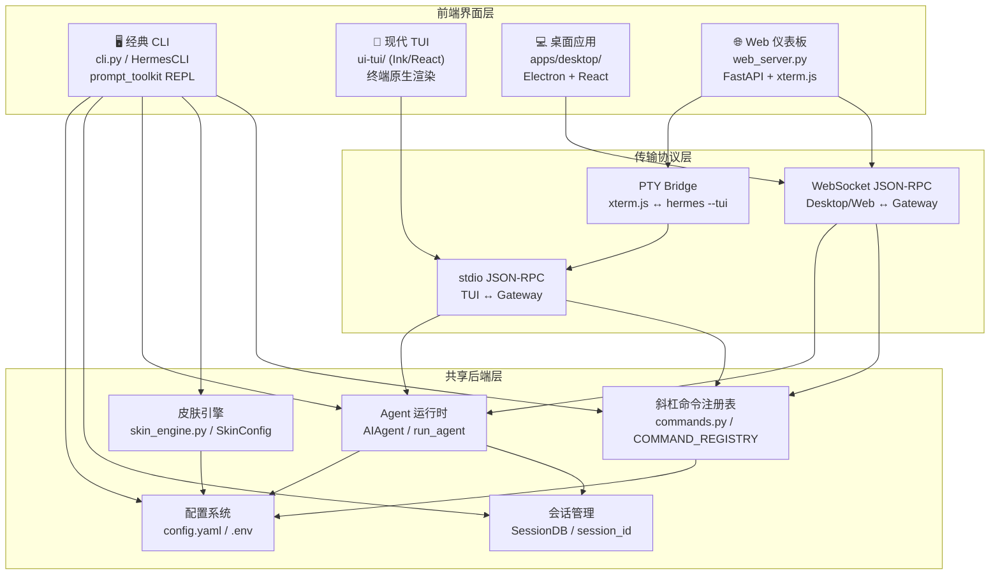
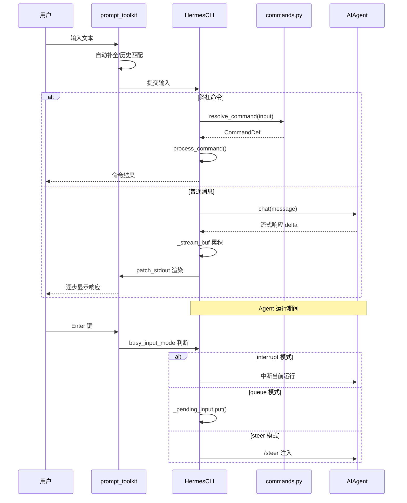
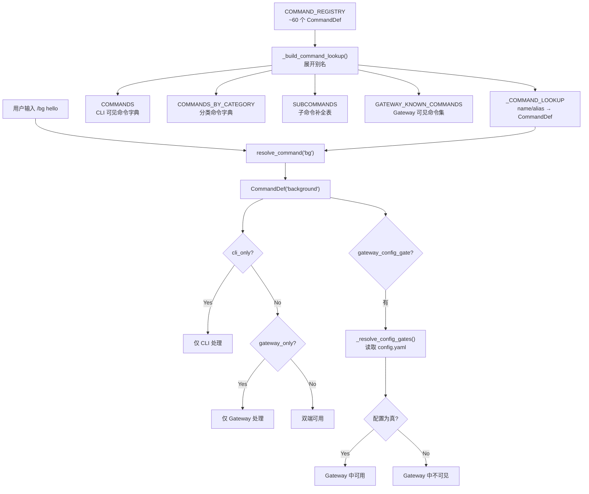
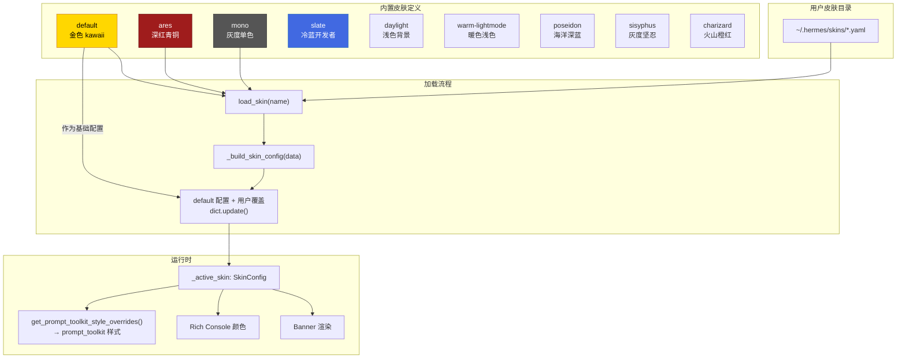
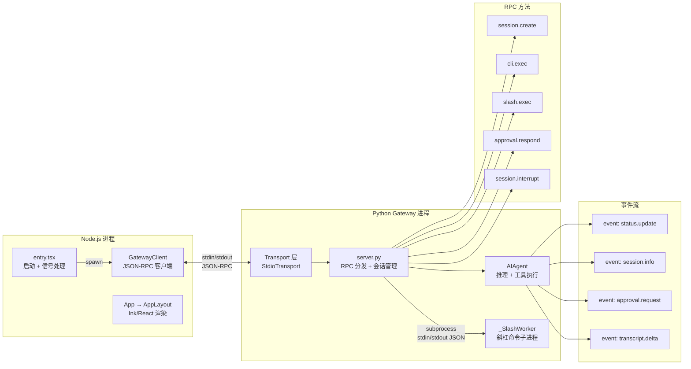
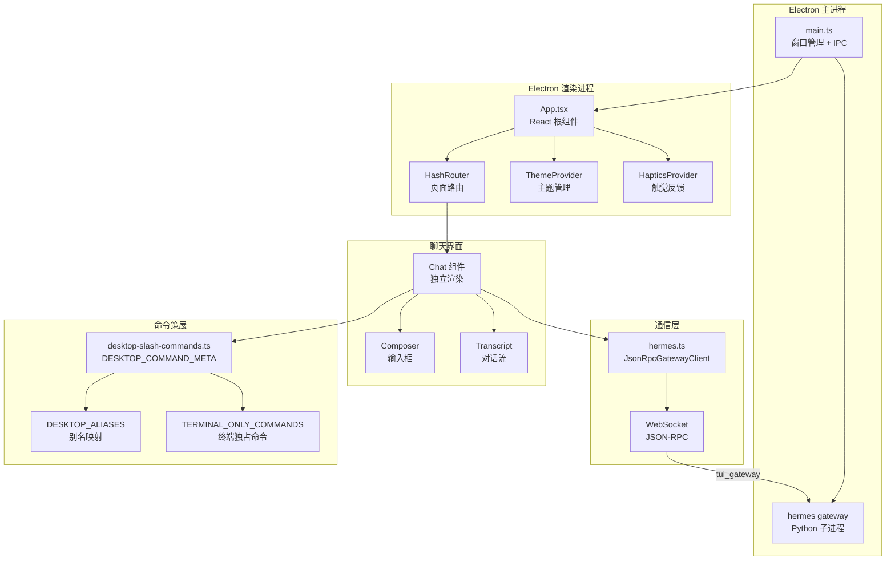
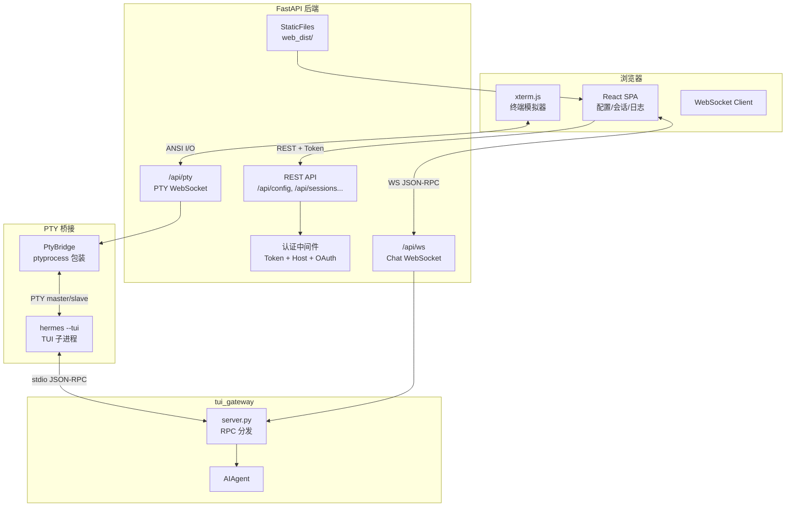

# Hermes Agent CLI 与交互界面——深度代码分析

## 一、开篇概览

Hermes Agent 提供了四种形态的交互界面，覆盖从终端极客到桌面用户的全场景需求：**经典 CLI**（`cli.py`，基于 prompt_toolkit 的 REPL）、**现代 TUI**（`ui-tui/` + `tui_gateway/`，Node/Ink 前端 + Python 后端的进程分离架构）、**桌面应用**（`apps/desktop/`，Electron + React + nanostore）、**Web 仪表板**（`hermes_cli/web_server.py`，FastAPI + xterm.js）。四种界面共享同一套后端逻辑——斜杠命令注册表、皮肤引擎、Agent 运行时、会话管理——差异仅在于传输层和渲染层，体现了"多前端共享后端"的架构精髓。

### 全景架构图



---

## 二、CLI 架构——`cli.py`

### 2.1 HermesCLI 类：~11k LOC 的巨石 REPL

`cli.py` 中的 `HermesCLI` 类（第 3071 行起）是整个经典 CLI 的核心，承担了 REPL 循环、命令分发、Agent 生命周期管理、流式渲染、会话状态等全部职责。其 `__init__` 方法（第 3079–3468 行）初始化了超过 80 个实例属性，涵盖：

- **模型与 Provider**：`self.model`、`self.provider`、`self.api_key`、`self.base_url`，优先级为 CLI 参数 > config.yaml > 环境变量
- **显示配置**：`self.streaming_enabled`、`self.show_reasoning`、`self.busy_input_mode`（interrupt/queue/steer）、`self.tool_progress_mode`
- **会话状态**：`self.conversation_history`、`self.session_id`、`self._resumed`、`self._pending_title`
- **交互状态机**：`self._clarify_state`、`self._sudo_state`、`self._approval_state`、`self._slash_confirm_state`——每种模态输入都有独立的状态 + 超时机制
- **语音模式**：`self._voice_mode`、`self._voice_tts`、`self._voice_recorder`——完整的语音输入/输出管线

**为什么这样设计**：HermesCLI 的"巨石"形态是历史演进的产物。早期 CLI 只需要简单的 REPL，但随着斜杠命令、语音模式、审批流、后台任务等功能的叠加，状态管理复杂度指数级增长。将所有状态集中在单一类中，虽然增加了类的体积，但避免了跨对象状态同步的复杂性——在单线程 REPL 场景下，这是最简单正确的选择。

### 2.2 prompt_toolkit 集成

CLI 的交互层完全基于 `prompt_toolkit`，提供了：

- **固定底部输入区**：通过 `Layout` + `HSplit` + `FormattedTextControl` 实现输入框始终在终端底部，输出向上滚动
- **命令历史**：`FileHistory(_hermes_home / ".hermes_history")` 持久化到磁盘
- **自动补全**：`SlashCommandCompleter` 基于 `COMMAND_REGISTRY` 提供斜杠命令补全
- **多行编辑**：`install_shift_enter_alias()` 和 `install_ctrl_enter_alias()` 让 Shift+Enter 插入换行、Enter 提交
- **键绑定**：`KeyBindings` 注册 Ctrl+C（中断）、Ctrl+L（重绘）、Escape（取消补全）等

```python
# cli.py 第 56-74 行：prompt_toolkit 核心导入
from prompt_toolkit.history import FileHistory
from prompt_toolkit.styles import Style as PTStyle
from prompt_toolkit.patch_stdout import patch_stdout
from prompt_toolkit.application import Application
from prompt_toolkit.layout import Layout, HSplit, Window, FormattedTextControl
from prompt_toolkit.layout.menus import CompletionsMenu
from prompt_toolkit.widgets import TextArea
from prompt_toolkit.key_binding import KeyBindings
```

### 2.3 输入处理与自动补全

输入处理的核心流程在 `run()` 方法（第 13057 行）中：

1. 显示 Banner + Welcome 消息
2. 进入 prompt_toolkit 的 `Application.run()` 主循环
3. 用户输入通过 `process_command()` 分发斜杠命令，或通过 `chat()` 发送给 Agent
4. Agent 响应通过流式渲染逐步显示

自动补全由 `hermes_cli/commands.py` 中的 `SlashCommandCompleter` 驱动，它读取 `COMMAND_REGISTRY` 生成补全列表，支持命令名、别名和子命令的三级补全。

### 2.4 会话管理

每个 CLI 实例维护一个 `session_id`（格式：`YYYYMMDD_HHMMSS_<6位hex>`），通过 `SessionDB`（SQLite）持久化会话元数据。`/resume` 命令可恢复历史会话，`/new` 命令创建新会话。会话的 `conversation_history` 列表在内存中维护，退出时通过 `_finalize_session()` 提交到数据库。

### CLI 交互流程时序图



---

## 三、斜杠命令系统——`hermes_cli/commands.py`

### 3.1 CommandDef 数据类与 COMMAND_REGISTRY

`CommandDef` 是每个斜杠命令的完整定义，使用 `frozen=True` 的 dataclass 确保不可变性：

```python
# hermes_cli/commands.py 第 46-58 行
@dataclass(frozen=True)
class CommandDef:
    name: str                          # 规范名：如 "background"
    description: str                   # 人类可读描述
    category: str                      # 分类："Session", "Configuration" 等
    aliases: tuple[str, ...] = ()      # 别名：("bg", "btw")
    args_hint: str = ""                # 参数提示："<prompt>"
    subcommands: tuple[str, ...] = ()  # 可 Tab 补全的子命令
    cli_only: bool = False             # 仅 CLI 可用
    gateway_only: bool = False         # 仅 Gateway 可用
    gateway_config_gate: str | None = None  # 配置门控路径
```

`COMMAND_REGISTRY` 是所有命令的**唯一真相源**（Single Source of Truth），包含约 60+ 个命令，分为 6 大类：

| 分类 | 典型命令 | 数量 |
|------|---------|------|
| Session | `/new`, `/resume`, `/undo`, `/compress`, `/branch` | ~20 |
| Configuration | `/model`, `/skin`, `/yolo`, `/reasoning`, `/voice` | ~12 |
| Tools & Skills | `/tools`, `/skills`, `/cron`, `/browser`, `/plugins` | ~12 |
| Info | `/help`, `/usage`, `/status`, `/copy` | ~8 |
| Exit | `/quit`, `/exit` | 1 |

### 3.2 命令分类与别名机制

别名通过 `aliases` 字段定义，在 `_build_command_lookup()` 中展开为扁平查找表：

```python
# hermes_cli/commands.py 第 231-241 行
def _build_command_lookup() -> dict[str, CommandDef]:
    lookup: dict[str, CommandDef] = {}
    for cmd in COMMAND_REGISTRY:
        lookup[cmd.name] = cmd
        for alias in cmd.aliases:
            lookup[alias] = cmd
    return lookup
```

例如 `/background` 命令有 `bg` 和 `btw` 两个别名，查找表中三个键都指向同一个 `CommandDef`。`resolve_command()` 接受带或不带 `/` 前缀的名称，统一小写后查找。

### 3.3 CLI-only vs Gateway-only 命令

命令的可见性通过 `cli_only` 和 `gateway_only` 两个布尔标志控制：

- **CLI-only 命令**（`cli_only=True`）：如 `/clear`、`/config`、`/history`、`/save`——这些命令依赖终端特性（清屏、配置显示、历史浏览），在消息平台（Telegram/Discord）上无意义
- **Gateway-only 命令**（`gateway_only=True`）：如 `/start`、`/approve`、`/deny`、`/topic`——这些命令专门为消息平台设计，在 CLI 中不需要
- **配置门控命令**（`gateway_config_gate`）：如 `/verbose` 命令标记了 `gateway_config_gate="display.tool_progress_command"`，当该配置项为真时，即使命令本身是 `cli_only`，也会在 Gateway 中可用

`GATEWAY_KNOWN_COMMANDS` 集合由 `_build_command_lookup()` 派生，包含所有非 `cli_only` 命令加上配置门控命令，供 Gateway 分发逻辑使用。

### 3.4 配置门控命令

`gateway_config_gate` 是一个精巧的设计：它允许一个命令在 CLI 中始终可用，但在 Gateway 中仅在特定配置开启时可用。`_resolve_config_gates()` 函数读取 `config.yaml`，沿点分路径（如 `display.tool_progress_command`）查找配置值，返回当前激活的门控命令集合。

**为什么这样设计**：`/verbose` 命令在 CLI 中控制工具进度显示，在 Gateway 中对应 `display.tool_progress_command` 配置。当用户未启用该配置时，Gateway 不应暴露 `/verbose` 命令，否则用户执行后会困惑于"命令执行了但没效果"。配置门控让命令的可见性与功能可用性保持一致。

### 命令注册与分发流程图



---

## 四、皮肤引擎——`hermes_cli/skin_engine.py`

### 4.1 SkinConfig 数据驱动设计

皮肤引擎的核心是 `SkinConfig` dataclass，它将 CLI 的所有视觉元素抽象为数据：

```python
# hermes_cli/skin_engine.py 第 130-141 行
@dataclass
class SkinConfig:
    name: str
    description: str = ""
    colors: Dict[str, str] = field(default_factory=dict)     # 30+ 颜色键
    spinner: Dict[str, Any] = field(default_factory=dict)     # 等待/思考动画
    branding: Dict[str, str] = field(default_factory=dict)    # 品牌文本
    tool_prefix: str = "┊"                                    # 工具输出前缀
    tool_emojis: Dict[str, str] = field(default_factory=dict) # 工具图标覆盖
    banner_logo: str = ""    # Rich-markup ASCII art
    banner_hero: str = ""    # Rich-markup 英雄图
```

颜色系统包含 30+ 个语义化键，覆盖 Banner（`banner_border`、`banner_title`、`banner_accent`、`banner_dim`、`banner_text`）、UI 通用（`ui_accent`、`ui_label`、`ui_ok`、`ui_error`、`ui_warn`）、输入区（`prompt`、`input_rule`）、响应框（`response_border`）、状态栏（`status_bar_bg`、`status_bar_text`、`status_bar_strong`、`status_bar_dim`、`status_bar_good`/`warn`/`bad`/`critical`）、会话标签（`session_label`、`session_border`）等。

**为什么用语义化颜色键而非硬编码**：语义化键让每个皮肤只需覆盖想改变的颜色，其余自动继承 `default` 皮肤的值。这避免了"改一个皮肤要改 30 个颜色"的维护负担，也让用户自定义皮肤可以极简——只写 3-5 个颜色覆盖即可。

### 4.2 内置皮肤

系统内置 7 款皮肤，每款都有独特的视觉人格：

| 皮肤名 | 风格 | 品牌符号 | 特色 |
|--------|------|---------|------|
| `default` | 金色 + kawaii | ⚕ | 经典 Hermes 风格，金色渐变 Banner |
| `ares` | 深红 + 青铜 | ⚔ | 战神主题，自定义翅膀 Spinner |
| `mono` | 灰度单色 | ⚕ | 干净无色，适合极简主义者 |
| `slate` | 冷蓝开发者风 | ⚕ | 蓝色系，开发者友好 |
| `daylight` | 浅色背景 | ⚕ | 深色文字 + 蓝色强调，亮色终端 |
| `warm-lightmode` | 暖色浅色 | ⚕ | 棕金文字，暖色终端 |
| `poseidon` | 海洋深蓝 | Ψ | 海神主题，海浪 Spinner + 自定义 Logo |
| `sisyphus` | 灰度坚忍 | ◉ | 西西弗斯主题，推石 Spinner |
| `charizard` | 火山橙红 | ✦ | 喷火龙主题，火焰 Spinner |

每款皮肤不仅定义颜色，还定义了完整的品牌系统——`agent_name`、`welcome`、`goodbye`、`response_label`、`prompt_symbol`、`help_header`——以及自定义的 Spinner 动画（`waiting_faces`、`thinking_faces`、`thinking_verbs`、`wings`）和 ASCII art（`banner_logo`、`banner_hero`）。

### 4.3 用户自定义皮肤 YAML

用户只需在 `~/.hermes/skins/` 下放置 YAML 文件即可创建自定义皮肤：

```yaml
# ~/.hermes/skins/mytheme.yaml
name: mytheme
description: My custom theme
colors:
  banner_title: "#FF6B6B"
  ui_accent: "#FF6B6B"
branding:
  prompt_symbol: "→"
```

未指定的字段自动从 `default` 皮肤继承，这是通过 `_build_skin_config()` 实现的——先复制 `default` 的完整配置，再用用户覆盖值 `update` 上去。

### 4.4 运行时切换

`set_active_skin(name)` 函数支持运行时切换皮肤，无需重启 CLI：

```python
# hermes_cli/skin_engine.py 第 777-782 行
def set_active_skin(name: str) -> SkinConfig:
    global _active_skin, _active_skin_name
    _active_skin_name = name
    _active_skin = load_skin(name)
    return _active_skin
```

CLI 中的 `/skin <name>` 命令调用此函数，`get_prompt_toolkit_style_overrides()` 将皮肤颜色转换为 prompt_toolkit 的样式覆盖，实现即时视觉刷新。

### 皮肤引擎加载与继承图



---

## 五、TUI 架构——`ui-tui/` + `tui_gateway/`

### 5.1 进程模型：Node(Ink) ↔ stdio JSON-RPC ↔ Python(tui_gateway)

TUI 采用**双进程架构**：Node.js 进程（Ink/React）负责终端渲染和用户输入，Python 子进程（`tui_gateway`）负责 Agent 逻辑和会话管理。两个进程通过 stdin/stdout 的 JSON-RPC 协议通信。

```
┌─────────────────────┐     stdin/stdout      ┌─────────────────────┐
│   Node.js (Ink)     │ ◄──────────────────► │   Python (Gateway)  │
│   entry.tsx         │     JSON-RPC          │   tui_gateway/      │
│   App → AppLayout   │                       │   server.py         │
│   GatewayClient     │                       │   entry.py          │
└─────────────────────┘                       └─────────────────────┘
```

**为什么这样设计**：Ink（基于 React 的终端 UI 框架）在 Node.js 中运行，而 Hermes 的 Agent 核心是 Python。双进程架构让两端各用最擅长的语言——Node.js 做终端渲染（Ink 的 Flexbox 布局、Unicode 宽度计算、鼠标事件），Python 做 AI 推理和工具执行。JSON-RPC over stdio 是最简单的 IPC 方式，无需额外端口或依赖。

### 5.2 传输协议

`tui_gateway/transport.py` 定义了 `Transport` 协议接口：

```python
# tui_gateway/transport.py 第 67-74 行
@runtime_checkable
class Transport(Protocol):
    def write(self, obj: dict) -> bool:
        """Emit one JSON frame. Return False when the peer is gone."""
    def close(self) -> None:
        """Release any resources owned by this transport."""
```

三种传输实现：

1. **StdioTransport**：通过 `_real_stdout` + `_stdout_lock` 写入标准输出，用于 Ink TUI
2. **WSTransport**：通过 WebSocket 发送，用于桌面应用和 Web 仪表板
3. **TeeTransport**：同时写入两个传输，用于 sidecar 模式（TUI + 仪表板同时接收事件）

传输绑定通过 `contextvars.ContextVar` 实现，确保异步处理中的事件路由到正确的客户端。

### 5.3 关键界面组件

TUI 前端（`ui-tui/src/`）的核心组件树：

- **`App`** → `GatewayProvider` + `AppLayout`
- **`AppLayout`** → `AppChrome`（主框架）+ `Transcript`（对话流）+ `Composer`（输入框）+ `StatusBar`（状态栏）
- **`AppChrome`** → `TextInput` + `StreamingMarkdown` + `ModelPicker` + `SkillsHub`
- **`GatewayClient`**：管理 JSON-RPC 连接，提供 `session.create`、`cli.exec`、`slash.exec` 等 RPC 方法

### 5.4 斜杠命令流程

TUI 中的斜杠命令通过 `_SlashWorker` 子进程执行：

```python
# tui_gateway/server.py 第 206-276 行
class _SlashWorker:
    """Persistent HermesCLI subprocess for slash commands."""
    def __init__(self, session_key, model):
        argv = [sys.executable, "-m", "tui_gateway.slash_worker",
                "--session-key", session_key]
        self.proc = subprocess.Popen(argv, stdin=PIPE, stdout=PIPE, stderr=PIPE, text=True)

    def run(self, command):
        self.proc.stdin.write(json.dumps({"id": rid, "command": command}) + "\n")
        self.proc.stdin.flush()
        # 等待 stdout_queue 中的响应
```

**为什么用子进程而非线程**：斜杠命令可能执行任意 Python 代码（如 `/tools`、`/config`），如果在线程中运行，GIL 会阻塞 Agent 的异步操作。子进程隔离确保斜杠命令不会影响 Agent 的响应性。

### TUI 进程模型与通信图



---

## 六、桌面应用——`apps/desktop/`

### 6.1 Electron + React + nanostore 架构

桌面应用基于 Electron + React 构建，使用 `@tanstack/react-query` 管理服务端状态，`nanostores` 管理客户端状态：

```tsx
// apps/desktop/src/main.tsx
createRoot(document.getElementById('root')!).render(
  <StrictMode>
    <ErrorBoundary label="root">
      <QueryClientProvider client={queryClient}>
        <ThemeProvider>
          <HapticsProvider>
            <HashRouter>
              <App />
            </HashRouter>
          </HapticsProvider>
        </ThemeProvider>
      </QueryClientProvider>
    </ErrorBoundary>
  </StrictMode>
)
```

`hermes.ts` 封装了 `JsonRpcGatewayClient`（来自 `@hermes/shared`），提供类型安全的 RPC 调用接口，覆盖配置管理、会话操作、模型切换、Cron 任务等 30+ 个 API。

### 6.2 独立聊天界面

桌面应用有自己独立的聊天界面组件，不依赖 xterm.js 或 Ink 渲染。它通过 WebSocket JSON-RPC 直接与 `tui_gateway` 通信，使用 `WSTransport` 传输层。

### 6.3 斜杠命令策展机制

桌面应用不直接使用 `COMMAND_REGISTRY`，而是维护了自己的命令策展列表 `DESKTOP_COMMAND_META`：

```typescript
// apps/desktop/src/lib/desktop-slash-commands.ts 第 25-47 行
const DESKTOP_COMMAND_META = [
  ['/agents', 'Show active desktop sessions and running tasks'],
  ['/background', 'Run a prompt in the background'],
  ['/branch', 'Branch the latest message into a new chat'],
  // ... 约 20 个命令
] as const
```

同时定义了 `TERMINAL_ONLY_COMMANDS`（如 `/clear`、`/config`、`/history`）和 `PICKER_OWNED_COMMANDS`（如 `/model`，由专用 UI 组件处理而非命令行）。

**为什么策展而非全量暴露**：桌面应用有独立的 UI 组件处理某些功能（如模型选择器、配置编辑器），直接暴露对应的斜杠命令会导致功能重复和用户困惑。策展机制确保每个功能在桌面应用中有且仅有一个入口。

### 桌面应用架构图



---

## 七、Web 仪表板——`hermes_cli/web_server.py`

### 7.1 FastAPI + xterm.js 架构

Web 仪表板基于 FastAPI 后端 + Vite/React 前端，提供配置编辑、会话管理、日志查看和嵌入式聊天终端。

```python
# hermes_cli/web_server.py 第 129 行
app = FastAPI(title="Hermes Agent", version=__version__, lifespan=_lifespan)
```

前端静态文件从 `HERMES_WEB_DIST` 或 `hermes_cli/web_dist/` 目录提供，配置 Schema 从 `DEFAULT_CONFIG` 自动生成（`_build_schema_from_config()`），支持类型推断、分类合并和手动覆盖。

### 7.2 PTY 桥接

`hermes_cli/pty_bridge.py` 是 Web 聊天终端的核心——它将 `hermes --tui` 进程包装在 PTY 中，让 xterm.js 可以流式接收 ANSI 输出并发送键盘输入：

```python
# hermes_cli/pty_bridge.py 第 89-155 行
class PtyBridge:
    @classmethod
    def spawn(cls, argv, *, cwd=None, env=None, cols=80, rows=24):
        proc = ptyprocess.PtyProcess.spawn(list(argv), cwd=cwd, env=spawn_env, dimensions=(rows, cols))
        return cls(proc)

    def read(self, timeout=0.2) -> Optional[bytes]:
        """Read up to 64 KiB of raw bytes from the PTY master."""
        readable, _, _ = select.select([self._fd], [], [], timeout)
        data = os.read(self._fd, 65536)
        return data

    def write(self, data: bytes) -> None:
        """Write raw bytes to the PTY master (child's stdin)."""
        os.write(self._fd, data)

    def resize(self, cols, rows) -> None:
        """Forward terminal resize via TIOCSWINSZ."""
        winsize = struct.pack("HHHH", rows, cols, 0, 0)
        fcntl.ioctl(self._fd, termios.TIOCSWINSZ, winsize)
```

**为什么用 PTY 桥接而非直接 WebSocket**：`hermes --tui` 是一个完整的终端应用，它输出 ANSI 转义序列、响应终端 resize、处理鼠标事件。PTY 桥接让 xterm.js 与 TUI 之间的通信完全透明——xterm.js 认为它在连接一个真实终端，TUI 认为它运行在一个真实终端上。这确保了 TUI 的所有功能（斜杠命令弹窗、模型选择器、工具行、Markdown 渲染、皮肤引擎、审批提示）在 Web 中自动可用，无需任何适配。

### 7.3 认证机制

Web 仪表板实现了三层安全防护：

1. **会话令牌**（`_SESSION_TOKEN`）：启动时生成或从 `HERMES_DASHBOARD_SESSION_TOKEN` 环境变量读取，注入到 SPA HTML 中，所有 `/api/` 请求必须携带 `X-Hermes-Session-Token` 头
2. **Host 头验证**：`host_header_middleware` 拒绝 Host 不匹配绑定地址的请求，防御 DNS 重绑定攻击
3. **OAuth 门控**：当绑定到非回环地址且未使用 `--insecure` 标志时，`_dashboard_auth_gate` 中间件启用 OAuth 认证

```python
# hermes_cli/web_server.py 第 221-234 行
def should_require_auth(host: str, allow_public: bool) -> bool:
    return (host not in _LOOPBACK_HOST_VALUES) and (not allow_public)
```

CORS 策略严格限制为 localhost 来源，防止恶意网站读取/修改配置和密钥。

### Web 仪表板架构图



---

## 八、收束总结

### 8.1 设计精髓

Hermes 的界面系统体现了三个核心设计决策：

**1. 多前端共享后端**

四种界面形态（CLI、TUI、Desktop、Web）共享同一套后端逻辑——`COMMAND_REGISTRY`、`SkinConfig`、`AIAgent`、`SessionDB`。差异仅在传输层（stdio/WebSocket/PTY）和渲染层（prompt_toolkit/Ink/React/xterm.js）。这意味着任何后端改进（新命令、新皮肤、Agent 优化）自动惠及所有界面，无需重复实现。

**2. 数据驱动主题**

皮肤引擎将所有视觉元素抽象为 `SkinConfig` 数据结构，内置皮肤和用户皮肤使用同一套加载/继承机制。`default` 皮肤作为基础配置，其他皮肤只需覆盖差异部分。运行时切换通过全局 `_active_skin` 单例 + `get_prompt_toolkit_style_overrides()` 即时生效。

**3. PTY 桥接**

Web 仪表板的聊天终端通过 PTY 桥接复用完整的 TUI 应用，而非重新实现聊天界面。这种"桥接而非重写"的策略确保了功能完整性——TUI 的所有交互（斜杠命令弹窗、审批流、语音模式）在 Web 中自动可用。

### 8.2 设计决策总结图

```mermaid
graph TD
    subgraph "核心设计决策"
        D1["多前端共享后端<br/>COMMAND_REGISTRY 为唯一真相源<br/>SkinConfig 统一视觉系统"]
        D2["数据驱动主题<br/>YAML 定义皮肤<br/>default 继承 + 覆盖<br/>运行时切换"]
        D3["PTY 桥接<br/>xterm.js ↔ PTY ↔ TUI<br/>零适配复用"]
        D4["进程分离<br/>Node(Ink) ↔ Python(Gateway)<br/>JSON-RPC over stdio"]
        D5["命令策展<br/>cli_only / gateway_only<br/>gateway_config_gate<br/>Desktop 独立策展"]
    end

    subgraph "解决的问题"
        P1["避免后端逻辑重复<br/>一处修改四处生效"]
        P2["降低皮肤创建门槛<br/>3 行 YAML 即可自定义"]
        P3["Web 聊天功能完整性<br/>无需重写 TUI 交互"]
        P4["渲染与逻辑解耦<br/>各用最擅长的语言"]
        P5["界面适配性<br/>终端/消息平台/桌面各取所需"]
    end

    D1 --> P1
    D2 --> P2
    D3 --> P3
    D4 --> P4
    D5 --> P5

    subgraph "关键文件"
        F1["cli.py — HermesCLI ~11k LOC"]
        F2["commands.py — COMMAND_REGISTRY"]
        F3["skin_engine.py — SkinConfig"]
        F4["tui_gateway/server.py — RPC 分发"]
        F5["tui_gateway/transport.py — Transport 协议"]
        F6["hermes_cli/pty_bridge.py — PTY 桥接"]
        F7["hermes_cli/web_server.py — FastAPI 仪表板"]
        F8["apps/desktop/ — Electron 桌面应用"]
    end

    D1 -.-> F2
    D2 -.-> F3
    D3 -.-> F6
    D4 -.-> F4 & F5
    D5 -.-> F2 & F8
```


