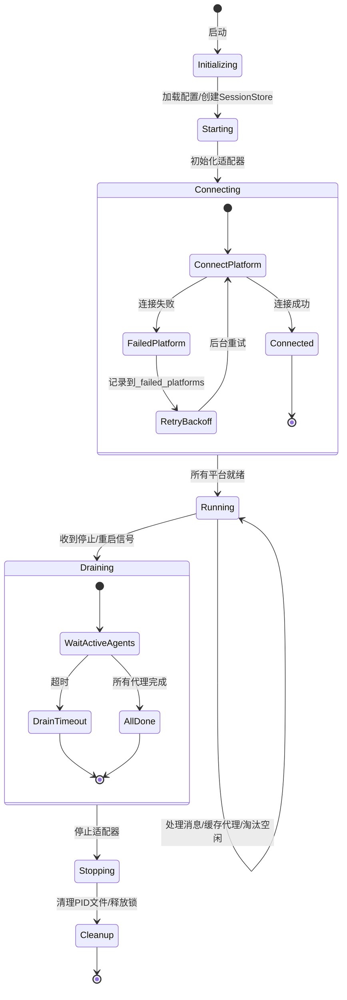
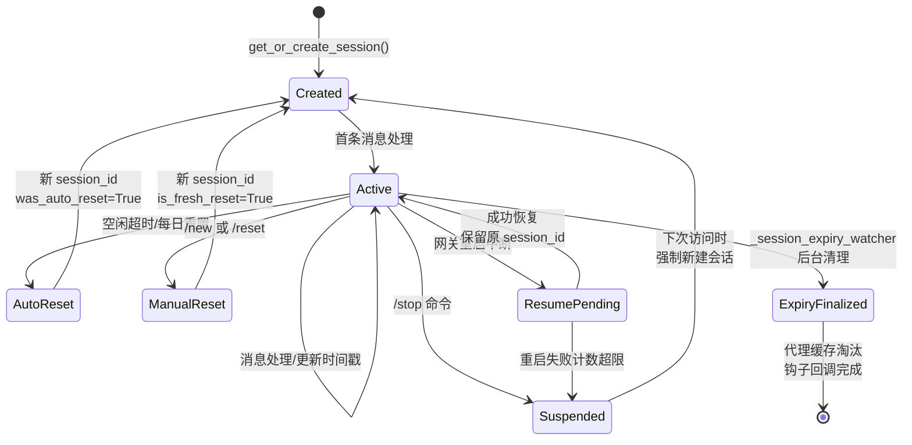
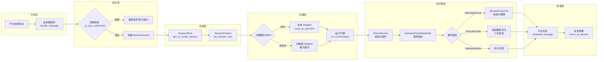
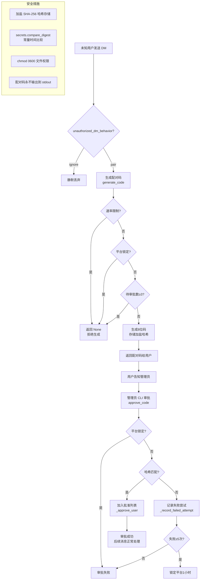
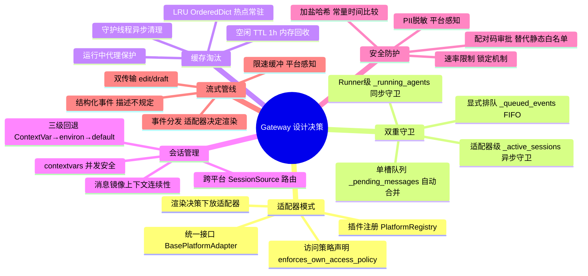

# Hermes 消息网关深度代码分析

## 开篇概览

Gateway 是 Hermes 的社交枢纽，连接 15+ 消息平台到统一的代理后端。它不仅仅是一个消息转发器——它是会话管理器、安全守卫、流式渲染引擎和生命周期编排器的合体。从 Telegram 到钉钉，从 Discord 到飞书，每一条消息都经过适配器翻译、权限校验、会话绑定、流式投递的完整管线，最终抵达 AI Agent 并返回响应。Gateway 的核心挑战在于：**在异构平台间维持语义一致性，同时尊重每个平台的独特能力与限制**。

### 全景架构图

```mermaid
graph TB
    subgraph "消息平台层"
        TG[Telegram]
        DC[Discord]
        WA[WhatsApp]
        SL[Slack]
        SG[Signal]
        MX[Matrix]
        EM[Email]
        SM[SMS]
        DT[钉钉]
        FS[飞书]
        WC[企业微信]
        WX[微信]
        BB[iMessage/BlueBubbles]
        QQ[QQ]
        YB[元宝]
        API[API Server]
        WH[Webhook]
    end

    subgraph "Gateway Runner 生命周期管理"
        GR[GatewayRunner]
        AC[Agent Cache<br/>LRU + Idle TTL]
        SEW[Session Expiry Watcher]
        PM[_pending_messages<br/>双重消息守卫]
    end

    subgraph "平台适配器层"
        BA[BasePlatformAdapter]
        TA[TelegramAdapter]
        DA[DiscordAdapter]
        SA[SlackAdapter]
        WAA[WhatsAppAdapter]
        OAA[其他平台适配器...]
    end

    subgraph "会话与安全层"
        SS[SessionStore]
        SC[SessionContext<br/>contextvars]
        PR[PairingStore<br/>配对审批]
        PA[PlatformRegistry<br/>插件注册]
    end

    subgraph "消息流管线"
        SE[StreamEvents<br/>结构化事件]
        SDC[GatewayEventDispatcher<br/>事件分发]
        SC2[GatewayStreamConsumer<br/>流式消费]
        HK[HookRegistry<br/>钩子系统]
        MR[Mirror<br/>消息镜像]
    end

    subgraph "AI Agent 后端"
        AG[AIAgent]
    end

    TG & DC & WA & SL & SG & MX --> BA
    EM & SM & DT & FS & WC & WX --> BA
    BB & QQ & YB & API & WH --> BA
    BA --> GR
    GR --> SS & SC & PR
    GR --> SE & SDC & SC2
    GR --> AG
    BA --> TA & DA & SA & WAA & OAA
    HK & MR -.-> GR
    SEW -.-> AC & SS
```



---

## 一、Gateway Runner：生命周期管理中枢

**文件路径**：`gateway/run.py`

GatewayRunner 是整个消息网关的"大脑"，负责管理所有平台适配器的生命周期、代理实例的缓存与淘汰、并发代理实例的检测、平台连接超时与断开超时等核心机制。

### 1.1 GatewayRunner 核心属性

```python
# gateway/run.py L1812-1960
class GatewayRunner:
    def __init__(self, config: Optional[GatewayConfig] = None):
        self.config = config or load_gateway_config()
        self.adapters: Dict[Platform, BasePlatformAdapter] = {}
        self.session_store = SessionStore(...)
        self._running_agents: Dict[str, Any] = {}        # 正在运行的代理实例
        self._running_agents_ts: Dict[str, float] = {}   # 运行开始时间戳
        self._pending_messages: Dict[str, str] = {}       # 中断期间排队的消息
        self._agent_cache: OrderedDict[str, tuple] = OrderedDict()  # LRU代理缓存
        self._agent_cache_lock = threading.Lock()
        self._failed_platforms: Dict[Platform, Dict] = {}  # 连接失败的平台
```

### 1.2 代理缓存：LRU + 空闲 TTL 淘汰

代理缓存是 Gateway 性能优化的关键设计。没有缓存时，每条消息都创建新的 AIAgent 实例，重建系统提示词（包括记忆），在支持 prompt caching 的提供商（如 Anthropic）上成本约高 10 倍。

```python
# gateway/run.py L64-65
_AGENT_CACHE_MAX_SIZE = 128          # LRU 硬上限
_AGENT_CACHE_IDLE_TTL_SECS = 3600.0  # 空闲1小时后淘汰
```

**LRU 淘汰机制**（`_enforce_agent_cache_cap`）：
- 使用 `OrderedDict` 实现 LRU 顺序：缓存命中时 `move_to_end()`，淘汰时 `popitem(last=False)` 弹出最久未用的条目
- 正在运行的代理（存在于 `_running_agents` 中）**绝不会被淘汰**——它们的客户端、终端沙箱、后台进程都在活跃使用中，中途淘汰会导致请求崩溃
- 如果所有 LRU 候选都在活跃运行，缓存暂时超过上限，等下次插入时重新检查

**空闲 TTL 淘汰**（`_sweep_idle_cached_agents`）：
- 由 `_session_expiry_watcher` 后台任务每 5 分钟调用一次
- 扫描所有缓存代理，淘汰空闲时间超过 `_AGENT_CACHE_IDLE_TTL_SECS`（默认1小时）的实例
- 同样跳过正在运行的代理，资源清理在守护线程中异步执行

**为什么这样设计**：LRU 保证热点会话常驻缓存（prompt cache 命中率高），空闲 TTL 防止长期不活跃的会话占用内存，两者互补形成完整的缓存淘汰策略。

### 1.3 并发代理实例检测

```python
# gateway/run.py L1879-1883
self._running_agents: Dict[str, Any] = {}        # Key: session_key
self._running_agents_ts: Dict[str, float] = {}   # 运行开始时间戳
```

每个会话同一时刻只允许一个代理实例运行。当新消息到达时，如果该会话已有代理在运行：

- **中断模式（interrupt）**：新消息存入 `_pending_messages`，当前代理完成后处理排队消息
- **排队模式（queue）**：通过 `/queue` 命令显式排队，消息进入 `_queued_events` 列表，FIFO 逐个处理

这种设计防止了同一会话的并发代理实例互相干扰——比如两个代理同时修改会话历史，或同时发送消息导致乱序。

### 1.4 平台连接超时与断开超时

```python
# gateway/run.py L66-67
_PLATFORM_CONNECT_TIMEOUT_SECS_DEFAULT = 30.0   # 平台连接超时
_ADAPTER_DISCONNECT_TIMEOUT_SECS_DEFAULT = 5.0   # 适配器断开超时
```

连接失败的平台会被记录到 `_failed_platforms`，GatewayRunner 会在后台自动重试连接，而不是直接放弃。这确保了网络抖动或平台临时不可用时，网关能自动恢复。

### 1.5 Gateway Runner 生命周期状态图



---

## 二、平台适配器架构

**文件路径**：`gateway/platforms/`

### 2.1 基类适配器 BasePlatformAdapter

**文件路径**：`gateway/platforms/base.py`

BasePlatformAdapter 是所有平台适配器的抽象基类，定义了统一的消息收发接口和通用能力：

```python
# gateway/platforms/base.py L1785-1860
class BasePlatformAdapter(ABC):
    def __init__(self, config: PlatformConfig, platform: Platform):
        self.config = config
        self.platform = platform
        self._message_handler: Optional[MessageHandler] = None
        self._active_sessions: Dict[str, asyncio.Event] = {}     # 会话中断事件
        self._pending_messages: Dict[str, MessageEvent] = {}     # 排队消息
        self._session_tasks: Dict[str, asyncio.Task] = {}        # 会话任务映射
        self._busy_text_mode: str = "queue"                      # 忙碌时文本处理模式
        self._background_tasks: set[asyncio.Task] = set()        # 后台消息处理任务
        self._post_delivery_callbacks: Dict[str, Any] = {}       # 投递后回调
```

基类提供的关键能力：
- **消息长度计算**：`message_len_fn` 属性，Telegram 重写为 UTF-16 计数（`utf16_len`），其他平台使用 Python `len`
- **访问策略声明**：`enforces_own_access_policy` 属性，让网关知道适配器是否已自行处理权限校验
- **流式草稿支持**：`supports_draft_streaming` / `send_draft`，Telegram Bot API 9.5+ 的原生流式预览
- **结构化事件渲染**：`render_message_event` / `format_tool_event`，让适配器决定如何呈现每种流式事件

### 2.2 消息队列机制 _pending_messages

`_pending_messages` 是适配器层的"单槽消息队列"——每个会话只有一个槽位，新消息会合并（merge）而非追加：

```python
# gateway/platforms/base.py L1818
self._pending_messages: Dict[str, MessageEvent] = {}
```

**为什么是单槽而非列表**：设计目标是"下一轮跟进"语义——当代理正在处理消息时，用户连续发送的多条消息会被合并为一条，避免代理逐条处理导致的上下文碎片化。这与 `/queue` 命令的 `_queued_events` 列表形成互补：`_pending_messages` 是自动合并的"快速通道"，`_queued_events` 是显式排队的"逐条通道"。

### 2.3 双重消息守卫

Gateway 实现了**两层消息守卫**来防止并发处理同一会话的消息：

**第一层：适配器级守卫**（`_active_sessions`）
```python
# gateway/platforms/base.py L1817
self._active_sessions: Dict[str, asyncio.Event] = {}
```
每个会话有一个 `asyncio.Event`，代理运行时事件为"已设置"状态，新消息到达时检查该事件——如果代理正在运行，新消息进入 `_pending_messages` 排队。

**第二层：Runner 级守卫**（`_running_agents`）
```python
# gateway/run.py L1881
self._running_agents: Dict[str, Any] = {}
```
Runner 层跟踪每个会话正在运行的代理实例，确保同一会话不会同时启动两个代理。

**为什么需要双重守卫**：适配器层守卫是异步的（asyncio Event），在事件循环中高效运行；Runner 层守卫是同步的（字典查找），在多线程环境中安全访问。两层配合确保了无论消息从哪个路径进入，都不会出现并发代理实例。

### 2.4 各平台实现

Gateway 支持以下平台适配器：

| 平台 | 文件 | 认证方式 | 特殊能力 |
|------|------|----------|----------|
| Telegram | `telegram.py` | Bot Token | 原生流式草稿、Forum Topics、UTF-16 长度限制 |
| Discord | `discord.py` | Bot Token | Guild/Channel/Thread 三级路由 |
| WhatsApp | `whatsapp.py` | Bridge 认证 | JID/LID 规范化、别名展开 |
| Slack | `slack.py` | Bot Token | Block Kit、频道技能绑定 |
| Signal | `signal.py` | HTTP URL + Account | UUID 稳定 ID、速率限制 |
| Matrix | `matrix.py` | Access Token | E2EE 加密、房间白名单 |
| Email | `email.py` | IMAP/SMTP | 邮件轮询收件 |
| SMS | `sms.py` | Twilio SID | 短信收发 |
| 钉钉 | `dingtalk.py` | Client ID/Secret | WebSocket 连接 |
| 飞书 | `feishu.py` | App ID/Secret | 评论/会议邀请/加密回调 |
| 企业微信 | `wecom.py` | Bot ID/Secret | 回调模式/加密消息 |
| 微信 | `weixin.py` | Token + Account ID | iLink Bot API、多行消息分割 |
| iMessage | `bluebubbles.py` | Server URL + Password | 气泡分割、已读回执 |
| QQ | `qqbot/adapter.py` | App ID/Client Secret | 官方 Bot API v2 |
| 元宝 | `yuanbao.py` | App ID/App Secret | WebSocket + 私聊/群聊 |
| API Server | `api_server.py` | API Key | REST API 接入 |
| Webhook | `webhook.py` | Secret | 通用 HTTP 回调 |

### 2.5 平台适配器类继承图

```mermaid
classDiagram
    class BasePlatformAdapter {
        +config: PlatformConfig
        +platform: Platform
        +_active_sessions: Dict
        +_pending_messages: Dict
        +_session_tasks: Dict
        +_background_tasks: Set
        +message_len_fn() Callable
        +enforces_own_access_policy() bool
        +supports_draft_streaming() bool
        +send_draft() SendResult
        +render_message_event()
        +format_tool_event() Optional~str~
        +connect()* 
        +disconnect()*
        +send()*
        +handle_message()
    }

    class TelegramAdapter {
        +utf16_len() int
        +supports_draft_streaming() bool
        +send_draft() SendResult
        +send_or_update_status()
    }

    class DiscordAdapter {
        +enforces_own_access_policy() bool
    }

    class WhatsAppAdapter {
        +enforces_own_access_policy() bool
        +canonical_whatsapp_identifier()
    }

    class SlackAdapter {
        +enforces_own_access_policy() bool
    }

    class FeishuAdapter {
        +enforces_own_access_policy() bool
        +评论/会议邀请处理
    }

    class WeComAdapter {
        +enforces_own_access_policy() bool
    }

    class WeixinAdapter {
        +enforces_own_access_policy() bool
    }

    class QQBotAdapter {
        +enforces_own_access_policy() bool
    }

    class YuanbaoAdapter {
        +enforces_own_access_policy() bool
    }

    BasePlatformAdapter <|-- TelegramAdapter
    BasePlatformAdapter <|-- DiscordAdapter
    BasePlatformAdapter <|-- WhatsAppAdapter
    BasePlatformAdapter <|-- SlackAdapter
    BasePlatformAdapter <|-- FeishuAdapter
    BasePlatformAdapter <|-- WeComAdapter
    BasePlatformAdapter <|-- WeixinAdapter
    BasePlatformAdapter <|-- QQBotAdapter
    BasePlatformAdapter <|-- YuanbaoAdapter
    BasePlatformAdapter <|-- SignalAdapter
    BasePlatformAdapter <|-- MatrixAdapter
    BasePlatformAdapter <|-- EmailAdapter
    BasePlatformAdapter <|-- SMSAdapter
    BasePlatformAdapter <|-- DingTalkAdapter
    BasePlatformAdapter <|-- BlueBubblesAdapter
    BasePlatformAdapter <|-- APIServerAdapter
    BasePlatformAdapter <|-- WebhookAdapter
```



### 2.6 插件注册机制 PlatformRegistry

**文件路径**：`gateway/platform_registry.py`

PlatformRegistry 是平台适配器的中心注册表，支持内置适配器和插件适配器的统一发现与实例化：

```python
# gateway/platform_registry.py L162-260
class PlatformRegistry:
    def __init__(self):
        self._entries: dict[str, PlatformEntry] = {}

    def register(self, entry: PlatformEntry) -> None: ...
    def create_adapter(self, name: str, config: Any) -> Optional[Any]: ...
```

`PlatformEntry` 是一个丰富的数据类，包含适配器工厂、依赖检查、配置验证、安装提示、PII 安全标记、YAML 配置桥接等元数据。插件通过 `PluginContext.register_platform()` 注册，网关优先查找注册表，找不到则回退到内置的 if/elif 链。

**为什么这样设计**：注册表模式将平台发现与平台实现解耦，插件作者无需修改核心代码即可添加新平台。`PlatformEntry` 的丰富元数据让网关在适配器实例化之前就能做出智能决策（如是否启用、如何验证配置）。

---

## 三、会话管理

**文件路径**：`gateway/session.py`、`gateway/session_context.py`

### 3.1 会话创建与恢复

SessionStore 管理会话的完整生命周期，核心方法是 `get_or_create_session`：

```python
# gateway/session.py L856-955
def get_or_create_session(self, source: SessionSource, force_new: bool = False) -> SessionEntry:
    session_key = self._generate_session_key(source)
    # 1. 查找已有会话
    if session_key in self._entries and not force_new:
        entry = self._entries[session_key]
        # 2. 检查挂起状态（/stop 后的强制重置）
        if entry.suspended:
            reset_reason = "suspended"
        # 3. 检查恢复挂起（重启中断后的自动恢复）
        elif entry.resume_pending:
            entry.updated_at = now
            return entry  # 保留原 session_id，自动恢复
        # 4. 检查重置策略（空闲/每日）
        else:
            reset_reason = self._should_reset(entry, source)
        # 5. 无需重置，更新时间戳返回
        if not reset_reason:
            entry.updated_at = now
            return entry
    # 6. 创建新会话
    session_id = f"{now.strftime('%Y%m%d_%H%M%S')}_{uuid.uuid4().hex[:8]}"
```

**会话键构建规则**（`build_session_key`）是会话隔离的核心：

- **DM**：`agent:main:{platform}:dm:{chat_id}[:{thread_id}]`——每个私聊独立会话
- **群组/频道**：`agent:main:{platform}:{chat_type}:{chat_id}[:{thread_id}][:{user_id}]`——支持按用户隔离（`group_sessions_per_user`）或共享（默认线程共享）
- **WhatsApp 特殊处理**：JID/LID 规范化，防止同一用户因标识符格式不同而创建多个会话

### 3.2 会话上下文 session_context.py

**文件路径**：`gateway/session_context.py`

这是并发安全的会话状态管理模块，使用 Python 的 `contextvars.ContextVar` 替代了旧的 `os.environ` 方案：

```python
# gateway/session_context.py L51-62
_SESSION_PLATFORM: ContextVar = ContextVar("HERMES_SESSION_PLATFORM", default=_UNSET)
_SESSION_CHAT_ID: ContextVar = ContextVar("HERMES_SESSION_CHAT_ID", default=_UNSET)
_SESSION_THREAD_ID: ContextVar = ContextVar("HERMES_SESSION_THREAD_ID", default=_UNSET)
_SESSION_USER_ID: ContextVar = ContextVar("HERMES_SESSION_USER_ID", default=_UNSET)
_SESSION_KEY: ContextVar = ContextVar("HERMES_SESSION_KEY", default=_UNSET)
_SESSION_ID: ContextVar = ContextVar("HERMES_SESSION_ID", default=_UNSET)
_SESSION_MESSAGE_ID: ContextVar = ContextVar("HERMES_SESSION_MESSAGE_ID", default=_UNSET)
```

**为什么从 os.environ 迁移到 contextvars**：网关通过 asyncio 并发处理消息。当两条消息同时到达时，旧的 `os.environ["HERMES_SESSION_THREAD_ID"] = ...` 是进程全局的——消息 A 的值会被消息 B 静默覆盖，导致后台任务通知和工具调用路由到错误的线程。`ContextVar` 是任务局部的，每个 asyncio 任务（及其 `run_in_executor` 线程）获得独立副本，并发消息互不干扰。

**三级回退机制**（`get_session_env`）：
1. ContextVar（网关设置的并发安全值）
2. `os.environ`（CLI、cron、测试进程的兼容回退）
3. 默认值

### 3.3 跨平台会话连续性

会话的跨平台连续性通过以下机制实现：

- **SessionSource**：记录消息来源的平台、聊天ID、线程ID、用户信息，确保响应路由回正确位置
- **HomeChannel**：每个平台配置默认投递目标，cron 任务可以通过 `deliver="telegram"` 指定平台
- **消息镜像**（`gateway/mirror.py`）：跨平台投递时，在目标会话的转录中追加镜像记录，让接收侧代理知道消息来自哪个源

### 3.4 会话生命周期状态图



---

## 四、消息流与钩子

### 4.1 结构化流式事件 StreamEvents

**文件路径**：`gateway/stream_events.py`

StreamEvents 定义了 Agent→Gateway 的投递契约，是一组不可变的数据类：

| 事件类型 | 含义 | 典型场景 |
|----------|------|----------|
| `MessageChunk` | 流式文本增量 | 模型逐 token 输出 |
| `MessageStop` | 当前消息段结束 | 文本→工具调用→文本的分段边界 |
| `Commentary` | 完整的中间注释 | "我先检查一下仓库" |
| `ToolCallChunk` | 工具调用开始/变更 | 执行 bash、搜索文件 |
| `ToolCallFinished` | 工具调用完成 | 清除进度气泡 |
| `LongToolHint` | 长时间运行提示 | 建议使用 /verbose |
| `GatewayNotice` | 网关控制消息 | 重启通知、在线通知 |

**设计哲学**：事件只描述"发生了什么"，不规定"如何投递"。适配器决定渲染方式——Telegram 可以用原生草稿流式渲染 MarkdownV2 代码块，iMessage 可能折叠或丢弃工具装饰。这种分离确保了智能代理发出结构化数据，智能网关决定投递方式。

### 4.2 事件分发器 GatewayEventDispatcher

**文件路径**：`gateway/stream_dispatch.py`

```python
# gateway/stream_dispatch.py L40-130
class GatewayEventDispatcher:
    def dispatch(self, event: StreamEvent) -> None:
        """路由单个事件，永不向代理工作线程抛异常"""
        try:
            self._dispatch(event)
        except Exception:
            logger.debug("stream-event dispatch error", exc_info=True)
```

分发规则：
- **MessageChunk/MessageStop/Commentary** → 交给适配器的 `render_message_event` 渲染到流式消费者
- **ToolCallChunk** → 交给适配器的 `format_tool_event` 格式化，返回 `None` 表示"吃掉"该事件（平台不支持工具装饰）
- **ToolCallFinished** → 默认无渲染（只驱动内部状态）
- **LongToolHint/GatewayNotice** → 触发注册的回调钩子

**"new" 模式去重**：当 `tool_mode="new"` 时，只有工具名称变化才发送进度更新，避免同一工具的多次状态变更刷屏。

### 4.3 流式消费 GatewayStreamConsumer

**文件路径**：`gateway/stream_consumer.py`

GatewayStreamConsumer 是异步消费者，将同步的代理回调桥接到异步的平台投递：

```python
# gateway/stream_consumer.py L79-100
class GatewayStreamConsumer:
    """异步消费者：渐进式编辑平台消息以显示流式 token"""
```

工作流程：
1. 代理在工作线程中同步调用 `on_delta(text)`
2. 增量通过 `queue.Queue` 传递到 asyncio 任务
3. 异步 `run()` 任务缓冲、限速、渐进式编辑平台消息

**传输模式**：
- **edit**（默认）：发送初始消息，然后反复 `editMessageText`
- **draft**（Telegram DM）：使用 `sendMessageDraft` 原生流式预览
- **auto**：优先 draft，不支持时回退到 edit

**限速参数**（来自 `gateway/config.py`）：
```python
DEFAULT_STREAMING_EDIT_INTERVAL: float = 0.8    # 编辑间隔，略低于 Telegram 1次/秒限制
DEFAULT_STREAMING_BUFFER_THRESHOLD: int = 24    # 缓冲阈值，短回复近即时
DEFAULT_STREAMING_CURSOR: str = " ▉"            # 流式光标
```

### 4.4 钩子系统

**文件路径**：`gateway/hooks.py`

钩子系统是一个轻量级的事件驱动框架，在关键生命周期点触发处理器：

```python
# gateway/hooks.py L35-43
class HookRegistry:
    def __init__(self):
        self._handlers: Dict[str, List[Callable]] = {}
```

支持的事件：
- `gateway:startup` —— 网关进程启动
- `session:start` —— 新会话创建
- `session:end` —— 会话结束
- `session:reset` —— 会话重置完成
- `agent:start` / `agent:step` / `agent:end` —— 代理处理生命周期
- `command:*` —— 任意斜杠命令（通配符匹配）

钩子发现机制：扫描 `~/.hermes/hooks/` 目录，每个钩子目录包含 `HOOK.yaml`（元数据）和 `handler.py`（处理器）。错误被捕获并记录，永不阻塞主管线。

### 4.5 消息镜像

**文件路径**：`gateway/mirror.py`

消息镜像确保跨平台投递的上下文连续性：

```python
# gateway/mirror.py L25-41
def mirror_to_session(platform, chat_id, message_text, source_label="cli", thread_id=None, user_id=None):
    """在目标会话的转录中追加投递镜像记录"""
```

当通过 `send_message` 或 cron 投递将消息发送到另一个平台时，镜像模块在目标会话的转录中追加一条标记为 `mirror=True` 的记录，让接收侧代理知道"这条消息来自另一个会话"。

### 4.6 消息流处理管线图



---

## 五、配对与安全

**文件路径**：`gateway/pairing.py`

### 5.1 DM 配对机制

PairingStore 实现了基于配对码的用户授权系统，替代了静态用户 ID 白名单：

```python
# gateway/pairing.py L39-50
ALPHABET = "ABCDEFGHJKLMNPQRSTUVWXYZ23456789"  # 无歧义字母表（排除0/O/1/I）
CODE_LENGTH = 8
CODE_TTL_SECONDS = 3600             # 配对码1小时过期
RATE_LIMIT_SECONDS = 600            # 每用户10分钟1次请求
LOCKOUT_SECONDS = 3600              # 5次失败后锁定1小时
MAX_PENDING_PER_PLATFORM = 3        # 每平台最多3个待审批码
MAX_FAILED_ATTEMPTS = 5             # 锁定前的最大失败次数
```

**配对流程**：
1. 未知用户发送 DM → 网关生成 8 位配对码（`generate_code`）
2. 配对码只存储加盐 SHA-256 哈希，不存明文（`_hash_code`）
3. 用户将配对码告知管理员 → 管理员通过 CLI 审批（`approve_code`）
4. 审批时使用 `secrets.compare_digest` 常量时间比较，防止时序攻击
5. 审批通过后用户加入批准列表，后续消息正常处理

### 5.2 命令审批流程

网关实现了多层安全防护：

**平台访问控制**（`enforces_own_access_policy`）：
- 部分适配器（WeCom、Weixin、Yuanbao、QQBot、WhatsApp）在适配器层自行实现 `dm_policy` / `group_policy` / `allow_from` 等配置驱动的访问控制
- 网关层的 `_is_user_authorized` 检查在这些适配器之后运行，通过 `enforces_own_access_policy` 标志跳过重复校验

**环境变量白名单**：
- `TELEGRAM_ALLOWED_USERS`、`DISCORD_ALLOWED_USERS` 等环境变量控制哪些用户可以与代理交互
- 未配置白名单时默认拒绝（安全优先）

**PII 脱敏**（`session.py` 中的 `_hash_sender_id` / `_hash_chat_id`）：
- 在 PII 安全平台（WhatsApp、Signal、Telegram）上，系统提示中的用户 ID 和聊天 ID 被替换为确定性哈希
- Discord 等需要真实 ID 进行 @mention 的平台不脱敏

### 5.3 配对与审批流程图



---

## 六、收束总结

### 设计精髓

Gateway 的设计精髓可以归纳为三个核心模式：

**1. 适配器模式（Adapter Pattern）**

BasePlatformAdapter 定义统一接口，15+ 平台各自实现。关键设计决策：
- 适配器不仅翻译消息格式，还决定渲染策略（`render_message_event` / `format_tool_event`）
- `enforces_own_access_policy` 让适配器声明"我已处理权限"，避免网关重复校验
- PlatformRegistry 插件注册表让新平台无需修改核心代码即可接入

**2. 双重守卫（Double Guard）**

适配器层 `_active_sessions` + Runner 层 `_running_agents` 的双重守卫，从异步和同步两个维度确保同一会话不会出现并发代理实例。`_pending_messages` 单槽队列自动合并连续消息，`_queued_events` 列表支持显式 FIFO 排队，两种语义互补覆盖了所有并发场景。

**3. 缓存淘汰（Cache Eviction）**

LRU 硬上限 + 空闲 TTL 的组合淘汰策略：
- LRU 保证热点会话常驻（prompt cache 命中率高，成本降低约 10 倍）
- 空闲 TTL 防止长期不活跃会话占用内存
- 正在运行的代理绝不被淘汰，避免请求崩溃
- 资源清理在守护线程异步执行，不阻塞主流程

### 设计决策总结图


