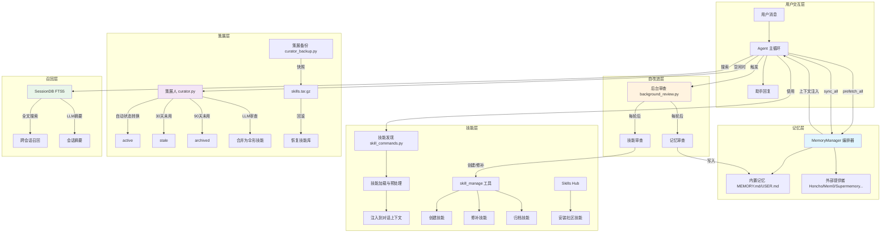
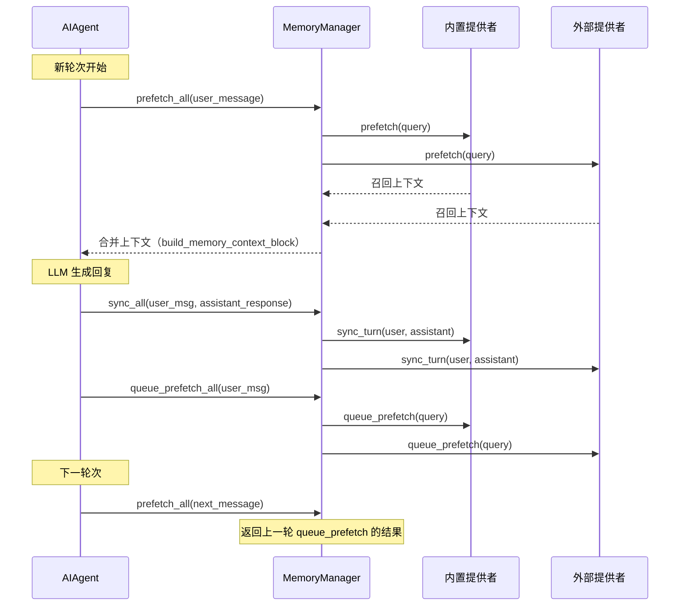
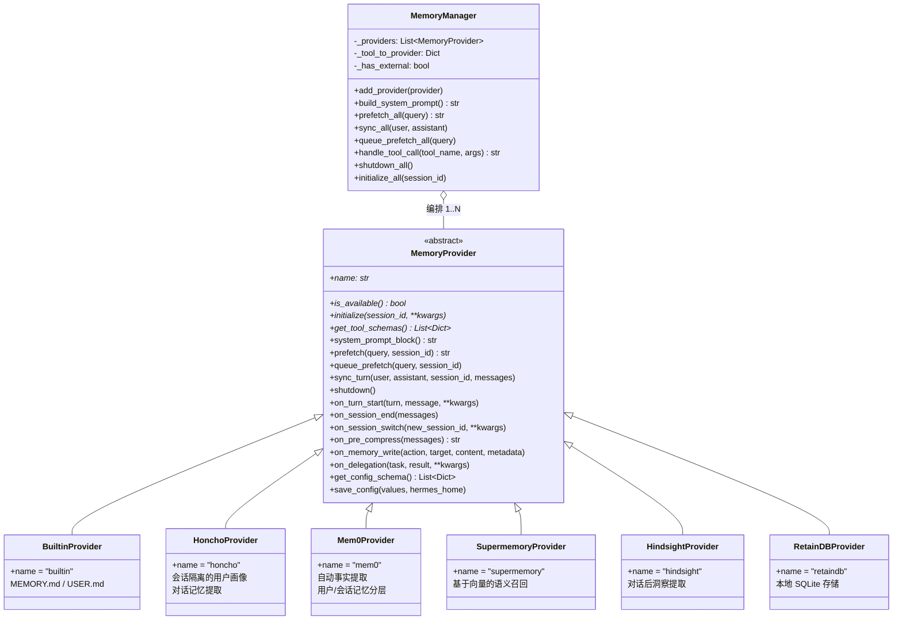
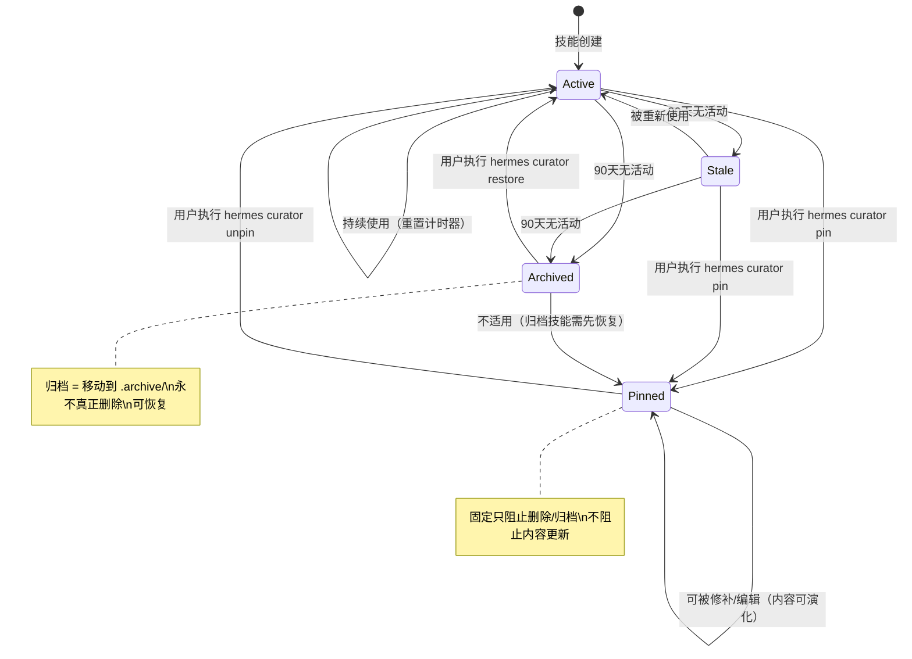
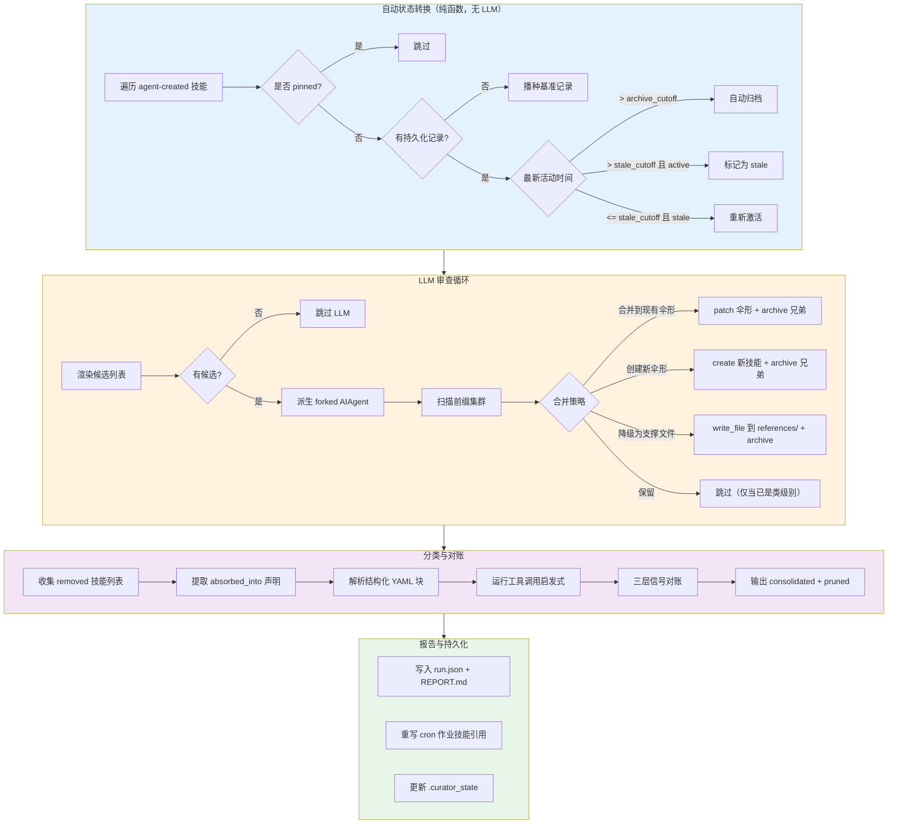
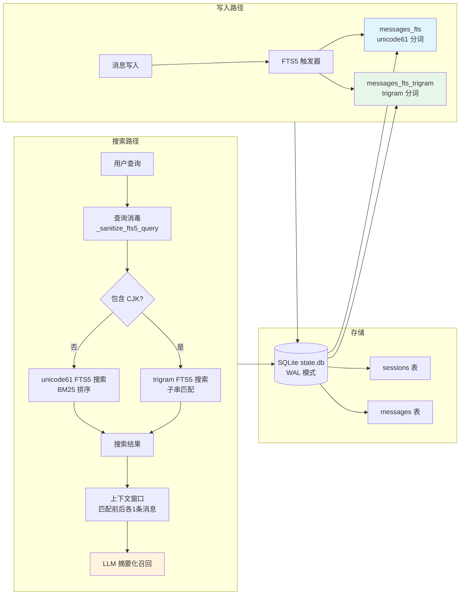
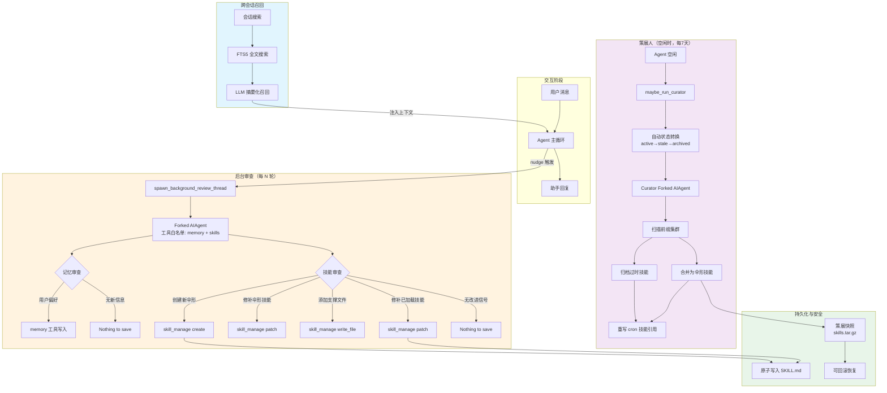
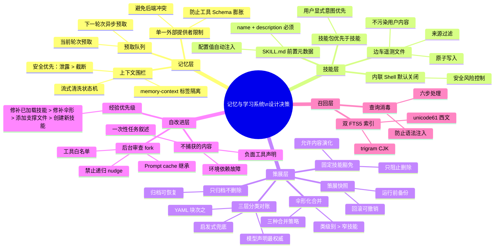

# Hermes 记忆与学习系统 — 深度代码分析

## 开篇概览

记忆与学习系统是 Hermes 实现"自改进"的核心引擎。它将 Agent 的日常交互经验转化为持久化的知识资产——从用户偏好的记忆存储，到可复用的技能指令，再到跨会话的搜索召回——形成一条 **经验→技能→改进→持久化** 的完整闭环。这条闭环不是简单的"写入数据库"，而是一个精心设计的多层体系：记忆管理器编排外部提供者，技能系统捕获可操作知识，策展人自动维护技能库的健康，后台审查在每轮对话后静默提取经验，会话搜索提供跨时间线的召回能力。整个系统遵循三个不变量：**经验驱动**（所有知识来自真实交互）、**安全演化**（永不删除、备份可回滚）、**永不丢失**（归档可恢复、快照可回退）。

### 全景架构图：自改进闭环的全景数据流



---

## 一、记忆管理器 — `agent/memory_manager.py`

### 1.1 MemoryManager 编排器

`MemoryManager` 是记忆系统的中央调度器，作为 `run_agent.py` 与所有记忆后端之间的唯一集成点。它取代了早期散落在各处的后端特定代码，用一个统一的管理器将请求委托给已注册的提供者。

**核心设计约束：单一外部插件提供者限制**。`add_provider()` 方法只允许注册一个非内置（external）提供者——第二次注册会被拒绝并发出警告。这个限制的深层原因有二：

1. **工具 Schema 膨胀**：每个外部提供者都会向 LLM 暴露自己的工具集（如 `memory_add`、`memory_search`），多个提供者会导致工具列表急剧膨胀，降低模型选择工具的准确性。
2. **后端冲突**：不同记忆后端对同一用户画像可能有矛盾的理解，同时运行会破坏记忆的一致性。

```python
# agent/memory_manager.py — 核心注册逻辑
def add_provider(self, provider: MemoryProvider) -> None:
    is_builtin = provider.name == "builtin"
    if not is_builtin:
        if self._has_external:
            logger.warning(
                "Rejected memory provider '%s' — external provider '%s' is "
                "already registered. Only one external memory provider is "
                "allowed at a time.", provider.name, existing,
            )
            return
        self._has_external = True
    self._providers.append(provider)
    # 索引工具名 → 提供者，用于路由
    for schema in provider.get_tool_schemas():
        tool_name = schema.get("name", "")
        if tool_name and tool_name not in self._tool_to_provider:
            self._tool_to_provider[tool_name] = provider
```

### 1.2 上下文围栏 — sanitize_context

当记忆提供者返回的文本被注入到对话上下文时，必须确保这些文本不会被 LLM 误读为新的用户输入。Hermes 使用 `<memory-context>` XML 标签将召回的记忆包裹起来，并附加一条系统注记：

```python
# agent/memory_manager.py
def build_memory_context_block(raw_context: str) -> str:
    return (
        "<memory-context>\n"
        "[System note: The following is recalled memory context, "
        "NOT new user input. Treat as authoritative reference data — "
        "this is the agent's persistent memory and should inform all responses.]\n\n"
        f"{clean}\n"
        "</memory-context>"
    )
```

`sanitize_context()` 函数则负责在提供者输出中剥离可能存在的预包装标签，防止双重嵌套。它使用三个正则表达式依次清除：围栏标签、完整的上下文块、系统注记行。

### 1.3 流式上下文清洗 — StreamingContextScrubber

流式输出（streaming）带来了一个非平凡的问题：`<memory-context>` 标签可能被分割到两个不同的 delta 中。一次性正则 `sanitize_context` 无法处理跨 chunk 的标签对。`StreamingContextScrubber` 用一个有限状态机解决这个问题：

- **状态 `_in_span`**：当前是否在 `<memory-context>` 标签对内部
- **缓冲 `_buf`**：持有可能是标签前缀的尾部片段
- **块边界追踪 `_at_block_boundary`**：只在块级边界识别开标签，避免误杀正文中的同名文本

```python
# agent/memory_manager.py — StreamingContextScrubber 核心逻辑
def feed(self, text: str) -> str:
    buf = self._buf + text
    self._buf = ""
    out: list[str] = []
    while buf:
        if self._in_span:
            idx = buf.lower().find(self._CLOSE_TAG)
            if idx == -1:
                # 持有可能的部分闭标签；丢弃其余内容
                held = self._max_partial_suffix(buf, self._CLOSE_TAG)
                self._buf = buf[-held:] if held else ""
                return "".join(out)
            buf = buf[idx + len(self._CLOSE_TAG):]
            self._in_span = False
        else:
            idx = self._find_boundary_open_tag(buf)
            if idx == -1:
                # 没有开标签 — 持有可能的部分开标签
                ...
```

**设计决策**：`flush()` 时如果仍在未闭合的 span 内，剩余内容被**丢弃**而非泄露。这是一个安全优先的选择——泄露部分记忆上下文比截断回答更糟糕。

### 1.4 记忆生命周期

记忆在每个对话轮次中经历四个阶段：



**为什么需要 `queue_prefetch`？** 因为外部提供者的召回可能有网络延迟。在当前轮次结束后立即为下一轮次预取，可以让下一轮次的 `prefetch_all` 直接返回缓存结果，将用户感知的延迟降到零。

---

## 二、记忆提供者抽象 — `agent/memory_provider.py`

### 2.1 MemoryProvider ABC

`MemoryProvider` 是所有记忆后端的抽象基类，定义了提供者必须实现的核心接口和可选钩子。其设计遵循**接口隔离原则**——提供者只需实现自己关心的方法，其余默认为空操作。

```python
# agent/memory_provider.py — 核心接口
class MemoryProvider(ABC):
    @property
    @abstractmethod
    def name(self) -> str: ...

    @abstractmethod
    def is_available(self) -> bool: ...

    @abstractmethod
    def initialize(self, session_id: str, **kwargs) -> None: ...

    @abstractmethod
    def get_tool_schemas(self) -> List[Dict[str, Any]]: ...

    # 可选钩子（默认空操作）
    def system_prompt_block(self) -> str: return ""
    def prefetch(self, query: str, *, session_id: str = "") -> str: return ""
    def queue_prefetch(self, query: str, *, session_id: str = "") -> None: ...
    def sync_turn(self, user_content, assistant_content, ...) -> None: ...
    def shutdown(self) -> None: ...
    def on_turn_start(self, turn_number, message, **kwargs) -> None: ...
    def on_session_end(self, messages) -> None: ...
    def on_session_switch(self, new_session_id, ...) -> None: ...
    def on_pre_compress(self, messages) -> str: return ""
    def on_memory_write(self, action, target, content, metadata=None) -> None: ...
    def on_delegation(self, task, result, ...) -> None: ...
```

**`initialize()` 的 kwargs 设计**值得注意：它总是包含 `hermes_home`（避免每个提供者自己导入 `get_hermes_home()`），还可能包含 `agent_context`（区分主代理/子代理/cron上下文）、`agent_identity`（配置文件名）、`user_id`（平台用户标识）等。提供者按需取用，多余的 kwargs 被安全忽略。

**`on_session_switch()` 的精妙之处**：当 Agent 执行 `/resume`、`/branch`、`/reset`、`/new` 或上下文压缩时，`session_id` 会旋转但提供者不会被销毁重建。提供者需要在此钩子中刷新缓存的会话状态（如 `_session_id`、`_document_id`、轮次计数器），确保后续写入落到正确的会话记录中。`rewound=True` 参数专门处理 `/undo` 场景——session_id 不变但对话被截断，缓存了逐轮文档状态的提供者需要失效。

### 2.2 MemoryProvider 接口与实现类图



**为什么内置提供者总是第一个？** `MemoryManager._providers` 列表中内置提供者始终排在最前。这保证了系统提示词中内置记忆的指令优先出现，外部提供者的指令作为补充。`on_memory_write()` 钩子也显式跳过内置提供者（它是写入的源头，不需要镜像自己的写入）。

---

## 三、技能系统

### 3.1 技能发现与加载 — `agent/skill_commands.py`

技能发现的核心是 `scan_skill_commands()`，它扫描 `~/.hermes/skills/` 及外部技能目录中的所有 `SKILL.md` 文件，构建 `/skill-name → 技能信息` 的映射表。

**发现流程的关键过滤**：

1. **平台兼容性**：`skill_matches_platform(frontmatter)` 过滤与当前 OS 不兼容的技能
2. **环境匹配**：`skill_matches_environment(frontmatter)` 过滤与当前运行环境不相关的技能（如 Docker 专用技能在非 Docker 环境下隐藏）
3. **用户禁用**：尊重 `skills.platform_disabled` 配置
4. **名称去重**：`seen_names` 集合确保同名技能只出现一次（本地目录优先于外部目录）

**技能名称规范化**：名称被统一转换为小写、连字符分隔的 slug，去除非字母数字字符，合并连续连字符。这使得 Telegram 的下划线命令名（如 `/claude_code`）和 CLI 的连字符命令名（如 `/claude-code`）可以互换使用。

```python
# agent/skill_commands.py — 名称规范化
cmd_name = name.lower().replace(' ', '-').replace('_', '-')
cmd_name = _SKILL_INVALID_CHARS.sub('', cmd_name)
cmd_name = _SKILL_MULTI_HYPHEN.sub('-', cmd_name).strip('-')
```

### 3.2 SKILL.md 前置元数据规范

每个技能以 `SKILL.md` 为入口，必须包含 YAML 前置元数据（frontmatter），至少声明 `name` 和 `description` 字段。验证逻辑在 `tools/skill_manager_tool.py` 的 `_validate_frontmatter()` 中：

```python
# tools/skill_manager_tool.py
def _validate_frontmatter(content: str) -> Optional[str]:
    if not content.startswith("---"):
        return "SKILL.md must start with YAML frontmatter (---)."
    # ... 解析 YAML，验证 name 和 description 字段
    if "name" not in parsed:
        return "Frontmatter must include 'name' field."
    if "description" not in parsed:
        return "Frontmatter must include 'description' field."
```

前置元数据还可以声明 `metadata.hermes.config` 条目，让技能依赖的配置值在加载时自动注入，无需 Agent 额外读取 `config.yaml`。

### 3.3 技能预处理 — `agent/skill_preprocessing.py`

技能内容在注入对话前经过两层预处理：

1. **模板变量替换**：`${HERMES_SKILL_DIR}` → 技能目录的绝对路径，`${HERMES_SESSION_ID}` → 当前会话 ID。未解析的 token 保留原样，方便作者调试。
2. **内联 Shell 展开**：`` !`date +%Y-%m-%d` `` → 命令的实际输出。以技能目录为 CWD，支持相对路径。输出截断到 4000 字符，超时默认 10 秒。

```python
# agent/skill_preprocessing.py
_INLINE_SHELL_RE = re.compile(r"!`([^`\n]+)`")
_INLINE_SHELL_MAX_OUTPUT = 4000

def expand_inline_shell(content, skill_dir, timeout):
    if "!`" not in content:
        return content
    def _replace(match):
        cmd = match.group(1).strip()
        return run_inline_shell(cmd, skill_dir, timeout)
    return _INLINE_SHELL_RE.sub(_replace, content)
```

**为什么内联 Shell 默认关闭？** `skills.inline_shell` 配置默认为 `False`，因为每次加载技能都会执行命令，可能带来安全风险和性能开销。只有用户显式启用时才激活。

### 3.4 技能包 — `agent/skill_bundles.py`

技能包（Bundle）是一个 YAML 文件，将多个技能打包为一个斜杠命令。当包和技能同名时，**包优先**——这是有意为之，用户显式命名一个包意味着他们希望 `/research` 指向自己的组合而非某个同名技能。

```yaml
# ~/.hermes/skill-bundles/backend-dev.yaml
name: backend-dev
description: Backend feature work — code review, testing, PR workflow.
skills:
  - github-code-review
  - test-driven-development
  - github-pr-workflow
instruction: |
  Optional extra guidance to inject above the skill bodies.
```

包的缓存机制使用 mtime 检测：只有当目录或文件的修改时间变化时才重新扫描，避免每次调用都遍历磁盘。

### 3.5 技能 Hub — `tools/skills_hub.py`

Skills Hub 是技能的远程注册中心，支持多个来源适配器：

| 来源 | 说明 | 信任级别 |
|------|------|----------|
| `OptionalSkillSource` | 官方可选技能（随仓库分发但默认不激活） | builtin |
| `GitHubSource` | 任意 GitHub 仓库的技能 | community |
| `ClawHubSource` | Claw Hub 注册中心 | trusted |
| `LobeHubSource` | LobeHub 社区 | community |

所有来源适配器都继承 `SkillSource` ABC，实现 `search()` 方法。安装流程经过**隔离→安全扫描→安装**三步，确保社区技能不会引入安全风险。

### 3.6 技能使用追踪 — `tools/skill_usage.py`

使用追踪采用**边车文件**设计——操作遥测存储在 `~/.hermes/skills/.usage.json` 中，而非 SKILL.md 的 frontmatter。这个选择有三个原因：

1. **不污染用户内容**：遥测数据不应出现在用户编辑的 SKILL.md 中
2. **避免冲突**：bundled/hub 技能的 SKILL.md 由上游管理，不应被本地遥测修改
3. **原子写入**：sidecar 文件可以独立使用 tempfile + os.replace 的原子写入模式

```python
# tools/skill_usage.py — 使用记录结构
def _empty_record() -> Dict[str, Any]:
    return {
        "created_by": None,       # "agent" 标记为 Agent 创建
        "use_count": 0,
        "view_count": 0,
        "last_used_at": None,
        "last_viewed_at": None,
        "patch_count": 0,
        "last_patched_at": None,
        "created_at": _now_iso(),
        "state": STATE_ACTIVE,    # active / stale / archived
        "pinned": False,          # 固定标记
        "archived_at": None,
    }
```

**来源过滤**：`is_agent_created()` 判断技能是否由 Agent 创建（非 bundled、非 hub），这是策展人决定是否可以管理该技能的关键依据。`is_curation_eligible()` 进一步考虑了 `curator.prune_builtins` 配置。

### 3.7 技能 AST 审计 — `tools/skills_ast_audit.py`

（注：此文件在代码库中作为安全扫描的补充层存在，对技能内容进行 AST 级别的静态分析，检测潜在的恶意代码模式。）

### 3.8 技能生命周期状态图



---

## 四、策展人系统 — `agent/curator.py`

### 4.1 策展人角色

策展人（Curator）是一个**后台技能维护编排器**，在 Agent 空闲时自动运行。它不是定时守护进程，而是**空闲触发**的——当 Agent 空闲且距上次策展运行超过 `interval_hours`（默认7天）时，`maybe_run_curator()` 才会派生一个 forked AIAgent 执行审查。

策展人的核心职责：
1. **自动状态转换**：基于活动时间戳，纯函数、无 LLM 参与
2. **LLM 审查循环**：派生一个 forked Agent 审查技能库，执行合并/归档/修补
3. **持久化状态**：在 `.curator_state` 中记录运行历史

### 4.2 严格不变量

策展人遵循四条铁律：

1. **只触碰 Agent 创建的技能**：bundled 和 hub-installed 技能严格不可编辑（除非 `prune_builtins` 启用）
2. **永不删除**：只归档（移动到 `.archive/`），归档可恢复
3. **固定技能豁免**：pinned 技能绕过所有自动转换
4. **使用辅助客户端**：不触碰主会话的 prompt cache

```python
# agent/curator.py — CURATOR_REVIEW_PROMPT 中的硬规则
"Hard rules — do not violate:\n"
"1. DO NOT touch bundled or hub-installed skills.\n"
"2. DO NOT delete any skill. Archiving is the maximum destructive action.\n"
"3. DO NOT touch skills shown as pinned=yes.\n"
"4. DO NOT use usage counters as a reason to skip consolidation.\n"
"5. DO NOT reject consolidation on the grounds that 'each skill has a distinct trigger'.\n"
```

### 4.3 自动状态转换

`apply_automatic_transitions()` 是一个纯函数，遍历所有策展人管理的技能，根据最新活动时间戳执行状态转换：

- **active → stale**：超过 `stale_after_days`（默认30天）无活动
- **stale → archived**：超过 `archive_after_days`（默认90天）无活动
- **stale → active**：被重新使用（复活）
- **首次见到的内置技能**：播种基准记录，将不活动时钟锚定到"现在"而非 epoch

**为什么内置技能需要播种？** 当 `prune_builtins` 启用时，内置技能首次进入策展视野。如果直接用 epoch 作为锚点，所有内置技能都会立即被归档。播种一个 `created_at = now` 的记录，确保它们至少经过一个完整的 `archive_after_days` 周期才会被考虑归档。

### 4.4 LLM 审查循环

LLM 审查的核心目标是**伞形化**（umbrella-ification）——将大量狭窄的"一次会话一个技能"合并为少数"类级别"的伞形技能。审查提示词明确指出：

> "A collection of hundreds of narrow skills where each one captures one session's specific bug is a FAILURE of the library — not a feature."

合并策略有三种：
1. **合并到现有伞形**：集群中已有一个足够宽泛的技能
2. **创建新伞形**：没有现有成员足够宽泛
3. **降级为支撑文件**：有价值的狭窄内容移入 `references/`、`templates/` 或 `scripts/`

### 4.5 分类与对账

策展人运行结束后，需要将归档的技能分类为"合并"（consolidated）或"修剪"（pruned）。这是一个三层信号对账系统：

1. **模型声明**（最权威）：`skill_manage(action="delete", absorbed_into="<umbrella>")` 在删除时显式声明意图
2. **结构化 YAML 块**：LLM 在最终回复中输出的 `consolidations:` 和 `prunings:` 列表
3. **工具调用启发式**：扫描 `skill_manage` 的 `write_file`/`patch`/`create` 调用，检查是否引用了被删除技能的名称

```python
# agent/curator.py — 对账规则
# 1. 模型声明的 absorbed_into 最权威
# 2. 模型声明的合并目标存在 → 信任
# 3. 模型声明的合并目标不存在 → 幻觉，降级到启发式
# 4. 启发式发现合并但模型未提及 → 保留
# 5. 无任何证据 → 归为修剪
```

### 4.6 备份机制 — `agent/curator_backup.py`

每次策展运行前，`curator_backup.snapshot_skills()` 会对 `~/.hermes/skills/` 创建 tar.gz 快照。快照包含：

- 所有 SKILL.md 及其目录（`scripts/`、`references/`、`templates/`、`assets/`）
- `.usage.json`（使用遥测）
- `.archive/`（已归档技能）
- `.curator_state`（策展运行状态）
- `.bundled_manifest`（保护标记）
- `.curator_suppressed`（被修剪内置技能的抑制列表）
- `cron/jobs.json`（cron 作业引用了技能名，需要一起备份）

**回滚策略**：回滚时先创建当前状态的快照（使回滚本身也可撤销），然后将当前技能目录移入暂存区，从快照中提取恢复。cron 作业只恢复 `skills`/`skill` 字段，不触碰调度、启用状态等运行时状态。

```python
# agent/curator_backup.py — 回滚核心逻辑
def rollback(backup_id=None) -> Tuple[bool, str, Optional[Path]]:
    # 1. 解析目标快照
    # 2. 创建安全快照（使回滚可撤销）
    # 3. 将当前内容移入暂存区
    # 4. 从快照提取恢复
    # 5. 对账 cron 技能链接（只恢复 skills/skill 字段）
```

### 4.7 策展人状态转换图



---

## 五、会话搜索

### 5.1 FTS5 全文搜索 — `hermes_state.py` SessionDB

`SessionDB` 是基于 SQLite 的会话持久化存储，核心搜索能力来自 SQLite 的 FTS5（Full-Text Search 5）虚拟表。

**双索引架构**：

| 索引 | 分词器 | 用途 |
|------|--------|------|
| `messages_fts` | `unicode61` | 西文全文搜索，支持词干提取和布尔查询 |
| `messages_fts_trigram` | `trigram` | CJK（中日韩）子串搜索，解决 unicode61 无法分词的问题 |

**CJK 搜索的精妙处理**：当查询包含 3+ 个 CJK 字符时，自动切换到 trigram 索引路径。unicode61 分词器按空格和标点分词，对中文等无空格语言完全无效——"部署Docker"会被当作一个不可分割的 token。trigram 索引将文本按三字符滑动窗口切分，可以匹配任意子串。

```python
# hermes_state.py — CJK 检测与路径切换
@staticmethod
def _contains_cjk(text: str) -> bool:
    for ch in text:
        cp = ord(ch)
        if (0x4E00 <= cp <= 0x9FFF or    # CJK Unified Ideographs
            0x3400 <= cp <= 0x4DBF or    # CJK Extension A
            0xAC00 <= cp <= 0xD7AF):     # Hangul Syllables
            return True
    return False
```

**FTS5 查询消毒**：`_sanitize_fts5_query()` 对用户输入进行六步处理：提取引号短语→剥离特殊字符→合并通配符→移除悬空布尔运算符→包裹连字符/点号术语→恢复引号短语。这防止了 FTS5 语法注入导致的 `OperationalError`。

### 5.2 LLM 摘要化跨会话召回

SessionDB 不仅存储原始消息，还支持通过 `search_sessions()` 进行跨会话搜索。搜索结果包含会话元数据、匹配片段和上下文消息（匹配前后各一条），为 LLM 提供足够的上下文来理解历史对话的相关部分。

### 5.3 会话搜索架构图



---

## 六、自改进闭环

### 6.1 经验→技能创建→使用中改进→策展人维护→知识持久化

自改进闭环是 Hermes 最核心的设计理念，它将 Agent 的日常交互转化为持续改进的动力。闭环由五个阶段组成：

**阶段一：经验积累**。每轮对话结束后，`spawn_background_review_thread()` 在后台线程中派生一个 forked AIAgent，重放对话快照并评估"是否有值得保存的记忆或技能"。

**阶段二：技能创建**。后台审查 Agent 使用 `skill_manage` 工具创建新技能或修补现有技能。创建决策遵循严格的优先级：

1. 修补当前已加载的技能
2. 修补现有伞形技能
3. 在伞形技能下添加支撑文件
4. 创建新的类级别伞形技能

**阶段三：使用中改进**。当技能被加载使用时，如果发现指令过时、缺少步骤或存在陷阱，后台审查会立即修补。审查提示词明确指出："A pass that does nothing is a missed learning opportunity, not a neutral outcome."

**阶段四：策展人维护**。定期运行的策展人将狭窄技能合并为伞形技能，归档过时技能，保持技能库的"类级别"形态。

**阶段五：知识持久化**。所有变更通过原子写入（tempfile + os.replace）持久化到磁盘，策展人快照提供灾难恢复能力。

### 6.2 背景审查 nudge 机制

背景审查不是每轮都运行——它通过 **nudge 间隔**控制频率。`_memory_nudge_interval` 和 `_skill_nudge_interval` 两个计数器决定每隔多少轮触发一次审查。策展人 fork 和后台审查 fork 都会将自己的 nudge 间隔设为 0，防止递归审查。

```python
# agent/background_review.py — 审查 fork 的关键配置
review_agent = AIAgent(
    model=agent.model,
    max_iterations=16,
    quiet_mode=True,
    skip_memory=True,          # 不触碰外部记忆提供者
    ...
)
review_agent._memory_nudge_interval = 0   # 禁止递归 nudge
review_agent._skill_nudge_interval = 0    # 禁止递归 nudge
```

**工具白名单**：审查 fork 只能调用 `memory` 和 `skills` 工具集的工具，其他工具在运行时被拒绝。这防止审查 Agent 执行意外的终端命令或文件操作。

**prompt cache 继承**：审查 fork 继承父 Agent 的缓存系统提示词，确保出站 HTTP 请求命中相同的 Anthropic/OpenRouter 前缀缓存，减少约 26% 的端到端成本。

### 6.3 自改进闭环全景图



---

## 收束总结

### 设计精髓：经验驱动、安全演化、永不丢失

Hermes 的记忆与学习系统不是简单的"写入数据库，需要时读取"，而是一个精心设计的**自改进生态系统**。其设计精髓可以概括为三条原则：

1. **经验驱动**：所有知识——无论是记忆条目还是技能指令——都来自真实的交互经验。后台审查不是被动等待用户指示，而是主动从每轮对话中提取可复用的知识。审查提示词明确要求"Be ACTIVE"，将"什么都不做"视为学习机会的浪费。

2. **安全演化**：系统在多个层面保护知识资产的安全。技能只归档不删除（归档可恢复），策展人运行前创建快照（快照可回滚），审查 fork 使用工具白名单（防止意外操作），固定技能豁免策展（防止误删关键知识），原子写入保证崩溃安全。

3. **永不丢失**：从数据层面看，`_atomic_write_text()` 使用 tempfile + os.replace 确保文件永远不会处于半写状态；从知识层面看，合并操作将内容吸收到伞形技能中而非简单丢弃；从系统层面看，策展快照 + cron 引用重写确保即使合并出错也能完整恢复。

### 设计决策总结图


