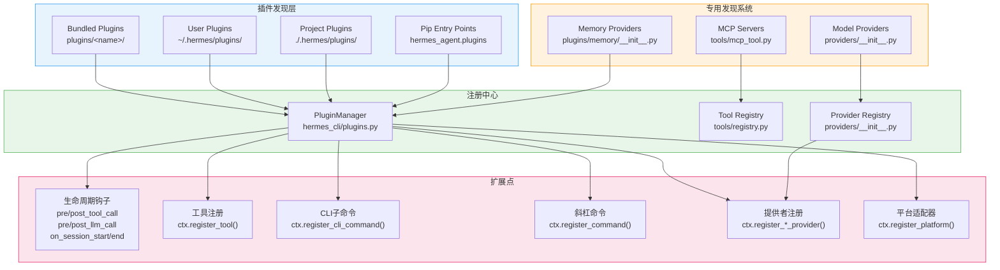
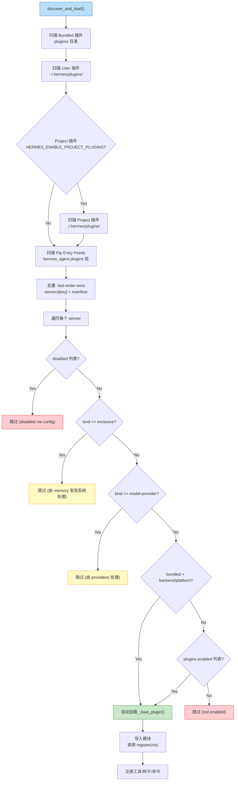
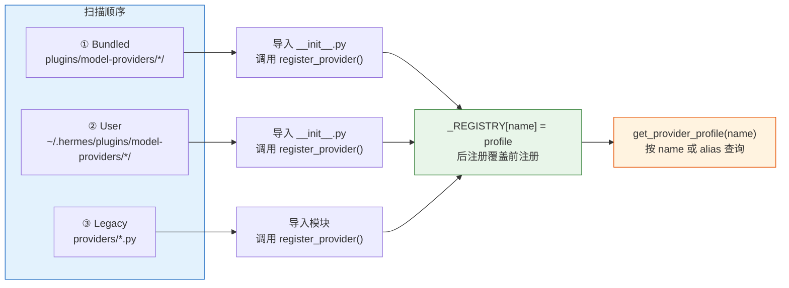
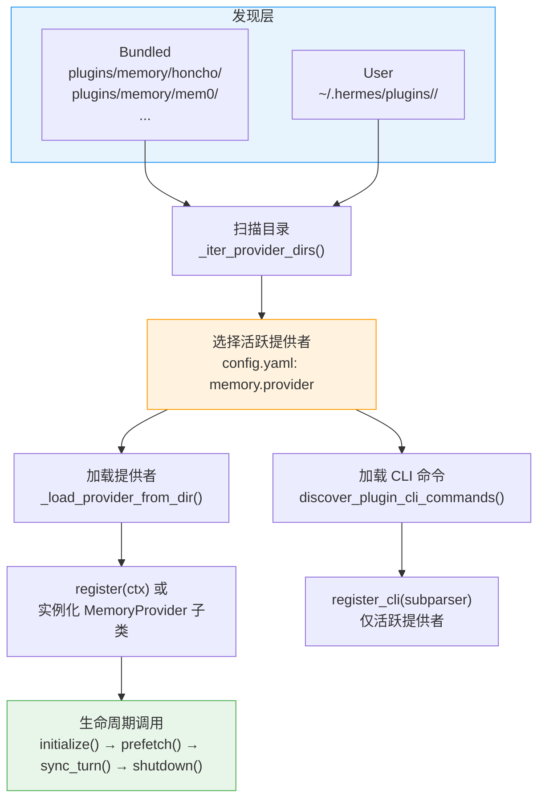
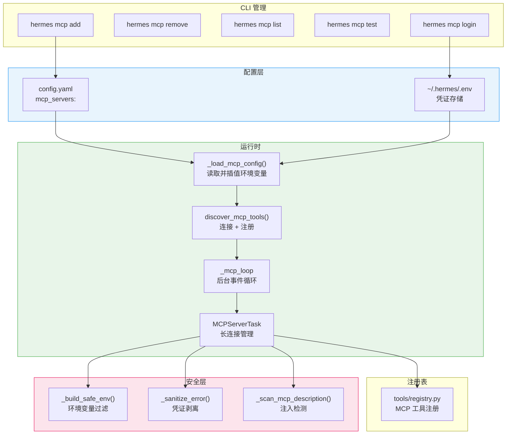
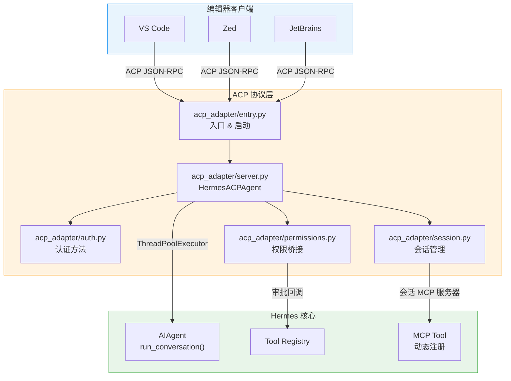
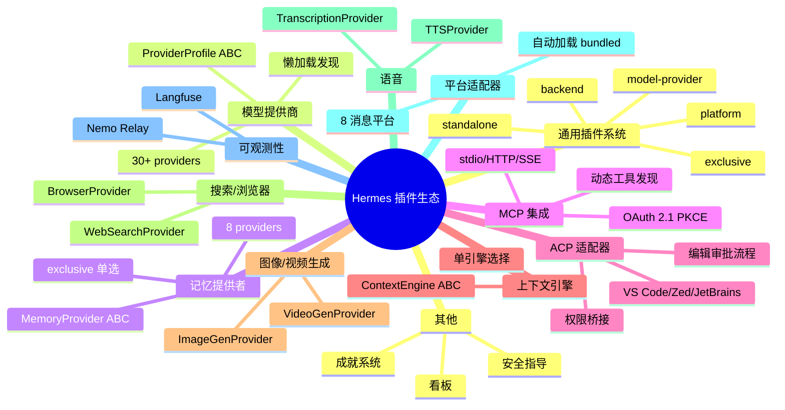
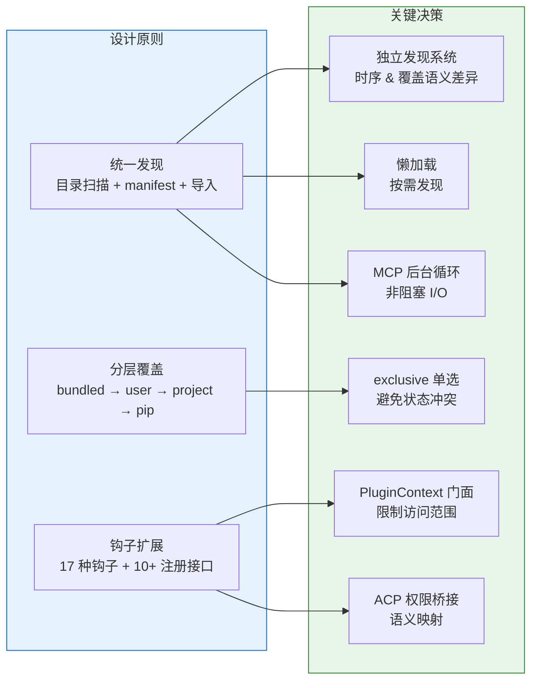

# Hermes Agent 插件与扩展机制

## 开篇概览

插件系统是 Hermes 的扩展骨架，通过统一的发现与注册机制实现无限扩展。Hermes 的插件架构采用"分层发现、统一注册、钩子驱动"的设计哲学：从文件系统目录到 pip entry points，从生命周期钩子到工具注册，每一层扩展点都经过精心设计，既保证了核心的稳定性，又赋予了第三方无限的定制能力。整个插件系统覆盖了工具、钩子、CLI命令、斜杠命令、模型提供商、记忆提供者、上下文引擎、图像/视频/语音/浏览器/搜索提供者、平台适配器、辅助任务等十余种扩展维度，形成了一个既统一又灵活的插件生态。

### 全景架构图



---

## 一、通用插件系统：hermes_cli/plugins.py

### 1.1 PluginManager 发现机制

`PluginManager` 是整个插件系统的中枢，负责从四个来源发现、加载和管理插件：

| 来源 | 路径 | 优先级 |
|------|------|--------|
| Bundled | `<repo>/plugins/<name>/` | 最低（可被覆盖） |
| User | `~/.hermes/plugins/<name>/` | 中 |
| Project | `./.hermes/plugins/<name>/` | 高（需 `HERMES_ENABLE_PROJECT_PLUGINS=1`） |
| Pip Entry Points | `hermes_agent.plugins` 组 | 最高 |

**关键设计决策**：后发现的源覆盖先发现的——用户插件可以替换内置插件，项目插件可以替换用户插件。这种"last-writer-wins"策略确保用户始终拥有最终控制权。

```python
# hermes_cli/plugins.py — discover_and_load() 核心逻辑
def discover_and_load(self, force: bool = False) -> None:
    manifests: List[PluginManifest] = []

    # 1. Bundled plugins
    bundled = self._scan_directory(repo_plugins, source="bundled",
        skip_names={"memory", "context_engine", "platforms", "model-providers"})
    manifests.extend(bundled)

    # 2. User plugins
    user_manifests = self._scan_directory(user_dir, source="user")
    manifests.extend(user_manifests)

    # 3. Project plugins (opt-in)
    if _env_enabled("HERMES_ENABLE_PROJECT_PLUGINS"):
        project_manifests = self._scan_directory(project_dir, source="project")
        manifests.extend(project_manifests)

    # 4. Pip entry-point plugins
    ep_manifests = self._scan_entry_points()
    manifests.extend(ep_manifests)

    # Dedup: later sources override earlier ones on key collision
    winners: Dict[str, PluginManifest] = {}
    for manifest in manifests:
        winners[manifest.key or manifest.name] = manifest
```

**为什么 memory、context_engine、platforms、model-providers 被跳过？** 因为它们拥有各自独立的发现系统——通用扫描器只处理 `standalone`、`backend`、`platform` 类型的插件，而 `exclusive`（记忆）和 `model-provider`（模型提供商）由专用子系统管理，避免双重加载导致状态冲突。

### 1.2 目录扫描与分类

`_scan_directory` 支持两种布局混合使用：

- **扁平布局**：`plugins/disk-cleanup/plugin.yaml` → key 为 `disk-cleanup`
- **分类布局**：`plugins/image_gen/openai/plugin.yaml` → key 为 `image_gen/openai`

分类布局的深度上限为 2 层，防止无限递归扫描。key 的设计确保了 `tts/openai` 和 `image_gen/openai` 不会碰撞，即使它们的 manifest `name` 都是 `openai`。

### 1.3 PluginManifest 与插件类型

```python
@dataclass
class PluginManifest:
    name: str
    kind: str = "standalone"  # standalone | backend | exclusive | platform | model-provider
    key: str = ""             # 路径派生的唯一标识
    source: str = ""          # "bundled" | "user" | "project" | "entrypoint"
```

五种插件类型决定了不同的加载策略：

| kind | 加载策略 | 示例 |
|------|---------|------|
| `standalone` | 需 `plugins.enabled` 显式启用 | disk-cleanup, spotify |
| `backend` | bundled 自动加载，user 需启用 | image_gen/openai, web/tavily |
| `exclusive` | 跳过通用加载，由专用系统管理 | memory/honcho |
| `platform` | bundled 自动加载，user 需启用 | platforms/discord |
| `model-provider` | 跳过通用加载，由 providers/ 管理 | model-providers/anthropic |

**自动类型推断**：当 `plugin.yaml` 未声明 `kind` 时，解析器会扫描 `__init__.py` 源码，检测 `register_memory_provider`/`MemoryProvider` 关键字自动归类为 `exclusive`，检测 `register_provider`/`ProviderProfile` 自动归类为 `model-provider`。这种启发式规则让旧插件无需修改 manifest 即可被正确路由。

### 1.4 生命周期钩子

```python
VALID_HOOKS: Set[str] = {
    "pre_tool_call", "post_tool_call",
    "pre_llm_call", "post_llm_call",
    "pre_api_request", "post_api_request", "api_request_error",
    "on_session_start", "on_session_end", "on_session_finalize", "on_session_reset",
    "transform_terminal_output", "transform_tool_result", "transform_llm_output",
    "subagent_start", "subagent_stop",
    "pre_gateway_dispatch",
    "pre_approval_request", "post_approval_response",
}
```

钩子调用的核心方法 `invoke_hook` 对每个回调做了独立的 try/except 隔离——一个行为异常的插件永远不会破坏核心 agent 循环：

```python
def invoke_hook(self, hook_name: str, **kwargs: Any) -> List[Any]:
    callbacks = self._hooks.get(hook_name, [])
    results: List[Any] = []
    for cb in callbacks:
        try:
            ret = cb(**kwargs)
            if ret is not None:
                results.append(ret)
        except Exception as exc:
            logger.warning("Hook '%s' callback %s raised: %s", hook_name, ...)
    return results
```

**`pre_tool_call` 的特殊语义**：该钩子支持"阻止"语义——插件返回 `{"action": "block", "message": "..."}` 即可拦截工具调用，第一个有效的阻止指令胜出。这为安全策略（速率限制、审批流程）提供了标准化的拦截点。

### 1.5 PluginContext 注册接口

`PluginContext` 是插件与宿主之间的门面（Facade），提供了丰富的注册能力：

| 方法 | 用途 |
|------|------|
| `register_tool()` | 注册工具到全局工具注册表 |
| `register_hook()` | 注册生命周期钩子回调 |
| `register_cli_command()` | 注册 CLI 子命令（如 `hermes honcho`） |
| `register_command()` | 注册会话内斜杠命令（如 `/lcm`） |
| `register_context_engine()` | 注册上下文引擎（仅允许一个） |
| `register_image_gen_provider()` | 注册图像生成后端 |
| `register_video_gen_provider()` | 注册视频生成后端 |
| `register_web_search_provider()` | 注册搜索/提取后端 |
| `register_browser_provider()` | 注册云浏览器后端 |
| `register_tts_provider()` | 注册 TTS 后端 |
| `register_transcription_provider()` | 注册语音识别后端 |
| `register_platform()` | 注册网关平台适配器 |
| `register_auxiliary_task()` | 注册辅助 LLM 任务 |
| `register_skill()` | 注册只读技能 |
| `register_dashboard_auth_provider()` | 注册仪表板认证提供者 |
| `inject_message()` | 向活跃会话注入消息 |
| `dispatch_tool()` | 通过注册表分派工具调用 |
| `llm` 属性 | 访问宿主拥有的 LLM 门面 |

**`register_tool` 的 override 参数**：当 `override=True` 时，插件可以替换同名内置工具（如用自定义 CDP 实现替换 `browser_navigate`）。不加此标志时，重复名称会被拒绝——这是防止意外覆盖的安全守卫。

### 1.6 发现时序陷阱

插件发现是**幂等**的——`discover_and_load()` 首次调用后设置 `_discovered = True`，后续调用直接返回。但 `force=True` 可以强制重新扫描，这在长生命周期会话中很有用（如配置变更后无需重启 agent）。

**陷阱**：由于 `exclusive` 和 `model-provider` 类型的插件由专用系统延迟加载，通用扫描器只记录 manifest 而不导入模块。如果通用扫描器也导入这些模块，会创建两个 `ProviderProfile` 实例，破坏"last-writer-wins"覆盖语义。这是一个微妙但关键的设计约束。

### 1.7 插件发现与加载流程图



---

## 二、模型提供商插件：plugins/model-providers/

### 2.1 ProviderProfile 注册体系

模型提供商插件是 Hermes 最丰富的插件类别之一，当前包含 30+ 个提供商（anthropic、openai、gemini、deepseek、ollama 等）。每个提供商通过 `ProviderProfile` 数据类声明其全部行为特征：

```python
# providers/base.py
@dataclass
class ProviderProfile:
    name: str                          # 提供商标识
    api_mode: str = "chat_completions" # API 模式
    aliases: tuple = ()                # 名称别名
    env_vars: tuple = ()               # 所需环境变量
    base_url: str = ""                 # API 端点
    auth_type: str = "api_key"         # 认证类型
    supports_vision: bool = False      # 是否支持图像
    fallback_models: tuple = ()        # 模型列表回退
    # ... 以及多个请求级行为钩子
```

`ProviderProfile` 是**声明式**的——它描述提供商的行为，不拥有客户端构建、凭证轮换或流式传输。这些职责留在 `AIAgent` 中。这种分离确保了配置与执行的清晰边界。

### 2.2 独立发现系统与懒加载

模型提供商拥有独立的发现系统（`providers/__init__.py`），与通用 `PluginManager` 完全解耦：

```python
# providers/__init__.py
_REGISTRY: dict[str, ProviderProfile] = {}
_ALIASES: dict[str, str] = {}
_discovered = False

def get_provider_profile(name: str) -> ProviderProfile | None:
    if not _discovered:
        _discover_providers()  # 懒加载：首次访问时才扫描
    canonical = _ALIASES.get(name, name)
    return _REGISTRY.get(canonical)
```

**为什么不用通用 PluginManager？** 两个原因：
1. **时序问题**：模型提供商在 agent 初始化之前就需要被查询（选择模型时），而通用插件发现发生在 agent 启动之后
2. **覆盖语义**：`register_provider()` 是"后注册覆盖前注册"，而通用系统是"先发现者胜出"——两者策略不同

### 2.3 扫描顺序与覆盖机制

```python
def _discover_providers() -> None:
    # 1. Bundled plugins — shipped with hermes-agent
    for child in sorted(_BUNDLED_PLUGINS_DIR.iterdir()):
        _import_plugin_dir(child, "bundled")

    # 2. User plugins — override bundled on name collision
    user_dir = _user_plugins_dir()
    if user_dir is not None:
        for child in sorted(user_dir.iterdir()):
            _import_plugin_dir(child, "user")

    # 3. Legacy single-file profiles (backward compat)
    for _importer, modname, _ispkg in pkgutil.iter_modules(_pkg.__path__):
        importlib.import_module(f"providers.{modname}")
```

**扫描顺序 bundled → user → legacy**，配合 `register_provider()` 的覆盖语义，确保用户插件可以替换任何内置配置——第三方可以 monkey-patch 或替换内置 profile 而无需修改仓库代码。

### 2.4 模型提供商发现与覆盖机制图



---

## 三、记忆提供者插件：plugins/memory/

### 3.1 MemoryProvider ABC 实现

记忆提供者是一个 `exclusive` 类型的插件——同一时刻只能有一个活跃的记忆提供者。`MemoryProvider` 抽象基类定义了完整的生命周期接口：

```python
# agent/memory_provider.py
class MemoryProvider(ABC):
    @property
    @abstractmethod
    def name(self) -> str: ...

    @abstractmethod
    def is_available(self) -> bool: ...

    @abstractmethod
    def initialize(self, session_id: str, **kwargs) -> None: ...

    @abstractmethod
    def get_tool_schemas(self) -> List[Dict[str, Any]]: ...

    # 可选钩子
    def prefetch(self, query: str, *, session_id: str = "") -> str: ...
    def sync_turn(self, user_content, assistant_content, ...) -> None: ...
    def on_session_end(self, messages) -> None: ...
    def on_session_switch(self, new_session_id, ...) -> None: ...
    def on_pre_compress(self, messages) -> str: ...
    def on_memory_write(self, action, target, content, metadata=None) -> None: ...
```

当前内置了 8 个记忆提供者：hindsight、honcho、mem0、holographic、byterover、supermemory、openviking、retaindb。

### 3.2 独立发现与选择机制

记忆提供者的发现系统（`plugins/memory/__init__.py`）同样独立于通用 PluginManager：

```python
def _iter_provider_dirs() -> List[Tuple[str, Path]]:
    seen: set = set()
    dirs: List[Tuple[str, Path]] = []

    # 1. Bundled providers (plugins/memory/<name>/)
    for child in sorted(_MEMORY_PLUGINS_DIR.iterdir()):
        if _is_valid_provider_dir(child):
            seen.add(child.name)
            dirs.append((child.name, child))

    # 2. User-installed providers
    for child in sorted(user_dir.iterdir()):
        if child.name not in seen and _is_memory_provider_dir(child):
            dirs.append((child.name, child))
    return dirs
```

**与模型提供商的关键区别**：记忆提供者采用"先发现者胜出"（bundled 优先），而模型提供商采用"后注册覆盖前注册"（user 优先）。这是因为记忆提供者是 exclusive 的——只能有一个活跃，bundled 版本经过充分测试，优先使用更安全。

### 3.3 CLI 命令注册：仅活跃提供者暴露

```python
def discover_plugin_cli_commands() -> List[dict]:
    active_provider = _get_active_memory_provider()  # 从 config.yaml 读取
    if not active_provider:
        return results  # 无活跃提供者 → 无 CLI 命令

    # 只加载活跃提供者的 cli.py
    cli_file = plugin_dir / "cli.py"
    register_cli = getattr(cli_mod, "register_cli", None)
    ...
```

**设计精髓**：只有被 `memory.provider` 配置选中的提供者才会暴露 CLI 命令。这避免了多个记忆提供者注册冲突的 CLI 子命令，同时保持了 lazy loading——`cli.py` 是轻量级的，不需要加载完整的 SDK 依赖。

### 3.4 记忆提供者插件架构图



---

## 四、MCP 集成

### 4.1 MCP 工具：tools/mcp_tool.py

MCP（Model Context Protocol）集成是 Hermes 扩展外部工具能力的核心通道。`mcp_tool.py` 实现了完整的 MCP 客户端，支持三种传输方式：

| 传输方式 | 配置键 | 说明 |
|----------|--------|------|
| stdio | `command` + `args` | 启动子进程，通过 stdin/stdout 通信 |
| HTTP/StreamableHTTP | `url` | 连接远程 MCP 服务器 |
| SSE | `url` + `transport: sse` | 使用 Server-Sent Events 协议 |

**架构设计**：MCP 运行在专用的后台事件循环（`_mcp_loop`）中，每个 MCP 服务器作为长期存活的 asyncio Task 运行，保持传输上下文活跃。工具调用通过 `run_coroutine_threadsafe()` 调度到后台循环。

```python
# tools/mcp_tool.py — 核心发现入口
def discover_mcp_tools() -> List[str]:
    """从 config.yaml 加载 MCP 服务器配置，连接并注册工具。"""
    servers = _load_mcp_config()  # 读取 mcp_servers 配置
    return register_mcp_servers(servers)

def register_mcp_servers(servers: Dict[str, dict]) -> List[str]:
    """连接到 MCP 服务器并注册其工具到全局注册表。"""
    # 并行连接所有新服务器
    async def _discover_all():
        results = await asyncio.gather(
            *(_discover_one(name, cfg) for name, cfg in new_servers.items()),
            return_exceptions=True,
        )
```

**安全防护**：
- `_build_safe_env()` 过滤 stdio 子进程的环境变量，只传递安全基线变量
- `_sanitize_error()` 在返回给 LLM 之前剥离错误信息中的凭证模式
- `_scan_mcp_description()` 扫描 MCP 工具描述中的提示注入模式

### 4.2 MCP 配置：hermes_cli/mcp_config.py

`mcp_config.py` 实现了 `hermes mcp` 子命令的完整生命周期管理：

| 子命令 | 功能 |
|--------|------|
| `add` | 添加 MCP 服务器，支持发现式工具选择 |
| `remove` | 移除服务器配置及 OAuth 令牌 |
| `list` | 列出所有已配置的服务器 |
| `test` | 测试连接并展示可用工具 |
| `configure` | 重新配置已启用工具 |
| `login` | 重新认证 OAuth 服务器 |

**发现式工具选择**：`hermes mcp add` 先连接服务器列出工具，再让用户选择启用哪些——这比"全部启用再排除"更安全，避免了意外暴露危险工具。

### 4.3 MCP OAuth 管理

MCP 集成支持 OAuth 2.1 PKCE 认证流程，通过 `tools/mcp_oauth.py` 和 `tools/mcp_oauth_manager.py` 管理：
- 动态客户端注册（RFC 7591）
- 令牌缓存与自动刷新
- `hermes mcp login` 强制重新认证

### 4.4 MCP 集成架构图



---

## 五、ACP 适配器：acp_adapter/

### 5.1 ACP 协议与编辑器集成

ACP（Agent Client Protocol）适配器将 Hermes Agent 暴露为 ACP 标准服务器，使其能被 VS Code、Zed、JetBrains 等编辑器直接调用。核心类 `HermesACPAgent` 继承自 `acp.Agent`，实现了完整的 ACP 生命周期：

```python
# acp_adapter/server.py
class HermesACPAgent(acp.Agent):
    async def initialize(self, ...) -> InitializeResponse: ...
    async def authenticate(self, method_id, ...) -> AuthenticateResponse: ...
    async def new_session(self, cwd, mcp_servers, ...) -> NewSessionResponse: ...
    async def prompt(self, prompt, session_id, ...) -> PromptResponse: ...
    async def cancel(self, session_id, ...) -> None: ...
    async def set_session_model(self, model_id, ...) -> SetSessionModelResponse: ...
    async def set_session_mode(self, mode_id, ...) -> SetSessionModeResponse: ...
```

### 5.2 认证机制

```python
# acp_adapter/auth.py
def build_auth_methods() -> list[Any]:
    methods = []
    provider = detect_provider()
    if provider:
        methods.append(AuthMethodAgent(id=provider, ...))  # 运行时凭证
    methods.append(TerminalAuthMethod(id="hermes-setup", ...))  # 终端设置
    return methods
```

ACP 支持两种认证方式：
1. **运行时凭证**：如果 Hermes 已配置提供商凭证，直接使用
2. **终端设置**：通过 `--setup` 参数启动交互式模型/提供商配置

### 5.3 编辑审批流程

ACP 适配器实现了精细的编辑审批策略，映射到 ACP 的 session mode：

| Mode | 审批策略 | 说明 |
|------|---------|------|
| Default | `ask` | 每次编辑前询问 |
| Accept Edits | `workspace_session` | 自动允许工作区编辑，敏感路径仍需询问 |
| Don't Ask | `session` | 会话内自动允许，敏感路径除外 |

### 5.4 权限管理

```python
# acp_adapter/permissions.py
def make_approval_callback(request_permission_fn, loop, session_id, timeout=60.0):
    """创建 Hermes 兼容的审批回调，桥接到 ACP 权限请求。"""
    def _callback(command, description, *, allow_permanent=True, **_):
        options = _build_permission_options(allow_permanent=allow_permanent)
        tool_call = _build_permission_tool_call(command, description)
        coro = request_permission_fn(session_id=session_id, tool_call=tool_call, options=options)
        future = safe_schedule_threadsafe(coro, loop, ...)
        response = future.result(timeout=timeout)
        return _map_outcome_to_hermes(response.outcome, ...)
    return _callback
```

权限回调将 Hermes 的审批语义（once/session/always/deny）映射到 ACP 的 `PermissionOption` 体系，实现了跨协议的审批桥接。超时自动拒绝（60s）防止编辑器无响应时 agent 无限等待。

### 5.5 会话管理与 MCP 动态注册

ACP 支持在 `new_session`/`load_session`/`resume_session` 时传入 `mcp_servers`，适配器会动态注册这些 MCP 服务器并刷新工具表面：

```python
async def _register_session_mcp_servers(self, state, mcp_servers):
    config_map = {}
    for server in mcp_servers:
        if isinstance(server, McpServerStdio):
            config = {"command": server.command, "args": list(server.args), ...}
        else:
            config = {"url": server.url, "headers": ...}
        config_map[name] = config
    await asyncio.to_thread(register_mcp_servers, config_map)
```

### 5.6 ACP 适配器架构图



---

## 六、其他插件类型

### 6.1 上下文引擎插件：plugins/context_engine/

上下文引擎控制对话上下文在接近模型 token 限制时的管理策略。默认实现是 `ContextCompressor`（摘要压缩），第三方引擎（如 LCM）可以通过插件替换：

```python
# agent/context_engine.py
class ContextEngine(ABC):
    @property
    @abstractmethod
    def name(self) -> str: ...

    @abstractmethod
    def should_compress(self, messages, ...) -> bool: ...

    @abstractmethod
    def compress(self, messages, ...) -> tuple: ...
```

选择通过 `context.engine` 配置键驱动，只允许一个活跃引擎。插件通过 `ctx.register_context_engine()` 注册。

### 6.2 图像生成插件：plugins/image_gen/

当前内置 5 个图像生成后端：fal、krea、openai、openai-codex、xai。每个后端实现 `ImageGenProvider` ABC，通过 `image_gen.provider` 配置键选择。

### 6.3 看板插件：plugins/kanban/

看板插件提供任务管理能力，包含 Web 仪表板（`dashboard/`）和 systemd 服务（`systemd/`），支持任务创建、分配和追踪。

### 6.4 可观测性插件：plugins/observability/

内置两个可观测性后端：
- **langfuse**：集成 Langfuse 追踪平台
- **nemo_relay**：NVIDIA Nemo 监控中继

### 6.5 平台适配器插件：plugins/platforms/

网关平台适配器让 Hermes 可以接入各种消息平台。当前内置 8 个：discord、google_chat、irc、line、mattermost、ntfy、simplex、teams。bundled 平台适配器自动加载，确保每个 Hermes 附带的平台开箱即用。

### 6.6 其他值得注意的插件

| 插件 | 类型 | 说明 |
|------|------|------|
| browser/ | backend | 云浏览器后端（browser_use、browserbase、firecrawl） |
| web/ | backend | 搜索/提取后端（brave_free、ddgs、exa、tavily 等 8 个） |
| video_gen/ | backend | 视频生成后端（fal、xai） |
| dashboard_auth/ | backend | 仪表板认证提供者（basic、nous、self_hosted） |
| disk-cleanup/ | standalone | 磁盘清理工具 |
| spotify/ | standalone | Spotify 集成 |
| google_meet/ | standalone | Google Meet 集成 |
| security-guidance/ | standalone | 安全指导模式 |
| teams_pipeline/ | standalone | Teams 流水线集成 |
| hermes-achievements/ | standalone | 成就系统 |

### 6.7 插件类型全景图



---

## 收束总结

### 设计精髓

Hermes 插件系统的设计精髓可以概括为三个核心原则：

1. **统一发现**：所有插件类型共享相同的发现框架——目录扫描 + manifest 解析 + 模块导入。但每种类型又有独立的发现时机和加载策略，避免了"一刀切"的僵化。

2. **分层覆盖**：bundled → user → project → entry-point 的优先级链，配合"last-writer-wins"或"first-seen-wins"策略，让用户始终拥有最终控制权，同时保证内置插件的可靠性。

3. **钩子扩展**：17 种生命周期钩子 + 10+ 种注册接口，覆盖了从工具调用到 API 请求、从会话管理到审批流程的每一个扩展点。每个钩子都有独立的错误隔离，确保插件异常不会影响核心循环。

**为什么这样设计？**

- **独立发现系统**而非统一加载：因为不同插件类型有不同的时序需求（模型提供商在 agent 初始化前就需要，记忆提供者在会话开始时才加载）和不同的覆盖语义（模型提供商 user 优先，记忆提供者 bundled 优先）
- **exclusive 类型**而非多实例：记忆提供者涉及持久化状态和工具 schema，多实例会导致 schema 膨胀和状态冲突
- **PluginContext 门面模式**而非直接访问：限制了插件的访问范围，防止插件直接操作 agent 内部状态，同时为未来 API 演进保留了灵活性
- **MCP 后台事件循环**而非同步连接：MCP 服务器是 I/O 密集型的长连接，同步操作会阻塞 agent 主循环
- **ACP 权限桥接**而非直接暴露：Hermes 的审批语义（once/session/always）与 ACP 的 PermissionOption 体系不同，需要映射层确保语义一致性

### 设计决策总结图


