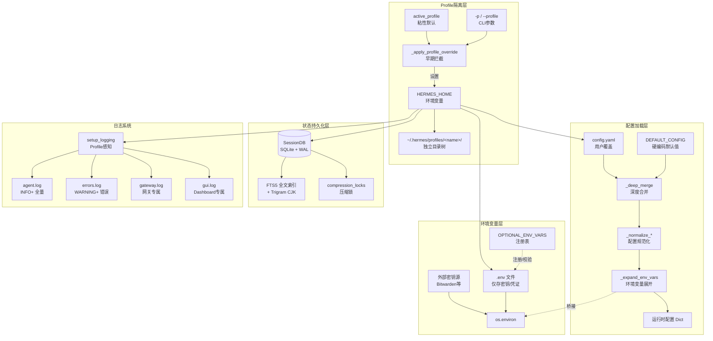
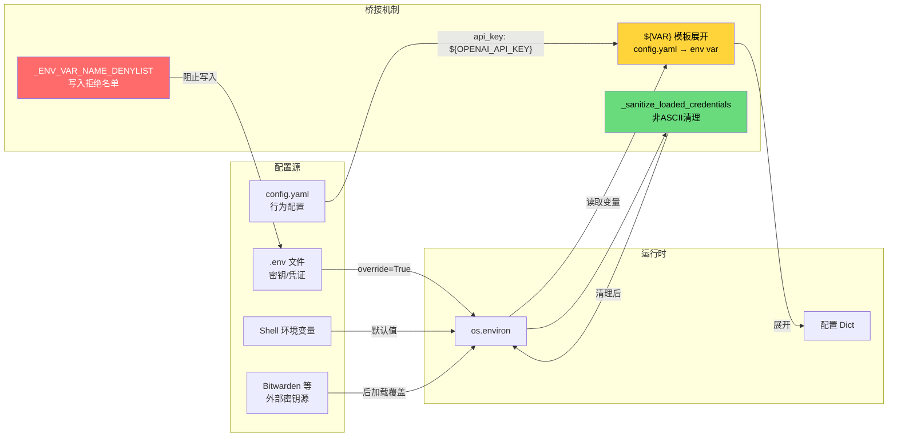
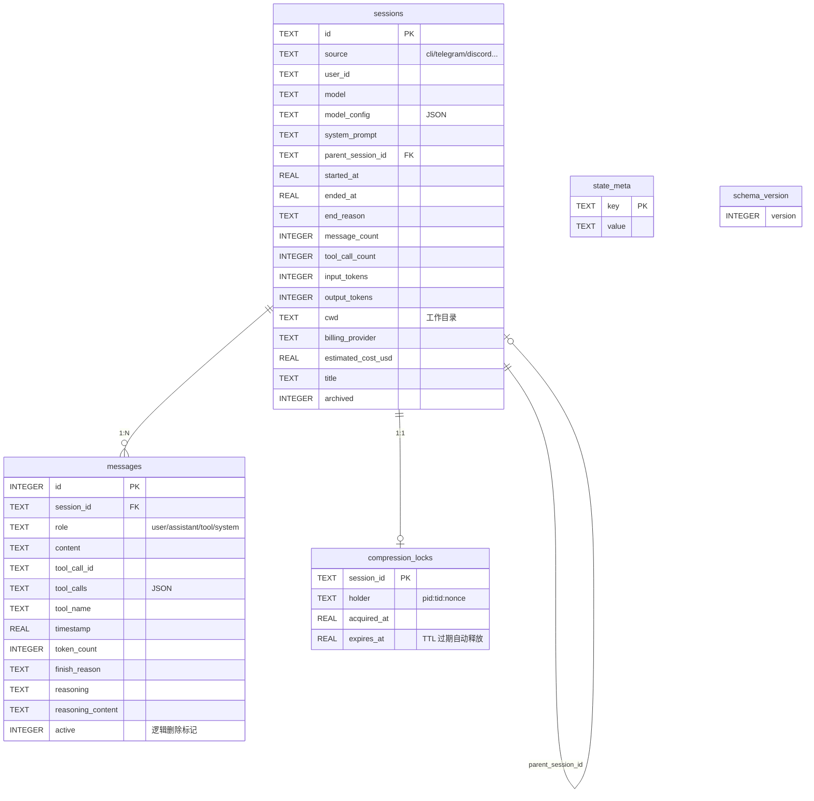
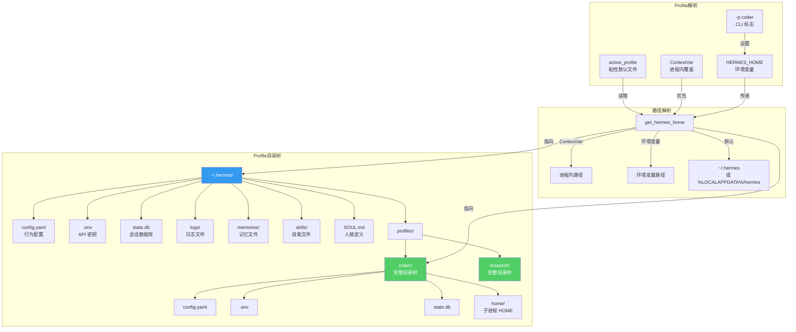
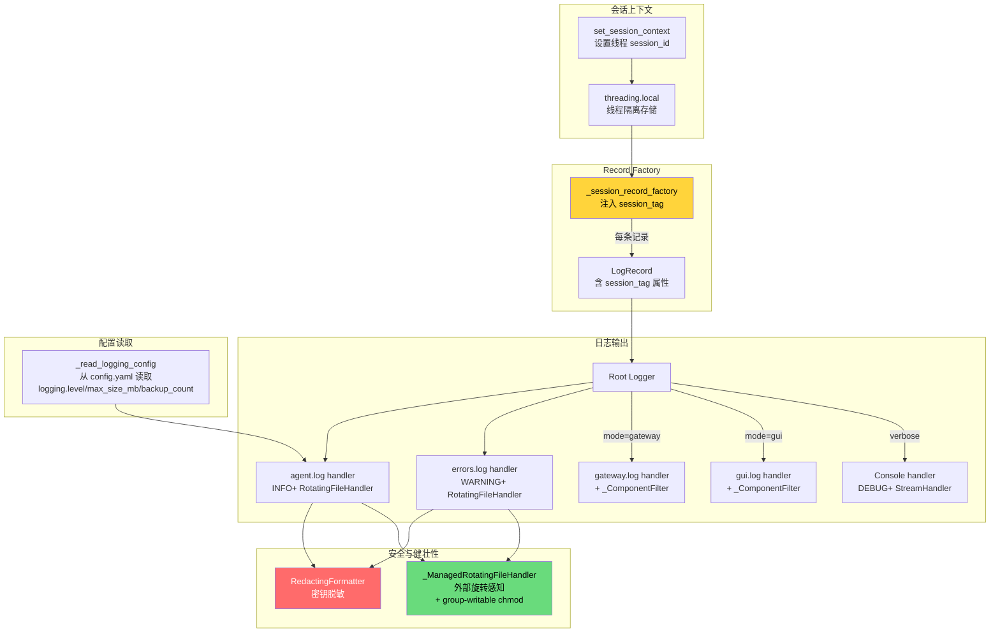

# 08 - 配置与状态管理

## 开篇概览

配置与状态是 Hermes Agent 的神经系统——配置决定了 Agent "如何思考与行动"，状态记录了 Agent "做了什么"。Profile 隔离机制则是 Hermes 多实例支持的基石，使得同一台机器上可以并行运行多个完全独立的 Agent 实例，各自拥有独立的配置、密钥、会话和记忆，互不干扰。整个系统围绕三条核心原则构建：**三层加载器**（默认配置 → YAML 用户覆盖 → 环境变量展开）确保配置既有合理默认值又可灵活定制；**密钥分离**（.env 仅存密钥、config.yaml 存行为配置）将敏感凭证与行为参数解耦；**Profile 隔离**（每个 Profile 是一个完整的 HERMES_HOME 目录）实现了真正的多租户支持。

### 全景架构图



---

## 一、配置系统

### 1.1 三层配置加载器

Hermes 的配置加载遵循"默认值 → 用户覆盖 → 环境变量展开"的三层架构，核心实现在 `hermes_cli/config.py` 的 `load_config()` 函数中：

**第一层：DEFAULT_CONFIG 硬编码默认值**

`DEFAULT_CONFIG`（`hermes_cli/config.py:802`）是一个超过 700 行的巨型字典，定义了 Hermes 所有配置段的默认值：

```python
DEFAULT_CONFIG = {
    "model": "",
    "providers": {},
    "fallback_providers": [],
    "toolsets": ["hermes-cli"],
    "agent": {
        "max_turns": 90,
        "gateway_timeout": 1800,
        "api_max_retries": 3,
        "tool_use_enforcement": "auto",
        # ... 更多 agent 行为参数
    },
    "terminal": {
        "backend": "local",
        "timeout": 180,
        "docker_image": "nikolaik/python-nodejs:python3.11-nodejs20",
        # ... 终端/沙箱配置
    },
    "compression": {
        "enabled": True,
        "threshold": 0.50,
        "target_ratio": 0.20,
        "protect_last_n": 20,
    },
    "display": { ... },      # 显示/交互配置
    "browser": { ... },      # 浏览器工具配置
    "auxiliary": { ... },    # 辅助模型配置
    "openrouter": { ... },   # OpenRouter 专属配置
    "bedrock": { ... },      # AWS Bedrock 配置
    # ... 更多顶层配置段
}
```

**为什么这样设计？** 将所有默认值集中定义而非分散在各消费模块，确保了配置的**单一事实来源**（Single Source of Truth）。任何模块需要配置时，只需从 `load_config()` 的返回值中读取，无需关心默认值是什么——默认值永远在 `DEFAULT_CONFIG` 中维护。这也使得 `hermes config` 命令可以完整展示所有可配置项。

**第二层：config.yaml 用户覆盖**

用户通过 `~/.hermes/config.yaml`（Profile 感知路径）覆盖默认值。加载时通过 `_deep_merge()` 实现递归合并：

```python
# hermes_cli/config.py:4771
def _deep_merge(base: dict, override: dict) -> dict:
    """递归合并 override 到 base，保留嵌套默认值。"""
    result = base.copy()
    for key, value in override.items():
        if (
            key in result
            and isinstance(result[key], dict)
            and isinstance(value, dict)
        ):
            result[key] = _deep_merge(result[key], value)
        else:
            result[key] = value
    return result
```

**深度合并的关键意义**：用户只需覆盖想改的部分。例如用户只想修改 `compression.threshold`，无需写出整个 `compression` 段——`_deep_merge` 会保留 `compression.enabled`、`compression.target_ratio` 等未覆盖的默认值。这种"部分覆盖"设计极大降低了用户配置的心智负担。

**第三层：环境变量展开**

`_expand_env_vars()`（`hermes_cli/config.py:4791`）递归展开配置值中的 `${VAR}` 引用：

```python
def _expand_env_vars(obj):
    """递归展开 ${VAR} 引用。未解析的引用保留原样。"""
    if isinstance(obj, str):
        return re.sub(
            r"\${([^}]+)}",
            lambda m: os.environ.get(m.group(1), m.group(0)),
            obj,
        )
    if isinstance(obj, dict):
        return {k: _expand_env_vars(v) for k, v in obj.items()}
    if isinstance(obj, list):
        return [_expand_env_vars(item) for item in obj]
    return obj
```

这允许用户在 `config.yaml` 中写 `api_key: ${OPENAI_API_KEY}`，运行时自动从环境变量取值——**密钥不落盘于 config.yaml**，实现了密钥与配置的分离。

### 1.2 配置加载与合并流程

```mermaid
flowchart TD
    A[调用 load_config] --> B{缓存命中？}
    B -->|mtime+size 未变| C[返回 deepcopy 缓存]
    B -->|未命中/已变| D[deepcopy DEFAULT_CONFIG]
    D --> E{config.yaml 存在？}
    E -->|否| G[_normalize_root_model_keys]
    E -->|是| F[yaml.safe_load 读取用户配置]
    F -->|解析失败| FW[_warn_config_parse_failure<br/>备份损坏文件]
    FW --> G
    F -->|成功| H[_deep_merge<br/>默认值 + 用户覆盖]
    H --> G
    G --> I[_normalize_max_turns_config<br/>兼容旧版 max_turns]
    I --> J[_expand_env_vars<br/>展开 ${VAR} 引用]
    J --> K[存入 _LOAD_CONFIG_CACHE<br/>key=路径+mtime+size]
    K --> L[返回展开后的配置 Dict]

    style FW fill:#ff6b6b,color:#fff
    style C fill:#51cf66,color:#fff
    style L fill:#339af0,color:#fff
```

**缓存机制**：`_LOAD_CONFIG_CACHE` 以 `(path, mtime_ns, size)` 为键缓存展开后的配置。由于 `save_config()` 使用 `atomic_yaml_write`（创建新 inode），stat 的 mtime_ns 会变化，缓存自动失效——无需显式失效钩子。

**只读优化**：`load_config_readonly()` 跳过 deepcopy，直接返回缓存对象。在 Agent 循环的热路径（如 `get_provider_request_timeout` 每轮 API 调用都读取）中，省去了 ~135μs 的 deepcopy 开销和 GC 压力。

**损坏容错**：当 `config.yaml` 解析失败时，系统回退到 `DEFAULT_CONFIG` 并：
1. 通过 `_backup_corrupt_config()` 将损坏文件备份为 `config.yaml.corrupt.<ts>.bak`
2. 通过 `_warn_config_parse_failure()` 在 stderr 和 errors.log 中警告
3. 按 `(path, mtime_ns, size)` 去重，同一损坏文件只警告一次

### 1.3 配置版本迁移

`migrate_config()`（`hermes_cli/config.py:4176`）实现了配置的向前兼容迁移，当前 `SCHEMA_VERSION = 14`（在 `hermes_state.py` 中定义，此处为配置版本）。迁移示例：

- **v3→v4**：将 `HERMES_TOOL_PROGRESS` 环境变量迁移到 `display.tool_progress` 配置段
- **v4→v5**：添加 `timezone` 字段，从 `HERMES_TIMEZONE` 环境变量迁移
- **v8→v9**：清除废弃的 `ANTHROPIC_TOKEN` 环境变量
- **v11→v12**：将 `custom_providers` 列表格式迁移为 `providers` 字典格式

**设计哲学**：迁移始终是向前兼容的——旧版配置在新版中仍可工作，迁移是渐进式的。每次迁移只处理一个版本跨度，确保迁移链的每一步都是可验证的。

### 1.4 顶层配置段一览

| 配置段 | 职责 | 关键配置项 |
|--------|------|-----------|
| `model` | 主模型选择 | `default`, `provider` |
| `providers` | 模型提供商定义 | 自定义 provider 的 base_url/api_key |
| `agent` | Agent 行为参数 | `max_turns`, `gateway_timeout`, `tool_use_enforcement` |
| `terminal` | 终端/沙箱配置 | `backend`, `docker_image`, `container_memory` |
| `compression` | 上下文压缩策略 | `enabled`, `threshold`, `target_ratio` |
| `display` | 显示/交互配置 | `streaming`, `tool_progress`, `platforms` |
| `browser` | 浏览器工具 | `inactivity_timeout`, `engine`, `camofox` |
| `auxiliary` | 辅助模型配置 | `vision`, `compression`, `title_generation` 等 |
| `openrouter` | OpenRouter 专属 | `response_cache`, `min_coding_score` |
| `bedrock` | AWS Bedrock | `region`, `discovery`, `guardrail` |
| `security` | 安全配置 | `redact_secrets` |
| `checkpoints` | 文件检查点 | `enabled`, `max_snapshots` |
| `tool_output` | 工具输出截断 | `max_bytes`, `max_lines` |

---

## 二、环境变量管理

### 2.1 .env 文件：密钥的专属领地

Hermes 严格遵循**密钥与配置分离**原则：`config.yaml` 存行为配置，`.env` 文件仅存 API 密钥和凭证。`.env` 文件位于 `{HERMES_HOME}/.env`，由 `hermes_cli/env_loader.py` 的 `load_hermes_dotenv()` 加载：

```python
# hermes_cli/env_loader.py:212
def load_hermes_dotenv(
    *,
    hermes_home: str | os.PathLike | None = None,
    project_env: str | os.PathLike | None = None,
) -> list[Path]:
    """加载 Hermes 环境文件，用户配置优先于 shell 环境变量。"""
    # 用户 .env 覆盖 stale shell 值
    if user_env.exists():
        _load_dotenv_with_fallback(user_env, override=True)
    # 项目 .env 仅填充缺失值
    if project_env_path and project_env_path.exists():
        _load_dotenv_with_fallback(project_env_path, override=not loaded)
    # 外部密钥源（Bitwarden 等）
    _apply_external_secret_sources(home_path)
```

**优先级链**：shell 环境变量 < 项目 `.env` < 用户 `.env` < 外部密钥源。用户 `.env` 使用 `override=True`，确保覆盖 stale 的 shell 导出值；项目 `.env` 仅在用户 `.env` 不存在时才覆盖 shell 值。

### 2.2 OPTIONAL_ENV_VARS 注册表

`OPTIONAL_ENV_VARS`（`hermes_cli/config.py:2410`）是一个注册表字典，记录了 Hermes 知道的所有可选环境变量及其元数据：

```python
OPTIONAL_ENV_VARS = {
    "OPENROUTER_API_KEY": {
        "description": "OpenRouter API key",
        "prompt": "OpenRouter API key",
        "url": "https://openrouter.ai/keys",
        "password": True,           # 敏感值，输入时遮蔽
        "tools": ["vision_analyze", "mixture_of_agents"],
        "category": "provider",
        "advanced": True,
    },
    "GOOGLE_API_KEY": { ... },
    "GEMINI_API_KEY": { ... },
    # ... 数百个注册项
}
```

每个注册项包含：`description`（描述）、`prompt`（设置向导提示语）、`url`（获取密钥的链接）、`password`（是否为敏感值）、`category`（分类）、`advanced`（是否高级选项）。这个注册表不仅用于 `hermes setup` 向导的交互式配置，还用于 `.env` 文件的校验和清理。

**动态扩展**：`_inject_provider_profile_env_vars()` 和 `_inject_plugin_env_vars()` 在模块导入时将 provider 配置文件和插件清单中声明的环境变量注入到 `OPTIONAL_ENV_VARS`，确保第三方扩展的环境变量也能被系统识别。

### 2.3 环境变量写入安全：拒绝名单

`_ENV_VAR_NAME_DENYLIST`（`hermes_cli/config.py:180`）是一个安全拒绝名单，阻止通过 `save_env_value()` 写入可能被利用的环境变量：

```python
_ENV_VAR_NAME_DENYLIST: frozenset[str] = frozenset({
    # 动态链接器 — 注入恶意 .so
    "LD_PRELOAD", "LD_LIBRARY_PATH", "DYLD_INSERT_LIBRARIES",
    # Python 解释器 — 代码注入
    "PYTHONPATH", "PYTHONHOME", "PYTHONSTARTUP",
    # Node 解释器
    "NODE_OPTIONS", "NODE_PATH",
    # 通用命令注入
    "PATH", "SHELL", "BROWSER", "EDITOR", "VISUAL",
    # Hermes 运行时位置 — 不能通过 .env 重定位
    "HERMES_HOME", "HERMES_PROFILE", "HERMES_CONFIG",
})
```

**为什么这样设计？** Dashboard 的环境变量写入功能是面向非特权用户的 Web 界面。如果不加限制，攻击者可以通过写入 `LD_PRELOAD` 或 `PYTHONPATH` 实现远程代码执行——Hermes 的每个子进程都会继承这些环境变量。拒绝名单采用**枚举而非通配**策略（`HERMES_*` 不是全量拒绝），因为许多合法的集成凭证也使用该前缀（如 `HERMES_GEMINI_CLIENT_ID`）。

### 2.4 环境变量与配置关系图



### 2.5 凭证安全处理

`_sanitize_loaded_credentials()`（`hermes_cli/env_loader.py:102`）在 `.env` 加载后自动清理凭证值中的非 ASCII 字符——这通常是从 PDF 或富文本编辑器复制粘贴时引入的 Unicode 伪装字符（如 `ʋ` U+028B 替代 `v`），会导致 "invalid API key" 错误。

`_preserve_env_ref_templates()`（`hermes_cli/config.py:4826`）在保存配置时保留原始的 `${VAR}` 模板——如果用户在 `config.yaml` 中写了 `api_key: ${OPENAI_API_KEY}`，运行时展开为实际密钥值后，保存配置时不会将明文密钥写回文件，而是恢复原始模板引用。

---

## 三、状态持久化 — hermes_state.py

### 3.1 SessionDB 架构

`SessionDB`（`hermes_state.py:376`）是 Hermes 的核心状态存储，基于 SQLite + WAL 模式，提供会话持久化、消息历史和全文搜索能力：

```python
class SessionDB:
    """SQLite 会话存储，支持 FTS5 全文搜索。
    
    线程安全：适配 gateway 多读一写模式（WAL）。
    每个方法打开自己的 cursor。
    """
    _WRITE_MAX_RETRIES = 15       # 写冲突最大重试次数
    _WRITE_RETRY_MIN_S = 0.020    # 最小退避 20ms
    _WRITE_RETRY_MAX_S = 0.150    # 最大退避 150ms
    _CHECKPOINT_EVERY_N_WRITES = 50  # 每50次写做一次 WAL checkpoint
```

**WAL 模式与 NFS 兼容**：`apply_wal_with_fallback()` 尝试设置 `journal_mode=WAL`，在 NFS/SMB 等不支持 WAL 的文件系统上自动回退到 `DELETE` 模式，并按 `(process, db_label)` 去重警告，避免 kanban 等高频操作刷屏。

### 3.2 数据模型



**sessions 表**：记录会话元数据，包括模型配置、token 用量、计费信息、工作目录等。`parent_session_id` 支持压缩产生的会话链（压缩时旧会话成为父会话，新会话继承其上下文摘要）。

**messages 表**：存储完整消息历史。`active` 字段实现逻辑删除——压缩时旧消息标记为 `active=0` 而非物理删除，保留审计轨迹。

**compression_locks 表**：压缩锁，防止多个压缩进程同时操作同一会话。

### 3.3 FTS5 全文搜索

Hermes 构建了两个 FTS5 虚拟表以支持跨会话的全文搜索：

1. **messages_fts**：使用默认 `unicode61` 分词器，适合英文和空格分隔的语言
2. **messages_fts_trigram**：使用 `trigram` 分词器，支持 CJK 子串搜索

```sql
-- 标准 FTS5 索引
CREATE VIRTUAL TABLE messages_fts USING fts5(content);

-- Trigram FTS5 索引（CJK 子串搜索）
CREATE VIRTUAL TABLE messages_fts_trigram USING fts5(
    content,
    tokenize='trigram'
);
```

**为什么需要两个索引？** `unicode61` 分词器将 CJK 字符拆分为单字 token，破坏了短语匹配；`trigram` 分词器创建重叠的 3 字节序列，使子串查询对任何文字系统都能原生工作。代价是 trigram 索引体积更大，但搜索质量显著提升。

FTS 索引通过触发器自动维护——INSERT/UPDATE/DELETE 消息时同步更新两个 FTS 表。当 FTS5 不可用时（如 Python 编译时未启用），系统优雅降级，仅禁用搜索功能。

### 3.4 压缩锁机制

`try_acquire_compression_lock()`（`hermes_state.py:1032`）实现了基于数据库的分布式锁：

```python
def try_acquire_compression_lock(
    self, session_id: str, holder: str, ttl_seconds: float = 300.0
) -> bool:
    """原子获取压缩锁。过期锁自动回收。"""
    # 1. 删除过期锁
    conn.execute(
        "DELETE FROM compression_locks WHERE session_id = ? AND expires_at < ?",
        (session_id, now),
    )
    # 2. 尝试插入（INSERT OR IGNORE 避免冲突）
    conn.execute(
        "INSERT OR IGNORE INTO compression_locks ...",
        (session_id, holder, now, expires_at),
    )
    # 3. 验证所有权
    row = conn.execute(
        "SELECT holder FROM compression_locks WHERE session_id = ?",
        (session_id,),
    ).fetchone()
    return row is not None and row["holder"] == holder
```

**设计要点**：
- **TTL 自动过期**：锁默认 300 秒后自动释放，防止崩溃的压缩进程永久阻塞会话
- **原子操作**：DELETE + INSERT OR IGNORE + SELECT 在同一事务中执行，SQLite 的写串行化保证原子性
- **Fail-open**：锁获取失败时返回 `False`，调用方跳过压缩而非报错——这是安全降级策略

### 3.5 写入冲突处理

`_execute_write()`（`hermes_state.py:565`）使用 `BEGIN IMMEDIATE` + 随机抖动重试来处理 WAL 写锁冲突：

```python
def _execute_write(self, fn):
    for attempt in range(self._WRITE_MAX_RETRIES):
        try:
            with self._lock:
                self._conn.execute("BEGIN IMMEDIATE")  # 立即获取写锁
                result = fn(self._conn)
                self._conn.commit()
            # 周期性 WAL checkpoint
            self._write_count += 1
            if self._write_count % 50 == 0:
                self._try_wal_checkpoint()
            return result
        except sqlite3.OperationalError as exc:
            if "locked" in err_msg or "busy" in err_msg:
                jitter = random.uniform(0.020, 0.150)  # 随机抖动
                time.sleep(jitter)
                continue
            raise
```

**为什么不用 SQLite 内置 busy handler？** SQLite 的内置退避使用确定性睡眠调度，在高并发下产生**护航效应**（convoy effect）——所有等待者同时醒来又同时竞争。随机抖动自然错开竞争者，避免这种同步碰撞。

---

## 四、Profile 系统

### 4.1 _apply_profile_override() 机制

Profile 切换是 Hermes 启动链中**最早执行**的逻辑之一，在 `hermes_cli/main.py:310` 的 `_apply_profile_override()` 中完成，**必须在任何 hermes 模块导入之前运行**——因为许多模块在导入时缓存 `HERMES_HOME`（模块级常量）：

```python
# hermes_cli/main.py:310
def _apply_profile_override() -> None:
    """预解析 --profile/-p 并在模块导入前设置 HERMES_HOME。"""
    # 1. 检查显式 -p / --profile 标志
    for i, arg in enumerate(argv):
        if arg in {"--profile", "-p"} and i + 1 < len(argv):
            profile_name = argv[i + 1]
            break

    # 1b. 拒绝无效 profile 名（如 pytest 的 "-p no:xdist"）
    if profile_name and not _re.match(r"^[a-z0-9][a-z0-9_-]{0,63}$", profile_name):
        profile_name = None

    # 1.5 如果 HERMES_HOME 已指向 profile 目录，信任它
    if profile_name is None and hermes_home_env:
        if Path(hermes_home_env).parent.name == "profiles":
            return  # 已经在 profile 中

    # 2. 无标志时检查 active_profile 粘性默认
    if profile_name is None:
        active_path = get_default_hermes_root() / "active_profile"
        if active_path.exists():
            name = active_path.read_text().strip()
            if name and name != "default":
                profile_name = name

    # 3. 解析并设置 HERMES_HOME
    if profile_name is not None:
        hermes_home = resolve_profile_env(profile_name)
        os.environ["HERMES_HOME"] = hermes_home
        # 从 sys.argv 中移除标志，避免 argparse 误解析
```

**为什么必须在导入前运行？** `hermes_constants.py` 中的 `DEFAULT_DB_PATH = get_hermes_home() / "state.db"` 这类模块级常量在 import 时求值。如果 `_apply_profile_override()` 晚于这些 import，所有模块级常量都会指向错误的 HERMES_HOME。

### 4.2 HERMES_HOME 路径解析

`get_hermes_home()`（`hermes_constants.py:53`）是 HERMES_HOME 的**唯一真相来源**：

```python
def get_hermes_home() -> Path:
    """返回 Hermes home 目录。"""
    # 1. Context-local override（进程内 per-task 作用域）
    override = get_hermes_home_override()
    if override:
        return Path(override)

    # 2. 环境变量
    val = os.environ.get("HERMES_HOME", "").strip()
    if val:
        return Path(val)

    # 3. 平台默认路径
    # POSIX: ~/.hermes
    # Windows: %LOCALAPPDATA%/hermes
    return _get_platform_default_hermes_home()
```

三级解析：ContextVar 覆盖 → 环境变量 → 平台默认值。ContextVar 机制（`set_hermes_home_override()` / `reset_hermes_home_override()`）用于进程内的 per-task 作用域隔离，**故意不修改 `os.environ`**——因为环境变量是进程全局共享的，多线程修改会导致竞态。

**跨 Profile 数据损坏防护**：当 `HERMES_HOME` 未设置但 `active_profile` 指向非默认 Profile 时，`get_hermes_home()` 会发出一次性警告到 stderr，帮助诊断跨 Profile 数据写入问题（issue #18594）。

### 4.3 get_hermes_home() vs display_hermes_home()

```python
# hermes_constants.py:245
def display_hermes_home() -> str:
    """返回用户友好的 HERMES_HOME 显示字符串。"""
    home = get_hermes_home()
    try:
        return "~/" + str(home.relative_to(Path.home()))
    except ValueError:
        return str(home)
```

`get_hermes_home()` 返回 `Path` 对象用于代码逻辑；`display_hermes_home()` 返回 `~/.hermes` 风格的字符串用于用户界面显示。两者分离避免了在日志和 CLI 输出中硬编码 `~/.hermes`。

### 4.4 Profile 隔离与路径解析图



### 4.5 Profile 隔离规则

每个 Profile 是一个完全独立的 HERMES_HOME 目录，包含：

| 目录/文件 | 用途 |
|-----------|------|
| `config.yaml` | 行为配置（独立模型、provider 等） |
| `.env` | API 密钥（独立凭证池） |
| `state.db` | 会话数据库（独立会话历史） |
| `memories/` | 记忆文件（独立长期记忆） |
| `skills/` | 技能文件（独立技能集） |
| `SOUL.md` | 人格定义（独立 Agent 人格） |
| `logs/` | 日志文件（独立日志） |
| `home/` | 子进程 HOME（独立 git/ssh 配置） |
| `cron/` | 定时任务（独立调度） |

**子进程 HOME 隔离**：`get_subprocess_home()`（`hermes_constants.py:285`）当 `{HERMES_HOME}/home/` 存在时，为子进程设置独立的 `HOME` 目录。这确保了 git 身份、SSH 密钥、gh token 等系统工具配置不会跨 Profile 泄露。

### 4.6 Token 锁 — acquire_scoped_lock

`acquire_scoped_lock()`（`gateway/status.py:582`）是机器级别的分布式锁，防止同一机器上多个 Gateway 使用相同的外部身份（如同一个 Telegram bot token）：

```python
def acquire_scoped_lock(
    scope: str, identity: str, metadata: Optional[dict] = None
) -> tuple[bool, Optional[dict]]:
    """获取机器本地锁，以 scope + identity 为键。"""
    lock_path = _get_scope_lock_path(scope, identity)
    # 检查现有锁是否属于活跃进程
    if existing:
        if _pid_exists(existing_pid):
            # PID 被复用？检查 start_time
            if current_start != existing.get("start_time"):
                stale = True
            # macOS/Windows 无 /proc？检查命令行
            if not _looks_like_gateway_process(existing_pid):
                stale = True
    # 写入新锁记录
    _write_json_file(lock_path, record)
```

**PID 复用检测**：在长时间运行的系统上，PID 会被操作系统回收。锁记录中保存了 `start_time`，通过比较进程启动时间判断 PID 是否已被不相关的进程复用。在 macOS/Windows 上（无 `/proc`），则回退到检查进程命令行是否看起来像 Gateway。

---

## 五、日志系统 — hermes_logging.py

### 5.1 Profile 感知的日志路径

`setup_logging()`（`hermes_logging.py:166`）将日志文件放在 `{HERMES_HOME}/logs/` 下，天然支持 Profile 隔离——每个 Profile 的日志互不干扰：

```python
def setup_logging(
    *,
    hermes_home: Optional[Path] = None,
    log_level: Optional[str] = None,
    mode: Optional[str] = None,
    force: bool = False,
) -> Path:
    home = hermes_home or get_hermes_home()  # Profile 感知
    log_dir = home / "logs"
    log_dir.mkdir(parents=True, exist_ok=True)
    # ... 创建日志文件
```

### 5.2 多日志文件架构

Hermes 维护多个日志文件，各有分工：

| 日志文件 | 级别 | 内容 | 旋转策略 |
|---------|------|------|---------|
| `agent.log` | INFO+ | 全量 Agent/工具/会话活动 | 5MB × 3 备份 |
| `errors.log` | WARNING+ | 仅错误和警告，快速排查 | 2MB × 2 备份 |
| `gateway.log` | INFO+ | 仅 Gateway 组件记录 | 5MB × 3 备份 |
| `gui.log` | INFO+ | Dashboard/WebSocket/TUI 事件 | 10MB × 5 备份 |

**组件过滤**：`_ComponentFilter` 通过 logger 名称前缀将记录路由到不同日志文件：

```python
COMPONENT_PREFIXES = {
    "gateway": ("gateway", "hermes_plugins"),
    "agent":   ("agent", "run_agent", "model_tools"),
    "tools":   ("tools",),
    "cli":     ("hermes_cli", "cli"),
    "gui":     ("hermes_cli.web_server", "hermes_cli.pty_bridge", "uvicorn"),
}
```

`agent.log` 是全量日志（catch-all），`gateway.log` 和 `gui.log` 仅接收各自组件的记录，通过 `_ComponentFilter` 实现。

### 5.3 会话上下文注入

`set_session_context()` / `clear_session_context()`（`hermes_logging.py:76`）通过 `threading.local` 为当前线程注入会话 ID，所有日志行自动包含 `[session_id]` 标记：

```python
def set_session_context(session_id: str) -> None:
    _session_context.session_id = session_id

# 日志格式：2024-01-15 10:30:00 INFO [abc123] agent: processing...
```

**Record Factory 模式**：`_install_session_record_factory()` 替换全局 LogRecord 工厂，确保 `%(session_tag)s` 在**每条**日志记录中都可用——包括从子 logger 传播的记录和第三方 handler 处理的记录。这比在 handler 上添加 Filter 更可靠，因为 Filter 只在 handler 级别生效，可能遗漏传播路径上的记录。

### 5.4 日志系统架构图



### 5.5 _ManagedRotatingFileHandler：健壮的日志旋转

`_ManagedRotatingFileHandler`（`hermes_logging.py:322`）解决了两个生产环境问题：

1. **NixOS 托管模式**：`stateDir` 使用 setgid (2770)，但 Python 的 `open()` 使用进程 umask（通常 0022），创建的文件权限为 0644。该 handler 在 `_open()` 和 `doRollover()` 后自动 `chmod 0660`，确保 Gateway 和交互用户可以共享日志文件。

2. **外部旋转感知**：`logrotate` 或手动 `mv` 会导致 handler 的文件描述符指向已重命名的 inode——后续写入全部进入 `gateway.log.1` 而非 `gateway.log`，造成**静默日志丢失**。该 handler 在每次 `emit()` 前比较 `baseFilename` 的 inode 与打开流的 inode，不匹配时自动重新打开文件。

---

## 收束总结

### 设计精髓

Hermes 的配置与状态管理系统体现了三个核心设计决策：

1. **三层加载器**（DEFAULT_CONFIG → config.yaml → 环境变量展开）实现了"零配置可用、部分覆盖灵活、密钥引用安全"的配置哲学。`_deep_merge` 让用户只需写想改的部分；`_expand_env_vars` 让密钥不落盘于配置文件；`_preserve_env_ref_templates` 确保保存时不泄露明文密钥。

2. **Profile 隔离**是 Hermes 多实例支持的基石。每个 Profile 是一个完整的 HERMES_HOME 目录树，拥有独立的配置、密钥、会话、记忆和日志。`_apply_profile_override()` 在模块导入前拦截 Profile 参数，确保所有模块级常量指向正确的路径。ContextVar 机制提供了进程内的 per-task 作用域隔离，避免了多线程修改 `os.environ` 的竞态。

3. **密钥分离**（.env 仅存密钥、config.yaml 存行为配置）将敏感凭证与行为参数解耦。`OPTIONAL_ENV_VARS` 注册表、`_ENV_VAR_NAME_DENYLIST` 拒绝名单、`_sanitize_loaded_credentials` 非ASCII清理、Bitwarden 外部密钥源集成，构成了一个纵深防御的密钥管理体系。

### 设计决策总结图


这些设计决策共同构成了一个既灵活又安全的配置与状态管理体系——灵活到用户只需写想改的配置，安全到密钥永远不会意外泄露到日志或配置文件中，健壮到 NFS 文件系统和进程崩溃都不会导致数据丢失。
