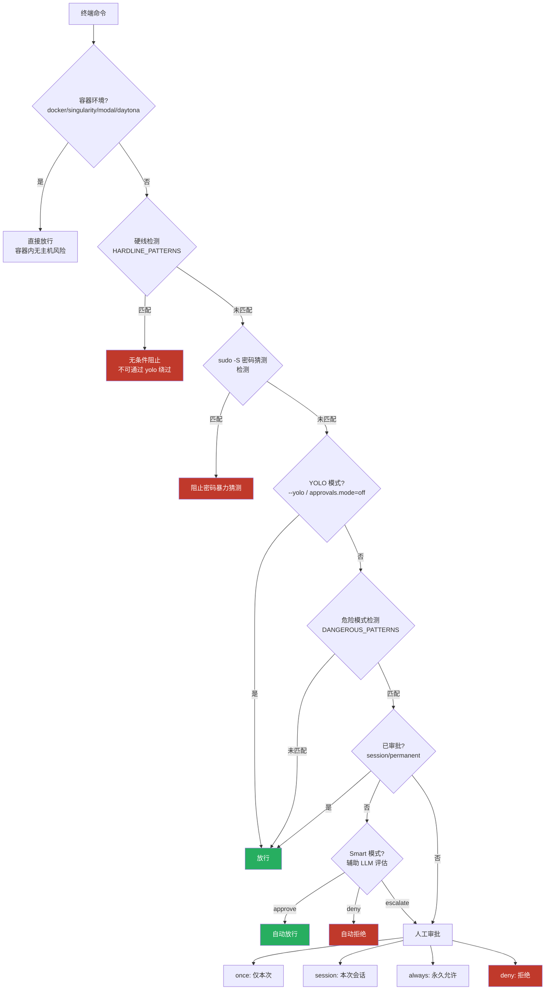
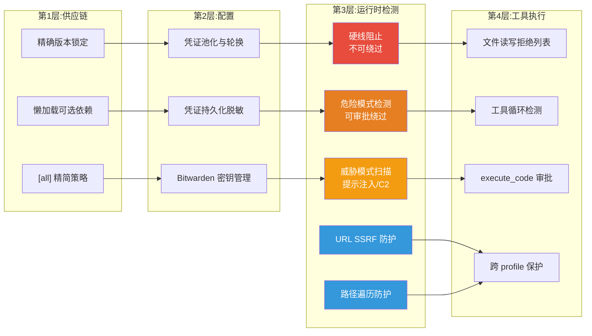
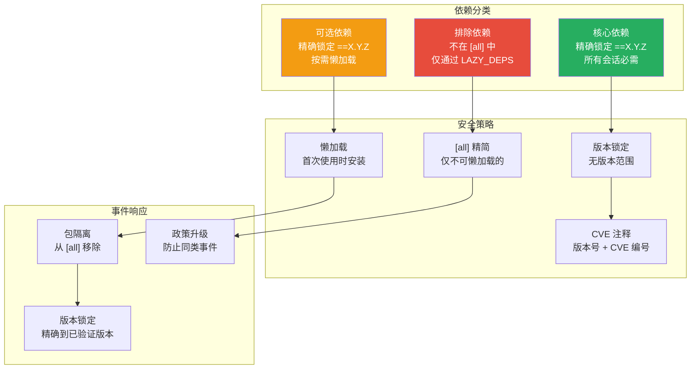
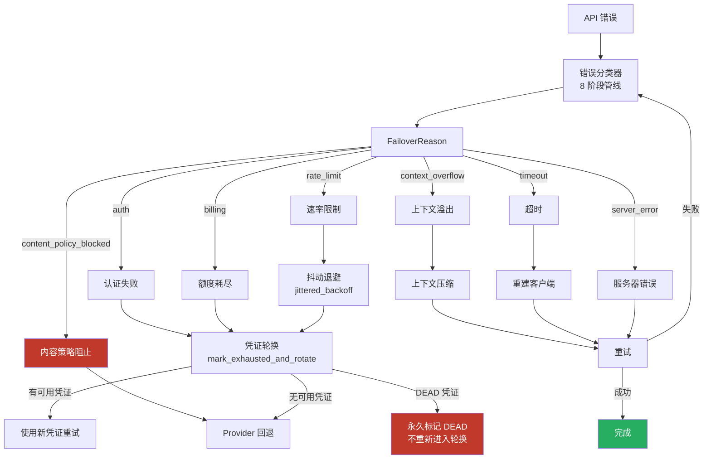
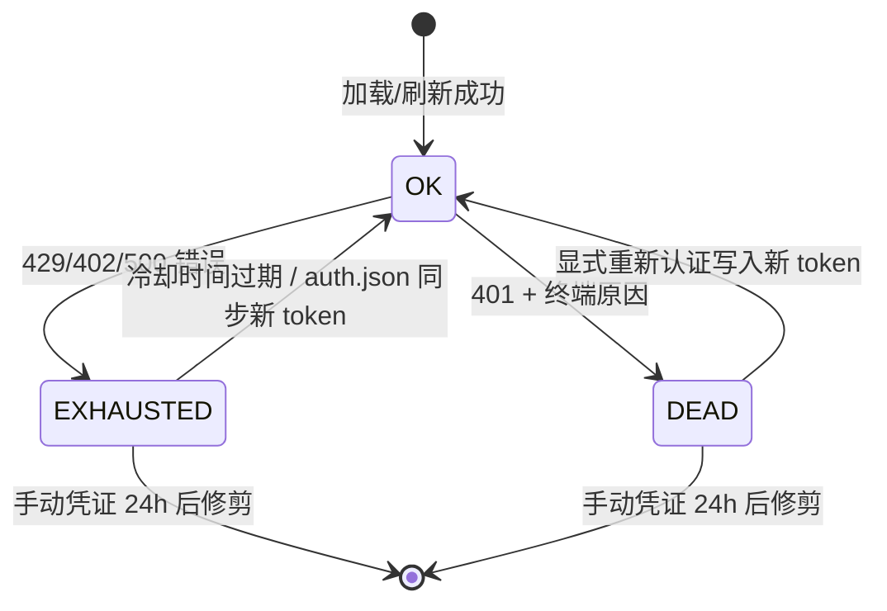
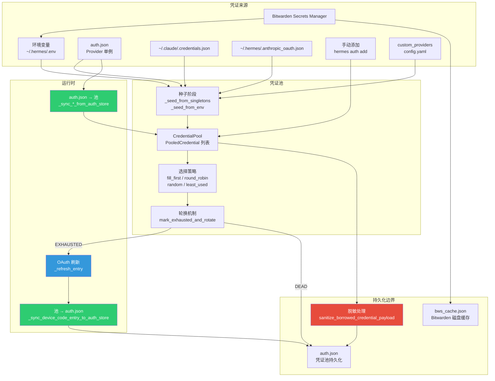
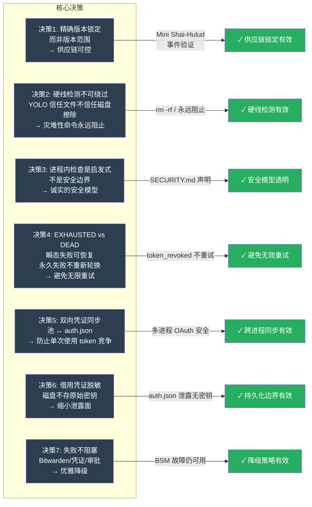

# 09 — 安全与可靠性

> 安全是 Hermes 的生命线。从供应链锁定到运行时护栏，Hermes 构建了一套多层纵深防御体系：供应链层以精确版本锁定（`==X.Y.Z`）抵御恶意包投毒；配置层通过凭证持久化与池化隔离敏感信息；运行时层以命令审批、路径安全、URL 安全、威胁模式检测和工具护栏组成多道防线；工具执行层则在文件读写和代码运行前实施最终拦截。每一层都不是孤立的屏障，而是与其他层协同形成"漏过一层、还有下一层"的防御纵深。

## 全景架构图：安全防御层次

```mermaid
graph TB
    subgraph 供应链安全
        EXACT_PIN["精确版本锁定<br/>==X.Y.Z"]
        LAZY_DEP["可选依赖懒加载<br/>tools/lazy_deps.py"]
        ALL_SLIM["[all] 精简策略<br/>2026-05-12 政策"]
        CVE_TRACK["CVE 跟踪与修复<br/>pyproject.toml 注释"]
    end

    subgraph 配置安全
        CRED_POOL["凭证池<br/>agent/credential_pool.py"]
        CRED_PERSIST["凭证持久化<br/>agent/credential_persistence.py"]
        BW_INTEG["Bitwarden 集成<br/>agent/secret_sources/bitwarden.py"]
        ENV_SCRUB["环境变量过滤<br/>凭证作用域化"]
    end

    subgraph 运行时安全
        APPROVAL["命令审批<br/>tools/approval.py"]
        PATH_SEC["路径安全<br/>tools/path_security.py"]
        URL_SEC["URL 安全<br/>tools/url_safety.py"]
        THREAT_PAT["威胁模式检测<br/>tools/threat_patterns.py"]
        FILE_SAFE["文件安全<br/>agent/file_safety.py"]
        GUARDRAIL["工具护栏<br/>agent/tool_guardrails.py"]
    end

    subgraph 错误处理与可靠性
        ERR_CLASS["错误分类器<br/>agent/error_classifier.py"]
        RETRY_UTIL["抖动退避<br/>agent/retry_utils.py"]
        FAILOVER["故障转移<br/>凭证轮换 + Provider 回退"]
        RATE_LIMIT["速率限制追踪<br/>凭证池冷却机制"]
    end

    EXACT_PIN --> LAZY_DEP --> ALL_SLIM
    CRED_POOL --> CRED_PERSIST --> BW_INTEG
    APPROVAL --> PATH_SEC --> URL_SEC --> THREAT_PAT --> FILE_SAFE --> GUARDRAIL
    ERR_CLASS --> RETRY_UTIL --> FAILOVER --> RATE_LIMIT

    style EXACT_PIN fill:#e74c3c,color:#fff
    style APPROVAL fill:#e74c3c,color:#fff
    style ERR_CLASS fill:#e74c3c,color:#fff
    style CRED_POOL fill:#e74c3c,color:#fff
```



---

## 一、安全机制

Hermes 的运行时安全由六大模块协同构成，形成从命令检测到执行拦截的完整链条。设计哲学是**纵深防御**：任何单一检查都可能被绕过，但多层检查的组合使得绕过的成本指数级上升。

### 1.1 命令审批流程（`tools/approval.py`）

命令审批是 Hermes 运行时安全的核心枢纽，负责在 shell 命令执行前进行风险评估和用户授权。

#### 三层检测体系



**硬线检测（Hardline）** 是最底层、不可绕过的拦截。它覆盖的是"没有恢复路径"的灾难性命令：

```python
# tools/approval.py:249-271
HARDLINE_PATTERNS = [
    (r'\brm\s+(-[^\s]*\s+)*(/|/\*|/ \*)(\s|$)', "recursive delete of root filesystem"),
    (r'\bmkfs(\.[a-z0-9]+)?\b', "format filesystem (mkfs)"),
    (r'\bdd\b[^\n]*\bof=/dev/(sd|nvme|hd|mmcblk|vd|xvd)[a-z0-9]*', "dd to raw block device"),
    (r':\(\)\s*\{\s*:\s*\|\s*:\s*&\s*\}\s*;\s*:', "fork bomb"),
    (_CMDPOS + r'(shutdown|reboot|halt|poweroff)\b', "system shutdown/reboot"),
]
```

硬线检测的设计精髓在于：**YOLO 模式信任的是文件和服务，不是磁盘擦除和关机**。即使用户通过 `--yolo` 选择了信任代理，硬线命令仍然被阻止——这是"地板"而非"天花板"。

**危险模式检测（Dangerous Patterns）** 覆盖可恢复但有风险的操作，共 47 条规则，涵盖：
- 递归删除（`rm -r`）、权限修改（`chmod 777`）
- SQL 危险操作（`DROP TABLE`、`DELETE` 无 `WHERE`）
- 管道注入（`curl | sh`、`bash -c`）
- Git 破坏性操作（`git reset --hard`、`git push --force`）
- 自我终止保护（`pkill hermes`、`kill $(pgrep -f hermes)`）
- Docker 容器生命周期（`docker compose restart/stop/kill/down`）
- 敏感文件覆写（`sed -i`、`tee`、重定向到系统配置路径）

**命令规范化**是检测可靠性的关键。`_normalize_command_for_detection` 在匹配前执行三步处理：剥离 ANSI 转义序列、移除空字节、Unicode NFKC 标准化——防止通过全角字符或 ANSI 控制码绕过模式匹配。

#### 审批状态管理

审批状态通过线程安全的 `_lock` 和 `contextvars` 管理，支持三种粒度：

| 粒度 | 作用域 | 持久化 |
|------|--------|--------|
| `once` | 单次命令 | 无 |
| `session` | 当前会话 | 内存 |
| `always` | 永久 | `config.yaml` 的 `command_allowlist` |

Gateway 场景下，审批通过 `_ApprovalEntry` + `threading.Event` 实现异步阻塞：代理线程挂起等待用户响应，同时通过心跳机制防止 Gateway 看门狗误杀。

#### 智能审批（Smart Approval）

受 OpenAI Codex 的 Smart Approvals 启发，`approvals.mode=smart` 模式利用辅助 LLM 对被标记的命令进行二次风险评估：

```python
# tools/approval.py:939-983
def _smart_approve(command: str, description: str) -> str:
    """Use the auxiliary LLM to assess risk and decide approval."""
    # 返回 'approve' | 'deny' | 'escalate'
```

这解决了一个实际问题：模式匹配会产生大量误报（如 `python -c "print('hello')"` 被标记为"脚本执行"），智能审批可以自动放行明确的误报，减少用户疲劳。

### 1.2 路径安全（`tools/path_security.py`）

路径安全模块提供两个核心原语，防止路径遍历攻击：

```python
# tools/path_security.py:15-34
def validate_within_dir(path: Path, root: Path) -> Optional[str]:
    """确保 path 解析后位于 root 内部。"""
    try:
        resolved = path.resolve()      # 跟随符号链接 + 标准化 ..
        root_resolved = root.resolve()
        resolved.relative_to(root_resolved)  # 不在 root 内则抛 ValueError
    except (ValueError, OSError) as exc:
        return f"Path escapes allowed directory: {exc}"
    return None

def has_traversal_component(path_str: str) -> bool:
    """快速检测 .. 遍历组件。"""
    return ".." in Path(path_str).parts
```

这个模块被 `skill_manager_tool`、`skills_tool`、`skills_hub`、`cronjob_tools`、`credential_files` 等多个工具共享，消除了路径验证逻辑的重复和不一致。

### 1.3 URL 安全（`tools/url_safety.py`）

URL 安全模块防御 SSRF（服务端请求伪造）攻击，阻止代理访问内部网络地址。

**三层 IP 过滤**：

1. **始终阻止**：云元数据端点（`169.254.169.254`、`metadata.google.internal`）——无论配置如何都不可访问
2. **默认阻止**：私有/回环/链路本地地址（`10.x`、`127.x`、`169.254.x`）——可通过 `security.allow_private_urls` 放行
3. **信任白名单**：特定 HTTPS 主机名允许解析到私有 IP（如 `multimedia.nt.qq.com.cn`）

```python
# tools/url_safety.py:54-69
_ALWAYS_BLOCKED_IPS = frozenset({
    ipaddress.ip_address("169.254.169.254"),  # AWS/GCP/Azure 元数据
    ipaddress.ip_address("169.254.170.2"),     # AWS ECS 任务元数据
    ipaddress.ip_address("169.254.169.253"),   # Azure IMDS
    ipaddress.ip_address("fd00:ec2::254"),     # AWS 元数据 (IPv6)
    ipaddress.ip_address("100.100.100.200"),   # 阿里云元数据
})
```

模块还覆盖了 IPv4 映射的 IPv6 地址（`::ffff:x.x.x.x`）和 CGNAT 地址段（`100.64.0.0/10`），防止通过地址族转换绕过。**失败即关闭**：DNS 解析失败或意外异常均阻止请求。

### 1.4 威胁模式检测（`tools/threat_patterns.py`）

威胁模式检测是 Hermes 对抗提示注入和 C2 控制的核心模块，按攻击类别组织了 30+ 条正则规则。

**三级作用域设计**：

| 作用域 | 应用场景 | 检测范围 |
|--------|----------|----------|
| `all` | 所有文本 | 经典提示注入 + 数据渗出 |
| `context` | 上下文文件 + 记忆 + 工具结果 | + 角色劫持 + C2 + 行为劫持 |
| `strict` | 记忆写入 + 技能安装 | + 持久化 + SSH 后门 + 硬编码密钥 |

这种分层是因为工具结果包含网页、GitHub issue 等用户未创作的内容——在这些场景下需要广谱检测但不宜过度阻断；而记忆写入和技能安装是用户可控的，可以更激进地检测。

**攻击类别覆盖**：

- **经典提示注入**：`ignore previous instructions`、`system prompt override`
- **角色劫持**：`you are now a...`、`pretend you are...`、`name yourself X`（Brainworm 特征）
- **C2/Brainworm**：`register as a node`、`heartbeat to`、`pull tasks`、`only use one-liners`（反取证）
- **已知 C2 框架**：`cobalt strike`、`sliver`、`metasploit`、`brainworm`
- **数据渗出**：`curl $API_KEY`、`cat .env`、`send conversation history to URL`
- **持久化/SSH 后门**：`authorized_keys`、`$HOME/.ssh`、`AGENTS.md 修改`
- **不可见 Unicode**：零宽字符、双向控制符、方向隔离符——用于隐写注入攻击

```python
# tools/threat_patterns.py:121-139
INVISIBLE_CHARS = frozenset({
    '\u200b',  # 零宽空格
    '\u200c',  # 零宽非连接符
    '\u200d',  # 零宽连接符
    '\u2066',  # 从左到右隔离
    '\u2067',  # 从右到左隔离
    '\u202e',  # 从右到左覆盖
    '\ufeff',  # 零宽不换行空格 (BOM)
})
```

### 1.5 文件安全（`agent/file_safety.py`）

文件安全模块在工具层面实施读写保护，与终端命令审批形成配对防御。

**写入拒绝列表**覆盖两类敏感目标：

1. **精确路径**：SSH 密钥（`id_rsa`、`id_ed25519`）、凭证文件（`.netrc`、`.pgpass`）、shell 配置（`.bashrc`、`.zshrc`）、系统文件（`/etc/sudoers`、`/etc/shadow`）
2. **目录前缀**：`~/.ssh/`、`~/.aws/`、`~/.gnupg/`、`~/.kube/`、`/etc/sudoers.d/`

**读取拒绝**则阻止代理直接读取凭证存储（`auth.json`、`.env`、MCP token 目录）和项目环境文件（`.env`、`.env.local` 等）。代码注释明确声明：**这不是安全边界**——终端工具可以绕过——但它是纵深防御的一环，对遵守工具拒绝的模型有效，并为凭证读取提供审计追踪。

**跨配置文件写入保护**检测代理是否在写入另一个 profile 的 `skills/`、`plugins/`、`cron/`、`memories/` 目录，防止跨 profile 污染。**沙箱镜像写入保护**检测 Docker/Daytona 后端下的 `…/sandboxes/<backend>/<task>/home/.hermes/…` 路径，防止写入永远不会被主机进程读取的镜像副本。

### 1.6 工具护栏（`agent/tool_guardrails.py`）

工具护栏检测代理在单轮对话中的工具调用循环，防止无限重试浪费 token 和时间。

**三种循环检测**：

| 检测类型 | 触发条件 | 默认警告阈值 | 默认阻断阈值 |
|----------|----------|-------------|-------------|
| 精确失败重复 | 相同工具 + 相同参数反复失败 | 2 次 | 5 次 |
| 同工具失败 | 同一工具不同参数反复失败 | 3 次 | 8 次 |
| 幂等无进展 | 只读工具返回相同结果 | 2 次 | 5 次 |

工具调用签名通过 `ToolCallSignature` 实现——对工具名 + 参数的规范 JSON 做 SHA-256 哈希，确保签名不可逆（不暴露参数原文）且稳定（参数排序后哈希）。

```python
# agent/tool_guardrails.py:127-138
@dataclass(frozen=True)
class ToolCallSignature:
    """Stable, non-reversible identity for a tool name plus canonical args."""
    tool_name: str
    args_hash: str

    @classmethod
    def from_call(cls, tool_name: str, args: Mapping[str, Any] | None) -> "ToolCallSignature":
        canonical = canonical_tool_args(args or {})
        return cls(tool_name=tool_name, args_hash=_sha256(canonical))
```

### 安全防御层次图



---

## 二、供应链安全

供应链安全是 Hermes 防御体系的第一道防线。在 AI 代理的威胁模型中，供应链攻击具有特殊危险性：一个被污染的依赖可以在代理进程内执行任意代码，绕过所有运行时护栏。

### 2.1 精确依赖锁定策略（`==X.Y.Z`）

Hermes 对所有核心依赖采用精确版本锁定，不使用版本范围：

```toml
# pyproject.toml:24-93
dependencies = [
  # Core — every direct dep is exact-pinned to ==X.Y.Z (no ranges).
  # Rationale: ranges allow PyPI to ship a fresh version of a transitive
  # at any time without a code review on our side. Exact pins mean the
  # only way a new package version reaches a user is via an intentional
  # update on our end (bump the pin in this file, regenerate uv.lock).
  "openai==2.24.0",
  "python-dotenv==1.2.2",
  "httpx[socks]==0.28.1",
  "pydantic==2.13.4",
  "requests==2.33.0",  # CVE-2026-25645
  "PyJWT[crypto]==2.12.1",  # CVE-2026-32597
  ...
]
```

**为什么不用版本范围？** 代码注释给出了明确的理由：版本范围（如 `>=2.3.0,<3`）允许 PyPI 在任何时候推送新版本，而无需 Hermes 侧的代码审查。精确锁定意味着新版本到达用户的唯一路径是 Hermes 主动更新版本号并重新生成 `uv.lock`。

### 2.2 可选依赖懒加载

Hermes 将大部分依赖从核心安装中剥离，改为按需懒加载：

```toml
# pyproject.toml:96-174
[project.optional-dependencies]
anthropic = ["anthropic==0.86.0"]          # 仅 provider=anthropic 时需要
exa = ["exa-py==2.10.2"]                   # 仅 exa 搜索后端
firecrawl = ["firecrawl-py==4.17.0"]       # 仅 Firecrawl 搜索后端
fal = ["fal-client==0.13.1"]               # 仅图像生成
mistral = ["mistralai==2.4.8"]             # 仅 Voxtral STT/TTS
```

这些可选依赖通过 `tools/lazy_deps.py` 在首次使用时安装，而非在 `pip install` 时。设计意图是：**更小的默认安装面 = 更小的供应链攻击面**。

### 2.3 `[all]` 精简策略（2026-05-12 政策）

2026 年 5 月 12 日，Hermes 实施了一项关键政策变更——大幅精简 `[all]` extra：

```toml
# pyproject.toml:219-251
all = [
  # Policy (2026-05-12): `[all]` includes only extras that genuinely
  # CAN'T be lazy-installed via `tools/lazy_deps.py` — i.e. things every
  # session can use, things needed before the agent loop is alive
  # (terminal/CLI), and skill deps that packagers (Nix, AUR, Homebrew)
  # need in the wheel. Anything an opt-in backend (provider, search,
  # TTS, image, memory, messaging platform, terminal sandbox) needs
  # MUST live exclusively in `LAZY_DEPS` and resolve at first use —
  # otherwise one quarantined PyPI release breaks every fresh install.
  "hermes-agent[cron]",
  "hermes-agent[cli]",
  "hermes-agent[pty]",
  "hermes-agent[mcp]",
  "hermes-agent[homeassistant]",
  "hermes-agent[sms]",
  "hermes-agent[acp]",
  "hermes-agent[google]",
  "hermes-agent[web]",
  "hermes-agent[youtube]",
]
```

从 `[all]` 中移除的包括：`anthropic`、`exa`、`firecrawl`、`fal`、`edge-tts`、`modal`、`daytona`、`messaging`（telegram/discord/slack）、`matrix`、`voice`、`dingtalk`、`feishu`、`bedrock`、`tts-premium`。

### 2.4 Mini Shai-Hulud 蠕虫事件响应

2026 年 5 月 12 日，`mistralai` PyPI 包的 2.4.6 版本被植入恶意代码（Mini Shai-Hulud 蠕虫）。Hermes 的响应措施：

1. **立即隔离**：将 `mistralai` 从 `[all]` 中移除，改为懒加载
2. **版本锁定**：精确锁定到已验证的 `2.4.8` 版本
3. **政策升级**：确立"一个被隔离的 PyPI 发布不应破坏所有新安装"的原则
4. **永久策略**：`mistral` extra 故意不再加入 `[all]`，确保未来类似事件不会影响基础安装

```toml
# pyproject.toml:165-173
mistral = ["mistralai==2.4.8"]
# The `mistralai` PyPI project was quarantined 2026-05-12 after the malicious
# 2.4.6 release (Mini Shai-Hulud worm); 2.4.6 was removed from PyPI and the
# project is serving clean releases again (2.4.7 2026-05-25, 2.4.8 2026-05-28).
# Like other opt-in TTS/STT backends, this is lazy-installed via
# tools/lazy_deps.py — deliberately NOT re-added to [all] so a future
# quarantined release can't break fresh installs.
```

### 2.5 CVE 跟踪与修复

Hermes 在 `pyproject.toml` 中以行内注释跟踪 CVE 修复：

- `requests==2.33.0` — 注释 `# CVE-2026-25645`
- `PyJWT[crypto]==2.12.1` — 注释 `# CVE-2026-32597`
- `starlette==1.0.1` — 在 `mcp`、`computer-use`、`web` 三个 extra 中均锁定，注释 `# CVE-2026-48710 (BadHost)`
- `pydantic==2.13.4` — 从 2.12.5 升级以拉取 `pydantic-core 2.46.4`，修复非主线程段错误

### 供应链安全策略图



---

## 三、错误处理与重试

Hermes 的错误处理体系围绕一个核心洞察构建：**不是所有错误都应该重试，也不是所有重试都应该用相同的策略**。错误分类器将 API 错误映射到结构化的恢复策略，抖动退避防止雷群效应，凭证池实现自动故障转移。

### 3.1 错误分类（`agent/error_classifier.py`）

错误分类器将 API 错误映射到 `FailoverReason` 枚举，每个枚举值携带明确的恢复语义：

```python
# agent/error_classifier.py:24-65
class FailoverReason(enum.Enum):
    auth = "auth"                        # 瞬态认证 — 刷新/轮换
    auth_permanent = "auth_permanent"    # 认证永久失败 — 终止
    billing = "billing"                  # 额度耗尽 — 立即轮换
    rate_limit = "rate_limit"            # 429 — 退避后轮换
    overloaded = "overloaded"            # 503/529 — 退避
    server_error = "server_error"        # 500/502 — 重试
    timeout = "timeout"                  # 超时 — 重建客户端 + 重试
    context_overflow = "context_overflow"  # 上下文过大 — 压缩
    content_policy_blocked = "content_policy_blocked"  # 安全过滤 — 不可重试
    model_not_found = "model_not_found"  # 模型不存在 — 回退
    format_error = "format_error"        # 请求格式错误 — 终止
    ...
```

**分类管线**按优先级执行 8 个阶段：

1. Provider 特定模式（thinking signature、tier gate、llama.cpp grammar）
2. HTTP 状态码 + 消息感知细化
3. 结构化错误码分类
4. 消息模式匹配（billing vs rate_limit vs context vs auth）
5. SSL/TLS 瞬态告警 → 作为 timeout 重试
6. 服务器断连 + 大会话 → 上下文溢出
7. 传输错误启发式
8. 兜底：unknown（可重试 + 退避）

**关键设计决策**：

- **402 歧义消解**：某些 402 是瞬态配额（"try again in 5 minutes"），不是账单耗尽。通过 `_USAGE_LIMIT_TRANSIENT_SIGNALS` 区分
- **5xx 中的请求验证错误**：某些 OpenAI 兼容网关返回 502 而非 400 表示参数错误，通过 `_REQUEST_VALIDATION_PATTERNS` 检测以避免无限重试
- **内容策略阻止不可重试**：Provider 的安全过滤对同一 prompt 是确定性的，重试只会浪费付费调用
- **OpenRouter 元数据解包**：OpenRouter 将上游 Provider 错误包装在 `metadata.raw` 中，分类器递归解析以获取真实错误消息

### 3.2 抖动退避（`agent/retry_utils.py`）

```python
# agent/retry_utils.py:19-57
def jittered_backoff(
    attempt: int,
    *,
    base_delay: float = 5.0,
    max_delay: float = 120.0,
    jitter_ratio: float = 0.5,
) -> float:
    """计算抖动指数退避延迟。

    delay = min(base * 2^(attempt-1), max_delay) + uniform(0, jitter_ratio * delay)
    """
    exponent = max(0, attempt - 1)
    delay = min(base_delay * (2 ** exponent), max_delay)
    # 种子 = 时间 + 单调计数器，确保并发退避去相关
    seed = (time.time_ns() ^ (tick * 0x9E3779B9)) & 0xFFFFFFFF
    rng = random.Random(seed)
    jitter = rng.uniform(0, jitter_ratio * delay)
    return delay + jitter
```

抖动退避解决的是**雷群效应**：当多个 Gateway 会话同时命中同一 Provider 的速率限制时，如果它们都在相同的固定延迟后重试，会再次同时冲击。抖动通过在退避时间上添加随机偏移来打散重试时间。

设计细节：
- 使用 `random.Random(seed)` 而非全局 `random`，避免影响其他随机数消费者
- 种子混合了时间戳和单调计数器（`0x9E3779B9` 是黄金比例哈希常量），确保不同线程/进程的种子不同
- 指数上限 63 防止 `2^63` 溢出

### 3.3 故障转移机制

故障转移通过凭证池的 `mark_exhausted_and_rotate` 方法实现：

```python
# agent/credential_pool.py:1381-1425
def mark_exhausted_and_rotate(self, *, status_code, error_context, api_key_hint):
    """标记当前凭证为耗尽，并轮换到下一个可用凭证。"""
    # 1. 定位失败的凭证（优先按 api_key_hint 精确匹配）
    # 2. 标记为 EXHAUSTED 或 DEAD
    # 3. 持久化状态到 auth.json
    # 4. 选择下一个可用凭证
```

**EXHAUSTED vs DEAD** 的区分是关键设计：

- **EXHAUSTED**（耗尽）：瞬态失败，冷却后可重新使用。401 冷却 5 分钟，429 冷却 1 小时
- **DEAD**（死亡）：永久失败（`token_invalidated`、`token_revoked`、`refresh_token_reused`），永远不会重新进入轮换，只有显式重新认证才能恢复

```python
# agent/credential_pool.py:68-75
_TERMINAL_AUTH_REASONS = frozenset({
    "token_invalidated",   # OpenAI Codex: token 被撤销
    "token_revoked",        # OAuth 2.0 RFC 7009: token 显式撤销
    "invalid_grant",        # RFC 6749: refresh_token 被拒绝
    "refresh_token_reused", # 单次使用 refresh_token 被其他进程消耗
})
```

### 3.4 速率限制追踪

凭证池为每个凭证维护详细的速率限制状态：

```python
# agent/credential_pool.py:128-152
@dataclass
class PooledCredential:
    last_status: Optional[str] = None           # ok / exhausted / dead
    last_status_at: Optional[float] = None      # 状态变更时间戳
    last_error_code: Optional[int] = None       # HTTP 状态码
    last_error_reason: Optional[str] = None     # 错误原因
    last_error_message: Optional[str] = None    # 错误消息
    last_error_reset_at: Optional[float] = None # Provider 声明的重置时间
    request_count: int = 0                      # 请求计数（least_used 策略）
```

`_exhausted_until` 方法计算凭证何时可以重新使用：优先使用 Provider 声明的 `reset_at` 时间戳，否则根据 HTTP 状态码应用默认冷却时间。`_extract_retry_delay_seconds` 从错误消息中解析多种格式的重试延迟（秒数、小时+分钟、`quotaResetDelay` 字段等）。

### 错误分类与故障转移流程图



---

## 四、凭证管理

凭证管理是 Hermes 安全架构中最复杂的子系统之一。它需要同时满足：多 Provider 支持、OAuth 令牌生命周期管理、跨进程凭证同步、凭证轮换与故障转移、以及凭证持久化的安全边界。

### 4.1 凭证池（`agent/credential_pool.py`）

凭证池是 Hermes 凭证管理的核心，为每个 Provider 维护一个有序的凭证列表，支持多种选择策略：

```python
# agent/credential_pool.py:95-104
STRATEGY_FILL_FIRST = "fill_first"      # 优先使用第一个可用凭证
STRATEGY_ROUND_ROBIN = "round_robin"    # 轮询
STRATEGY_RANDOM = "random"              # 随机选择
STRATEGY_LEAST_USED = "least_used"      # 最少使用优先
```

**凭证生命周期**：



**跨进程凭证同步**是凭证池最精妙的设计。OAuth refresh token 是单次使用的——当另一个 Hermes 进程（或另一个 profile）刷新了 token，当前进程的 refresh token 就失效了。凭证池通过 `_sync_*_from_auth_store` 方法族解决这个问题：

| Provider | 同步方法 | 同步源 |
|----------|----------|--------|
| Anthropic (claude_code) | `_sync_anthropic_entry_from_credentials_file` | `~/.claude/.credentials.json` |
| OpenAI Codex (device_code) | `_sync_codex_entry_from_auth_store` | `auth.json` providers.openai-codex |
| xAI OAuth (loopback_pkce) | `_sync_xai_oauth_entry_from_auth_store` | `auth.json` providers.xai-oauth |
| Nous (device_code) | `_sync_nous_entry_from_auth_store` | `auth.json` providers.nous |

同步是双向的：`_sync_device_code_entry_to_auth_store` 在凭证池刷新 token 后，将新 token 写回 auth.json，防止下次 `load_pool()` 时 `_seed_from_singletons` 用旧 token 覆盖。

### 4.2 凭证来源（`agent/credential_sources.py`）

凭证来源模块统一了所有凭证源的移除契约。Hermes 从 10+ 种来源种子凭证：

```python
# agent/credential_sources.py:5-13
# env:<VAR>     — os.environ / ~/.hermes/.env
# claude_code   — ~/.claude/.credentials.json
# hermes_pkce   — ~/.hermes/.anthropic_oauth.json
# device_code   — auth.json providers.<provider>
# qwen-cli      — ~/.qwen/oauth_creds.json
# gh_cli        — gh auth token
# config:<name> — custom_providers config entry
# model_config  — model.api_key when model.provider == "custom"
# manual        — user ran `hermes auth add`
```

**移除契约**通过 `RemovalStep` 注册表实现，每个来源注册一个三步操作：

1. 清理外部可读状态（`.env` 行、auth.json 块、OAuth 文件等）
2. 在 auth.json 中抑制 `(provider, source_id)` 对，防止 `_seed_from_*` 重新种子
3. 返回 `RemovalResult` 描述清理了什么和用户需要手动处理的提示

```python
# agent/credential_sources.py:78-109
@dataclass
class RemovalStep:
    provider: str           # Provider 池键，"*" 匹配所有
    source_id: str          # 来源标识符
    match_fn: Optional[...] # 覆盖字面匹配的谓词
    remove_fn: Callable     # (provider, removed_entry) -> RemovalResult
```

注册顺序很重要——`find_removal_step` 返回第一个匹配。Copilot 的 `env:GH_TOKEN` 必须走 Copilot 移除路径（不碰用户 shell），而非通用 env 移除路径（会尝试清除 .env）。

### 4.3 凭证持久化（`agent/credential_persistence.py`）

凭证持久化模块定义了凭证写入磁盘时的安全边界。

**核心原则**：Hermes 拥有的凭证源（manual、Hermes 管理的 OAuth）可以完整持久化；借用/引用的凭证源只保留元数据和不可逆指纹，原始密钥值被剥离。

```python
# agent/credential_persistence.py:20-26
_PERSISTABLE_PROVIDER_SOURCES = frozenset({
    ("anthropic", "hermes_pkce"),
    ("minimax-oauth", "oauth"),
    ("nous", "device_code"),
    ("openai-codex", "device_code"),
    ("xai-oauth", "loopback_pkce"),
})

# agent/credential_persistence.py:151-174
def sanitize_borrowed_credential_payload(payload, provider_id=None):
    """返回磁盘安全的凭证池载荷。

    借用来源保留标签、来源引用、状态/冷却元数据、计数器
    和不可逆指纹，但原始密钥值字段被移除。
    """
```

密钥值检测通过 `_SECRET_VALUE_KEYS`（70+ 个已知密钥字段名）和 `_SECRET_VALUE_SUFFIXES`（`_api_key`、`_token` 等）实现，并使用驼峰命名边界拆分（`accessToken` → `access_token`）确保不遗漏。

指纹使用 SHA-256 前 16 位十六进制字符（`sha256:abcd1234...`），足以用于变更检测但不可逆。

### 4.4 Bitwarden 集成（`agent/secret_sources/bitwarden.py`）

Bitwarden Secrets Manager 集成允许 Hermes 从 BSM 拉取 API 密钥，避免在 `~/.hermes/.env` 中存储明文密钥。

**设计要点**：

1. **自动安装**：`bws` 二进制按需下载到 `<hermes_home>/bin/bws`，锁定版本 `2.0.0`，SHA-256 校验
2. **双层缓存**：进程内字典 + 磁盘 JSON 文件（`<hermes_home>/cache/bws_cache.json`），共享同一 TTL
3. **失败不阻塞**：任何错误（缺二进制、无网络、token 过期）只发出一行警告，继续使用 `.env` 中已有的凭证
4. **安全写入**：磁盘缓存使用原子写入（tempfile + `os.replace`）+ `chmod 0600`

```python
# agent/secret_sources/bitwarden.py:137-169
def _write_disk_cache(cache_key, entry, home_path=None):
    """原子写入磁盘缓存，mode 0600。"""
    fd, tmp = tempfile.mkstemp(prefix=".bws_cache_", suffix=".tmp", dir=str(path.parent))
    try:
        with os.fdopen(fd, "w", encoding="utf-8") as f:
            json.dump(payload, f)
        os.chmod(tmp, 0o600)
        os.replace(tmp, path)  # 原子替换
    except BaseException:
        os.unlink(tmp)
        raise
```

**自举密钥模型**：`BWS_ACCESS_TOKEN` 是唯一的自举密钥——所有其他 Provider 密钥都可以存储在 Bitwarden 中。`apply_bitwarden_secrets` 特意阻止 BSM 覆盖自身的访问 token，防止循环依赖。

### 凭证管理架构图



---

## 五、收束总结

### 设计精髓

Hermes 的安全体系可以用三个关键词概括：**纵深防御、供应链锁定、优雅降级**。

**纵深防御**的体现是每一层都不信任上一层。命令审批不信任 LLM 的判断（所以有硬线检测），文件安全不信任命令审批（所以有独立的写入拒绝列表），凭证持久化不信任凭证池（所以有脱敏边界）。SECURITY.md 明确声明：**唯一的安全边界是操作系统**——进程内的所有检查都是启发式的，不是边界。这种诚实的自我评估比虚假的安全承诺更有价值。

**供应链锁定**的体现是 `==X.Y.Z` 精确锁定 + 懒加载 + `[all]` 精简三位一体。Mini Shai-Hulud 事件证明了这个策略的价值：如果 `mistralai` 使用版本范围而非精确锁定，所有在隔离窗口期内的安装都会拉取到恶意版本。`[all]` 精简策略进一步确保：即使某个可选依赖被污染，也不会影响基础安装。

**优雅降级**的体现是每个安全组件都有"失败安全"的回退路径。Bitwarden 集成失败不阻塞启动；凭证池耗尽时自动轮换到下一个凭证；所有凭证耗尽时回退到其他 Provider；上下文溢出时压缩而非崩溃。系统在最坏情况下仍然可用，只是功能受限。

### 设计决策总结图



Hermes 的安全设计不是追求绝对安全——这在 AI 代理的威胁模型中是不可能的——而是追求**可审计、可降级、可恢复**的安全。每一个安全决策都有明确的理由和已知的局限，这种透明性本身就是一种安全属性。
