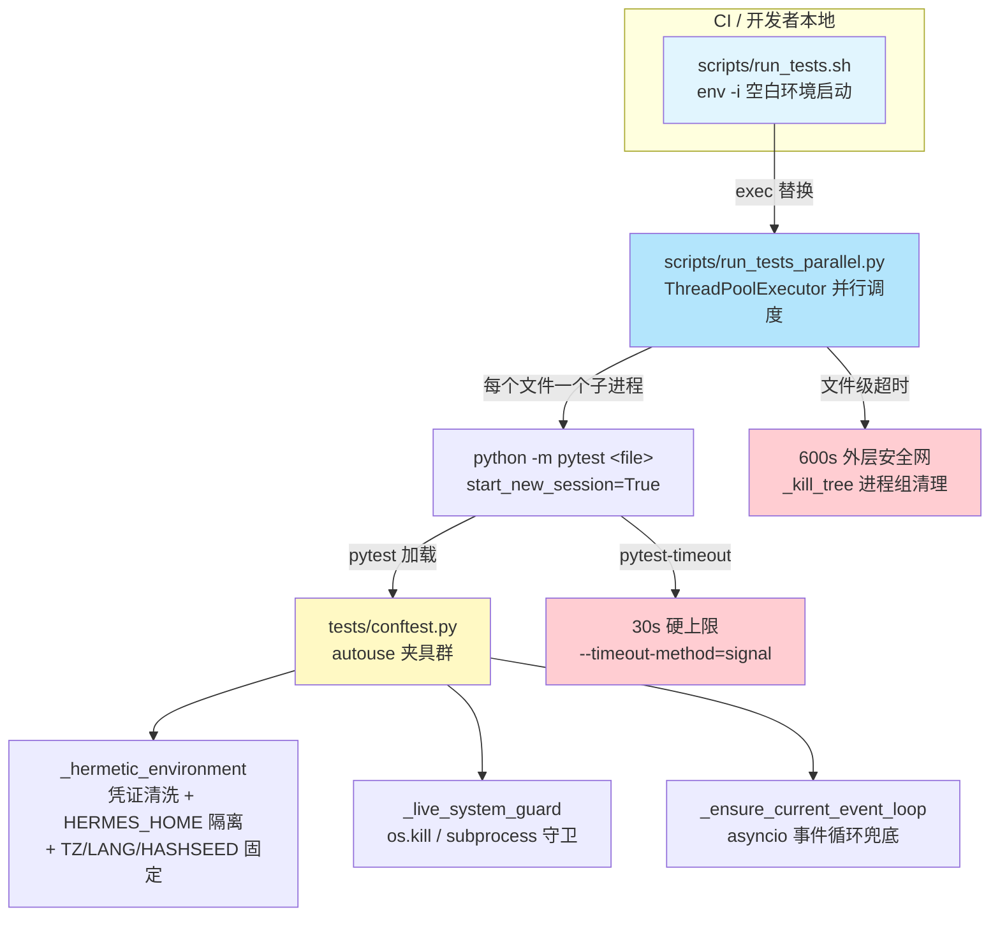
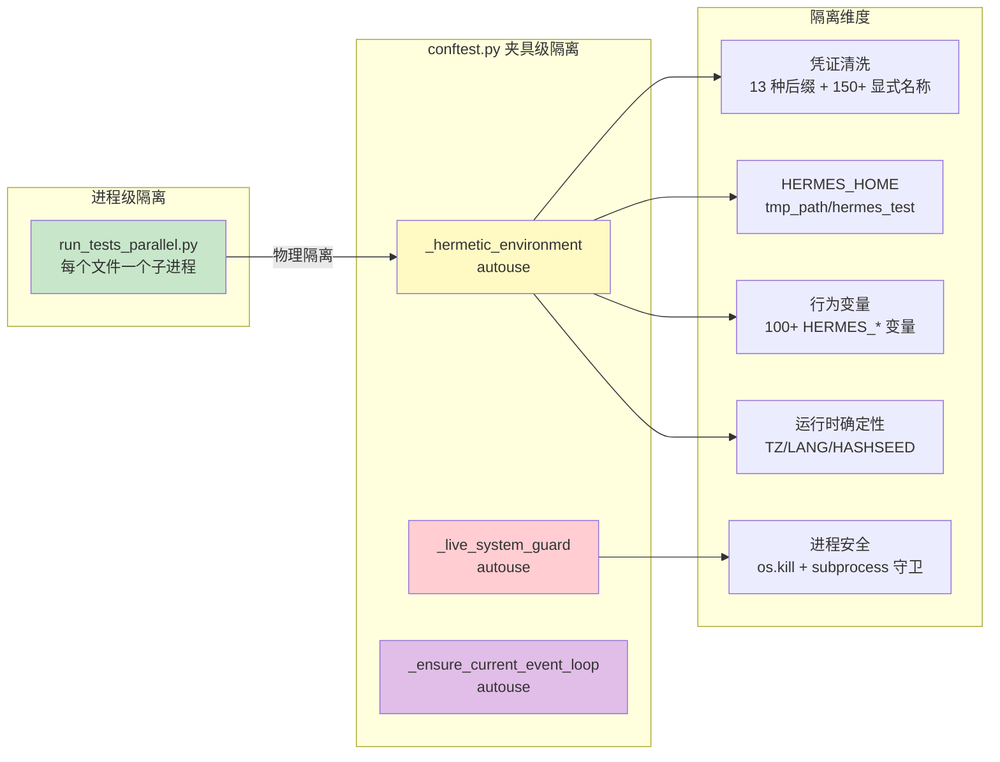
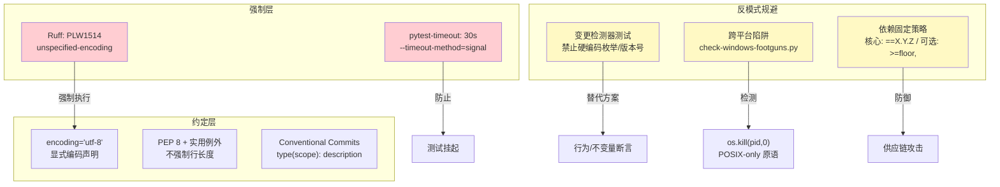
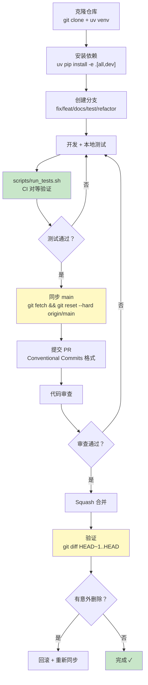
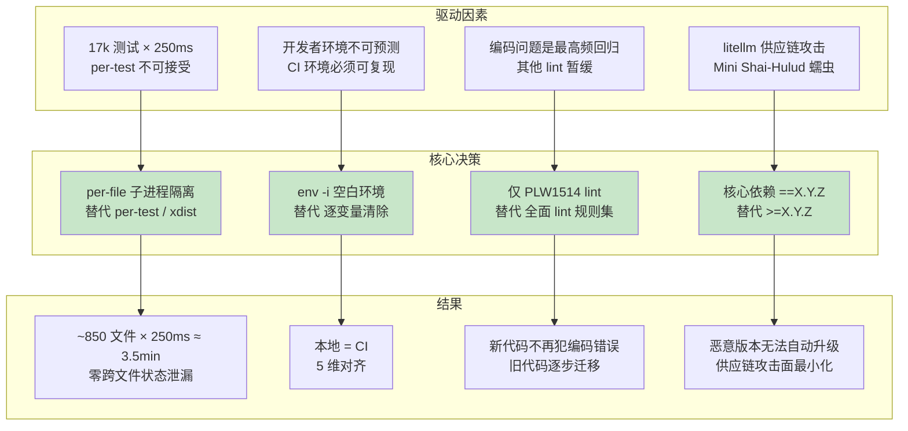

# Hermes Agent 测试与工程实践

## 开篇概览

Hermes 的测试哲学是**"隔离即正确"**——子进程隔离确保零状态泄漏。这一哲学贯穿了整个测试架构的设计：从 `scripts/run_tests_parallel.py` 为每个测试文件启动独立 Python 子进程，到 `conftest.py` 中 `autouse` 夹具对凭证、行为变量、`HERMES_HOME` 的全面清洗，再到 `run_tests.sh` 包装器通过 `env -i` 从空白环境起步——每一层都在回答同一个问题：**如何让开发者的本地运行与 CI 的行为完全一致？** 答案是层层隔离、处处对齐、杜绝一切隐式状态依赖。

### 全景架构图



---

## 一、测试架构：子进程隔离与自动夹具

### 1.1 子进程隔离：从 per-test 到 per-file 的演进

Hermes 的测试隔离策略经历了一个清晰的演进路径：

| 阶段 | 策略 | 问题 |
|------|------|------|
| 早期 | `_reset_module_state` autouse 夹具 | 手动清除模块级状态，容易遗漏，维护成本高 |
| 实验 | per-test 子进程隔离 | ~250ms × 17k 测试 ≈ 70 分钟 CPU 开销，不可接受 |
| **当前** | **per-file 子进程隔离** | ~250ms × ~850 文件 ≈ 3.5 分钟，兼顾隔离与性能 |

当前方案的核心洞察是：**跨文件的状态泄漏才是真正的 flake 源头**（模块级字典、`ContextVars`、缓存等），而同一文件内的测试顺序则是测试作者的责任。`conftest.py` 中对此有明确的注释：

> *文件路径：`tests/conftest.py` 第 36-48 行*
>
> ```python
> # Tests run via ``scripts/run_tests_parallel.py``, which spawns a fresh
> # ``python -m pytest <file>`` subprocess per test file. Cross-file state
> # leakage (module-level dicts, ContextVars, caches) is impossible: each
> # file gets a clean Python interpreter. Intra-file ordering is the test
> # author's responsibility.
> ```

值得注意的是，`AGENTS.md` 中仍引用了 `tests/_isolate_plugin.py`，但该文件在当前代码库中已不存在——隔离职责已完全迁移到 `run_tests_parallel.py` 的子进程调度模型中。这是一个有意的设计简化：与其维护一个 pytest 插件来拦截每个测试的执行，不如直接在进程层面实现物理隔离。

### 1.2 conftest.py：四重防护的自动夹具

`tests/conftest.py` 是测试隔离的核心实现，通过三个 `autouse` 夹具构建了四重防护：

**第一重：凭证环境变量清洗**（`_hermetic_environment`）

```python
# 文件路径：tests/conftest.py 第 57-73 行
_CREDENTIAL_SUFFIXES = (
    "_API_KEY", "_TOKEN", "_SECRET", "_PASSWORD", "_CREDENTIALS",
    "_ACCESS_KEY", "_SECRET_ACCESS_KEY", "_PRIVATE_KEY", ...
)

_CREDENTIAL_NAMES = frozenset({
    "AWS_ACCESS_KEY_ID", "OPENAI_API_KEY", "GITHUB_TOKEN", ...
})
```

设计意图：开发者的本地 shell 中通常设置了各种 API Key，如果这些 Key 泄漏到测试中，会导致"自动检测到 Provider"等断言在本地通过但在 CI 失败。`_looks_like_credential()` 函数通过**后缀匹配 + 显式名称枚举**的双重策略，确保任何凭证形态的环境变量都不会进入测试。

**第二重：HERMES_HOME 隔离**

```python
# 文件路径：tests/conftest.py 第 354-360 行
fake_hermes_home = tmp_path / "hermes_test"
fake_hermes_home.mkdir()
(fake_hermes_home / "sessions").mkdir()
(fake_hermes_home / "cron").mkdir()
(fake_hermes_home / "memories").mkdir()
(fake_hermes_home / "skills").mkdir()
monkeypatch.setenv("HERMES_HOME", str(fake_hermes_home))
```

关键设计决策：**不重定向 HOME**。conftest 中有专门的注释解释了为什么——重定向 HOME 会导致 CI 中子进程继承被修改的 HOME 后行为异常。任何使用 `Path.home() / ".hermes"` 而非 `get_hermes_home()` 的代码都被视为 bug，应在调用点修复。

**第三重：确定性运行时**

```python
# 文件路径：tests/conftest.py 第 364-374 行
monkeypatch.setenv("TZ", "UTC")
monkeypatch.setenv("LANG", "C.UTF-8")
monkeypatch.setenv("LC_ALL", "C.UTF-8")
monkeypatch.setenv("PYTHONHASHSEED", "0")
monkeypatch.setenv("AWS_EC2_METADATA_DISABLED", "true")  # 避免 2s IMDS 超时
monkeypatch.setenv("TIRITH_ENABLED", "false")             # 阻止隐式网络引导
```

**第四重：行为变量清洗**

`_HERMES_BEHAVIORAL_VARS` 包含了 100+ 个 `HERMES_*` 环境变量，涵盖 YOLO 模式、交互模式、会话变量、Kanban 路径、平台允许列表、Home Channel 等。这些变量不是凭证，但会改变测试语义——例如 `HERMES_KANBAN_DB` 泄漏会导致测试向真实的 `~/.hermes/kanban.db` 写入假数据。

### 1.3 活系统守卫：防止测试杀死真实进程

`_live_system_guard` 是 conftest 中最精巧的夹具，它解决了一个真实发生过的问题：测试中未 mock 的 `os.kill` 调用通过 `psutil` 找到开发者的真实 `hermes-gateway` 进程并发送 SIGTERM。PR #23285 的关机取证发现在 3 天内发生了 5+ 次此类事件。

守卫覆盖了所有能向外部进程发送信号的原语：

| 原语 | 守卫策略 |
|------|---------|
| `os.kill` / `os.killpg` | 拒绝对测试进程子树外的 PID 发送信号 |
| `subprocess.run/Popen/call/...` | 检查命令字符串，拦截 `systemctl restart hermes-gateway` |
| `os.system` / `os.popen` | 同上 |
| `pty.spawn` | 同上 |
| `asyncio.create_subprocess_*` | 同上 |

测试可以通过 `@pytest.mark.live_system_guard_bypass` 标记显式退出守卫。

### 测试隔离架构图



---

## 二、测试运行器：环境一致性与并行执行

### 2.1 run_tests.sh：从空白环境起步

`scripts/run_tests.sh` 是 Hermes 测试的规范入口，其核心设计是**绝不信任当前环境**：

```bash
# 文件路径：scripts/run_tests.sh 第 69-78 行
exec env -i \
  PATH="$PATH" \
  HOME="$HOME" \
  TZ=UTC \
  LANG=C.UTF-8 \
  LC_ALL=C.UTF-8 \
  PYTHONHASHSEED=0 \
  ${EXTRA_PYTHONPATH:+PYTHONPATH="$EXTRA_PYTHONPATH"} \
  ${EXTRA_PYTEST_PLUGINS:+PYTEST_PLUGINS="$EXTRA_PYTEST_PLUGINS"} \
  "$PYTHON" "$SCRIPT_DIR/run_tests_parallel.py" "$@"
```

`env -i` 从完全空白的环境开始，只显式传入 5 个必需变量。这意味着开发者 shell 中的任何 `*_API_KEY`、`HERMES_*` 变量都无法泄漏——即使 conftest 的清洗逻辑有遗漏，环境本身就是干净的。这是一种**纵深防御**策略。

### 2.2 五维对齐：本地与 CI 的一致性保证

`AGENTS.md` 中总结的 5 个本地与 CI 漂移源，每一个都有对应的对齐措施：

| 维度 | 无包装器时 | 有包装器时 |
|------|-----------|-----------|
| Provider API Keys | 环境中有什么就用什么 | 所有 `*_API_KEY`/`*_TOKEN` 全部清除 |
| HOME / `~/.hermes/` | 真实配置 + auth.json | 每个测试的临时目录 |
| 时区 | 本地时区（如 PDT） | UTC |
| 语言环境 | 系统默认 | C.UTF-8 |
| 并行工作进程 | `-n auto` = 所有核心 | 子进程隔离防止跨 worker flake |

### 2.3 run_tests_parallel.py：子进程池调度器

这个约 860 行的 Python 脚本替代了 pytest-xdist，实现了更简单、更可靠的并行测试执行：

**为什么放弃 xdist？**

xdist 的持久化 worker 会在文件间累积状态——这正是 Hermes 要解决的泄漏问题。xdist 还引入了不必要的复杂性（`loadfile` vs `loadscope`、`--max-worker-restart`、内部控制面），而一个基于 `subprocess.Popen` 的信号量池只需约 60 行就能完成同样的工作。

**核心调度逻辑：**

```python
# 文件路径：scripts/run_tests_parallel.py 第 283-294 行
proc = subprocess.Popen(
    cmd,
    cwd=repo_root,
    stdout=subprocess.PIPE,
    stderr=subprocess.STDOUT,
    text=True,
    start_new_session=True,  # 关键：新进程组，便于 _kill_tree 清理
)
```

`start_new_session=True` 确保每个 pytest 子进程位于独立的进程组中，这样 `_kill_tree()` 可以通过 `os.killpg(pgid, SIGKILL)` 原子地杀死整个进程树——包括子进程可能启动的 uvicorn 服务器、async 运行时等孙进程。

**超时双层机制：**

| 层级 | 超时 | 机制 | 作用 |
|------|------|------|------|
| 内层 | 30s/测试 | pytest-timeout (`--timeout-method=signal`) | 捕获 Python 级别的挂起 |
| 外层 | 600s/文件 | `run_tests_parallel.py` 的 `file_timeout` | 防止单个文件拖垮整个套件 |

**智能分片（`--slice`）：**

```python
# 文件路径：scripts/run_tests_parallel.py 第 535-598 行
# LPT（最长处理时间优先）分配：按预估耗时降序排列文件，
# 贪心地将每个文件分配给当前总耗时最小的分片。
file_durs.sort(key=lambda x: x[1], reverse=True)
for f, dur in file_durs:
    min_idx = min(range(slice_count), key=lambda i: bucket_totals[i])
    bucket_files[min_idx].append(f)
    bucket_totals[min_idx] += dur
```

这确保了 CI 中多个并行 job 的执行时间大致相等，避免"一个 job 分到所有慢文件"的情况。耗时数据缓存在 `test_durations.json` 中，跨运行累积。

### 测试执行流程图

```mermaid
sequenceDiagram
    participant Dev as 开发者
    participant SH as run_tests.sh
    participant PAR as run_tests_parallel.py
    participant SUB as pytest 子进程
    participant CONF as conftest.py

    Dev->>SH: scripts/run_tests.sh
    SH->>SH: env -i 清空环境
    SH->>SH: 激活 venv
    SH->>PAR: exec 替换

    PAR->>PAR: _discover_files() 发现测试文件
    PAR->>PAR: _count_tests() 统计测试数量
    PAR->>PAR: _slice_files() 分片（可选）

    loop 每个测试文件（ThreadPoolExecutor 并行）
        PAR->>SUB: subprocess.Popen(start_new_session=True)
        SUB->>CONF: 加载 conftest.py
        CONF->>CONF: _hermetic_environment: 清洗凭证/行为变量
        CONF->>CONF: 设置 HERMES_HOME=tmp_path
        CONF->>CONF: 固定 TZ=UTC, LANG=C.UTF-8
        CONF->>CONF: _live_system_guard: 拦截 os.kill/subprocess
        SUB->>SUB: 执行测试（pytest-timeout 30s）
        SUB-->>PAR: 返回码 + 输出
        PAR->>PAR: _parse_pytest_summary() 解析结果
        PAR->>PAR: _print_progress() 实时进度
    end

    PAR->>PAR: _save_durations() 缓存耗时
    PAR-->>Dev: 汇总报告
```

---

## 三、代码规范：最小化规则集与反模式规避

### 3.1 Ruff 配置：仅 PLW1514 规则

Hermes 的 Ruff 配置极为克制——只启用了一条规则：

```toml
# 文件路径：pyproject.toml 第 311-322 行
[tool.ruff]
preview = true  # required for PLW1514 (unspecified-encoding) — preview rule

[tool.ruff.lint]
select = ["PLW1514"]
```

**为什么只选这一条？** 因为 `PLW1514`（`unspecified-encoding`）是**负载最重**的规则。裸 `open()`/`read_text()`/`write_text()` 在文本模式下默认使用系统区域设置编码，在 Windows 上通常是 `cp1252`，会静默损坏任何非 ASCII 内容。Hermes 曾在一个调试会话中遭遇三次 Windows 沙箱回归，全都是编码问题。这条规则确保新代码不再犯同样的错误。

**豁免策略：**

```toml
[tool.ruff.lint.per-file-ignores]
"tests/**" = ["PLW1514"]        # 测试可以有意测试区域编码边界
"skills/**" = ["PLW1514"]       # Skills 部分由用户编写
"optional-skills/**" = ["PLW1514"]
"plugins/**" = ["PLW1514"]
```

### 3.2 编码声明强制

整个代码库中，`encoding="utf-8"` 已成为标准实践。这不是靠 lint 规则强制（PLW1514 只检查是否指定了编码，不检查具体值），而是靠**文化约定 + 代码审查**。`CONTRIBUTING.md` 中明确要求：

> *打开文件时显式指定 `encoding="utf-8"`。Windows 上 Python 默认使用系统区域设置（通常为 cp1252），处理非拉丁字符时会出现乱码或崩溃。*

### 3.3 TypeScript 风格指南

Hermes 的前端部分（`ui-tui/`、`web/`）使用 TypeScript，风格指南通过 `tsconfig.json` 和项目约定隐式传达。前端构建输出到 `hermes_cli/web_dist/` 和 `hermes_cli/tui_dist/`，由 FastAPI 服务器作为静态 SPA 提供。

### 3.4 变更检测器测试反模式

`AGENTS.md` 中专门用一节来警告"变更检测器"反模式：

**不要写：**
```python
# 目录快照 — 每次模型发布都会断
assert "gemini-2.5-pro" in _PROVIDER_MODELS["gemini"]
# 枚举计数 — 每次添加 skill/provider 都会断
assert len(_PROVIDER_MODELS["huggingface"]) == 8
```

**应该写：**
```python
# 行为：目录管道是否工作？
assert "gemini" in _PROVIDER_MODELS
assert len(_PROVIDER_MODELS["gemini"]) >= 1
# 不变量：目录中的每个模型都有 context-length 条目
for m in _PROVIDER_MODELS["huggingface"]:
    assert m.lower() in DEFAULT_CONTEXT_LENGTHS_LOWER
```

判断标准：**如果测试读起来像当前数据的快照，删掉它；如果读起来像两块数据之间关系的契约，保留它。**

### 代码规范体系图



---

## 四、贡献流程：从开发环境到合并

### 4.1 开发环境设置

Hermes 的开发环境设置强调**最小化手动步骤**：

```bash
# 1. 创建 venv（uv 比 pip 快 10-100 倍）
uv venv venv --python 3.11
export VIRTUAL_ENV="$(pwd)/venv"

# 2. 安装所有依赖
uv pip install -e ".[all,dev]"

# 3. 配置运行时目录
mkdir -p ~/.hermes/{cron,sessions,logs,memories,skills}
cp cli-config.yaml.example ~/.hermes/config.yaml
```

### 4.2 测试运行规范

```bash
# 规范方式 — 与 CI 完全一致
scripts/run_tests.sh

# 替代方式（需先激活 venv）
pytest tests/ -v
```

`CONTRIBUTING.md` 明确推荐使用 `scripts/run_tests.sh`，因为它确保了与 GitHub Actions 的行为对等。

### 4.3 PR 流程

**分支命名规范：**
```
fix/description        # Bug 修复
feat/description       # 新功能
docs/description       # 文档
test/description       # 测试
refactor/description   # 代码重构
```

**提交消息格式（Conventional Commits）：**
```
fix(cli): prevent crash in save_config_value when model is a string
feat(gateway): add WhatsApp multi-user session isolation
fix(security): prevent shell injection in sudo password piping
```

**PR 提交前检查清单：**
1. 运行测试：`scripts/run_tests.sh`
2. 手动测试：运行 `hermes` 并走一遍修改的代码路径
3. 跨平台影响：如果涉及文件 I/O、进程管理、终端处理，考虑 macOS/Linux/WSL2
4. 保持 PR 聚焦：一个逻辑变更一个 PR

### 4.4 Squash 合并注意事项

`AGENTS.md` 中有一个专门的警告：

> *Squash merges from stale branches silently revert recent fixes*
>
> 在 squash 合并 PR 之前，确保分支已与 `main` 同步。过时分支中的无关文件版本会在 squash 时静默覆盖 `main` 上的最新修复。合并后用 `git diff HEAD~1..HEAD` 验证——意外的删除是危险信号。

这是一个容易被忽视但后果严重的问题：Squash 合并将分支的所有提交压缩为一个，如果分支是从旧版 `main` 分出的，那么分支中未修改的文件仍保留旧版本，squash 后这些旧版本会覆盖 `main` 上的新修复。

### 贡献流程图



---

## 收束总结

### 设计精髓

Hermes 测试工程的设计精髓可以浓缩为三个关键词：

**1. 子进程隔离——物理边界胜过逻辑清洗**

从 `_reset_module_state` 的手动清除，到 per-test 子进程的性能瓶颈，再到 per-file 子进程的最终方案——Hermes 的演进证明了一个原则：**进程是最可靠的隔离边界**。模块级字典、ContextVars、插件单例——这些在进程内难以彻底清除的状态，在进程退出时自然消亡。`start_new_session=True` + `_kill_tree()` 的组合确保了即使子进程的孙进程（uvicorn 服务器等）也不会泄漏。

**2. 环境对齐——纵深防御**

`run_tests.sh` 的 `env -i`（环境层）和 `conftest.py` 的 `autouse` 夹具（pytest 层）构成了纵深防御。即使其中一层有遗漏，另一层仍然能保证隔离。这种"belt-and-suspenders"（双保险）策略在 `_live_system_guard` 中也有体现：它不仅拦截 `os.kill`，还拦截 `subprocess`、`os.system`、`os.popen`、`pty.spawn`、`asyncio.create_subprocess_*`——覆盖了所有能向外部进程发送信号的路径。

**3. 反模式规避——测试测行为，不测数据**

变更检测器测试、跨平台陷阱、供应链攻击——Hermes 对这些反模式都有明确的防御策略。PLW1514 规则只选一条但选最关键的一条；依赖固定策略区分核心依赖（`==X.Y.Z`）和可选依赖（`>=floor,<next_major`）；测试断言验证行为契约而非数据快照。

### 设计决策总结图


