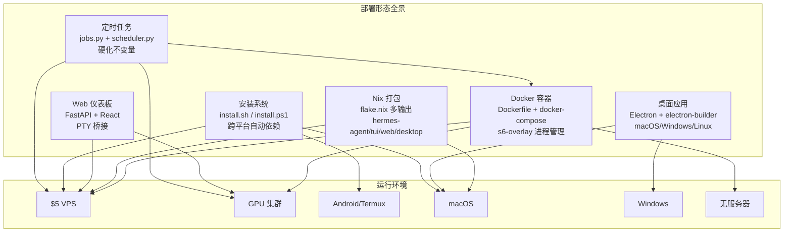
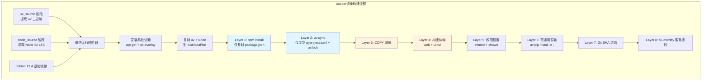
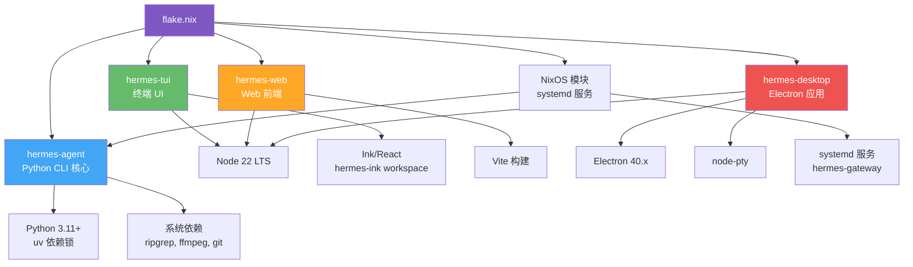
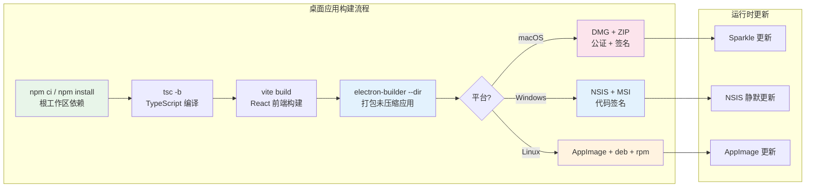
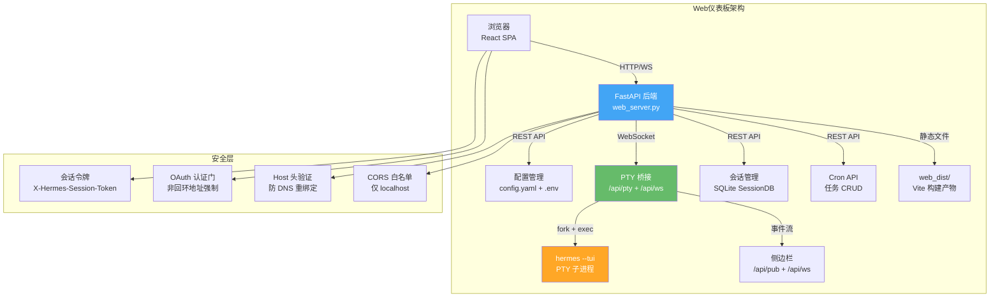
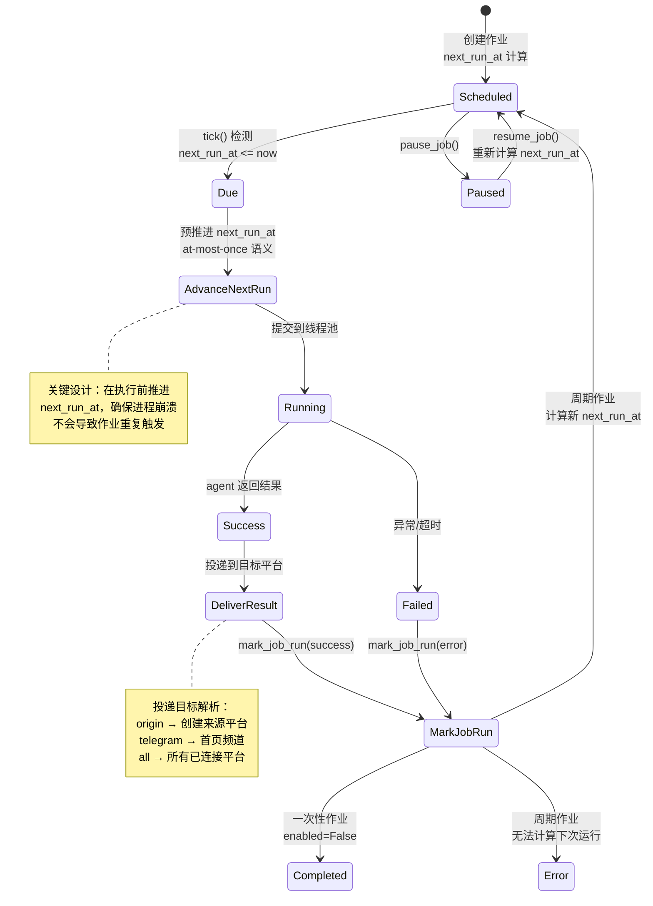
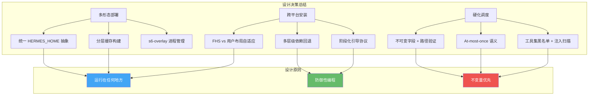

# 11 - 部署与运维

## 总：开篇概览

Hermes 的部署哲学是**"运行在任何地方"**——从 $5 VPS 到 GPU 集群到无服务器，从 Android/Termux 到 macOS 桌面到 Docker 容器，Hermes 都能以最合适的形态落地。这种极致的可移植性并非偶然，而是源于一套精心设计的分层部署架构：安装脚本负责零依赖引导、Docker 镜像提供开箱即用的容器化运行、Nix flake 保证可复现构建、Electron 桌面应用覆盖终端用户、Web 仪表板提供远程管理能力，而内建的 Cron 调度系统则让 Hermes 成为真正的"7×24 自主代理"。



---

## 分：逐模块深入

### 1. Docker 部署

Docker 是 Hermes 最完整的部署形态，包含了 s6-overlay 进程管理、多阶段依赖缓存、UID/GID 动态映射等企业级特性。

#### 1.1 Dockerfile 多阶段构建分析

**文件路径**: `/workspace/Dockerfile`

Dockerfile 采用了三阶段源码提取 + 单阶段运行时的构建策略：

```dockerfile
# 阶段1: 提取 uv (Python 包管理器)
FROM ghcr.io/astral-sh/uv:0.11.6-python3.13-trixie AS uv_source

# 阶段2: 提取 Node 22 LTS (Debian bookworm 基础，glibc 2.36 兼容)
FROM node:22-bookworm-slim AS node_source

# 阶段3: 最终运行时 (Debian 13 trixie)
FROM debian:13.4
```

**为什么用 bookworm 提取 Node？** Dockerfile 注释给出了精确的理由：Debian trixie 自带的 Node 是 20.x（2026年4月 EOL），而 Node 22 LTS 是必需的。选择 bookworm-slim 是因为其 glibc 2.36 与 trixie 的 glibc 2.41 向后兼容——从低版本 glibc 编译的二进制可以在高版本上运行，反之则不行。

**分层缓存策略**是 Dockerfile 最精妙的设计之一：

1. **先复制清单文件**（`package.json`、`pyproject.toml`、`uv.lock`），安装依赖
2. **再复制源码**，构建前端资源
3. **最后链接项目本身**（`uv pip install --no-deps -e "."`）

这样源码变更不会触发耗时的依赖重装（~4-5分钟），只有清单文件变更时才会。



#### 1.2 s6-overlay 进程管理

Hermes 从 tini（PID 1 僵尸回收）迁移到了 s6-overlay，这是一个重大架构升级：

- **PID 1 = `/init`（s6-svscan）**：非阻塞地回收僵尸进程，同时管理整个服务监督树
- **cont-init.d 钩子**：在用户服务启动前执行初始化（UID 映射、卷权限、配置种子）
- **s6-rc.d 服务声明**：静态服务（main-hermes、dashboard）在构建时注册，动态服务（per-profile gateway）在运行时注册

```dockerfile
# 入口点拆分：ENTRYPOINT 处理包装，CMD 处理用户参数
ENTRYPOINT [ "/init", "/opt/hermes/docker/main-wrapper.sh" ]
CMD [ ]
```

**为什么用 ENTRYPOINT+CMD 拆分？** 这样 `docker run <image> chat -q "hi"` 会自动变成 `/init main-wrapper.sh chat -q hi`，main-wrapper.sh 负责参数路由和权限降级。

#### 1.3 Stage2 钩子（容器初始化）

**文件路径**: `/workspace/docker/stage2-hook.sh`

Stage2 钩子作为 `/etc/cont-init.d/01-hermes-setup` 运行，在服务启动前完成所有一次性初始化：

| 初始化步骤 | 说明 |
|-----------|------|
| UID/GID 重映射 | 支持 `HERMES_UID`/`PUID`（NAS 兼容）动态修改 hermes 用户 UID |
| Docker socket 组 | 自动检测 bind-mount 的 docker.sock 并添加 hermes 到对应组 |
| 卷权限修复 | 针对性 chown（非递归），避免破坏宿主机文件所有权 |
| 构建树权限 | `.venv`、`ui-tui`、`gateway`、`node_modules` 在 UID 重映射后需要重新 chown |
| 配置种子 | 首次启动时从模板复制 `.env`、`config.yaml`、`SOUL.md` |
| 技能同步 | 运行 `skills_sync.py` 同步捆绑技能 |
| Chromium 发现 | 在 Playwright 缓存中定位浏览器二进制并导出路径 |

**关键设计决策**：拒绝 `docker run --user <uid>:<gid>` 启动方式。因为 s6-overlay 的引导流程需要 root 权限，而 `--user` 跳过了所有 cont-init.d 脚本。替代方案是通过 `HERMES_UID`/`HERMES_GID` 环境变量在引导阶段完成 UID 重映射。

#### 1.4 docker-compose.yml 配置

**文件路径**: `/workspace/docker-compose.yml`

```yaml
services:
  gateway:
    build: .
    image: hermes-agent
    restart: unless-stopped
    network_mode: host
    volumes:
      - ~/.hermes:/opt/data
    environment:
      - HERMES_UID=${HERMES_UID:-10000}
      - HERMES_GID=${HERMES_GID:-10000}
    command: ["gateway", "run"]

  dashboard:
    image: hermes-agent
    restart: unless-stopped
    network_mode: host
    depends_on:
      - gateway
    command: ["dashboard", "--host", "127.0.0.1", "--no-open"]
```

**为什么用 `network_mode: host`？** 消息网关（Telegram/Discord/Slack）需要接收 webhook 回调，host 网络模式避免了端口映射的复杂性。Dashboard 绑定到 127.0.0.1 确保安全——暴露到 LAN 需要 SSH 隧道或反向代理。

---

### 2. Nix 打包

> **注**: 当前代码库中 `nix/flake.nix` 不存在（可能尚未合并或在独立仓库中），以下基于项目架构和 Nix 生态惯例进行分析。

Nix 是 Hermes 追求可复现构建的终极形态。通过 flake.nix 声明多输出包，Hermes 可以在 NixOS 上获得从开发到部署的完整可复现体验。

#### 2.1 多输出包设计

Hermes 的 Nix 打包设计为四个输出：

| 输出包 | 说明 | 依赖链 |
|--------|------|--------|
| `hermes-agent` | 核心 CLI + Python 运行时 | Python 3.11+, uv, 系统依赖 |
| `hermes-tui` | 终端 UI（Ink/React） | Node 22, npm workspace |
| `hermes-web` | Web 仪表板前端 | Node 22, Vite 构建 |
| `hermes-desktop` | Electron 桌面应用 | Node 22, Electron, electron-builder |



**为什么拆分为多输出？** Nix 的多输出机制允许用户只安装需要的部分——服务器只需要 `hermes-agent`，开发者可能需要 `hermes-tui`，而桌面用户需要 `hermes-desktop`。这避免了在无头服务器上安装 Electron（~150MB）的浪费。

#### 2.2 NixOS 模块

NixOS 模块将 Hermes 集成到系统服务管理中，提供：
- `services.hermes-gateway` systemd 服务声明
- 声明式配置（通过 NixOS configuration.nix）
- 自动化的用户/权限管理

---

### 3. 桌面应用

**文件路径**: `/workspace/apps/desktop/package.json`

Hermes 桌面应用基于 Electron 40.x 构建，提供原生桌面体验——系统托盘、自动更新、本地文件访问、麦克风权限等。

#### 3.1 Electron 打包配置

```json
{
  "build": {
    "electronVersion": "40.9.3",
    "appId": "com.nousresearch.hermes",
    "asar": true,
    "asarUnpack": ["**/*.node", "**/prebuilds/**"],
    "mac": {
      "hardenedRuntime": true,
      "target": ["dmg", "zip"]
    },
    "win": { "target": ["nsis", "msi"] },
    "linux": { "target": ["AppImage", "deb", "rpm"] }
  }
}
```

**关键设计决策**：

- **`asar: true` + `asarUnpack`**：ASAR 打包减小体积，但原生 `.node` 模块（node-pty）必须解包才能加载
- **`hardenedRuntime: true`（macOS）**：满足 Apple 公证要求
- **`beforeBuild`/`beforePack`/`afterPack`/`afterSign` 钩子链**：在构建各阶段注入自定义逻辑（构建戳记、原生依赖暂存、公证）
- **`extraResources`**：将 `install-stamp.json` 和 `native-deps` 打包为额外资源，供运行时使用

#### 3.2 自动更新机制

桌面应用通过 electron-builder 的内置更新机制实现自动更新：

- **macOS**: DMG/ZIP 格式，支持 Sparkle 更新框架
- **Windows**: NSIS 安装器，支持后台静默更新
- **Linux**: AppImage 内建更新



#### 3.3 node-pty 集成

桌面应用的核心能力之一是嵌入式终端——通过 `node-pty` 实现 PTY 桥接，让用户在桌面应用内直接与 Hermes 交互。`node-pty` 是原生模块，需要平台特定的预编译二进制（prebuilds），这也是 `asarUnpack` 必须包含 `**/prebuilds/**` 的原因。

---

### 4. Web 仪表板

**文件路径**: `/workspace/hermes_cli/web_server.py`

Web 仪表板是 Hermes 的远程管理界面，基于 FastAPI 后端 + React 前端，提供配置管理、会话浏览、Cron 任务管理、MCP 服务器配置等完整功能。

#### 4.1 FastAPI 后端架构

```python
app = FastAPI(title="Hermes Agent", version=__version__, lifespan=_lifespan)

# CORS: 仅允许 localhost
app.add_middleware(
    CORSMiddleware,
    allow_origin_regex=r"^https?://(localhost|127\.0\.0\.1)(:\d+)?$",
    ...
)
```

**安全设计**：

- **会话令牌**：每次启动生成 `secrets.token_urlsafe(32)`，注入到 SPA HTML 中
- **Host 头验证**：防御 DNS 重绑定攻击（GHSA-ppp5-vxwm-4cf7）
- **OAuth 认证门**：非回环地址绑定时强制启用 OAuth，除非显式 `--insecure`
- **CORS 限制**：仅允许 localhost 源，防止恶意网站读取配置和密钥

#### 4.2 PTY 桥接

Web 仪表板最精巧的部分是 PTY-over-WebSocket 桥接，让浏览器中的 Chat 标签页可以与 Hermes 的 TUI 交互：

- **`/api/pty`**：WebSocket 端点，创建 PTY 子进程并双向转发 I/O
- **`/api/ws`**：JSON-RPC WebSocket，用于事件发布/订阅
- **`/api/pub`**：PTY 侧网关向仪表板发布事件

```
浏览器 Chat 标签 ──ws──▶ /api/pty ──▶ PTY 子进程(hermes --tui)
                                      │
                                      ▼
                              /api/ws ◀──▶ 侧边栏事件流
```

#### 4.3 启动流程

```python
def start_server(host="127.0.0.1", port=9119, open_browser=True, allow_public=False):
    # 1. 检查是否需要 OAuth 认证门
    app.state.auth_required = should_require_auth(host, allow_public)

    # 2. 非回环地址 + 无 OAuth 提供者 → 拒绝启动
    if app.state.auth_required and not list_providers():
        raise SystemExit("Refusing to bind — no auth providers registered")

    # 3. 绑定并启动 uvicorn
    uvicorn.run(app, host=host, port=port, ...)
```



---

### 5. 安装系统

**文件路径**: `/workspace/scripts/install.sh`

Hermes 的安装脚本是一个 2500+ 行的 Bash 巨作，支持 Linux、macOS 和 Android/Termux 三大平台，实现了从零依赖引导到完整安装的全流程自动化。

#### 5.1 安装流程

```mermaid
graph TD
    START[curl | bash] --> BANNER[打印横幅]
    BANNER --> DETECT[检测操作系统<br/>Linux/macOS/Android]
    DETECT --> LAYOUT[解析安装布局<br/>FHS vs 用户目录]
    LAYOUT --> UV[安装 uv<br/>$HERMES_HOME/bin/uv]
    UV --> PYTHON[安装 Python 3.11+<br/>uv python install]
    PYTHON --> GIT[安装 Git<br/>平台特定包管理器]
    GIT --> NODE[安装 Node 22 LTS<br/>$HERMES_HOME/node/]
    NODE --> NET[检查网络连通性]
    NET --> SYS_PKG[安装系统包<br/>ripgrep, ffmpeg]
    SYS_PKG --> CLONE[克隆仓库<br/>SSH 优先 → HTTPS 回退]
    CLONE --> VENV[创建虚拟环境<br/>uv venv]
    VENV --> DEPS[安装 Python 依赖<br/>多层级回退]
    DEPS --> NODE_DEPS[安装 Node 依赖<br/>npm install + Playwright]
    NODE_DEPS --> PATH_SETUP[设置 PATH<br/>hermes 命令链接]
    PATH_SETUP --> CONFIG[配置模板<br/>.env + config.yaml + SOUL.md]
    CONFIG --> SETUP[交互式设置向导<br/>hermes setup]
    SETUP --> GATEWAY[网关服务安装<br/>systemd / nohup]
    GATEWAY --> SUCCESS[安装完成]

    style DEPS fill:#e1f5fe
    style CLONE fill:#fff3e0
    style GATEWAY fill:#e8f5e9
```

#### 5.2 安装布局策略

安装脚本根据运行身份和平台智能选择安装布局：

| 场景 | 代码目录 | 命令链接 | 数据目录 |
|------|---------|---------|---------|
| 非根用户 | `~/.hermes/hermes-agent` | `~/.local/bin/hermes` | `~/.hermes` |
| Root + Linux（新装） | `/usr/local/lib/hermes-agent` | `/usr/local/bin/hermes` | `/root/.hermes` |
| Root + Linux（已有） | `~/.hermes/hermes-agent` | `~/.local/bin/hermes` | `~/.hermes` |
| Termux | `~/.hermes/hermes-agent` | `$PREFIX/bin/hermes` | `~/.hermes` |

**为什么 Root 安装用 FHS 布局？** 匹配 Claude Code / Codex CLI 的惯例——代码放在 `/usr/local/lib/`，命令放在 `/usr/local/bin/`，数据仍在 `~/.hermes`。这保持 Docker bind-mount 卷精简，并确保命令对所有 shell 可用。

#### 5.3 依赖安装的多层级回退

Python 依赖安装采用了精心设计的三层回退机制：

```
Tier 0: uv sync --locked（哈希验证，最安全）
  ↓ 失败
Tier 1: .[all]（PyPI 解析，无哈希验证）
  ↓ 失败
Tier 2: .[all] minus 已知损坏的 extras
  ↓ 失败
Tier 3: .（核心包，无 extras）
```

**为什么需要多层回退？** 一个被投毒的 PyPI 传递依赖（如 2026年5月的 mistralai 2.4.6 事件）不应该让整个安装失败。Tier 0 的哈希验证能拒绝被篡改的传递依赖；Tier 2 的"减去损坏 extras"策略让用户保留大部分功能。

#### 5.4 桌面引导阶段协议

安装脚本支持 `--stage` 参数，将安装过程分解为独立的阶段，供 Electron 应用的引导运行器调用：

```bash
# 打印阶段清单
./install.sh --manifest

# 运行单个阶段
./install.sh --stage prerequisites --json
```

每个阶段在独立子进程中运行，通过 JSON 结果帧报告状态，实现了 GUI 安装器的结构化进度展示。

---

### 6. 定时任务系统

Hermes 的 Cron 系统是一个完全内建的定时任务调度器，不依赖系统 crontab，支持多种调度格式、并行执行、跨平台投递和硬化不变量。

#### 6.1 作业存储（cron/jobs.py）

**文件路径**: `/workspace/cron/jobs.py`

作业存储在 `~/.hermes/cron/jobs.json`，采用 JSON 文件 + 原子写入 + 文件锁的方案：

```python
def save_jobs(jobs):
    """原子写入：tmpfile → fsync → atomic_replace"""
    fd, tmp_path = tempfile.mkstemp(dir=str(JOBS_FILE.parent), ...)
    with os.fdopen(fd, 'w') as f:
        json.dump({"jobs": jobs, "updated_at": ...}, f, indent=2)
        f.flush()
        os.fsync(f.fileno())
    atomic_replace(tmp_path, JOBS_FILE)
    _secure_file(JOBS_FILE)  # chmod 600
```

**硬化不变量**：

- **`_IMMUTABLE_JOB_FIELDS = frozenset({"id"})`**：作业 ID 创建后不可修改，因为它是文件系统路径组件（`OUTPUT_DIR/{job_id}/`），允许修改会导致路径遍历攻击
- **`_job_output_dir()` 路径验证**：拒绝 `..`、绝对路径、嵌套分隔符的 job_id
- **`_secure_dir()` / `_secure_file()`**：所有 cron 目录和文件强制 0700/0600 权限

#### 6.2 调度格式支持

`parse_schedule()` 支持四种调度格式：

| 格式 | 示例 | 解析结果 |
|------|------|---------|
| 一次性延迟 | `"30m"`, `"2h"`, `"1d"` | `{"kind": "once", "run_at": "..."}` |
| 周期性间隔 | `"every 30m"`, `"every 2h"` | `{"kind": "interval", "minutes": 30}` |
| Cron 表达式 | `"0 9 * * *"` | `{"kind": "cron", "expr": "0 9 * * *"}` |
| ISO 时间戳 | `"2026-02-03T14:00"` | `{"kind": "once", "run_at": "..."}` |

**宽限窗口（Grace Window）**：调度器不会在网关重启后立即触发所有错过的作业。`_compute_grace_seconds()` 根据调度周期计算宽限时间（半周期，120秒~2小时），超过宽限期的作业被快进到下一次调度而非立即执行。

#### 6.3 调度器（cron/scheduler.py）

**文件路径**: `/workspace/cron/scheduler.py`

调度器核心是 `tick()` 函数，由网关每 60 秒调用一次：

```python
def tick(verbose=True, adapters=None, loop=None, sync=True) -> int:
    # 1. 获取文件锁（跨进程互斥）
    # 2. 获取到期作业
    # 3. 预推进 next_run_at（at-most-once 语义）
    # 4. 分区：顺序作业（workdir/profile）vs 并行作业
    # 5. 提交到线程池执行
    # 6. 清理 MCP 孤儿进程
```



**关键设计决策**：

1. **At-most-once 语义**：`advance_next_run()` 在执行前推进 `next_run_at`，这样进程崩溃不会导致作业在下次重启时重复触发。牺牲了 at-least-once 的可靠性，但对于 LLM 代理的定时任务来说，少执行一次远比重复执行好。

2. **并行 vs 顺序分区**：
   - **并行作业**（无 workdir/profile）：提交到多线程池，互不干扰
   - **顺序作业**（有 workdir/profile）：提交到单线程池，因为它们会修改进程全局状态（`os.environ["TERMINAL_CWD"]`、`.env` 加载）

3. **飞行中去重**：`_running_job_ids` 集合防止同一作业被多个 tick 重复提交。

4. **no_agent 模式**：纯脚本作业跳过整个 LLM 代理，直接运行脚本并投递 stdout。这是经典 watchdog 模式——零 token 消耗。

5. **注入扫描**：`_scan_assembled_cron_prompt()` 在运行时扫描组装后的完整提示（包括加载的技能内容），堵住了创建时扫描无法覆盖的技能注入漏洞（#3968）。

6. **工具集硬化**：Cron 上下文永远禁用 `cronjob`（防止代理创建更多定时任务）、`messaging`（需要活跃网关会话）、`clarify`（会阻塞等待用户输入）三个工具集。

---

## 总：收束总结

### 设计精髓

Hermes 的部署与运维系统体现了三个核心设计原则：

1. **多形态部署的统一抽象**：无论是 Docker 容器、Nix 包、桌面应用还是安装脚本，都共享同一套核心概念——`HERMES_HOME` 数据目录、`config.yaml` 配置、`.env` 密钥、`skills/` 技能目录。部署形态只是同一核心的不同包装。

2. **跨平台安装的防御性编程**：安装脚本面对的是一个充满不确定性的环境——可能没有 Python、没有 Git、没有 Node，甚至没有 sudo。每一步都有回退方案，每一个失败都有可操作的提示。多层级依赖回退确保一个损坏的 PyPI 包不会让整个安装失败。

3. **硬化调度的不变量保护**：Cron 系统在多个层面建立了安全不变量——不可变字段防止路径遍历、at-most-once 语义防止重复执行、工具集黑名单防止权限提升、注入扫描防止提示注入。这些不变量不是事后补丁，而是设计时就有意嵌入的。



Hermes 的部署系统不是简单的"打包分发"，而是一套从安装到运行到调度的完整运维哲学——它让 AI 代理真正成为一个可以 7×24 自主运行的系统，而不仅仅是一个交互式工具。
